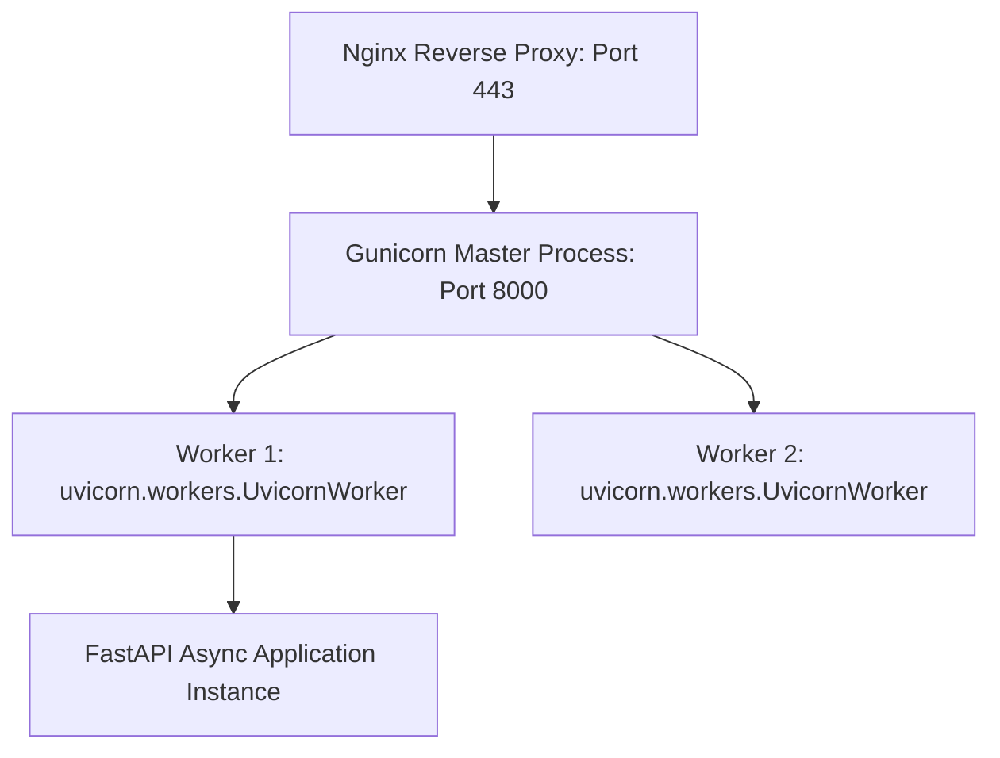

# Lesson 10.2 Production Deployment with Gunicorn Uvicorn Workers & Docker

> **Course**: Fastapi | **Module**: Module 1 | **Difficulty**: beginner

---

- **Estimated Time**: 65 Minutes (25m Reading | 30m Practice | 10m Quiz)
- **Difficulty Level**: ⭐⭐⭐ Advanced
- **Prerequisites**: [Lesson 10.1 Async Testing](file:///d:/My%20Drive/all%20files/PROJECT%20FILES/notes/docs/curriculum/_05_fastapi/_05_19_async_testing_with_pytest_and_httpx.md)
- **XP Reward**: +80 XP

### Learning Objectives
By the end of this lesson, you will be able to:
1. Understand the production **Gunicorn + Uvicorn Worker** architecture.
2. Execute Gunicorn using the `uvicorn.workers.UvicornWorker` class.
3. Construct a multi-stage production **`Dockerfile`**.
4. Orchestrate FastAPI microservices with PostgreSQL using **Docker Compose**.

---

---

Install `gunicorn` and `uvicorn`:

```bash
pip install gunicorn uvicorn
```

---

---

### 3.1 Production Process Management: Gunicorn + Uvicorn
While `uvicorn main:app` is ideal for development, running Uvicorn alone in production lacks process management capabilities (auto-restarting dead workers, handling process signals).

In enterprise production environments, **Gunicorn** acts as the process manager, spawning and supervising multiple worker processes running the high-performance **Uvicorn worker class (`uvicorn.workers.UvicornWorker`)**:

```
┌─────────────────────────────────────────────────────────────────────────────┐
│                    PRODUCTION GUNICORN + UVICORN ARCHITECTURE               │
├─────────────────────────────────────────────────────────────────────────────┤
│ Web Browser ──► Nginx Reverse Proxy (HTTPS Port 443)                        │
│                    │                                                        │
│                    ▼                                                        │
│                 Gunicorn Master Process (Manages process lifecycle & signals)│
│                    ├── Worker 1 (UvicornWorker Async Event Loop)            │
│                    ├── Worker 2 (UvicornWorker Async Event Loop)            │
│                    ├── Worker 3 (UvicornWorker Async Event Loop)            │
│                    └── Worker 4 (UvicornWorker Async Event Loop)            │
└─────────────────────────────────────────────────────────────────────────────┘
```

---

---



---

---

### File 1: `gunicorn_conf.py` (Gunicorn Configuration)

```python
import multiprocessing

# Gunicorn Production Configuration
bind = "0.0.0.0:8000"
workers = (multiprocessing.cpu_count() * 2) + 1
worker_class = "uvicorn.workers.UvicornWorker"

# Timeout & Logging
timeout = 120
keepalive = 5
loglevel = "info"
accesslog = "-"  # Log to stdout
errorlog = "-"
```

### File 2: `Dockerfile` (Production Container Definition)

```dockerfile
# Multi-Stage Production Dockerfile
FROM python:3.12-slim as builder

ENV PYTHONUNBUFFERED=1 \
    PYTHONDONTWRITEBYTECODE=1

WORKDIR /app

# Install build dependencies
RUN apt-get update && apt-get install -y --no-install-recommends \
    gcc libpq-dev && \
    rm -rf /var/lib/apt/lists/*

COPY requirements.txt .
RUN pip install --no-cache-dir -r requirements.txt

# Final Stage
FROM python:3.12-slim

WORKDIR /app

COPY --from=builder /usr/local/lib/python3.12/site-packages /usr/local/lib/python3.12/site-packages
COPY --from=builder /usr/local/bin /usr/local/bin
COPY . .

EXPOSE 8000

# Run Gunicorn with Uvicorn Worker Class
CMD ["gunicorn", "-c", "gunicorn_conf.py", "main:app"]
```

### File 3: `docker-compose.yml` (Multi-Container Deployment)

```yaml
version: '3.8'

services:
  api:
    build: .
    container_name: fastapi_microservice
    restart: always
    ports:
      - "8000:8000"
    environment:
      - DATABASE_URL=postgresql+asyncpg://postgres:secret@db:5432/telemetry_db
    depends_on:
      - db

  db:
    image: postgres:16-alpine
    container_name: postgres_async_db
    restart: always
    environment:
      - POSTGRES_USER=postgres
      - POSTGRES_PASSWORD=secret
      - POSTGRES_DB=telemetry_db
    volumes:
      - postgres_async_data:/var/lib/postgresql/data

volumes:
  postgres_async_data:
```

---

---

- **Cloud Microservice Clusters**: Enterprise teams deploy dockerized FastAPI containers running Gunicorn `UvicornWorker` across AWS EKS or Kubernetes, utilizing Nginx Ingress Controllers for SSL termination.

---

---

1. Save `gunicorn_conf.py`, `Dockerfile`, and `docker-compose.yml`.
2. Execute production command: `gunicorn -w 4 -k uvicorn.workers.UvicornWorker main:app` $\to$ Inspect worker process startup in terminal!

---

---

| Bug / Error | Root Cause | Engineering Solution |
| :--- | :--- | :--- |
| **`ImportError: Class uvicorn.workers.UvicornWorker not found`** | Forgetting to specify `-k uvicorn.workers.UvicornWorker` when running Gunicorn with FastAPI. | Pass `-k uvicorn.workers.UvicornWorker` explicitly to Gunicorn. |

---

---

- **Always Specify Worker Class**: Always pass `-k uvicorn.workers.UvicornWorker` when running Gunicorn with FastAPI.

---

---

### Q1: Why do we use Gunicorn together with Uvicorn in production rather than running Uvicorn alone?
**Answer**: Uvicorn is a high-performance ASGI server implementation, but it is not a full-featured process manager. Gunicorn acts as a process manager, spawning multiple Uvicorn worker processes (`UvicornWorker`), monitoring worker health, restarting dead processes automatically, and managing OS signals during zero-downtime reloads.

---

---

```json
{
  "quiz_title": "Lesson 10.2 Production Deployment Assessment",
  "questions": [
    {
      "question_id": "Q1",
      "type": "multiple_choice",
      "question_text": "Which worker class must be specified when running Gunicorn with FastAPI applications?",
      "options": ["sync", "gevent", "uvicorn.workers.UvicornWorker", "eventlet"],
      "correct_answer_index": 2,
      "explanation": "uvicorn.workers.UvicornWorker provides ASGI support in Gunicorn."
    }
  ]
}
```

---

---

Containerize a FastAPI application with Gunicorn, Uvicorn Workers, and Docker Compose.

---

---

**Front**: What CLI command runs Gunicorn with 4 Uvicorn async worker processes?
**Back**: `gunicorn -w 4 -k uvicorn.workers.UvicornWorker main:app`.
<!-- flashcard:end -->

---

---

```bash
gunicorn -w 4 -k uvicorn.workers.UvicornWorker main:app
docker-compose up -d --build
```


---

---

> **Source**: `_18_01_Deployment_and_Docker_Notes.md` (from backend concepts archive)
> This content was migrated from existing study notes. Review and merge with topics above.

# Module 10: Deployment

---

---

### 1. The Big Picture

#### What is Docker & Containerization?
**Containerization** is the packaging of software code with just the operating system (OS) libraries and dependencies required to run it, into a single lightweight executable called a **Container**.

**Docker** is the industry-standard platform used to create, deploy, and run containers.

#### Why Companies Use Docker
1. **Consistency:** "Works on my machine" is solved. The container runs the exact same way on a developer's laptop, a staging environment, and a production Kubernetes cluster in the cloud.
2. **Isolation:** Multiple applications running on the same server are kept completely isolated. They cannot interfere with each other's files, memory, or ports.
3. **Efficiency:** Containers share the host OS kernel, making them much faster to start and consuming far less RAM/CPU compared to traditional Virtual Machines (VMs).

```
    VIRTUAL MACHINES (VMs)                      DOCKER CONTAINERS

 ┌──────────────┐ ┌──────────────┐             ┌──────────────┐ ┌──────────────┐
 │    App A     │ │    App B     │             │    App A     │ │    App B     │
 ├──────────────┼───────────────┤             ├──────────────┼───────────────┤
 │  Libs/Bins   │ │  Libs/Bins   │             │  Libs/Bins   │ │  Libs/Bins   │
 ├──────────────┼───────────────┤             ├──────────────┴───────────────┤
 │   Guest OS   │ │   Guest OS   │             │        Docker Engine         │
 ├──────────────┼───────────────┤             ├──────────────────────────────┤
 │  Hypervisor  │  Hypervisor   │             │           Host OS            │
 ├──────────────┴───────────────┤             ├──────────────────────────────┤
 │          Host Hardware       │             │        Host Hardware         │
 └──────────────────────────────┘             └──────────────────────────────┘
```

---

### 2. Core Docker Concepts
* **Dockerfile:** A text file containing a list of instructions on how to build a Docker Image.
* **Image:** A read-only template with instructions for creating a Docker container. Think of it as the compiled "class" file.
* **Container:** A runnable instance of an image. Think of it as the "object" instantiated from the class.
* **Docker Compose:** A tool for defining and running multi-container Docker applications (e.g., spinning up your API, database, and Redis cache together using a single YAML file).

---

### 3. Production-Grade Dockerfile for FastAPI
A production Dockerfile should use a **Multi-Stage Build** to keep the final image size as small as possible (improving deployment speed and reducing security attack surfaces).

```dockerfile
# --- STAGE 1: Builder ---
FROM python:3.11-slim as builder

WORKDIR /app

# Install build dependencies if needed (e.g., gcc)
RUN apt-get update && apt-get install -y --no-install-recommends gcc build-essential

COPY requirements.txt .

# Install wheels to a local directory
RUN pip install --user --no-cache-dir -r requirements.txt

# --- STAGE 2: Final Production Image ---
FROM python:3.11-slim as runner

WORKDIR /app

# Copy installed dependencies from the builder stage
COPY --from=builder /root/.local /root/.local
COPY ./app ./app

ENV PATH=/root/.local/bin:$PATH

# Run as non-root user for security!
RUN useradd -u 8888 appuser && chown -R appuser:appuser /app
USER appuser

EXPOSE 8000

# Start Uvicorn
CMD ["uvicorn", "app.main:app", "--host", "0.0.0.0", "--port", "8000", "--workers", "4"]
```

---

### 4. Docker Compose for Local Development
A `docker-compose.yml` file allows you to spin up your entire stack with a single command: `docker compose up`.

```yaml
version: '3.8'

services:
  web:
    build: .
    ports:
      - "8000:8000"
    environment:
      - DATABASE_URL=postgresql://postgres:postgres123@db:5432/shop
      - REDIS_URL=redis://redis:6379/0
    depends_on:
      - db
      - redis

  db:
    image: postgres:15-alpine
    environment:
      - POSTGRES_USER=postgres
      - POSTGRES_PASSWORD=postgres123
      - POSTGRES_DB=shop
    ports:
      - "5432:5432"
    volumes:
      - postgres_data:/var/lib/postgresql/data

  redis:
    image: redis:7-alpine
    ports:
      - 6379:6379

volumes:
  postgres_data:
```

---

### 5. Hands-on Workout & Assessment

#### Part A: Deployment Challenge (Docker Security)
A junior developer writes a Dockerfile using `FROM python:3.11` (which is a full Debian image of ~1GB) and runs the container as `root`.
- Identify two issues with this approach.
- Explain how you would fix them using best practices (image size and security).

#### Part B: Quiz
1. What is the difference between a Docker Image and a Docker Container?
   A. An image is a running instance of a container.
   B. An image is a read-only blueprint; a container is a live, running instance of that blueprint.
   C. Images are only for databases; containers are only for code.
   D. There is no difference.
2. Why do we use volumes in Docker Compose for databases (e.g. `- postgres_data:/var/lib/postgresql/data`)?
   A. To make the database run faster.
   B. To ensure data is persisted on the host machine and not lost when the database container is stopped or deleted.
   C. To encrypt the database files.
   D. To allow multiple databases to share the same port.
3. What is a multi-stage build in a Dockerfile?
   A. A build that runs on multiple servers.
   B. A technique to write multiple Dockerfiles.
   C. A method to use multiple `FROM` statements in a single Dockerfile to separate the build environment from the final runtime environment, reducing the final image size.
   D. A deployment strategy.

---

### 6. Progress Tracker

* **Module 10: Deployment:** 0%
* **Topics Completed:** 0/1
* **Coding Exercises:** 0/0
* **Quiz Score:** N/A
* **API Design Challenge Score:** N/A
* **Backend Score:** 0 / 100

---

---
