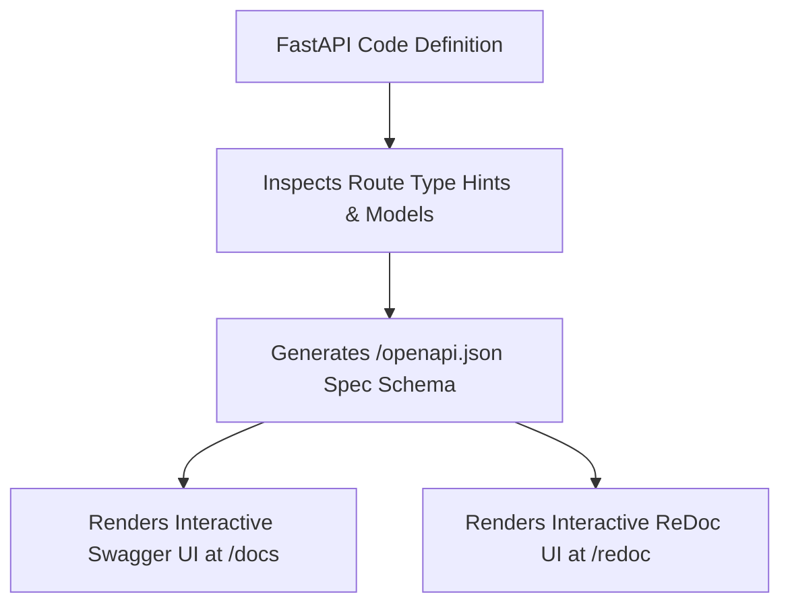

# Lesson 1.2 FastAPI Application Instantiation, Routing, & OpenAPI UI

> **Course**: Fastapi | **Module**: Module 1 | **Difficulty**: beginner

---

- **Estimated Time**: 45 Minutes (15m Reading | 20m Practice | 10m Quiz)
- **Difficulty Level**: ⭐ Beginner
- **Prerequisites**: [Lesson 1.1 ASGI Architecture](file:///d:/My%20Drive/all%20files/PROJECT%20FILES/notes/docs/curriculum/_05_fastapi/_05_01_asgi_architecture_uvicorn_and_fastapi_basics.md)
- **XP Reward**: +50 XP

### Learning Objectives
By the end of this lesson, you will be able to:
1. Configure metadata parameters on the **`FastAPI()`** app instance.
2. Explore automatically generated interactive **Swagger UI (`/docs`)** and **ReDoc (`/redoc`)**.
3. Use operation decorators (`@app.get()`, `@app.post()`, `@app.delete()`).
4. Set default response status codes using `status_code=status.HTTP_201_CREATED`.

---

---

Open Python REPL or VS Code.

---

---

### 3.1 Zero-Configuration Automatic OpenAPI Generation
One of FastAPI's most powerful enterprise features is its native integration with the **OpenAPI** specification (formerly Swagger). FastAPI inspects Python type hints and Pydantic models to generate an interactive, live-testing documentation portal at runtime—requiring zero external configuration.

```
┌─────────────────────────────────────────────────────────────────────────────┐
│                          FASTAPI AUTOMATIC DOCUMENTATION                    │
├─────────────────┬───────────────────────────────┬───────────────────────────┤
│ Portal Endpoint │ Documentation Engine          │ Primary Purpose           │
├─────────────────┼───────────────────────────────┼───────────────────────────┤
│ `/docs`         │ Swagger UI                    │ Interactive API testing   │
│ `/redoc`        │ ReDoc                         │ Clean, searchable docs    │
│ `/openapi.json` │ Raw OpenAPI Specification     │ Client SDK generation     │
└─────────────────┴───────────────────────────────┴───────────────────────────┘
```

---

---



---

---

```python
# FastAPI App Instantiation & Operations (openapi_demo.py)
from fastapi import FastAPI, status

# 1. Custom Metadata App Instantiation
app = FastAPI(
    title="Industrial IoT Gateway API",
    description="Enterprise RESTful microservice for sensor node orchestration.",
    version="2.1.0",
    docs_url="/docs",   # Swagger UI URL
    redoc_url="/redoc"  # ReDoc URL
)

# In-Memory Datastore
DEVICES_DB = [{"id": 1, "name": "ESP32-Lab"}]

# 2. HTTP GET Collection Endpoint
@app.get("/api/v1/devices", tags=["Device Inventory"], summary="List all active devices")
def get_devices():
    return {"data": DEVICES_DB, "count": len(DEVICES_DB)}

# 3. HTTP POST Endpoint with custom status code
@app.post(
    "/api/v1/devices",
    status_code=status.HTTP_201_CREATED,
    tags=["Device Inventory"],
    summary="Register new hardware device"
)
def create_device(device_name: str):
    new_device = {"id": len(DEVICES_DB) + 1, "name": device_name}
    DEVICES_DB.append(new_device)
    return new_device
```

---

---

- **API SDK Generation**: Engineering teams export `/openapi.json` schemas to auto-generate client SDK libraries in TypeScript, Swift, Kotlin, and Go using OpenAPI Generator tools.

---

---

1. Save code as `openapi_demo.py`.
2. Run `uvicorn openapi_demo:app --reload` $\to$ Open `http://127.0.0.1:8000/docs` in browser and execute an interactive POST test request!

---

---

| Bug / Error | Root Cause | Engineering Solution |
| :--- | :--- | :--- |
| **Missing `/docs` UI in Production** | Setting `docs_url=None` or running in production mode without enabling docs. | Set `docs_url="/docs"` explicitly if docs are required. |

---

---

- **Use `tags` and `summary`**: Add `tags=["Group"]` and `summary="..."` to route decorators to group endpoints neatly in Swagger UI.

---

---

### Q1: How does FastAPI generate Swagger UI documentation automatically without third-party plugins?
**Answer**: FastAPI parses Python type hints, route path parameters, and Pydantic schema models at application startup to construct an in-memory JSON schema adhering to the OpenAPI standard (`/openapi.json`), which it serves to embedded Swagger UI (`/docs`) and ReDoc (`/redoc`) HTML templates.

---

---

```json
{
  "quiz_title": "Lesson 1.2 OpenAPI Assessment",
  "questions": [
    {
      "question_id": "Q1",
      "type": "multiple_choice",
      "question_text": "What URL path serves the interactive Swagger UI testing portal in FastAPI by default?",
      "options": ["/swagger", "/docs", "/api/docs", "/redoc"],
      "correct_answer_index": 1,
      "explanation": "/docs serves the interactive Swagger UI portal."
    }
  ]
}
```

---

---

Build a FastAPI app with customized title, tags, and summary decorators for a product API.

---

---

**Front**: What URL path serves the ReDoc documentation portal in FastAPI by default?
**Back**: `/redoc`.
<!-- flashcard:end -->

---

---

```python
app = FastAPI(title="My API")
@app.post("/items", status_code=201, tags=["Items"])
def create(): return {"status": "created"}
```


---

---

> **Source**: `_06_01_The_HTTP_Protocol_Notes.md` (from backend concepts archive)
> This content was migrated from existing study notes. Review and merge with topics above.

# Module 2: API Status Codes, HTTP, REST, OpenAPI

---

---

### 1. The Big Picture

#### What is HTTP?
**HTTP (Hypertext Transfer Protocol)** is the foundation of data communication on the World Wide Web. It is an application-layer protocol designed to transfer information between networked devices. It operates on a simple **Request-Response** model.

#### How it Fits in Backend Architecture
Every API request from a client is wrapped in an HTTP packet. Your backend web server (e.g., Uvicorn/Gunicorn for Python, Tomcat for Spring Boot) parses this raw TCP/IP stream into an HTTP request object. Your framework (FastAPI or Spring) then routes it to your code.

```
┌──────────┐               HTTP Request               ┌───────────┐
│          ├─────────────────────────────────────────►│           │
│  Client  │                                          │  Server   │
│          │◄─────────────────────────────────────────┤           │
└──────────┘               HTTP Response              └───────────┘
```

---

### 2. Anatomy of an HTTP Request

An HTTP request consists of three parts:
1. **Request Line:** The method, the path, and the HTTP version.
   * *Example:* `POST /api/v1/users HTTP/1.1`
2. **Headers:** Key-value pairs providing metadata about the request.
   * *Example:*
     * `Host: api.myshop.com`
     * `Content-Type: application/json` (Tells the server the body is JSON)
     * `Authorization: Bearer <JWT_TOKEN>` (Authentication)
     * `Accept: application/json` (Tells the server the client wants JSON back)
3. **Body (Optional):** The actual payload (data) being sent to the server. Usually present in `POST`, `PUT`, and `PATCH` requests.

---

### 3. Anatomy of an HTTP Response

An HTTP response consists of three parts:
1. **Status Line:** The HTTP version, the status code, and the status text.
   * *Example:* `HTTP/1.1 201 Created`
2. **Headers:** Metadata about the response.
   * *Example:*
     * `Content-Type: application/json`
     * `Cache-Control: no-store` (Tells the browser not to cache this data)
     * `Set-Cookie: session_id=xyz123` (Sets a cookie on the client)
3. **Body:** The returned data (HTML page, image, or JSON payload).

---

### 4. HTTP Methods & Their Properties

Understanding the properties of HTTP methods is a favorite topic of backend interviewers.

#### 1. Safe Methods
An HTTP method is **safe** if it does not alter the state of the server. In other words, it is a read-only operation.
* **Safe Methods:** `GET`, `HEAD`, `OPTIONS`
* **Unsafe Methods:** `POST`, `PUT`, `PATCH`, `DELETE`

#### 2. Idempotent Methods
An HTTP method is **idempotent** if making multiple identical requests has the exact same effect on the server as making a single request.
* **Idempotent Methods:** `GET`, `PUT`, `DELETE`, `HEAD`, `OPTIONS`
* **Non-idempotent Methods:** `POST`, `PATCH`
  * *Why POST is not idempotent:* Sending `POST /api/v1/orders` three times will create three separate orders and charge the customer three times.
  * *Why PATCH is not idempotent:* If your PATCH request says `"increment_by": 5`, sending it three times increases the value by 15.

---

### 5. HTTP Headers: The Control Knobs of the Web

Headers control how clients and servers interact:
* **`Content-Type`:** Specifies the media type of the body. Common values: `application/json`, `application/x-www-form-urlencoded`, `multipart/form-data` (for file uploads).
* **`User-Agent`:** Identifies the client software (e.g., Chrome, Safari, Python-httpx).
* **`Location`:** Used in redirection (3xx) or to point to the URL of a newly created resource (201).
* **`Cache-Control`:** Directs caching behavior. E.g., `public, max-age=3600` allows caching for 1 hour.

---

### 6. Python Example: Inspecting Request Headers and Body
Here is how you access raw headers and client information in FastAPI.

```python
from fastapi import APIRouter, Request, Header

router = APIRouter()

@router.get("/api/v1/debug")
def debug_request(
    request: Request,
    user_agent: str = Header(None), # Automatically extracts the 'User-Agent' header
    x_custom_header: str = Header(None) # Automatically extracts 'X-Custom-Header'
):
    return {
        "client_host": request.client.host,
        "method": request.method,
        "url": str(request.url),
        "user_agent": user_agent,
        "custom_header": x_custom_header,
        "all_headers": dict(request.headers)
    }
```

---

### 7. Hands-on Workout & Assessment

#### Part A: API Design Challenge (Headers Design)
Suppose you are designing a file download API. The client requests a PDF invoice.
- Which HTTP method should they use?
- What `Content-Type` header should the server return?
- What header should the server use to force the browser to download the file as an attachment (e.g. `invoice_42.pdf`) instead of opening it in the browser?

#### Part B: Quiz
1. Which of the following HTTP methods is safe?
   A. POST
   B. DELETE
   C. GET
   D. PATCH
2. What does the `Content-Type` header do?
   A. It tells the server who is logged in.
   B. It specifies the format of the data in the HTTP body (e.g., JSON, HTML).
   C. It defines the caching duration.
   D. It encrypts the HTTP request.
3. Why is `PUT` considered idempotent, while `POST` is not?
   A. PUT is faster than POST.
   B. PUT completely replaces a resource at a specific URL, so repeating it has no additional effect. POST creates a new resource each time.
   C. PUT is only used for reading data.
   D. PUT requires SSL encryption.

---

### 8. Progress Tracker

* **Module 2: API Status Codes, HTTP, REST, OpenAPI:** 0%
* **Topics Completed:** 0/1
* **Coding Exercises:** 0/0
* **Quiz Score:** N/A
* **API Design Challenge Score:** N/A
* **Backend Score:** 0 / 100

---

---
