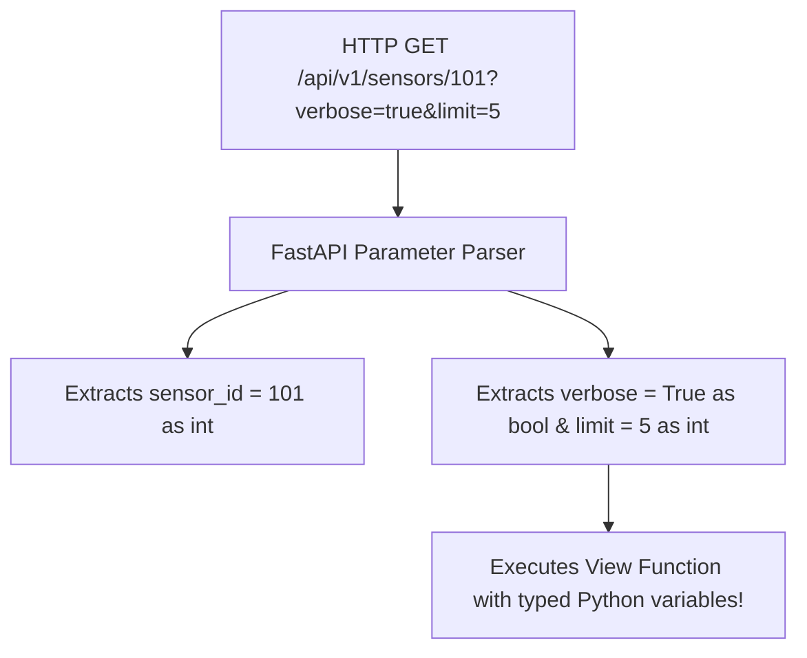

# Lesson 2.1 Path Parameters, Query Strings, & Type Annotations

> **Course**: Fastapi | **Module**: Module 1 | **Difficulty**: beginner

---

- **Estimated Time**: 45 Minutes (15m Reading | 20m Practice | 10m Quiz)
- **Difficulty Level**: ⭐ Beginner
- **Prerequisites**: [Lesson 1.2 FastAPI Routing](file:///d:/My%20Drive/all%20files/PROJECT%20FILES/notes/docs/curriculum/_05_fastapi/_05_02_fastapi_app_instantiation_routing_and_openapi.md)
- **XP Reward**: +50 XP

### Learning Objectives
By the end of this lesson, you will be able to:
1. Define dynamic path parameters using `/resource/{param_id}` syntax.
2. Declare query parameters (`?limit=10&active=true`) using function argument type hints.
3. Leverage automatic type casting (`int`, `float`, `bool`, `UUID`).
4. Apply validation constraints using **`Path()`** and **`Query()`** metadata functions.

---

---

Open Python REPL or VS Code.

---

---

### 3.1 Parameter Parsing & Automatic Type Conversion
In standard frameworks, path and query parameters are extracted as raw strings (`"42"`), requiring manual `int("42")` casting and error handling.

FastAPI inspects Python type hints on function arguments:
- If an argument is declared in the path (`/items/{item_id}`), it is parsed as a **Path Parameter**.
- If an argument is NOT in the path (`def get_items(limit: int = 10)`), it is parsed as a **Query String Parameter**.
- FastAPI converts string inputs into target Python types automatically and returns an HTTP 422 error if conversion fails.

```
┌─────────────────────────────────────────────────────────────────────────────┐
│                       FASTAPI PARAMETER DECLARATION MATRIX                  │
├─────────────────┬─────────────────────────────────┬─────────────────────────┤
│ Declaration     │ Function Signature              │ Source & Type           │
├─────────────────┼─────────────────────────────────┼─────────────────────────┤
│ `/nodes/{id}`   │ `def fn(id: int)`               │ Path parameter (`int`)  │
│ `/nodes`        │ `def fn(page: int = 1)`         │ Query param (`int`)     │
│ `/nodes`        │ `def fn(q: str | None = None)`  │ Optional Query param    │
└─────────────────┴─────────────────────────────────┴─────────────────────────┘
```

---

---



---

---

```python
# FastAPI Path & Query Parameter Validation (params_demo.py)
from uuid import UUID
from fastapi import FastAPI, Path, Query, status

app = FastAPI(title="Parameter Validation API")

# 1. Typed Path Parameter with Path() Validation Rules
@app.get("/api/v1/sensors/{sensor_id}")
def get_sensor_by_id(
    sensor_id: int = Path(
        ...,
        title="Sensor ID",
        ge=1,       # Greater than or equal to 1
        le=10000,   # Less than or equal to 10000
        description="The unique integer ID of the sensor hardware node"
    )
):
    return {"sensor_id": sensor_id, "type": str(type(sensor_id))}

# 2. Query Parameters with Query() Constraints
@app.get("/api/v1/telemetry")
def filter_telemetry(
    limit: int = Query(default=10, ge=1, le=100),
    page: int = Query(default=1, ge=1),
    active_only: bool = Query(default=True),
    search: str | None = Query(default=None, min_length=3, max_length=50)
):
    return {
        "page": page,
        "limit": limit,
        "active_only": active_only,
        "search_term": search
    }

# 3. UUID Path Parameter
@app.get("/api/v1/devices/{device_uuid}")
def get_device_by_uuid(device_uuid: UUID):
    # device_uuid is automatically parsed into a Python uuid.UUID object!
    return {"device_uuid": str(device_uuid), "is_valid_uuid": True}
```

---

---

- **Microservice Filtering & Pagination**: Production REST APIs use `Query(ge=1, le=100)` to enforce page size limits, preventing clients from requesting millions of database records in a single query.

---

---

1. Save code as `params_demo.py`.
2. Run `uvicorn params_demo:app --reload`.
3. Navigate to `/api/v1/sensors/0` $\to$ Inspect automatic HTTP 422 Validation Error response!

---

---

| Bug / Error | Root Cause | Engineering Solution |
| :--- | :--- | :--- |
| **HTTP 422 Unprocessable Entity** | Passing a non-integer string (`/sensors/abc`) to a parameter annotated with `: int`. | Ensure client requests supply arguments matching declared Python types. |

---

---

- **Use Python 3.10+ Union Syntax (`str | None`)**: Use `str | None = None` for clean optional query parameter declarations.

---

---

### Q1: How does FastAPI differentiate between a Path Parameter and a Query Parameter in a route function?
**Answer**: FastAPI inspects the route path string decorator (e.g. `@app.get("/items/{item_id}")`). Any function parameter whose name matches a variable inside `{...}` in the path decorator is treated as a Path Parameter. Any parameter not matching the path string is parsed as a Query String Parameter.

---

---

```json
{
  "quiz_title": "Lesson 2.1 Parameters Assessment",
  "questions": [
    {
      "question_id": "Q1",
      "type": "multiple_choice",
      "question_text": "How does FastAPI treat a function parameter that is NOT declared in the route path decorator?",
      "options": ["Path Parameter", "Query Parameter", "Header Parameter", "Body Parameter"],
      "correct_answer_index": 1,
      "explanation": "Parameters not in the path template are parsed as Query Parameters."
    }
  ]
}
```

---

---

Build an endpoint with `Path(ge=1)` and optional `Query(min_length=3)` parameter validations.

---

---

**Front**: What HTTP status code does FastAPI automatically return when path or query parameter validation fails?
**Back**: HTTP 422 Unprocessable Entity.
<!-- flashcard:end -->

---

---

```python
@app.get("/item/{id}")
def item(id: int = Path(..., ge=1), q: str | None = Query(None)):
    return {"id": id, "q": q}
```


---

---

> **Source**: `_08_01_FastAPI_and_CRUD_Notes.md` (from backend concepts archive)
> This content was migrated from existing study notes. Review and merge with topics above.

# Module 3: FastAPI, CRUD, REST APIs

---

---

### 1. The Big Picture

#### What is CRUD?
**CRUD** stands for **Create, Read, Update, and Delete**. These are the four basic functions of persistent storage. In web development, we map these database operations to HTTP methods:

```
┌──────────────────┬─────────────────┬─────────────────────────────────────┐
│ Operation        │ HTTP Method     │ REST Path Example                   │
├──────────────────┼─────────────────┼─────────────────────────────────────┤
│ **Create**       │ `POST`          │ `POST /api/v1/items`                │
│ **Read (List)**  │ `GET`           │ `GET /api/v1/items`                 │
│ **Read (Single)**│ `GET`           │ `GET /api/v1/items/{id}`            │
│ **Update (Full)**│ `PUT`           │ `PUT /api/v1/items/{id}`            │
│ **Update (Part)**│ `PATCH`         │ `PATCH /api/v1/items/{id}`          │
│ **Delete**       │ `DELETE`        │ `DELETE /api/v1/items/{id}`         │
└──────────────────┴─────────────────┴─────────────────────────────────────┘
```

---

### 2. Pydantic for Validation and Serialization
In FastAPI, we use **Pydantic** to define the data structures (schemas) for requests and responses.
* **Input Validation:** Pydantic automatically checks types, string lengths, ranges, and patterns. If the client sends an invalid payload, FastAPI returns a `422 Unprocessable Entity` immediately.
* **Serialization:** Pydantic filters and converts Python objects (including database ORM models) into JSON format.

---

### 3. Implementing CRUD in FastAPI

Here is how we design a clean, production-ready CRUD controller for an e-commerce **Category** resource.

#### 1. The Schemas (`schemas.py`)
```python
from pydantic import BaseModel, Field
from typing import Optional

class CategoryCreate(BaseModel):
    name: str = Field(..., min_length=2, max_length=50, example="Electronics")
    description: Optional[str] = Field(None, max_length=200, example="Gadgets and devices")

class CategoryUpdate(BaseModel):
    name: Optional[str] = Field(None, min_length=2, max_length=50)
    description: Optional[str] = Field(None, max_length=200)

class CategoryResponse(BaseModel):
    id: int
    name: str
    description: Optional[str]
```

#### 2. The Router (`router.py`)
```python
from fastapi import APIRouter, status, HTTPException
from typing import List
from schemas import CategoryCreate, CategoryUpdate, CategoryResponse

router = APIRouter(prefix="/api/v1/categories", tags=["Categories"])

CATEGORIES_DB = []
current_id = 1

# CREATE
@router.post("", response_model=CategoryResponse, status_code=status.HTTP_201_CREATED)
def create_category(category_in: CategoryCreate):
    global current_id
    new_category = {
        "id": current_id,
        "name": category_in.name,
        "description": category_in.description
    }
    CATEGORIES_DB.append(new_category)
    current_id += 1
    return new_category

# READ (List)
@router.get("", response_model=List[CategoryResponse])
def list_categories():
    return CATEGORIES_DB

# READ (Single)
@router.get("/{category_id}", response_model=CategoryResponse)
def get_category(category_id: int):
    for cat in CATEGORIES_DB:
        if cat["id"] == category_id:
            return cat
    raise HTTPException(status_code=404, detail="Category not found")

# UPDATE (Full - PUT)
@router.put("/{category_id}", response_model=CategoryResponse)
def update_category_full(category_id: int, category_in: CategoryCreate):
    for cat in CATEGORIES_DB:
        if cat["id"] == category_id:
            cat["name"] = category_in.name
            cat["description"] = category_in.description
            return cat
    raise HTTPException(status_code=404, detail="Category not found")

# UPDATE (Partial - PATCH)
@router.patch("/{category_id}", response_model=CategoryResponse)
def update_category_partial(category_id: int, category_in: CategoryUpdate):
    for cat in CATEGORIES_DB:
        if cat["id"] == category_id:
            # Only update fields that were explicitly sent in the request
            update_data = category_in.model_dump(exclude_unset=True)
            for key, value in update_data.items():
                cat[key] = value
            return cat
    raise HTTPException(status_code=404, detail="Category not found")

# DELETE
@router.delete("/{category_id}", status_code=status.HTTP_204_NO_CONTENT)
def delete_category(category_id: int):
    global CATEGORIES_DB
    for cat in CATEGORIES_DB:
        if cat["id"] == category_id:
            CATEGORIES_DB.remove(cat)
            return
    raise HTTPException(status_code=404, detail="Category not found")
```

---

### 4. Professional Notes: PUT vs PATCH
This is a classic senior-level distinction:
* **`PUT` (Complete Replacement):** The client must send the *entire* representation of the resource. If the client sends `{"name": "New Name"}` but omits `description`, the server will set `description` to `None` or its default value.
* **`PATCH` (Partial Update):** The client only sends the fields they want to change. If the client sends `{"name": "New Name"}`, the server *only* updates the name, leaving the existing `description` completely unchanged. 
* **Best Practice:** Use `exclude_unset=True` in Pydantic's `model_dump()` when processing PATCH requests so you don't accidentally overwrite fields with their default values.

---

### 5. Hands-on Workout & Assessment

#### Part A: API Design Challenge (PATCH Design)
Suppose a user wants to update their profile. The profile has `username`, `email`, `bio`, and `avatar_url`.
- Write down the Pydantic schema for the `PATCH` request (`UserProfileUpdate`). 
- How do you ensure fields are optional, but if they *are* provided, they are validated (e.g., email must be a valid email)?

#### Part B: Quiz
1. Which HTTP method maps to the "Delete" operation in CRUD?
   A. POST
   B. PUT
   C. DELETE
   D. GET
2. What does `exclude_unset=True` do when dumping a Pydantic model?
   A. It removes all fields that are set to None.
   B. It only includes fields that were explicitly passed in the request payload, ignoring defaults.
   C. It excludes fields that are not defined in the database.
   D. It encrypts the output.
3. If a client wants to change just the price of a product, which method is most appropriate?
   A. GET
   B. PUT
   C. PATCH
   D. POST

---

### 6. Progress Tracker

* **Module 3: FastAPI, CRUD, REST APIs:** 0%
* **Topics Completed:** 0/1
* **Coding Exercises:** 0/0
* **Quiz Score:** N/A
* **API Design Challenge Score:** N/A
* **Backend Score:** 0 / 100

---

---
