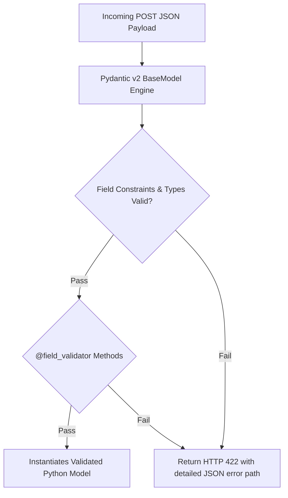

# Lesson 2.2 Pydantic v2 Models & Schema Validation

> **Course**: Fastapi | **Module**: Module 1 | **Difficulty**: beginner

---

- **Estimated Time**: 55 Minutes (20m Reading | 25m Practice | 10m Quiz)
- **Difficulty Level**: ⭐⭐ Intermediate
- **Prerequisites**: [Lesson 2.1 Parameters](file:///d:/My%20Drive/all%20files/PROJECT%20FILES/notes/docs/curriculum/_05_fastapi/_05_03_path_and_query_parameters.md)
- **XP Reward**: +60 XP

### Learning Objectives
By the end of this lesson, you will be able to:
1. Define request body payloads using **Pydantic v2 `BaseModel`**.
2. Apply declarative field constraints using **`Field()`**.
3. Implement custom field validation rules using **`@field_validator`**.
4. Construct complex multi-field rules using **`@model_validator`** and nested schemas.

---

---

Open Python REPL or VS Code.

---

---

### 3.1 Pydantic v2 Architecture
**Pydantic v2** is a high-performance data validation library written in Rust (`pydantic-core`). In FastAPI, declaring a parameter annotated with a `BaseModel` subclass automatically parses, validates, and deserializes incoming JSON request bodies:

```
┌─────────────────────────────────────────────────────────────────────────────┐
│                       PYDANTIC V2 SCHEMA VALIDATION PIPELINE                │
├─────────────────────────────────────────────────────────────────────────────┤
│ Client JSON Payload ──► FastAPI inspects `payload: SensorPayload`            │
│                     ──► Pydantic Core (Rust) validates type & constraints   │
│                     ──► Runs `@field_validator` rules                       │
│                     ──► Passes validated Python object to view function     │
└─────────────────────────────────────────────────────────────────────────────┘
```

---

---



---

---

```python
# Pydantic v2 Schema Models & Custom Validation (pydantic_demo.py)
from enum import Enum
from fastapi import FastAPI, status
from pydantic import BaseModel, Field, EmailStr, field_validator, model_validator

app = FastAPI(title="Pydantic v2 Telemetry API")

class SensorType(str, Enum):
    TEMPERATURE = "TEMPERATURE"
    HUMIDITY = "HUMIDITY"
    PRESSURE = "PRESSURE"

# 1. Nested Location Model
class LocationConfig(BaseModel):
    building: str = Field(..., min_length=2, max_length=50)
    floor: int = Field(..., ge=-2, le=100)

# 2. Main Pydantic Request Body Model
class SensorRegistrationPayload(BaseModel):
    node_code: str = Field(..., min_length=3, max_length=20, pattern=r"^[A-Z0-9\-]+$")
    sensor_type: SensorType
    threshold: float = Field(..., gt=-50.0, lt=150.0)
    operator_email: EmailStr
    location: LocationConfig # Nested Schema!

    # Custom Field Validator
    @field_validator("node_code")
    @classmethod
    def validate_node_code(cls, value: str) -> str:
        if "ADMIN" in value:
            raise ValueError("The string 'ADMIN' is reserved and cannot be in node_code!")
        return value

    # Root Model Validator (Multi-field validation)
    @model_validator(mode="after")
    def validate_threshold_range(self) -> "SensorRegistrationPayload":
        if self.sensor_type == SensorType.HUMIDITY and self.threshold > 100.0:
            raise ValueError("Humidity threshold cannot exceed 100.0%!")
        return self

# REST Endpoint accepting Pydantic Payload
@app.post("/api/v1/sensors/register", status_code=status.HTTP_201_CREATED)
def register_sensor(payload: SensorRegistrationPayload):
    # payload is a fully validated Python SensorRegistrationPayload object!
    return {
        "status": "REGISTERED",
        "node_code": payload.node_code,
        "floor": payload.location.floor,
        "sensor_type": payload.sensor_type
    }
```

---

---

- **Microservice Data Ingestion Gateways**: FastAPI services validate complex nested JSON payloads sent by IoT edge devices, ensuring bad sensor telemetry is caught and rejected at the API boundary before hitting database storage.

---

---

1. Save code as `pydantic_demo.py`.
2. Run `uvicorn pydantic_demo:app --reload`.
3. Send POST request with `"node_code": "ADMIN-NODE"` $\to$ Inspect exact JSON validation error output returned by Pydantic!

---

---

| Bug / Error | Root Cause | Engineering Solution |
| :--- | :--- | :--- |
| **`ImportError: cannot import name 'validator'`** | Using Pydantic v1 syntax `@validator` in Pydantic v2. | In Pydantic v2, use `@field_validator` with `@classmethod` or `@model_validator(mode='after')`. |

---

---

- **Use `@classmethod` on `@field_validator`**: In Pydantic v2, `@field_validator` functions must be declared as class methods (`@classmethod`).

---

---

### Q1: What are the key improvements of Pydantic v2 over Pydantic v1 in FastAPI?
**Answer**: Pydantic v2 re-architected its core validation engine in Rust (`pydantic-core`), resulting in validation performance increases of 5x to 50x over v1. It introduces stricter type safety, improved error messages, clearer validator decorators (`@field_validator`, `@model_validator`), and faster JSON serialization.

---

---

```json
{
  "quiz_title": "Lesson 2.2 Pydantic v2 Assessment",
  "questions": [
    {
      "question_id": "Q1",
      "type": "multiple_choice",
      "question_text": "Which base class must all Pydantic schema models inherit from?",
      "options": ["Schema", "BaseModel", "PydanticModel", "DataModel"],
      "correct_answer_index": 1,
      "explanation": "Pydantic models inherit from pydantic.BaseModel."
    }
  ]
}
```

---

---

Build a Pydantic v2 schema for an e-commerce order with custom field validation rules.

---

---

**Front**: Which Pydantic v2 decorator handles custom validation rules on individual model fields?
**Back**: `@field_validator("field_name")`.
<!-- flashcard:end -->

---

---

```python
class Item(BaseModel):
    name: str = Field(..., min_length=3)
    @field_validator("name")
    @classmethod
    def check(cls, v): return v.upper()
```

---
