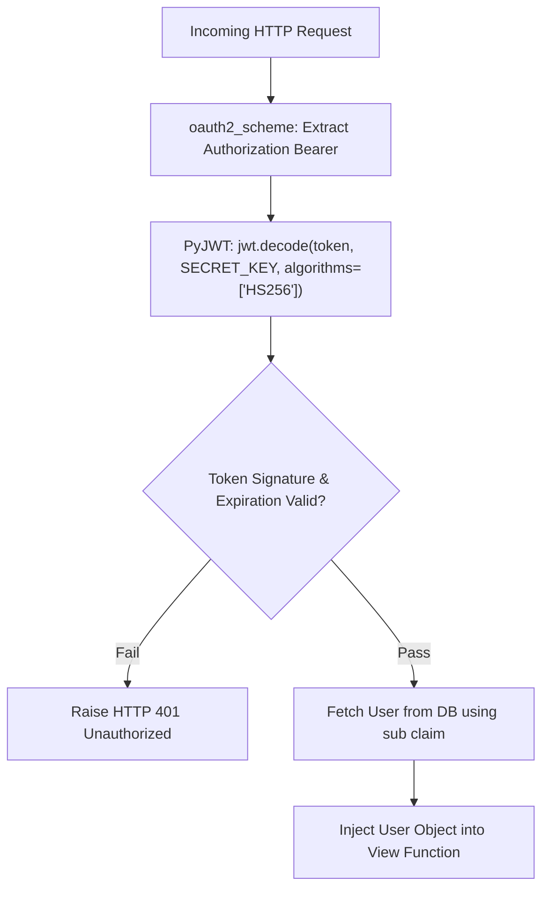

# Lesson 5.2 JWT Authentication & Current User Dependency

> **Course**: Fastapi | **Module**: Module 1 | **Difficulty**: beginner

---

- **Estimated Time**: 55 Minutes (20m Reading | 25m Practice | 10m Quiz)
- **Difficulty Level**: ⭐⭐⭐ Advanced
- **Prerequisites**: [Lesson 5.1 OAuth2 Password Bearer](file:///d:/My%20Drive/all%20files/PROJECT%20FILES/notes/docs/curriculum/_05_fastapi/_05_09_oauth2_password_bearer_and_hashing.md)
- **XP Reward**: +70 XP

### Learning Objectives
By the end of this lesson, you will be able to:
1. Encode and decode JWT tokens using **PyJWT** (`jwt.encode()`, `jwt.decode()`).
2. Add expiration claims (`exp`) and token metadata claims (`sub`).
3. Construct a reusable **`get_current_user`** dependency pipeline.
4. Implement **Role-Based Access Control (RBAC)** to restrict endpoints based on user roles (`ADMIN`, `OPERATOR`).

---

---

Install `pyjwt`:

```bash
pip install pyjwt
```

---

---

### 3.1 The `get_current_user` Dependency Pipeline
In FastAPI, authentication is implemented cleanly using Dependency Injection. Instead of writing authentication logic inside view functions, you create a `get_current_user` dependency.

This dependency:
1. Receives the raw Bearer token via `oauth2_scheme = OAuth2PasswordBearer(tokenUrl="token")`.
2. Decodes and verifies the JWT token using `jwt.decode()`.
3. Queries the user record from the database.
4. Injects the authenticated `User` model object directly into any protected view function!

```
┌─────────────────────────────────────────────────────────────────────────────┐
│                    FASTAPI GET_CURRENT_USER DEPENDENCY PIPELINE             │
├─────────────────────────────────────────────────────────────────────────────┤
│ Protected Route ──► `current_user: User = Depends(get_current_user)`         │
│                 ──► `get_current_user` depends on `oauth2_scheme`           │
│                 ──► Decodes JWT `sub` ──► Fetches User from DB              │
│                 ──► Injects validated `User` object into route              │
└─────────────────────────────────────────────────────────────────────────────┘
```

---

---



---

---

```python
# FastAPI JWT & Current User Dependency Pipeline (jwt_auth_demo.py)
from datetime import datetime, timedelta, timezone
import jwt
from fastapi import FastAPI, Depends, HTTPException, status
from fastapi.security import OAuth2PasswordBearer
from pydantic import BaseModel

app = FastAPI(title="JWT Authentication API")

SECRET_KEY = "jwt-secret-key-super-secure-90210"
ALGORITHM = "HS256"
ACCESS_TOKEN_EXPIRE_MINUTES = 30

oauth2_scheme = OAuth2PasswordBearer(tokenUrl="token")

# Pydantic Schemas
class User(BaseModel):
    username: str
    email: str
    role: str
    is_active: bool = True

class TokenData(BaseModel):
    username: str | None = None

# Mock Database
USERS_DB = {
    "operator_dev": User(username="operator_dev", email="op@telemetry.io", role="OPERATOR"),
    "admin_dev": User(username="admin_dev", email="admin@telemetry.io", role="ADMIN")
}

# 1. JWT Encoding Helper
def create_access_token(data: dict, expires_delta: timedelta | None = None) -> str:
    to_encode = data.copy()
    expire = datetime.now(timezone.utc) + (expires_delta or timedelta(minutes=15))
    to_encode.update({"exp": expire})
    return jwt.encode(to_encode, SECRET_KEY, algorithm=ALGORITHM)

# 2. Reusable get_current_user Dependency
def get_current_user(token: str = Depends(oauth2_scheme)) -> User:
    credentials_exception = HTTPException(
        status_code=status.HTTP_401_UNAUTHORIZED,
        detail="Could not validate credentials",
        headers={"WWW-Authenticate": "Bearer"},
    )
    try:
        # Decode and verify JWT signature & expiration!
        payload = jwt.decode(token, SECRET_KEY, algorithms=[ALGORITHM])
        username: str = payload.get("sub")
        if username is None:
            raise credentials_exception
    except jwt.PyJWTError:
        raise credentials_exception

    user = USERS_DB.get(username)
    if user is None:
        raise credentials_exception
    return user

# 3. Role-Based Access Control (RBAC) Sub-Dependency
def get_current_admin_user(current_user: User = Depends(get_current_user)) -> User:
    if current_user.role != "ADMIN":
        raise HTTPException(
            status_code=status.HTTP_403_FORBIDDEN,
            detail="Operation restricted to ADMIN users only!"
        )
    return current_user

# 4. Protected Endpoints
@app.get("/api/v1/users/me")
def read_current_user(current_user: User = Depends(get_current_user)):
    return {"user": current_user}

@app.get("/api/v1/admin/dashboard")
def admin_dashboard(admin: User = Depends(get_current_admin_user)):
    return {"message": f"Welcome to Admin Panel, {admin.username}!"}
```

---

---

- **Role-Based API Access Control (RBAC)**: Enterprise backends use sub-dependencies like `get_current_admin_user` to restrict sensitive microservice operations (such as device firmware updates or user deletion) to authorized roles.

---

---

1. Save code as `jwt_auth_demo.py`.
2. Generate token for `operator_dev` $\to$ Access `/api/v1/admin/dashboard` $\to$ Inspect HTTP 403 Forbidden response!

---

---

| Bug / Error | Root Cause | Engineering Solution |
| :--- | :--- | :--- |
| **`ExpiredSignatureError`** | Using a token whose `exp` timestamp has passed. | Handle `jwt.PyJWTError` exceptions and issue new access tokens via refresh endpoints. |

---

---

- **Use Sub-Dependencies for RBAC**: Chain `get_current_admin_user` off `get_current_user` to keep security logic modular and reusable.

---

---

### Q1: How does FastAPI implement Role-Based Access Control (RBAC) cleanly using Dependency Injection?
**Answer**: FastAPI implements RBAC by chaining sub-dependencies. A base `get_current_user` dependency decodes the JWT token and fetches the `User` object. A secondary sub-dependency (`get_current_admin_user`) depends on `get_current_user`, inspects `current_user.role`, and raises an `HTTPException(403 Forbidden)` if the role is insufficient.

---

---

```json
{
  "quiz_title": "Lesson 5.2 JWT Auth Assessment",
  "questions": [
    {
      "question_id": "Q1",
      "type": "multiple_choice",
      "question_text": "Which standard claim in a JWT payload stores the subject/user identity?",
      "options": ["id", "sub", "user", "username"],
      "correct_answer_index": 1,
      "explanation": "sub (Subject) is the standard JWT claim for user identity."
    }
  ]
}
```

---

---

Build a `get_current_user` dependency pipeline verifying JWT signatures and user active status.

---

---

**Front**: Which PyJWT exception catches expired or invalid token signatures?
**Back**: `jwt.PyJWTError` (or `jwt.ExpiredSignatureError`).
<!-- flashcard:end -->

---

---

```python
token = jwt.encode({"sub": user.username}, SECRET_KEY, algorithm="HS256")
payload = jwt.decode(token, SECRET_KEY, algorithms=["HS256"])
```


---

---

> **Source**: `_11_01_Authentication_and_JWT_Notes.md` (from backend concepts archive)
> This content was migrated from existing study notes. Review and merge with topics above.

# Module 5: Authentication

---

---

### 1. The Big Picture

#### What is JWT?
A **JWT (JSON Web Token)** is an open standard (RFC 7519) that defines a compact and self-contained way for securely transmitting information between parties as a JSON object. This information can be verified and trusted because it is digitally signed.

#### Why Companies Use JWT for APIs
In traditional web apps, the server stores session data in memory or a database, and the client sends a `Session ID` in a cookie. For APIs, this approach does not scale well:
1. **API Scalability:** If you have 10 API servers, they must all share a session database (like Redis) to know who is logged in.
2. **Statelessness:** JWTs are **stateless**. The token itself contains all the user data (claims). The server does not need to query a database to verify the token; it only needs to verify the digital signature using a secret key.

---

### 2. Anatomy of a JWT

A JWT is a string divided into three parts separated by dots (`.`): `header.payload.signature`

```
  HEADER (Algorithm & Token Type)
  eyJhbGciOiJIUzI1NiIsInR5cCI6IkpXVCJ9
  .
  PAYLOAD (Claims: User ID, Expiry, Roles)
  eyJzdWIiOiIxMjM0NTY3ODkwIiwibmFtZSI6IkpvaG4gRG9lIiwiaWF0IjoxNTE2MjM5MDIyfQ
  .
  SIGNATURE (Verifies the token hasn't been altered)
  SflKxwRJSMeKKF2QT4fwpMeJf36POk6yJV_adQssw5c
```

1. **Header:** Specifies the signing algorithm (e.g., HMAC SHA256 or RSA).
2. **Payload:** Contains the **claims** (statements about the user, e.g., `user_id`, `email`, `exp` - expiration time).
3. **Signature:** Created by taking the encoded header, the encoded payload, a secret key, and signing them. If even a single character in the payload is changed, the signature becomes invalid.

---

### 3. JWT Authentication Flow

```
Client (Browser)                                    Server (API)
       │                                                 │
       ├───────────────── 1. POST /login ───────────────►│ (Checks password,
       │                 (Credentials)                   │  generates JWT)
       │                                                 │
       ◄─────────────── 2. Returns JWT ──────────────────┤
       │                                                 │
       │                                                 │
       ├───────── 3. GET /profile ──────────────────────►│ (Verifies signature
       │         (Authorization: Bearer <JWT>)           │  & expiration.
       │                                                 │  Returns profile)
       ◄─────────── 4. Returns Profile ──────────────────┤
```

---

### 4. Password Hashing (Crucial Security)
**Never store plain-text passwords in a database.** If your database is leaked, all user accounts are compromised.
* **Salt + Hash:** A salt is a random string added to the password before hashing. This prevents attackers from using pre-computed tables (Rainbow Tables) to crack passwords.
* **Algorithms:** Use slow, CPU-intensive algorithms designed for password hashing, such as **bcrypt** or **Argon2id**. Do **not** use fast hashing algorithms like MD5 or SHA256.

---

### 5. Python Example: JWT Handling in FastAPI

```python
from datetime import datetime, timedelta, timezone
from jose import jwt, JWTError
from passlib.context import CryptContext

# CryptContext for password hashing (uses bcrypt under the hood)
pwd_context = CryptContext(schemes=["bcrypt"], deprecated="auto")

SECRET_KEY = "my_super_secret_key_change_me_in_production"
ALGORITHM = "HS256"

# Hash password
def hash_password(password: str) -> str:
    return pwd_context.hash(password)

# Verify password
def verify_password(plain_password: str, hashed_password: str) -> bool:
    return pwd_context.verify(plain_password, hashed_password)

# Create JWT Access Token
def create_access_token(data: dict, expires_delta: timedelta = None) -> str:
    to_encode = data.copy()
    if expires_delta:
        expire = datetime.now(timezone.utc) + expires_delta
    else:
        expire = datetime.now(timezone.utc) + timedelta(minutes=15)
        
    to_encode.update({"exp": expire})
    encoded_jwt = jwt.encode(to_encode, SECRET_KEY, algorithm=ALGORITHM)
    return encoded_jwt

# Verify and Decode JWT Token
def verify_access_token(token: str) -> dict:
    try:
        payload = jwt.decode(token, SECRET_KEY, algorithms=[ALGORITHM])
        return payload
    except JWTError:
        raise ValueError("Invalid or expired token")
```

---

### 6. Hands-on Workout & Assessment

#### Part A: API Design Challenge (Token Security)
A junior developer proposes storing the JWT in the browser's `localStorage` and sending it in the `Authorization` header.
- What security vulnerability does this expose the client to? (Hint: XSS).
- What is the alternative, more secure way to store tokens in a web browser to protect against XSS? (Hint: HttpOnly, Secure, SameSite Cookies).

#### Part B: Quiz
1. Which part of a JWT contains the user ID and token expiration timestamp?
   A. Header
   B. Payload
   C. Signature
   D. Metadata
2. Why is it a bad idea to use SHA256 for password hashing?
   A. SHA256 is not secure enough.
   B. SHA256 is too slow.
   C. SHA256 is a fast hashing algorithm, making it easy for attackers to brute-force millions of passwords per second using GPUs.
   D. SHA256 does not support salting.
3. What happens if a client alters the user ID in the JWT payload from `42` to `1` (admin)?
   A. The server will log them in as admin.
   B. The server will crash.
   C. The signature verification will fail, and the server will reject the token.
   D. The database will automatically update.

---

### 7. Progress Tracker

* **Module 5: Authentication:** 0%
* **Topics Completed:** 0/1
* **Coding Exercises:** 0/0
* **Quiz Score:** N/A
* **API Design Challenge Score:** N/A
* **Backend Score:** 0 / 100

---

---
