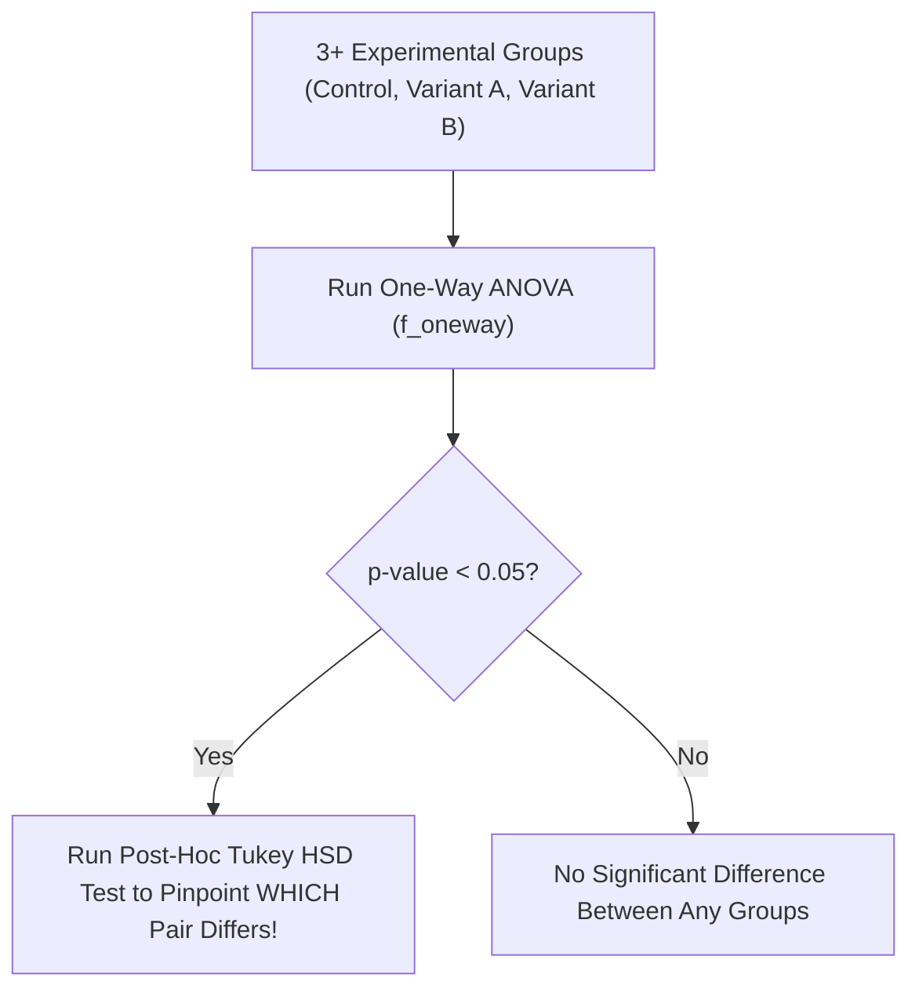

# Lesson 1.3.3 Analysis of Variance (ANOVA) & Chi-Square Tests

> **Course**: Ds Math | **Module**: Module 1 | **Difficulty**: beginner

---

- **Estimated Time**: 55 Minutes (20m Reading | 25m Practice | 10m Quiz)
- **Difficulty Level**: ⭐⭐ Intermediate
- **Prerequisites**: [Lesson 1.3.2 Parametric Hypothesis Testing](file:///d:/My%20Drive/all%20files/PROJECT%20FILES/notes/docs/curriculum/_08_ds_math/_01_09_parametric_hypothesis_testing.md)
- **XP Reward**: +60 XP

### Learning Objectives
By the end of this lesson, you will be able to:
1. Execute One-Way **ANOVA** ($F$-test) to compare means across 3+ independent groups.
2. Conduct Post-Hoc Pairwise Comparisons using **Tukey's HSD** test.
3. Perform Two-Way ANOVA to evaluate interaction effects between multi-factor variables.
4. Execute **Chi-Square ($\chi^2$) Tests of Independence** on categorical contingency tables.

---

---

Install Statsmodels alongside SciPy: `pip install statsmodels`.

---

---

### 3.1 One-Way ANOVA ($F$-Statistic)
Compares variance *between* groups to variance *within* groups:

$$F = \frac{\text{Mean Square Between (MSB)}}{\text{Mean Square Within (MSW)}} = \frac{\frac{\text{SSB}}{k-1}}{\frac{\text{SSW}}{N-k}}$$

If $F$ is significantly larger than $1.0$ ($p < 0.05$), at least one group mean differs from the others.

### 3.2 Chi-Square Test of Independence ($\chi^2$)
Evaluates whether two categorical variables are independent based on observed vs expected contingency counts:

$$\chi^2 = \sum \frac{(O - E)^2}{E}$$

---

---



---

---

```python
import numpy as np
from scipy import stats
from statsmodels.stats.multicomp import pairwise_tukeyhsd

# 1. One-Way ANOVA (Comparing 3 Marketing Channels)
grp1 = [12, 14, 15, 13, 11]
grp2 = [22, 24, 25, 21, 23]
grp3 = [15, 17, 16, 18, 14]

f_stat, p_val = stats.f_oneway(grp1, grp2, grp3)
print(f"ANOVA F-statistic: {f_stat:.2f}, p-value: {p_val:.6f}")

# 2. Post-Hoc Tukey HSD Test
data = np.concatenate([grp1, grp2, grp3])
labels = ['Grp1']*5 + ['Grp2']*5 + ['Grp3']*5
tukey = pairwise_tukeyhsd(endog=data, groups=labels, alpha=0.05)
print("\nTukey HSD Results:\n", tukey)

# 3. Chi-Square Test of Independence (Gender vs Device Preference)
contingency_table = np.array([[50, 30], [20, 40]]) # [[Male_Mobile, Male_Desk], [Fem_Mobile, Fem_Desk]]
chi2, p_chi2, dof, ex = stats.chi2_contingency(contingency_table)
print(f"\nChi2 Statistic: {chi2:.2f}, p-value: {p_chi2:.6f}")
```

---

---

- **Multi-Arm Web Experimentation**: Comparing click-through rates across 4 different button color designs simultaneously using One-Way ANOVA followed by Tukey HSD.

---

---

1. Save code as `anova_demo.py`.
2. Run `python anova_demo.py` $\to$ Inspect Tukey HSD pairwise matrix output!

---

---

| Bug / Error | Root Cause | Engineering Solution |
| :--- | :--- | :--- |
| **Running Multiple $t$-Tests Instead of ANOVA** | Running 3 pairwise $t$-tests inflates total Type I error rate ($\alpha$ jumps from 5% to 14%). | Always run ANOVA first, followed by Tukey HSD post-hoc adjustment. |

---

---

- **Run Tukey HSD After ANOVA**: Identifies specific group differences while controlling family-wise error rate.

---

---

### Q1: Why use ANOVA instead of multiple individual $t$-tests when comparing 4 groups?
**Answer**: Running multiple $t$-tests causes **alpha inflation**—the cumulative probability of making a Type I error increases exponentially ($1 - (1-\alpha)^k$). ANOVA evaluates all groups simultaneously in a single $F$-test while maintaining the global 5% significance level.

---

---

```json
{
  "quiz_title": "Lesson 1.3.3 ANOVA Assessment",
  "questions": [
    {
      "question_id": "Q1",
      "type": "multiple_choice",
      "question_text": "Which statistical test evaluates independence between two categorical variables in a contingency table?",
      "options": ["t-Test", "One-Way ANOVA", "Chi-Square Test of Independence", "Mann-Whitney U Test"],
      "correct_answer_index": 2,
      "explanation": "Chi-Square Test of Independence evaluates categorical contingency tables."
    }
  ]
}
```

---

---

Build an automated multi-group experiment analyzer combining ANOVA and Chi-Square tests.

---

---

**Front**: What function computes a Chi-Square test of independence in SciPy?
**Back**: `stats.chi2_contingency(contingency_matrix)`
<!-- flashcard:end -->

---

---

```python
f_stat, p_val = stats.f_oneway(group1, group2, group3)
chi2, p_val, dof, expected = stats.chi2_contingency(table)
```

---
