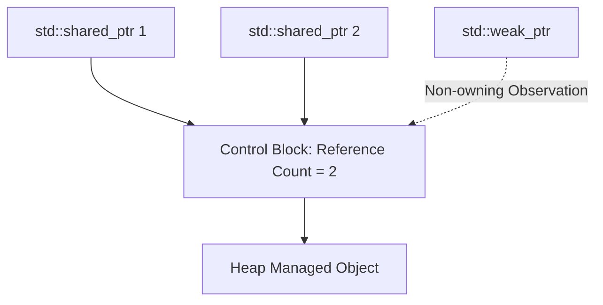

```yaml
schema_version: "2.0"
metadata:
  lesson_id: "CPP-MOD02-LES04"
  course_slug: "course-07-cpp"
  course_title: "Course 7: C++23 Modern Programming"
  module_slug: "mod-02-memory-safety-smart-pointers"
  module_title: "Module 2 - Modern Memory Safety & Smart Pointers"
  lesson_slug: "cpp20-smart-pointers-and-memory-safety"
  lesson_title: "Lesson 2.4 C++ Smart Pointers & RAII Memory Safety"
  sort_order: 204

pedagogy:
  difficulty: "advanced"
  estimated_time:
    reading_minutes: 20
    practice_minutes: 25
    quiz_minutes: 10
    total_minutes: 55
  bloom_taxonomy_level: "Apply"
  xp_reward: 70

prerequisites:
  required_lesson_ids:
    - "CPP-OOP-001"
  required_skills:
    - "C++ Classes & Pointer Mechanics"

skills_acquired:
  - "Resource Acquisition Is Initialization (RAII) Design Pattern"
  - "Exclusive Ownership via `std::unique_ptr` and `std::make_unique`"
  - "Shared Ownership via `std::shared_ptr` and `std::make_shared`"
  - "Preventing Circular Reference Leaks with `std::weak_ptr`"

dependencies:
  software:
    - "VS Code / GCC 13+ / Clang"
    - "C++20 Standard Compiler"
  hardware: []

seo_and_social:
  meta_title: "C++ Smart Pointers: unique_ptr, shared_ptr, weak_ptr & RAII Safety"
  meta_description: "Master modern C++ smart pointers: RAII memory management, std::unique_ptr, std::shared_ptr reference counting, std::weak_ptr, and eliminating raw delete."
  keywords: ["C++ Smart Pointers", "unique_ptr", "shared_ptr", "weak_ptr", "RAII memory safety", "make_unique make_shared"]

assessment_config:
  has_quiz: true
  has_lab: true
  has_flashcards: true
  pass_score_percentage: 80
```

# Lesson 2.4 C++ Smart Pointers & RAII Memory Safety

## 1. Overview & Learning Objectives [id: overview]

- **Estimated Time**: 55 Minutes (20m Reading | 25m Practice | 10m Quiz)
- **Difficulty Level**: ⭐⭐⭐ Advanced
- **Prerequisites**: C++ Pointers & Classes
- **XP Reward**: +70 XP

### Learning Objectives
By the end of this lesson, you will be able to:
1. Implement the **RAII (Resource Acquisition Is Initialization)** design pattern.
2. Manage exclusive resource ownership using **`std::unique_ptr`** and `std::make_unique()`.
3. Manage shared reference-counted ownership using **`std::shared_ptr`** and `std::make_shared()`.
4. Prevent circular reference memory leaks using **`std::weak_ptr`**.
5. Ban raw `new` and `delete` operations in modern C++ codebases.

---

## 2. Environment & Prerequisites [id: prerequisites]

Ensure a C++20 standard compiler (GCC 11+, Clang 13+, MSVC) is active.

---

## 3. Theoretical Foundations [id: theory]

### 3.1 RAII & Smart Pointers
Raw pointers (`T* ptr = new T()`) require manual `delete ptr;` invocations, leading to memory leaks, double-free crashes, and dangling pointers.

Modern C++ enforces **RAII**: object lifetimes are tied to stack scope. When a **Smart Pointer** goes out of scope, its destructor automatically frees the heap memory:

```
┌─────────────────────────────────────────────────────────────────────────────┐
│                          SMART POINTER TYPES MATRIX                         │
├─────────────────┬──────────────────────────────────┬────────────────────────┤
│ Smart Pointer   │ Ownership Semantics              │ Performance Overhead   │
├─────────────────┼──────────────────────────────────┼────────────────────────┤
│ `std::unique_ptr`│ Exclusive (Single owner)        │ ZERO (Same as raw pointer)│
│ `std::shared_ptr`│ Shared (Atomic Ref Counted)     │ Control Block + Atomic │
│ `std::weak_ptr`  │ Non-owning observer              │ Inspects shared_ptr    │
└─────────────────┴──────────────────────────────────┴────────────────────────┘
```

---

## 4. Architecture & Diagram Visualizations [id: diagram]



---

## 5. Code & Hardware Implementation [id: syntax]

```cpp
#include <iostream>
#include <memory>

class SensorNode {
public:
    std::string name;
    SensorNode(std::string n) : name(n) {
        std::cout << "[Constructor] Sensor initialized: " << name << "\n";
    }
    ~SensorNode() {
        std::cout << "[Destructor] Sensor auto-freed: " << name << "\n";
    }
    void readData() {
        std::cout << name << " reading telemetry...\n";
    }
};

int main() {
    // 1. Exclusive Ownership (std::unique_ptr)
    {
        auto u_sensor = std::make_unique<SensorNode>("ESP32-Exclusive");
        u_sensor->readData();
        // Move ownership (cannot copy!)
        std::unique_ptr<SensorNode> u_sensor2 = std::move(u_sensor);
    } // Destructor automatically called here as u_sensor2 goes out of scope!

    // 2. Shared Ownership (std::shared_ptr)
    std::shared_ptr<SensorNode> s_sensor1 = std::make_shared<SensorNode>("Gateway-Shared");
    {
        std::shared_ptr<SensorNode> s_sensor2 = s_sensor1;
        System.out.println("Use Count: " + s_sensor1.use_count()); // 2
    } // s_sensor2 scope ends, count drops back to 1
    
    std::cout << "Final Use Count: " << s_sensor1.use_count() << "\n";
    return 0; // Heap memory automatically freed!
}
```

---

## 6. Enterprise Real-World Applications [id: examples]

- **Autonomous Vehicle Vision Engines**: High-frequency image buffer pipelines use `std::unique_ptr` to pass frame buffers between thread queues with zero copying and zero memory leak risks.

---

## 7. Guided Step-by-Step Hands-On Exercise [id: exercises]

1. Save code as `smart_ptr_demo.cpp`.
2. Compile and run: `g++ -std=c++20 smart_ptr_demo.cpp -o smart_ptr_demo && ./smart_ptr_demo`.

---

## 8. Common Pitfalls & Troubleshooting [id: common_mistakes]

| Bug / Error | Root Cause | Engineering Solution |
| :--- | :--- | :--- |
| **Circular Reference Memory Leak** | Two `shared_ptr` objects referencing each other (A $\leftrightarrow$ B), preventing count from reaching 0. | Replace one side of the circular reference with `std::weak_ptr`. |

---

## 9. Best Practices & Optimization [id: best_practices]

- **Prefer `std::unique_ptr` by Default**: Use `unique_ptr` first; only switch to `shared_ptr` if shared ownership is explicitly required.

---

## 10. Industry Interview Q&A [id: interview_qa]

### Q1: What is the difference between `std::unique_ptr` and `std::shared_ptr`?
**Answer**: `std::unique_ptr` maintains strict exclusive ownership of a heap resource with zero runtime overhead; it cannot be copied, only moved. `std::shared_ptr` allows multiple owners to share a resource using atomic reference counting, freeing the resource when the reference count drops to zero.

---

## 11. Self-Assessment Quiz [id: quiz]

```json
{
  "quiz_title": "Lesson 2.4 Smart Pointers Assessment",
  "questions": [
    {
      "question_id": "Q1",
      "type": "multiple_choice",
      "question_text": "Which factory function is preferred for creating a `std::unique_ptr`?",
      "options": ["new unique_ptr()", "std::make_unique()", "std::create_unique()", "malloc()"],
      "correct_answer_index": 1,
      "explanation": "std::make_unique() is the safe factory function for unique_ptr."
    }
  ]
}
```

---

## 12. Portfolio Assignment & Challenge [id: lab]

Build an exception-safe RAII File Handle wrapper using `std::unique_ptr` with custom deleter `fclose`.

---

## 13. Spaced Repetition Flashcards [id: flashcards]

**Front**: How do you transfer ownership of a `std::unique_ptr`?
**Back**: Using `std::move()` (e.g. `ptr2 = std::move(ptr1)`).
<!-- flashcard:end -->

---

## 14. Summary & Cheat Sheet [id: summary]

```cpp
auto ptr = std::make_unique<Sensor>("Node1");
```
