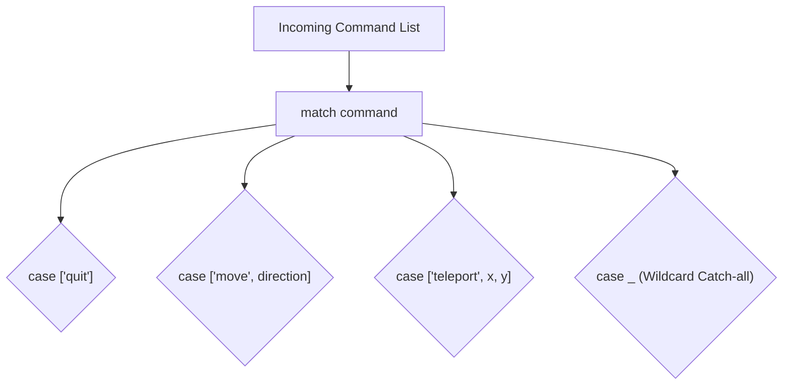

```yaml
schema_version: "2.0"
metadata:
  lesson_id: "PY-MOD01-LES05"
  course_slug: "course-02-python"
  course_title: "Course 2: Python 3.12+ Modern Programming"
  module_slug: "mod-01-core-fundamentals"
  module_title: "Module 1 - Core Fundamentals & Control Flow"
  lesson_slug: "structural-pattern-matching-match-case"
  lesson_title: "Lesson 1.5 Structural Pattern Matching (match/case)"
  sort_order: 105

pedagogy:
  difficulty: "intermediate"
  estimated_time:
    reading_minutes: 15
    practice_minutes: 20
    quiz_minutes: 10
    total_minutes: 45
  bloom_taxonomy_level: "Apply"
  xp_reward: 50

prerequisites:
  required_lesson_ids:
    - "PY-MOD01-LES04"
  required_skills:
    - "Python Conditionals & Dictionaries"

skills_acquired:
  - "Structural Pattern Matching Syntax (`match` and `case`)"
  - "Sequence Patterns & Destructuring (`case [x, y]`)"
  - "Mapping Patterns & Dictionary Extraction"
  - "Guard Clauses (`case x if x > 0`)"
  - "Class Instance Pattern Matching (`case Point(x, y)`)"

dependencies:
  software:
    - "VS Code"
    - "Python 3.10+"
  hardware: []

seo_and_social:
  meta_title: "Python Structural Pattern Matching: match/case Destructuring & Guards"
  meta_description: "Master Python 3.10+ Structural Pattern Matching: match case syntax, sequence destructuring, mapping patterns, guard clauses, and class instance matching."
  keywords: ["Python match case", "Structural Pattern Matching", "Python 3.10 features", "Pattern Matching Guards", "Sequence Destructuring"]

assessment_config:
  has_quiz: true
  has_lab: true
  has_flashcards: true
  pass_score_percentage: 80
```

# Lesson 1.5 Structural Pattern Matching (`match/case`)

## 1. Overview & Learning Objectives [id: overview]

- **Estimated Time**: 45 Minutes (15m Reading | 20m Practice | 10m Quiz)
- **Difficulty Level**: ⭐⭐ Intermediate
- **Prerequisites**: Python Conditionals & Control Flow
- **XP Reward**: +50 XP

### Learning Objectives
By the end of this lesson, you will be able to:
1. Implement Structural Pattern Matching using Python 3.10+ `match` and `case` statements.
2. Destructure sequences (lists/tuples) and mappings (dictionaries) directly inside patterns.
3. Apply **Guard Clauses** (`if` conditions) within `case` blocks.
4. Match custom Class Instances (`case Point(x, y)`).

---

## 2. Environment & Prerequisites [id: prerequisites]

Ensure Python 3.10+ is installed:
- Run `python --version` $\to$ Must output `Python 3.10.x` or higher.

---

## 3. Theoretical Foundations [id: theory]

### 3.1 `match/case` vs Legacy `if-elif-else`
Traditional `if-elif-else` chains test booleans sequentially. **Structural Pattern Matching** evaluates data structure *shapes* and values simultaneously, destructuring components into local variables:

```python
# Modern Structural Pattern Matching
match command.split():
    case ["quit"]:
        exit()
    case ["move", ("left" | "right" | "up" | "down") as direction]:
        move(direction)
    case ["teleport", int(x), int(y)]:
        teleport(x, y)
    case _:
        print("Unknown command")
```

---

## 4. Architecture & Diagram Visualizations [id: diagram]



---

## 5. Code & Hardware Implementation [id: syntax]

```python
from dataclasses import dataclass

@dataclass
class Command:
    action: str
    amount: float

def process_event(event: tuple | dict | Command):
    match event:
        # 1. Sequence Pattern with Guard Clause
        case ("TEMP_SENSOR", temp) if temp > 50.0:
            print(f"CRITICAL ALARM: Temperature {temp}°C exceeds safety threshold!")

        # 2. Mapping Pattern (Dictionary)
        case {"type": "PAYMENT", "amount": val, "status": "SUCCESS"}:
            print(f"Processed payment of ${val:.2f}")

        # 3. Class Instance Pattern
        case Command(action="REBOOT", amount=_):
            print("Executing system reboot...")

        # 4. Wildcard Catch-all
        case _:
            print("Unhandled event payload format.")

# Test Execution
process_event(("TEMP_SENSOR", 62.5))
process_event({"type": "PAYMENT", "amount": 150.00, "status": "SUCCESS"})
```

---

## 6. Enterprise Real-World Applications [id: examples]

- **API Event Dispatchers**: Microservices processing heterogeneous Kafka JSON events use `match/case` to cleanly route payloads based on internal schema shapes.

---

## 7. Guided Step-by-Step Hands-On Exercise [id: exercises]

1. Save code as `pattern_demo.py`.
2. Run `python pattern_demo.py` $\to$ Inspect clean pattern matching output!

---

## 8. Common Pitfalls & Troubleshooting [id: common_mistakes]

| Bug / Error | Root Cause | Engineering Solution |
| :--- | :--- | :--- |
| **`SyntaxError: invalid syntax`** | Running `match/case` code on Python 3.9 or older. | Upgrade to Python 3.10+ runtime environment. |

---

## 9. Best Practices & Optimization [id: best_practices]

- **Use Wildcard `case _` Last**: Always include a catch-all `case _` at the end of a match block.

---

## 10. Industry Interview Q&A [id: interview_qa]

### Q1: What makes structural pattern matching different from C/Java `switch` statements?
**Answer**: C/Java `switch` statements match simple scalar values (integers, strings). Python's `match/case` performs structural destructuring—matching sequence lengths, dictionary keys, class shapes, type constraints, and applying conditional guards simultaneously.

---

## 11. Self-Assessment Quiz [id: quiz]

```json
{
  "quiz_title": "Lesson 1.5 Pattern Matching Assessment",
  "questions": [
    {
      "question_id": "Q1",
      "type": "multiple_choice",
      "question_text": "Which symbol represents the wildcard catch-all case in Python structural pattern matching?",
      "options": ["*", "case default", "case _", "else"],
      "correct_answer_index": 2,
      "explanation": "case _ is the wildcard catch-all pattern."
    }
  ]
}
```

---

## 12. Portfolio Assignment & Challenge [id: lab]

Build a CLI command parser handling 5 complex command structures using `match/case`.

---

## 13. Spaced Repetition Flashcards [id: flashcards]

**Front**: How do you add an if condition inside a `case` pattern?
**Back**: Using a Guard Clause: `case pattern if condition:`.
<!-- flashcard:end -->

---

## 14. Summary & Cheat Sheet [id: summary]

```python
match payload:
    case {"status": 200, "data": body}:
        process(body)
    case _:
        handle_error()
```


---

## Existing Jupyter Notebooks

> **Note**: Comprehensive Jupyter notebooks exist for this topic in the Python study folder.
> Reference the notebooks when authoring full lesson content.
> Notebooks follow the pattern: `_NN_00_topic.ipynb` (notes), `_NN_01_topic_Questions.ipynb`, `_NN_02_topic_Answers.ipynb`
