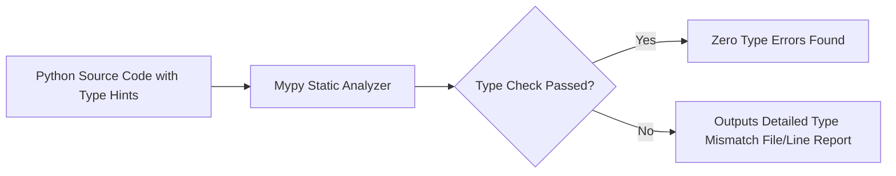

```yaml
schema_version: "2.0"
metadata:
  lesson_id: "PY-MOD05-LES01"
  course_slug: "course-02-python"
  course_title: "Course 2: Python 3.12+ Modern Programming"
  module_slug: "mod-05-modern-python-concurrency"
  module_title: "Module 5 - Async Concurrency & Type Hinting"
  lesson_slug: "static-type-hinting-and-mypy-validation"
  lesson_title: "Lesson 5.1 Static Type Hinting & Mypy Validation"
  sort_order: 501

pedagogy:
  difficulty: "intermediate"
  estimated_time:
    reading_minutes: 15
    practice_minutes: 20
    quiz_minutes: 10
    total_minutes: 45
  bloom_taxonomy_level: "Apply"
  xp_reward: 50

prerequisites:
  required_lesson_ids:
    - "PY-MOD01-LES02"
  required_skills:
    - "Python Functions & Primitive Data Types"

skills_acquired:
  - "Type Annotations Syntax (Variables, Functions, Return Values)"
  - "Modern Union Operator (`int | str`)"
  - "Generic Collections Annotations (`list[str]`, `dict[str, int]`)"
  - "Callable & Optional Type Declarations"
  - "Static Analysis using `mypy`"

dependencies:
  software:
    - "VS Code"
    - "Python 3.10+ with `mypy`"
  hardware: []

seo_and_social:
  meta_title: "Python Static Type Hinting: Annotations, Union | and Mypy Analysis"
  meta_description: "Master modern Python type hinting: function annotations, generic collections list[str], Union operator int | str, Callable, and static checking with Mypy."
  keywords: ["Python Type Hinting", "Mypy", "Type Annotations", "Python Union Operator", "Generic Types", "Static Analysis"]

assessment_config:
  has_quiz: true
  has_lab: true
  has_flashcards: true
  pass_score_percentage: 80
```

# Lesson 5.1 Static Type Hinting & Mypy Validation

## 1. Overview & Learning Objectives [id: overview]

- **Estimated Time**: 45 Minutes (15m Reading | 20m Practice | 10m Quiz)
- **Difficulty Level**: ⭐⭐ Intermediate
- **Prerequisites**: Python Functions & Types
- **XP Reward**: +50 XP

### Learning Objectives
By the end of this lesson, you will be able to:
1. Annotate Python functions, parameters, and variable assignments with static type hints.
2. Use modern Python 3.10+ union syntax (`int | float | None`).
3. Annotate collections using built-in generics (`list[str]`, `dict[str, int]`).
4. Perform static analysis on code repositories using `mypy`.

---

## 2. Environment & Prerequisites [id: prerequisites]

Install Mypy for static analysis:
- Run `pip install mypy`.

---

## 3. Theoretical Foundations [id: theory]

### 3.1 Gradual Typing in Python
Python remains a dynamically typed runtime language. Type hints do **NOT** enforce type constraints at runtime; instead, they provide static documentation and allow static type checkers (`mypy`, `pyright`) to catch bugs before execution:

```python
# Modern PEP 604 Union Syntax (int | float instead of Union[int, float])
def calculate_tax(price: float, rate: float = 0.05) -> float:
    return price * (1 + rate)

# Generic Collection Typing
def process_users(users: list[dict[str, str | int]]) -> int:
    return len(users)
```

---

## 4. Architecture & Diagram Visualizations [id: diagram]



---

## 5. Code & Hardware Implementation [id: syntax]

```python
from typing import Callable

# Function Type Annotation
def format_number(val: int | float) -> str:
    return f"{val:,.2f}"

# Higher-Order Function Type Annotation
def apply_transform(data: list[float], transform_fn: Callable[[float], float]) -> list[float]:
    return [transform_fn(x) for x in data]

# Test Execution
numbers = [10.5, 20.0, 30.25]
doubled = apply_transform(numbers, lambda x: x * 2)
print("Transformed:", doubled)
```

---

## 6. Enterprise Real-World Applications [id: examples]

- **Enterprise CI/CD Pipelines**: Production Python repositories run `mypy src/` as a mandatory pull-request gate to block type mismatch bugs from entering production codebases.

---

## 7. Guided Step-by-Step Hands-On Exercise [id: exercises]

1. Save code as `type_demo.py`.
2. Run static analysis: `mypy type_demo.py` $\to$ Inspect clean Mypy status report!

---

## 8. Common Pitfalls & Troubleshooting [id: common_mistakes]

| Bug / Error | Root Cause | Engineering Solution |
| :--- | :--- | :--- |
| **`Incompatible types in assignment`** | Assigning a string value to a variable annotated as `int`. | Ensure variable assignments match specified type annotations or use `Union` (`int | str`). |

---

## 9. Best Practices & Optimization [id: best_practices]

- **Use Built-in Generics**: Use `list[str]` and `dict[str, int]` instead of importing `from typing import List, Dict`.

---

## 10. Industry Interview Q&A [id: interview_qa]

### Q1: Do Python type hints affect runtime execution speed?
**Answer**: No. Type hints are completely ignored by the CPython interpreter during execution and add zero runtime overhead. Their purpose is static analysis, IDE autocompletion, and build verification.

---

## 11. Self-Assessment Quiz [id: quiz]

```json
{
  "quiz_title": "Lesson 5.1 Type Hinting Assessment",
  "questions": [
    {
      "question_id": "Q1",
      "type": "multiple_choice",
      "question_text": "What is the modern Python 3.10+ syntax for expressing a type that can be either an int or None?",
      "options": ["Optional[int]", "int | None", "Union[int, None]", "int or None"],
      "correct_answer_index": 1,
      "explanation": "int | None uses modern PEP 604 Union syntax."
    }
  ]
}
```

---

## 12. Portfolio Assignment & Challenge [id: lab]

Annotate a 200-line legacy Python module and clear all Mypy static analysis warnings.

---

## 13. Spaced Repetition Flashcards [id: flashcards]

**Front**: What tool performs static type checking on Python code?
**Back**: `mypy` (or `pyright`).
<!-- flashcard:end -->

---

## 14. Summary & Cheat Sheet [id: summary]

```bash
mypy src/
```


---

## Existing Jupyter Notebooks

> **Note**: Comprehensive Jupyter notebooks exist for this topic in the Python study folder.
> Reference the notebooks when authoring full lesson content.
> Notebooks follow the pattern: `_NN_00_topic.ipynb` (notes), `_NN_01_topic_Questions.ipynb`, `_NN_02_topic_Answers.ipynb`
