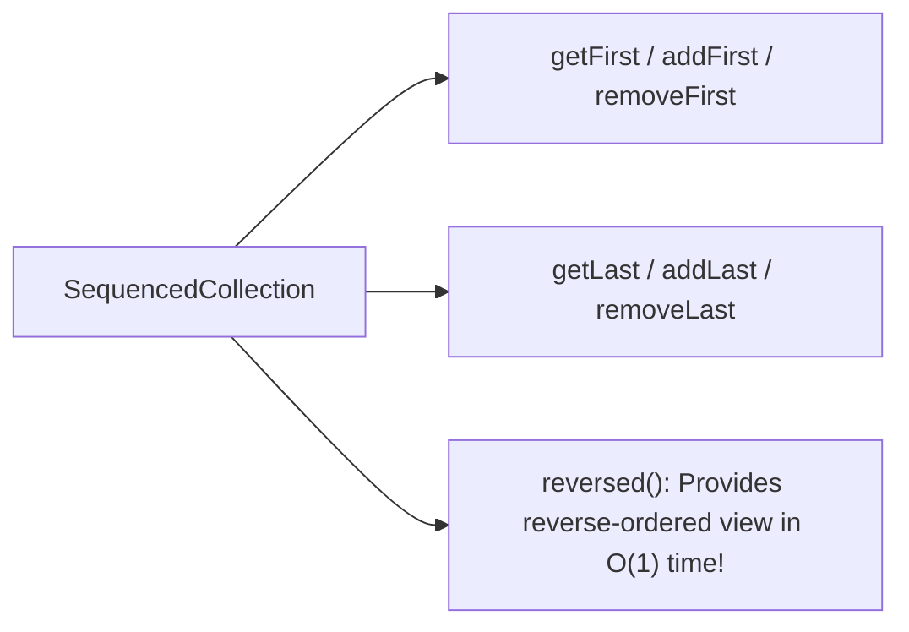

```yaml
schema_version: "2.0"
metadata:
  lesson_id: "JAVA-MOD03-LES02"
  course_slug: "course-03-java"
  course_title: "Course 3: Java 21 LTS Enterprise Development"
  module_slug: "mod-03-collections-stream-api"
  module_title: "Module 3 - Collections & Stream API"
  lesson_slug: "java21-sequenced-collections"
  lesson_title: "Lesson 3.2 Java 21 Sequenced Collections"
  sort_order: 302

pedagogy:
  difficulty: "intermediate"
  estimated_time:
    reading_minutes: 15
    practice_minutes: 20
    quiz_minutes: 10
    total_minutes: 45
  bloom_taxonomy_level: "Apply"
  xp_reward: 50

prerequisites:
  required_lesson_ids:
    - "JAVA-MOD02-LES04"
  required_skills:
    - "Java Collections Framework Basics"

skills_acquired:
  - "SequencedCollection Interface Hierarchy"
  - "First and Last Element Access (`getFirst()`, `getLast()`)"
  - "First and Last Insertion & Removal (`addFirst()`, `removeLast()`)"
  - "Reversed View Iteration (`reversed()`)"

dependencies:
  software:
    - "VS Code / IntelliJ IDEA"
    - "JDK 21 LTS"
  hardware: []

seo_and_social:
  meta_title: "Java 21 Sequenced Collections: SequencedCollection, SequencedSet & SequencedMap"
  meta_description: "Master Java 21 LTS Sequenced Collections: uniform first/last element access (getFirst, getLast, addFirst, removeLast), and reversed views."
  keywords: ["Java 21 Sequenced Collections", "SequencedCollection", "SequencedSet", "SequencedMap", "getFirst getLast", "Java Collections"]

assessment_config:
  has_quiz: true
  has_lab: true
  has_flashcards: true
  pass_score_percentage: 80
```

# Lesson 3.2 Java 21 Sequenced Collections

## 1. Overview & Learning Objectives [id: overview]

- **Estimated Time**: 45 Minutes (15m Reading | 20m Practice | 10m Quiz)
- **Difficulty Level**: ⭐⭐ Intermediate
- **Prerequisites**: Java Collections Framework
- **XP Reward**: +50 XP

### Learning Objectives
By the end of this lesson, you will be able to:
1. Understand the Java 21 **Sequenced Collection Hierarchy** (`SequencedCollection`, `SequencedSet`, `SequencedMap`).
2. Uniformly access first and last elements using `getFirst()` and `getLast()`.
3. Perform first and last element insertions and removals (`addFirst()`, `removeLast()`).
4. Generate reverse-ordered collection views using `reversed()`.

---

## 2. Environment & Prerequisites [id: prerequisites]

Ensure JDK 21 LTS is active.

---

## 3. Theoretical Foundations [id: theory]

### 3.1 The Missing Abstraction in Legacy Java Collections
Before Java 21, accessing the first or last element of a collection depended on the specific underlying class (e.g. `list.get(0)` vs `deque.getFirst()` vs `sortedSet.first()`).

**Java 21 Sequenced Collections** introduces a unified interface hierarchy for any collection with a defined encounter order:

```
                  Collection
                      │
              SequencedCollection
            ╱          │          ╲
        List        Deque      SequencedSet
                                    │
                                LinkedHashSet / SortedSet
```

```java
// Standardized Uniform Methods across ALL Sequenced Collections
void addFirst(E e);
void addLast(E e);
E getFirst();
E getLast();
E removeFirst();
E removeLast();
SequencedCollection<E> reversed();
```

---

## 4. Architecture & Diagram Visualizations [id: diagram]



---

## 5. Code & Hardware Implementation [id: syntax]

```java
import java.util.ArrayList;
import java.util.LinkedHashSet;

class SequencedDemo {
    public static void main(String[] args) {
        // 1. Sequenced List
        var list = new ArrayList<String>();
        list.add("Middle");
        list.addFirst("First");
        list.addLast("Last");

        System.out.println("First Element: " + list.getFirst()); // "First"
        System.out.println("Last Element: " + list.getLast());   // "Last"

        // 2. Reversed View (Zero-copy O(1) reversed iteration!)
        System.out.println("Reversed List: " + list.reversed());

        // 3. Sequenced Set (LinkedHashSet implements SequencedSet!)
        var set = new LinkedHashSet<Integer>();
        set.add(10);
        set.add(20);
        set.add(30);

        System.out.println("Set First: " + set.getFirst()); // 10
        System.out.println("Set Last: " + set.getLast());   // 30
    }
}
```

---

## 6. Enterprise Real-World Applications [id: examples]

- **LRU Cache Implementation**: Web application session management and cache eviction algorithms use `SequencedMap` / `LinkedHashMap` to access first/last accessed items with uniform API calls.

---

## 7. Guided Step-by-Step Hands-On Exercise [id: exercises]

1. Save code as `SequencedDemo.java`.
2. Compile and run: `javac SequencedDemo.java` $\to$ `java SequencedDemo`.

---

## 8. Common Pitfalls & Troubleshooting [id: common_mistakes]

| Bug / Error | Root Cause | Engineering Solution |
| :--- | :--- | :--- |
| **`NoSuchElementException`** | Calling `getFirst()` or `getLast()` on an empty collection. | Check `isEmpty()` before accessing head or tail elements. |

---

## 9. Best Practices & Optimization [id: best_practices]

- **Use `reversed()`**: Provides an $O(1)$ zero-copy reversed view without duplicating collection memory.

---

## 10. Industry Interview Q&A [id: interview_qa]

### Q1: What problem do Sequenced Collections solve in Java 21?
**Answer**: Prior to Java 21, Java lacked a unified interface for collections with a defined encounter order. Accessing or manipulating the first/last elements required different methods depending on whether you had a `List`, `Deque`, or `SortedSet`. Sequenced Collections unifies these under standard methods (`getFirst()`, `getLast()`, `addFirst()`, `removeLast()`, `reversed()`).

---

## 11. Self-Assessment Quiz [id: quiz]

```json
{
  "quiz_title": "Lesson 3.2 Sequenced Collections Assessment",
  "questions": [
    {
      "question_id": "Q1",
      "type": "multiple_choice",
      "question_text": "Which Java 21 method returns a reverse-ordered view of a SequencedCollection?",
      "options": ["reverse()", "reversed()", "toReverse()", "flip()"],
      "correct_answer_index": 1,
      "explanation": "reversed() returns a reverse-ordered view of the collection."
    }
  ]
}
```

---

## 12. Portfolio Assignment & Challenge [id: lab]

Refactor a legacy collection processing utility to use Java 21 Sequenced Collections.

---

## 13. Spaced Repetition Flashcards [id: flashcards]

**Front**: Does `reversed()` create a copy of the collection?
**Back**: No. `reversed()` returns a zero-copy $O(1)$ reversed view.
<!-- flashcard:end -->

---

## 14. Summary & Cheat Sheet [id: summary]

```java
var first = list.getFirst();
var last = list.getLast();
```
