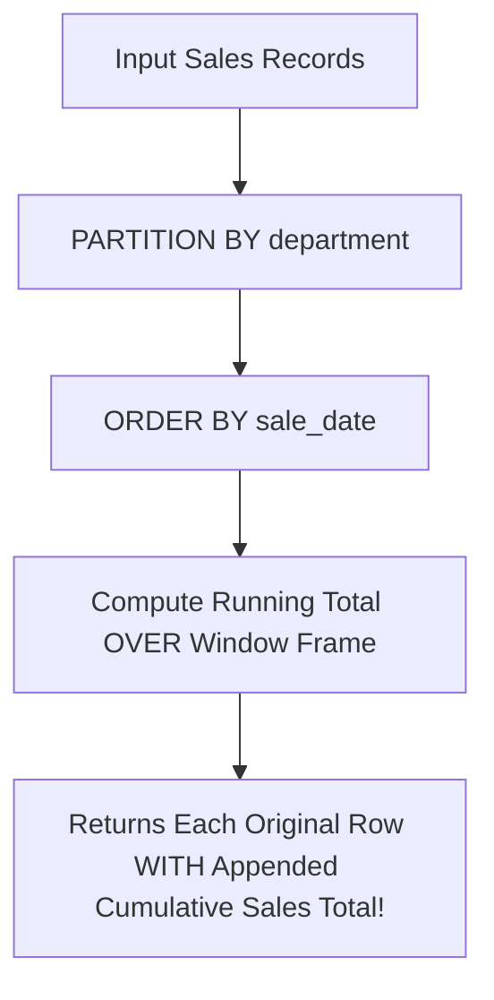

# Lesson 3.1 MySQL 8.4 Analytical Window Functions

> **Course**: MySQL | **Module**: Module 1 | **Difficulty**: beginner

---

- **Estimated Time**: 55 Minutes (20m Reading | 25m Practice | 10m Quiz)
- **Difficulty Level**: ⭐⭐ Intermediate
- **Prerequisites**: SQL `GROUP BY` Aggregations
- **XP Reward**: +60 XP

### Learning Objectives
By the end of this lesson, you will be able to:
1. Understand how **Window Functions** compute aggregate values across subset partitions without collapsing individual table rows.
2. Execute Ranking Functions (`ROW_NUMBER()`, `RANK()`, `DENSE_RANK()`).
3. Access adjacent row values using `LAG()` and `LEAD()`.
4. Calculate Cumulative Running Totals and Moving Averages using window frame specifications (`ROWS BETWEEN`).

---

---

Ensure MySQL Server 8.0+ is running.

---

---

### 3.1 `GROUP BY` vs Window Functions (`OVER`)
Traditional `GROUP BY` queries collapse multiple rows into a single summary row. **Window Functions** perform calculations across a partition of rows while retaining individual row identities in the result set:

$$\text{FUNCTION}() \overbrace{\text{OVER}}^{\text{Window Definition}} \left( \text{PARTITION BY } \text{dept} \text{ ORDER BY } \text{salary DESC} \right)$$

```
┌─────────────────────────────────────────────────────────────────────────────┐
│                       RANKING FUNCTIONS COMPARISON MATRIX                   │
├─────────────────┬───────────────────────────────────────────────────────────┤
│ Function        │ Behavior on Tied Values                                   │
├─────────────────┼───────────────────────────────────────────────────────────┤
│ `ROW_NUMBER()`  │ Always sequential unique integers (1, 2, 3, 4)           │
│ `RANK()`        │ Tied values get same rank; SKIPS subsequent ranks (1, 2, 2, 4)│
│ `DENSE_RANK()`  │ Tied values get same rank; NO gaps in sequence (1, 2, 2, 3)  │
└─────────────────┴───────────────────────────────────────────────────────────┘
```

---

---



---

---

```sql
-- MySQL 8.4 Analytical Window Functions Queries

-- 1. Top 2 Highest Paid Employees Per Department (DENSE_RANK)
WITH RankedEmployees AS (
    SELECT 
        emp_id,
        name,
        department_id,
        salary,
        DENSE_RANK() OVER(
            PARTITION BY department_id 
            ORDER BY salary DESC
        ) AS salary_rank
    FROM employees
)
SELECT * FROM RankedEmployees WHERE salary_rank <= 2;

-- 2. Sales Growth Comparison vs Previous Month (LAG)
SELECT 
    sale_month,
    revenue,
    LAG(revenue, 1, 0.0) OVER(ORDER BY sale_month) AS prev_month_revenue,
    revenue - LAG(revenue, 1, 0.0) OVER(ORDER BY sale_month) AS month_over_month_diff
FROM monthly_sales;

-- 3. Cumulative Running Total
SELECT 
    transaction_date,
    amount,
    SUM(amount) OVER(
        ORDER BY transaction_date 
        ROWS BETWEEN UNBOUNDED PRECEDING AND CURRENT ROW
    ) AS running_balance
FROM bank_transactions;
```

---

---

- **Financial Ledger Balance Analytics**: Calculating real-time running customer balances and Month-over-Month (MoM) revenue growth metrics in enterprise data warehouses.

---

---

1. Connect to MySQL Workbench or MySQL CLI.
2. Execute the `DENSE_RANK()` and `LAG()` queries $\to$ Observe row-level analytical metrics!

---

---

| Bug / Error | Root Cause | Engineering Solution |
| :--- | :--- | :--- |
| **`ERROR 1064 (42000): You have an error in your SQL syntax`** | Running window functions on legacy MySQL 5.7. | Upgrade server to MySQL 8.0 or 8.4 LTS. |

---

---

- **Use CTEs with Window Functions**: Wrap window function queries inside a Common Table Expression to filter results with `WHERE` clauses.

---

---

### Q1: What is the difference between `RANK()` and `DENSE_RANK()` in SQL?
**Answer**: When tied values occur, both functions assign the same rank number to tied rows. However, `RANK()` skips subsequent rank numbers (e.g. 1, 2, 2, 4), whereas `DENSE_RANK()` does not skip numbers (e.g. 1, 2, 2, 3).

---

---

```json
{
  "quiz_title": "Lesson 3.1 Window Functions Assessment",
  "questions": [
    {
      "question_id": "Q1",
      "type": "multiple_choice",
      "question_text": "Which window function accesses data from a previous row in the result set?",
      "options": ["LEAD()", "LAG()", "FIRST_VALUE()", "DENSE_RANK()"],
      "correct_answer_index": 1,
      "explanation": "LAG() accesses previous row values."
    }
  ]
}
```

---

---

Build a 3-month moving average sales reporting query using `ROWS BETWEEN 2 PRECEDING AND CURRENT ROW`.

---

---

**Front**: What clause divides a window function dataset into subset groups?
**Back**: `PARTITION BY`
<!-- flashcard:end -->

---

---

```sql
SELECT val, LAG(val) OVER(ORDER BY date) FROM t;
```


---

---

> **Note**: SQL Server reference scripts exist in the archive. Review and adapt for MySQL syntax.
> Location: `docs/old and reference and future studies/_02_python_full_stack/_02_sqlserver/`
>
  - `00_Setup_Database.sql`
  - `01_Basics_DDL_DML.sql`
  - `02_Retrieval_Filtering.sql`
  - `03_Functions_Aggregation.sql`
  - `04_Joins_Set_Operations.sql`
  - `05_Subqueries_CTEs.sql`
  - `06_Window_Functions.sql`
  - `07_Advanced_DB_Objects.sql`
  - `08_Transactions_Performance.sql`
  - `09_Temp_Tables_And_Table_Vars.sql`
  - `10_Error_Handling_Dynamic_SQL.sql`
  - `11_Pivot_Unpivot_Merge.sql`
  - `12_JSON_XML_Support.sql`
  - `13_Security_Administration.sql`

---
