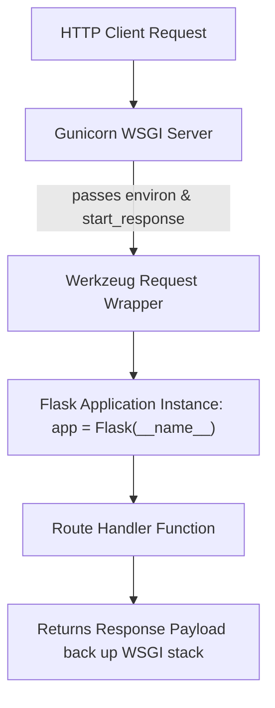

```yaml
schema_version: "2.0"
metadata:
  lesson_id: "FLK-MOD01-LES01"
  course_slug: "course-04-flask"
  course_title: "Course 4: Flask Backend & Microservices"
  module_slug: "mod-01-wsgi-flask-core"
  module_title: "Module 1 - WSGI Architecture & Flask Core Basics"
  lesson_slug: "wsgi-architecture-and-flask-basics"
  lesson_title: "Lesson 1.1 Web Server Gateway Interface (WSGI) Architecture"
  sort_order: 101

pedagogy:
  difficulty: "beginner"
  estimated_time:
    reading_minutes: 15
    practice_minutes: 20
    quiz_minutes: 10
    total_minutes: 45
  bloom_taxonomy_level: "Apply"
  xp_reward: 50

prerequisites:
  required_lesson_ids:
    - "JS-MOD12-LES11"
  required_skills:
    - "Python 3.12+ Fundamentals & HTTP Protocol Mechanics"

skills_acquired:
  - "WSGI Specification (PEP 3333) Architecture"
  - "Werkzeug WSGI Toolkit & Jinja2 Engine Integration"
  - "Flask Application Instance Construction (`Flask(__name__)`)"
  - "Running Flask Development Server (`flask run`)"

dependencies:
  software:
    - "VS Code"
    - "Python 3.12+"
    - "uv or pip"
  hardware: []

seo_and_social:
  meta_title: "Flask Architecture: PEP 3333 WSGI, Werkzeug Toolkit & Flask(__name__)"
  meta_description: "Master Flask Backend Architecture: PEP 3333 WSGI specification, Werkzeug toolkit integration, Jinja2 engine, and Flask(__name__) application instantiation."
  keywords: ["Flask WSGI", "PEP 3333", "Werkzeug", "Jinja2", "Flask(__name__)", "Python Backend", "Microframework"]

assessment_config:
  has_quiz: true
  has_lab: true
  has_flashcards: true
  pass_score_percentage: 80
```

# Lesson 1.1 Web Server Gateway Interface (WSGI) Architecture

## 1. Overview & Learning Objectives [id: overview]

- **Estimated Time**: 45 Minutes (15m Reading | 20m Practice | 10m Quiz)
- **Difficulty Level**: ⭐ Beginner
- **Prerequisites**: [JavaScript Capstone](file:///d:/My%20Drive/all%20files/PROJECT%20FILES/notes/docs/curriculum/_03_javascript/_03_52_capstone_realtime_iot_dashboard.md)
- **XP Reward**: +50 XP

### Learning Objectives
By the end of this lesson, you will be able to:
1. Explain the **WSGI Specification (PEP 3333)** connecting web servers to Python frameworks.
2. Understand Flask's underlying core dependencies: **Werkzeug** (WSGI toolkit) and **Jinja2** (templating engine).
3. Instantiate a minimal Flask application using `Flask(__name__)`.
4. Run the development server with hot-reloading (`flask run --debug`).

---

## 2. Environment & Prerequisites [id: prerequisites]

Create a virtual environment and install Flask:

```bash
# Create virtual environment using uv or venv
python -m venv .venv
source .venv/bin/activate  # Linux/macOS
# .venv\Scripts\activate   # Windows

pip install flask
```

---

## 3. Theoretical Foundations [id: theory]

### 3.1 What is WSGI (PEP 3333)?
The **Web Server Gateway Interface (WSGI)** is a standard specification (PEP 3333) defining a universal interface between HTTP web servers (Nginx, Apache, Gunicorn) and Python web applications (Flask, Django).

A raw WSGI application is simply a Python callable that takes two arguments:
1. **`environ`**: A dictionary containing HTTP headers, request paths, and environment variables.
2. **`start_response`**: A callback function to send HTTP status codes and headers.

```
┌─────────────────────────────────────────────────────────────────────────────┐
│                          WSGI REQUEST-RESPONSE FLOW                         │
├─────────────────────────────────────────────────────────────────────────────┤
│ Web Server (Nginx / Gunicorn) ──► WSGI Interface (environ, start_response)  │
│                                           │                                 │
│                                           ▼                                 │
│ Flask App (`Flask(__name__)`) ◄── Werkzeug Request / Response Packaging     │
└─────────────────────────────────────────────────────────────────────────────┘
```

---

## 4. Architecture & Diagram Visualizations [id: diagram]



---

## 5. Code & Hardware Implementation [id: syntax]

```python
# Minimal Flask WSGI Application (app.py)
from flask import Flask

# 1. Instantiate Flask Application
# __name__ tells Flask where to locate static files and templates relative to this module
app = Flask(__name__)

# 2. Define Route Handler via Decorator
@app.route("/")
def index():
    return {
        "status": "ONLINE",
        "service": "IoT Telemetry Gateway",
        "version": "1.0.0"
    }

# 3. Development Execution Entrypoint
if __name__ == "__main__":
    # debug=True enables hot-reloading & interactive browser debugger!
    app.run(host="127.0.0.1", port=5000, debug=True)
```

---

## 6. Enterprise Real-World Applications [id: examples]

- **Microservice Backend Telemetry Gateways**: Lightweight Flask WSGI applications run inside containerized Gunicorn workers to process incoming REST payloads from thousands of edge sensors.

---

## 7. Guided Step-by-Step Hands-On Exercise [id: exercises]

1. Save code as `app.py`.
2. Execute `python app.py` in terminal $\to$ Open `http://127.0.0.1:5000/` in browser to inspect JSON response!

---

## 8. Common Pitfalls & Troubleshooting [id: common_mistakes]

| Bug / Error | Root Cause | Engineering Solution |
| :--- | :--- | :--- |
| **`Address already in use` (Port 5000)** | Another background process or AirPlay server is occupying port 5000. | Change port in `app.run(port=5001)` or terminate the blocking process. |

---

## 9. Best Practices & Optimization [id: best_practices]

- **Never Use `debug=True` in Production**: The interactive debug console allows arbitrary Python code execution! Use Gunicorn or Uwsgi in production environments.

---

## 10. Industry Interview Q&A [id: interview_qa]

### Q1: What is WSGI in Python web development and why is `Flask(__name__)` required?
**Answer**: WSGI (PEP 3333) is the standard protocol interface connecting web servers to Python frameworks. Passing `__name__` to `Flask()` lets the framework know the import name of the root module so it can correctly calculate file paths for templates, static assets, and blueprints.

---

## 11. Self-Assessment Quiz [id: quiz]

```json
{
  "quiz_title": "Lesson 1.1 Flask WSGI Assessment",
  "questions": [
    {
      "question_id": "Q1",
      "type": "multiple_choice",
      "question_text": "Which Python PEP specification defines the WSGI standard for web servers?",
      "options": ["PEP 8", "PEP 3333", "PEP 484", "PEP 518"],
      "correct_answer_index": 1,
      "explanation": "PEP 3333 defines the WSGI standard specification."
    }
  ]
}
```

---

## 12. Portfolio Assignment & Challenge [id: lab]

Build a minimal Flask WSGI app returning JSON status checks for 3 mock IoT devices.

---

## 13. Spaced Repetition Flashcards [id: flashcards]

**Front**: What underlying WSGI library provides Flask's HTTP request/response routing foundation?
**Back**: Werkzeug.
<!-- flashcard:end -->

---

## 14. Summary & Cheat Sheet [id: summary]

```python
from flask import Flask
app = Flask(__name__)
@app.route("/")
def home(): return "Hello Flask"
```
