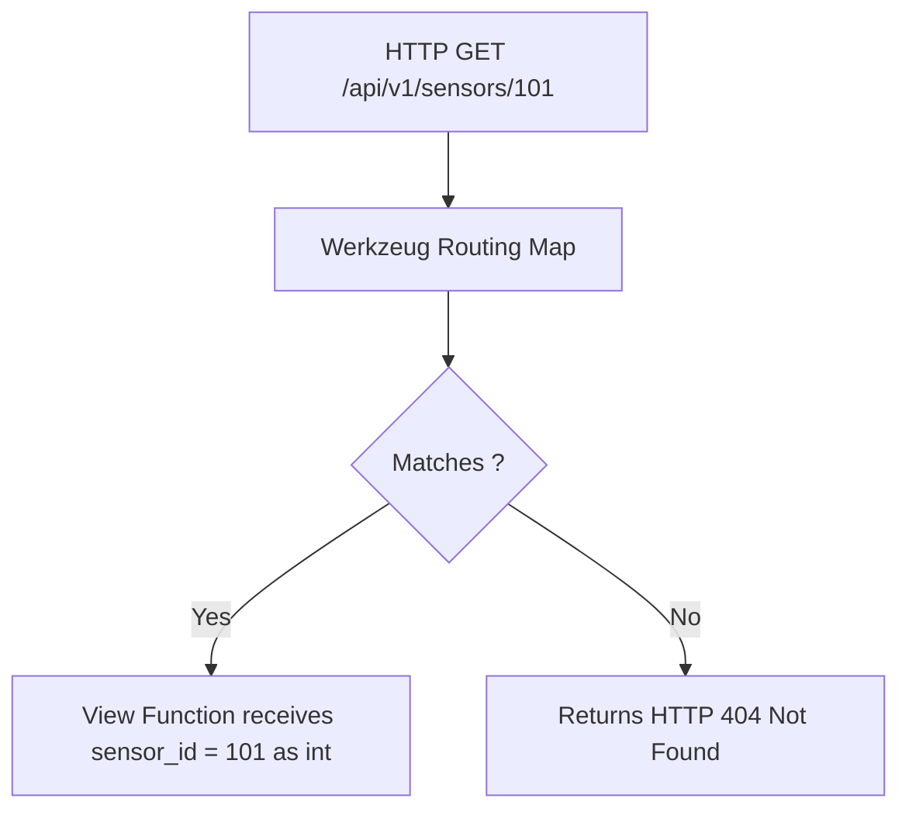

```yaml
schema_version: "2.0"
metadata:
  lesson_id: "FLK-MOD02-LES01"
  course_slug: "course-04-flask"
  course_title: "Course 4: Flask Backend & Microservices"
  module_slug: "mod-02-routing-request-response"
  module_title: "Module 2 - Routing, Request Handling, & Responses"
  lesson_slug: "flask-routing-and-url-converters"
  lesson_title: "Lesson 2.1 Routing System, Dynamic URL Parameters, & Converter Types"
  sort_order: 201

pedagogy:
  difficulty: "beginner"
  estimated_time:
    reading_minutes: 15
    practice_minutes: 20
    quiz_minutes: 10
    total_minutes: 45
  bloom_taxonomy_level: "Apply"
  xp_reward: 50

prerequisites:
  required_lesson_ids:
    - "FLK-MOD01-LES02"
  required_skills:
    - "Flask Application Factory & Basic App Instantiation"

skills_acquired:
  - "Route Decorator Syntax (`@app.route('/path')`)"
  - "Dynamic Path Parameters (`<variable_name>`)"
  - "Built-in URL Converters (`int`, `float`, `path`, `uuid`)"
  - "Reverse URL Generation via `url_for()`"
  - "Custom URL Converter Class Construction"

dependencies:
  software:
    - "VS Code"
    - "Python 3.12+"
  hardware: []

seo_and_social:
  meta_title: "Flask Routing: Dynamic URL Parameters, Built-in Converters & url_for()"
  meta_description: "Master Flask Routing: dynamic path parameters, URL converters (int, float, path, uuid), building custom converters, and reverse URL generation with url_for()."
  keywords: ["Flask Routing", "URL Converters", "url_for", "Dynamic Parameters", "Flask Path Variables", "Custom URL Converter"]

assessment_config:
  has_quiz: true
  has_lab: true
  has_flashcards: true
  pass_score_percentage: 80
```

# Lesson 2.1 Routing System, Dynamic URL Parameters, & Converter Types

## 1. Overview & Learning Objectives [id: overview]

- **Estimated Time**: 45 Minutes (15m Reading | 20m Practice | 10m Quiz)
- **Difficulty Level**: ⭐ Beginner
- **Prerequisites**: [Lesson 1.2 Application Factory](file:///d:/My%20Drive/all%20files/PROJECT%20FILES/notes/docs/curriculum/_04_flask/_04_02_flask_application_factory_pattern.md)
- **XP Reward**: +50 XP

### Learning Objectives
By the end of this lesson, you will be able to:
1. Define URL routes using `@app.route()` decorators.
2. Extract dynamic URL parameters using `<variable_name>` syntax.
3. Apply built-in URL converters (`int`, `float`, `path`, `uuid`).
4. Generate reverse URL paths using **`url_for()`**.

---

## 2. Environment & Prerequisites [id: prerequisites]

Open Python REPL or VS Code.

---

## 3. Theoretical Foundations [id: theory]

### 3.1 Built-in URL Converters
By default, dynamic URL variables `<param>` are treated as strings. Flask provides built-in URL converter types that automatically validate and convert path parameters into target Python data types before passing them to the view function:

```
┌─────────────────────────────────────────────────────────────────────────────┐
│                         FLASK BUILT-IN URL CONVERTERS                       │
├─────────────────┬───────────────────────────────────────────────────────────┤
│ Converter Type  │ Description & Python Type Conversion                      │
├─────────────────┼───────────────────────────────────────────────────────────┤
│ `string`        │ Default string (accepts any text without slashes)         │
│ `int`           │ Accepts positive integers (`int`)                         │
│ `float`         │ Accepts positive floating-point numbers (`float`)         │
│ `path`          │ Accepts string including forward slashes `/`              │
│ `uuid`          │ Accepts valid 36-character UUID strings (`uuid.UUID`)     │
└─────────────────┴───────────────────────────────────────────────────────────┘
```

---

## 4. Architecture & Diagram Visualizations [id: diagram]



---

## 5. Code & Hardware Implementation [id: syntax]

```python
# Flask Dynamic Routing & URL Converters (routing_demo.py)
import uuid
from flask import Flask, url_for

app = Flask(__name__)

# 1. String & Integer URL Converters
@app.route("/sensors/<string:category>/<int:sensor_id>")
def get_sensor_detail(category, sensor_id):
    # sensor_id is automatically cast to Python int!
    return {
        "category": category,
        "sensor_id": sensor_id,
        "type": str(type(sensor_id))
    }

# 2. UUID Converter
@app.route("/devices/<uuid:device_uuid>")
def get_device_by_uuid(device_uuid):
    # device_uuid is a Python uuid.UUID instance!
    return {"device_uuid": str(device_uuid), "valid": True}

# 3. Reverse URL Generation Test Route
@app.route("/test-urls")
def test_urls():
    # url_for() generates canonical URL paths dynamically!
    detail_url = url_for("get_sensor_detail", category="telemetry", sensor_id=42)
    return {"generated_url": detail_url}

if __name__ == "__main__":
    app.run(debug=True)
```

---

## 6. Enterprise Real-World Applications [id: examples]

- **RESTful Resource Endpoints**: Backend microservices define typed endpoints (`/api/v1/telemetry/<uuid:device_id>`) to ensure invalid non-UUID path parameters automatically return HTTP 404 without reaching business logic.

---

## 7. Guided Step-by-Step Hands-On Exercise [id: exercises]

1. Save code as `routing_demo.py`.
2. Run `python routing_demo.py` $\to$ Test `/sensors/temp/101` and `/test-urls` in browser!

---

## 8. Common Pitfalls & Troubleshooting [id: common_mistakes]

| Bug / Error | Root Cause | Engineering Solution |
| :--- | :--- | :--- |
| **HTTP 404 for Float Parameter** | Passing a negative float to `<float:val>` (Flask built-in converters only match positive numbers). | Write a custom Werkzeug URL converter for negative floats. |

---

## 9. Best Practices & Optimization [id: best_practices]

- **Always Use `url_for()`**: Never hardcode internal URLs in templates or Python view functions.

---

## 10. Industry Interview Q&A [id: interview_qa]

### Q1: Why should you use `url_for()` instead of hardcoding URL strings in Flask?
**Answer**: `url_for()` generates URLs dynamically based on view function names rather than fixed paths. If you refactor a route path from `/user/profile` to `/account/settings`, `url_for('user_profile')` automatically reflects the change across all templates without breaking links.

---

## 11. Self-Assessment Quiz [id: quiz]

```json
{
  "quiz_title": "Lesson 2.1 Routing Assessment",
  "questions": [
    {
      "question_id": "Q1",
      "type": "multiple_choice",
      "question_text": "Which URL converter type allows path parameters containing forward slashes `/`?",
      "options": ["string", "path", "text", "all"],
      "correct_answer_index": 1,
      "explanation": "The path converter accepts strings containing forward slashes."
    }
  ]
}
```

---

## 12. Portfolio Assignment & Challenge [id: lab]

Build a Flask app routing system with typed `int`, `uuid`, and `path` converters.

---

## 13. Spaced Repetition Flashcards [id: flashcards]

**Front**: What function generates reverse URL paths in Flask?
**Back**: `url_for('function_name', **kwargs)`.
<!-- flashcard:end -->

---

## 14. Summary & Cheat Sheet [id: summary]

```python
@app.route("/item/<int:id>")
def get_item(id): return f"Item {id}"
```
