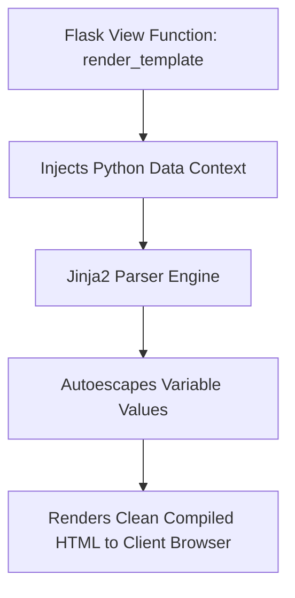

```yaml
schema_version: "2.0"
metadata:
  lesson_id: "FLK-MOD03-LES01"
  course_slug: "course-04-flask"
  course_title: "Course 4: Flask Backend & Microservices"
  module_slug: "mod-03-jinja2-templating"
  module_title: "Module 3 - Jinja2 Templating Engine"
  lesson_slug: "jinja2-syntax-control-flow-and-macros"
  lesson_title: "Lesson 3.1 Jinja2 Syntax, Variables, Control Flow, & Macros"
  sort_order: 301

pedagogy:
  difficulty: "beginner"
  estimated_time:
    reading_minutes: 15
    practice_minutes: 20
    quiz_minutes: 10
    total_minutes: 45
  bloom_taxonomy_level: "Apply"
  xp_reward: 50

prerequisites:
  required_lesson_ids:
    - "FLK-MOD02-LES02"
  required_skills:
    - "Flask Request & Response Objects & HTML Basics"

skills_acquired:
  - "Jinja2 Delimiter Syntax (`{{ }}`, ``, `{# #}`)"
  - "Rendering Templates via `render_template()`"
  - "Control Flow Iteration (``, ``)"
  - "Jinja2 Component Reusability via Reusable Macros (``)"

dependencies:
  software:
    - "VS Code"
    - "Python 3.12+"
  hardware: []

seo_and_social:
  meta_title: "Flask Jinja2 Templating: Variables, Control Flow & Reusable Macros"
  meta_description: "Master Jinja2 Templating in Flask: delimiters {{ }}, , render_template(), for loops, if conditionals, autoescaping security, and reusable macros."
  keywords: ["Jinja2 Templating", "Flask render_template", "Jinja2 Delimiters", "Jinja2 Macros", "Control Flow", "Autoescaping Security"]

assessment_config:
  has_quiz: true
  has_lab: true
  has_flashcards: true
  pass_score_percentage: 80
```

# Lesson 3.1 Jinja2 Syntax, Variables, Control Flow, & Macros

## 1. Overview & Learning Objectives [id: overview]

- **Estimated Time**: 45 Minutes (15m Reading | 20m Practice | 10m Quiz)
- **Difficulty Level**: ⭐ Beginner
- **Prerequisites**: [Lesson 2.2 Request/Response](file:///d:/My%20Drive/all%20files/PROJECT%20FILES/notes/docs/curriculum/_04_flask/_04_04_flask_request_response_objects.md)
- **XP Reward**: +50 XP

### Learning Objectives
By the end of this lesson, you will be able to:
1. Identify Jinja2 delimiter syntaxes (`{{ expression }}`, ``, `{# comment #}`).
2. Pass dynamic Python context data to HTML templates via `render_template()`.
3. Implement template logic using `` loops and `` conditionals.
4. Construct reusable UI component functions using Jinja2 **Macros (``)**.

---

## 2. Environment & Prerequisites [id: prerequisites]

Open Python REPL or VS Code.

---

## 3. Theoretical Foundations [id: theory]

### 3.1 Jinja2 Delimiter Syntax
Jinja2 is Flask's built-in Pythonic templating engine that compiles HTML templates into optimized Python bytecode:

```
┌─────────────────────────────────────────────────────────────────────────────┐
│                          JINJA2 DELIMITER SYNTAX MATRIX                     │
├─────────────────┬──────────────────────────────────┬────────────────────────┤
│ Delimiter       │ Purpose                          │ Example                │
├─────────────────┼──────────────────────────────────┼────────────────────────┤
│ `{{ ... }}`     │ Variable expression output       │ `{{ user.name }}`      │
│ ``     │ Logic control flow & statements  │ ``   │
│ `{# ... #}`     │ Server-side comments (not in HTML)│ `{# Internal note #}`  │
└─────────────────┴──────────────────────────────────┴────────────────────────┘
```

> [!NOTE]
> **Automatic XSS Protection**: Jinja2 automatically HTML-escapes all variable values passed inside `{{ ... }}` expressions, preventing XSS injection attacks.

---

## 4. Architecture & Diagram Visualizations [id: diagram]



---

## 5. Code & Hardware Implementation [id: syntax]

### File 1: `templates/macros/card.html` (Jinja2 Reusable Macro)

```html

<div class="sensor-card">
  <h3>Node: {{ sensor.id }}</h3>
  <p>Location: {{ sensor.location }}</p>
  
    <span class="badge warning">HIGH TEMP: {{ sensor.temp }}°C</span>
  
    <span class="badge normal">Normal: {{ sensor.temp }}°C</span>
  
</div>

```

### File 2: `templates/dashboard.html` (Main Page)

```html

<!DOCTYPE html>
<html lang="en">
<head>
  <title>IoT Telemetry Monitor</title>
</head>
<body>
  <h1>Active Sensor Fleet</h1>
  <div class="card-grid">
    
      {{ render_sensor_card(sensor) }}
    
      <p>No active sensors detected.</p>
    
  </div>
</body>
</html>
```

### File 3: `app.py` (Python View Function)

```python
from flask import Flask, render_template

app = Flask(__name__)

@app.route("/dashboard")
def dashboard():
    mock_sensors = [
        {"id": "ESP32-A1", "location": "Lab 1", "temp": 24.2},
        {"id": "ESP32-B2", "location": "Server Room", "temp": 38.5},
        {"id": "ESP32-C3", "location": "Warehouse", "temp": 19.8}
    ]
    return render_template("dashboard.html", sensors=mock_sensors)
```

---

## 6. Enterprise Real-World Applications [id: examples]

- **Server-Side Rendered (SSR) Dashboards**: Administrative monitoring tools render real-time database state directly on the server, serving lightweight pre-compiled HTML to mobile browsers.

---

## 7. Guided Step-by-Step Hands-On Exercise [id: exercises]

1. Create `templates/` directory and save files.
2. Run `python app.py` $\to$ Navigate to `http://127.0.0.1:5000/dashboard` in browser!

---

## 8. Common Pitfalls & Troubleshooting [id: common_mistakes]

| Bug / Error | Root Cause | Engineering Solution |
| :--- | :--- | :--- |
| **`TemplateNotFound: dashboard.html`** | Saving HTML templates outside the `templates/` directory. | Flask expects template files inside a directory named `templates/` relative to the app module. |

---

## 9. Best Practices & Optimization [id: best_practices]

- **Use Jinja2 Macros for Repeated UI Elements**: Macros act like functions for HTML layout components.

---

## 10. Industry Interview Q&A [id: interview_qa]

### Q1: How does Jinja2 prevent Cross-Site Scripting (XSS) attacks when rendering dynamic variables?
**Answer**: Jinja2 automatically HTML-escapes all string variables rendered inside `{{ ... }}` delimiters, replacing characters like `<`, `>`, `&`, and `"` with safe HTML entity codes (`&lt;`, `&gt;`).

---

## 11. Self-Assessment Quiz [id: quiz]

```json
{
  "quiz_title": "Lesson 3.1 Jinja2 Syntax Assessment",
  "questions": [
    {
      "question_id": "Q1",
      "type": "multiple_choice",
      "question_text": "Which Jinja2 delimiter is used to execute control flow logic (if/for)?",
      "options": ["{{ ... }}", "", "{# ... #}", "<% ... %>"],
      "correct_answer_index": 1,
      "explanation": " executes control flow logic statements."
    }
  ]
}
```

---

## 12. Portfolio Assignment & Challenge [id: lab]

Build a Jinja2 template iterating over a list of 10 device status objects with conditional status badges.

---

## 13. Spaced Repetition Flashcards [id: flashcards]

**Front**: What is the purpose of `` inside a Jinja2 `` loop?
**Back**: It executes if the target iteration list is empty or `None`.
<!-- flashcard:end -->

---

## 14. Summary & Cheat Sheet [id: summary]

```html

  <p>{{ item.name }}</p>

```
