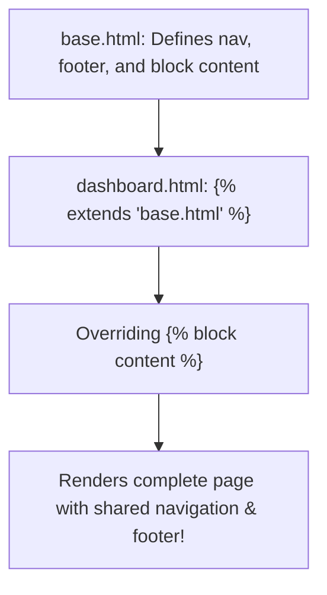

```yaml
schema_version: "2.0"
metadata:
  lesson_id: "FLK-MOD03-LES02"
  course_slug: "course-04-flask"
  course_title: "Course 4: Flask Backend & Microservices"
  module_slug: "mod-03-jinja2-templating"
  module_title: "Module 3 - Jinja2 Templating Engine"
  lesson_slug: "template-inheritance-and-custom-filters"
  lesson_title: "Lesson 3.2 Template Inheritance & Custom Template Filters"
  sort_order: 302

pedagogy:
  difficulty: "beginner"
  estimated_time:
    reading_minutes: 15
    practice_minutes: 20
    quiz_minutes: 10
    total_minutes: 45
  bloom_taxonomy_level: "Apply"
  xp_reward: 50

prerequisites:
  required_lesson_ids:
    - "FLK-MOD03-LES01"
  required_skills:
    - "Jinja2 Syntax, Control Flow, & Macros"

skills_acquired:
  - "Template Inheritance Architecture (``, ``)"
  - "Master Layout Template Design (`base.html`)"
  - "Built-in Jinja2 Filters (`| length`, `| default`, `| safe`)"
  - "Custom Template Filters Registration (`@template_filter()`)"

dependencies:
  software:
    - "VS Code"
    - "Python 3.12+"
  hardware: []

seo_and_social:
  meta_title: "Jinja2 Template Inheritance: , Blocks & Custom Filters"
  meta_description: "Master Jinja2 Template Inheritance in Flask: base.html layouts, , , built-in filters (safe, default), and custom @template_filter functions."
  keywords: ["Template Inheritance", "base.html", "extends block", "Jinja2 Filters", "Custom Template Filter", "DRY Layouts"]

assessment_config:
  has_quiz: true
  has_lab: true
  has_flashcards: true
  pass_score_percentage: 80
```

# Lesson 3.2 Template Inheritance & Custom Template Filters

## 1. Overview & Learning Objectives [id: overview]

- **Estimated Time**: 45 Minutes (15m Reading | 20m Practice | 10m Quiz)
- **Difficulty Level**: ⭐ Beginner
- **Prerequisites**: [Lesson 3.1 Jinja2 Syntax](file:///d:/My%20Drive/all%20files/PROJECT%20FILES/notes/docs/curriculum/_04_flask/_04_05_jinja2_syntax_control_flow_and_macros.md)
- **XP Reward**: +50 XP

### Learning Objectives
By the end of this lesson, you will be able to:
1. Build a master skeleton layout using **Template Inheritance (`base.html`)**.
2. Override content regions using `` and `` tags.
3. Transform output data using built-in Jinja2 filters (`| length`, `| default`, `| safe`).
4. Register custom Python filter functions using `@app.template_filter()`.

---

## 2. Environment & Prerequisites [id: prerequisites]

Open Python REPL or VS Code.

---

## 3. Theoretical Foundations [id: theory]

### 3.1 Template Inheritance Architecture
Template Inheritance follows the DRY (Don't Repeat Yourself) principle. Instead of duplicating header navigation, sidebar, and footer markup across 20 HTML files, you define a single **`base.html`** layout containing `` insertion points. Child templates inherit the master skeleton via `` and override only the specific content blocks they need.

```
┌─────────────────────────────────────────────────────────────────────────────┐
│                       TEMPLATE INHERITANCE HIERARCHY                        │
├─────────────────────────────────────────────────────────────────────────────┤
│ Master Base Layout (`base.html` - Nav, Header, Footer Skeleton)             │
│   ▲                                                                         │
│   ├── Child Page 1 (`index.html` - Overrides ``)          │
│   └── Child Page 2 (`dashboard.html` - Overrides ``)      │
└─────────────────────────────────────────────────────────────────────────────┘
```

---

## 4. Architecture & Diagram Visualizations [id: diagram]



---

## 5. Code & Hardware Implementation [id: syntax]

### File 1: `templates/base.html` (Master Base Template)

```html
<!DOCTYPE html>
<html lang="en">
<head>
  <meta charset="UTF-8">
  <title>IoT OS</title>
  <link rel="stylesheet" href="{{ url_for('static', filename='css/main.css') }}">
</head>
<body>
  <nav>
    <a href="{{ url_for('dashboard') }}">Dashboard</a>
    <a href="{{ url_for('settings') }}">Settings</a>
  </nav>

  <main class="container">
    
  </main>

  <footer>
    <p>&copy; 2026 Enterprise Learning OS. System Time: {{ now | datetimeformat }}</p>
  </footer>
</body>
</html>
```

### File 2: `app.py` (Custom Template Filter)

```python
from datetime import datetime
from flask import Flask, render_template

app = Flask(__name__)

# Register Custom Jinja2 Filter
@app.template_filter("datetimeformat")
def datetimeformat_filter(value, format_str="%B %d, %Y %H:%M"):
    if value is None:
        value = datetime.now()
    return value.strftime(format_str)

@app.route("/dashboard")
def dashboard():
    return render_template("dashboard.html", now=datetime.now())

if __name__ == "__main__":
    app.run(debug=True)
```

---

## 6. Enterprise Real-World Applications [id: examples]

- **Consistent Corporate Design Systems**: Multi-page web applications maintain uniform headers, footers, CSS links, and script tags across hundreds of subpages via a single `base.html` file.

---

## 7. Guided Step-by-Step Hands-On Exercise [id: exercises]

1. Save `base.html` and `app.py`.
2. Create `child.html` extending `base.html` $\to$ Render child route in browser to verify navigation and datetime filter output!

---

## 8. Common Pitfalls & Troubleshooting [id: common_mistakes]

| Bug / Error | Root Cause | Engineering Solution |
| :--- | :--- | :--- |
| **`` Not First Tag** | Placing HTML markup or whitespace before `` in a child template. | `` MUST be the absolute first line of a child template file. |

---

## 9. Best Practices & Optimization [id: best_practices]

- **Keep `base.html` Clean**: Place modular sidebar components into sub-templates and import them via ``.

---

## 10. Industry Interview Q&A [id: interview_qa]

### Q1: What is the difference between `` and `` in Jinja2?
**Answer**: `` is used for Template Inheritance: a child template extends a parent skeleton and fills in designated `` regions. `` inserts the exact raw HTML markup of a partial template (e.g. a navigation menu or footer) directly at that location.

---

## 11. Self-Assessment Quiz [id: quiz]

```json
{
  "quiz_title": "Lesson 3.2 Inheritance Assessment",
  "questions": [
    {
      "question_id": "Q1",
      "type": "multiple_choice",
      "question_text": "Which Jinja2 tag must be the absolute first line in a child template file inheriting from a base layout?",
      "options": ["", "", "", ""],
      "correct_answer_index": 1,
      "explanation": " must be the first line of an inheriting child template."
    }
  ]
}
```

---

## 12. Portfolio Assignment & Challenge [id: lab]

Build a 3-page web app with template inheritance and a custom `currency_format` filter.

---

## 13. Spaced Repetition Flashcards [id: flashcards]

**Front**: What Jinja2 filter renders unescaped raw HTML output (bypassing autoescaping)?
**Back**: `| safe` (e.g. `{{ raw_html | safe }}`).
<!-- flashcard:end -->

---

## 14. Summary & Cheat Sheet [id: summary]

```html

<h1>Child Content</h1>
```
