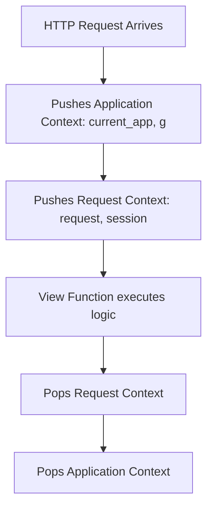

```yaml
schema_version: "2.0"
metadata:
  lesson_id: "FLK-MOD04-LES01"
  course_slug: "course-04-flask"
  course_title: "Course 4: Flask Backend & Microservices"
  module_slug: "mod-04-flask-contexts-globals"
  module_title: "Module 4 - Flask Application Contexts & Globals"
  lesson_slug: "flask-contexts-application-and-request"
  lesson_title: "Lesson 4.1 Application Context & Request Context Architecture"
  sort_order: 401

pedagogy:
  difficulty: "intermediate"
  estimated_time:
    reading_minutes: 20
    practice_minutes: 25
    quiz_minutes: 10
    total_minutes: 55
  bloom_taxonomy_level: "Analyze"
  xp_reward: 60

prerequisites:
  required_lesson_ids:
    - "FLK-MOD03-LES02"
  required_skills:
    - "Flask Application Factory & Request Handling"

skills_acquired:
  - "Understanding Flask Dual Context Architecture (Application vs Request Context)"
  - "Using `current_app` Proxy for Dynamic App Config Access"
  - "Pushing Contexts Manually via `app.app_context()` and `app.test_request_context()`"
  - "Resolving Working Outside of Application Context Errors"

dependencies:
  software:
    - "VS Code"
    - "Python 3.12+"
  hardware: []

seo_and_social:
  meta_title: "Flask Contexts: Application Context vs Request Context & current_app"
  meta_description: "Master Flask Dual Context Architecture: Application Context vs Request Context, current_app proxy, app.app_context(), and fixing Working Outside of Application Context errors."
  keywords: ["Flask Contexts", "Application Context", "Request Context", "current_app", "app.app_context()", "Working Outside of Application Context"]

assessment_config:
  has_quiz: true
  has_lab: true
  has_flashcards: true
  pass_score_percentage: 80
```

# Lesson 4.1 Application Context & Request Context Architecture

## 1. Overview & Learning Objectives [id: overview]

- **Estimated Time**: 55 Minutes (20m Reading | 25m Practice | 10m Quiz)
- **Difficulty Level**: ⭐⭐ Intermediate
- **Prerequisites**: [Lesson 3.2 Template Inheritance](file:///d:/My%20Drive/all%20files/PROJECT%20FILES/notes/docs/curriculum/_04_flask/_04_06_template_inheritance_and_custom_filters.md)
- **XP Reward**: +60 XP

### Learning Objectives
By the end of this lesson, you will be able to:
1. Explain Flask's **Dual Context Architecture**: **Application Context** vs **Request Context**.
2. Utilize the **`current_app`** proxy to access application configuration inside blueprint modules.
3. Manually push contexts during background tasks and unit testing using `app.app_context()`.
4. Identify and fix the common `RuntimeError: Working outside of application context`.

---

## 2. Environment & Prerequisites [id: prerequisites]

Open Python REPL or VS Code.

---

## 3. Theoretical Foundations [id: theory]

### 3.1 Application Context vs Request Context
To allow multiple Flask instances or multi-threaded worker handling without global state corruption, Flask uses two levels of context locals:

1. **Application Context (`app_ctx`)**: Binds application-level data (`current_app`, `g`). Pushed automatically when handling a request or manually via `with app.app_context():`.
2. **Request Context (`req_ctx`)**: Binds request-level HTTP data (`request`, `session`). Pushed when an HTTP request arrives and popped when the response finishes.

```
┌─────────────────────────────────────────────────────────────────────────────┐
│                          FLASK DUAL CONTEXT MATRIX                          │
├─────────────────┬───────────────────────────────┬───────────────────────────┤
│ Context Level   │ Proxy Objects                 │ Primary Use Case          │
├─────────────────┼───────────────────────────────┼───────────────────────────┤
│ Application     │ `current_app`, `g`            │ App config, DB pools,     │
│ Context         │                               │ extension state           │
├─────────────────┼───────────────────────────────┼───────────────────────────┤
│ Request         │ `request`, `session`          │ HTTP headers, query args, │
│ Context         │                               │ user session cookies      │
└─────────────────┴───────────────────────────────┴───────────────────────────┘
```

---

## 4. Architecture & Diagram Visualizations [id: diagram]



---

## 5. Code & Hardware Implementation [id: syntax]

```python
# Flask Dual Context & current_app Demonstration (context_demo.py)
from flask import Flask, current_app, g

def create_app():
    app = Flask(__name__)
    app.config["TELEMETRY_INTERVAL"] = 5  # Seconds

    @app.route("/config")
    def get_config():
        # current_app is a proxy pointing to the active Flask app instance!
        interval = current_app.config.get("TELEMETRY_INTERVAL")
        return {"telemetry_interval": interval}

    return app

# Testing / CLI Context Usage Demonstration
app = create_app()

# Attempting to access current_app OUTSIDE a context throws RuntimeError!
try:
    print(current_app.name)
except RuntimeError as err:
    print("[Error Caught]:", err)

# Manually Pushing Application Context for Scripts / CLI
with app.app_context():
    # Inside this block, current_app and g are active and bound!
    print("[Inside App Context]: Active App Name =", current_app.name)
    print("[Inside App Context]: Telemetry Interval =", current_app.config["TELEMETRY_INTERVAL"])
```

---

## 6. Enterprise Real-World Applications [id: examples]

- **Database Migration & CLI Commands**: Flask-Migrate and custom Click CLI scripts push an application context using `with app.app_context():` to inspect database URIs before running Alembic migrations outside of HTTP requests.

---

## 7. Guided Step-by-Step Hands-On Exercise [id: exercises]

1. Save code as `context_demo.py`.
2. Run `python context_demo.py` $\to$ Inspect error catch and manual context push logs!

---

## 8. Common Pitfalls & Troubleshooting [id: common_mistakes]

| Bug / Error | Root Cause | Engineering Solution |
| :--- | :--- | :--- |
| **`RuntimeError: Working outside of application context`** | Accessing `current_app` or database models in background threads or CLI scripts without an active app context. | Wrap external code in `with app.app_context():`. |

---

## 9. Best Practices & Optimization [id: best_practices]

- **Use `current_app` inside Blueprints**: Never import the hardcoded `app` instance inside blueprint files.

---

## 10. Industry Interview Q&A [id: interview_qa]

### Q1: What is the difference between the Application Context and Request Context in Flask?
**Answer**: The Application Context tracks application-level proxies (`current_app`, `g`) such as configuration settings and database connections. The Request Context tracks HTTP request-level proxies (`request`, `session`) like URL parameters and headers. The Application Context can exist without a request (e.g. during CLI scripts or background tasks), but a Request Context always automatically pushes an Application Context.

---

## 11. Self-Assessment Quiz [id: quiz]

```json
{
  "quiz_title": "Lesson 4.1 Context Architecture Assessment",
  "questions": [
    {
      "question_id": "Q1",
      "type": "multiple_choice",
      "question_text": "Which proxy object accesses active Flask configuration settings inside Blueprint modules?",
      "options": ["request", "session", "current_app", "g"],
      "correct_answer_index": 2,
      "explanation": "current_app proxy accesses application configuration."
    }
  ]
}
```

---

## 12. Portfolio Assignment & Challenge [id: lab]

Build a CLI script manually pushing `app.app_context()` to query database configuration.

---

## 13. Spaced Repetition Flashcards [id: flashcards]

**Front**: What context manager manually pushes an application context for testing or CLI scripts?
**Back**: `with app.app_context():`.
<!-- flashcard:end -->

---

## 14. Summary & Cheat Sheet [id: summary]

```python
with app.app_context():
    print(current_app.config["KEY"])
```
