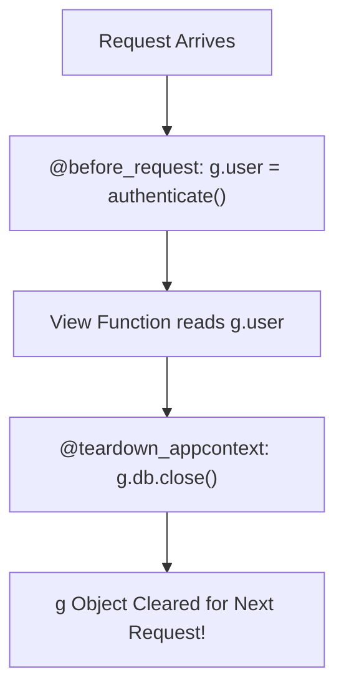

```yaml
schema_version: "2.0"
metadata:
  lesson_id: "FLK-MOD04-LES02"
  course_slug: "course-04-flask"
  course_title: "Course 4: Flask Backend & Microservices"
  module_slug: "mod-04-flask-contexts-globals"
  module_title: "Module 4 - Flask Application Contexts & Globals"
  lesson_slug: "flask-g-object-and-request-scoped-state"
  lesson_title: "Lesson 4.2 The g Global Object & Request-Scoped State"
  sort_order: 402

pedagogy:
  difficulty: "intermediate"
  estimated_time:
    reading_minutes: 15
    practice_minutes: 20
    quiz_minutes: 10
    total_minutes: 45
  bloom_taxonomy_level: "Apply"
  xp_reward: 50

prerequisites:
  required_lesson_ids:
    - "FLK-MOD04-LES01"
  required_skills:
    - "Flask Context Architecture & Lifecycle Hooks"

skills_acquired:
  - "Storing Request-Scoped State on the `g` Object"
  - "Differentiating `g` vs `session` vs `current_app`"
  - "Lazy Database Connection Pattern using `g`"
  - "Resource Cleanup with `@app.teardown_appcontext`"

dependencies:
  software:
    - "VS Code"
    - "Python 3.12+"
  hardware: []

seo_and_social:
  meta_title: "Flask g Object: Request-Scoped State, Database Connections & Teardown"
  meta_description: "Master Flask's g Object: request-scoped state storage, lazy database connections, differences between g, session, and current_app, and @teardown_appcontext cleanup."
  keywords: ["Flask g object", "request scoped state", "teardown_appcontext", "Flask lazy db", "session vs g", "Flask globals"]

assessment_config:
  has_quiz: true
  has_lab: true
  has_flashcards: true
  pass_score_percentage: 80
```

# Lesson 4.2 The `g` Global Object & Request-Scoped State

## 1. Overview & Learning Objectives [id: overview]

- **Estimated Time**: 45 Minutes (15m Reading | 20m Practice | 10m Quiz)
- **Difficulty Level**: ⭐⭐ Intermediate
- **Prerequisites**: [Lesson 4.1 Flask Contexts](file:///d:/My%20Drive/all%20files/PROJECT%20FILES/notes/docs/curriculum/_04_flask/_04_07_flask_contexts_application_and_request.md)
- **XP Reward**: +50 XP

### Learning Objectives
By the end of this lesson, you will be able to:
1. Store request-scoped temporary data on the **`g`** object.
2. Contrast **`g`** (request-scoped) vs **`session`** (client cookies) vs **`current_app`** (app-level).
3. Implement lazy database connection opening using `g`.
4. Clean up resources automatically using **`@app.teardown_appcontext`**.

---

## 2. Environment & Prerequisites [id: prerequisites]

Open Python REPL or VS Code.

---

## 3. Theoretical Foundations [id: theory]

### 3.1 What is the `g` Object?
`g` stands for **Global** (specifically, Request-Global). It is a simple namespace object used to store data during a single request lifecycle. Data stored on `g` is reset automatically at the end of every request.

```
┌─────────────────────────────────────────────────────────────────────────────┐
│                   FLASK STORAGE SCOPE COMPARISON MATRIX                     │
├─────────────────┬───────────────────────────────┬───────────────────────────┤
│ Object          │ Scope / Lifetime              │ Ideal Use Case            │
├─────────────────┼───────────────────────────────┼───────────────────────────┤
│ **`g`**         │ Single HTTP Request           │ Auth user, DB connection  │
│ **`session`**   │ Across Multiple Requests      │ Encrypted User ID cookies │
│ **`current_app`**│ Permanent App Lifetime       │ App Config, Mailer engine │
└─────────────────┴───────────────────────────────┴───────────────────────────┘
```

---

## 4. Architecture & Diagram Visualizations [id: diagram]



---

## 5. Code & Hardware Implementation [id: syntax]

```python
# Flask g Object & Resource Teardown Pattern (g_demo.py)
import sqlite3
from flask import Flask, g, jsonify, request

app = Flask(__name__)
DATABASE = "telemetry.db"

# 1. Lazy Database Connection Helper
def get_db():
    if "db" not in g:
        print("[Database Connected] Opening new SQLite connection for request...")
        g.db = sqlite3.connect(DATABASE)
        g.db.row_factory = sqlite3.Row
    return g.db

# 2. Teardown Hook: Automatically closes DB connection when request finishes
@app.teardown_appcontext
def close_db(exception):
    db = g.pop("db", None)
    if db is not None:
        print("[Database Teardown] Closing SQLite connection.")
        db.close()

# 3. Before Request Authentication Helper
@app.before_request
def load_authenticated_user():
    auth_header = request.headers.get("Authorization")
    if auth_header == "Bearer SECRET_TOKEN":
        g.user = {"username": "admin_dev", "role": "ADMIN"}
    else:
        g.user = None

@app.route("/api/v1/profile")
def get_profile():
    if not g.user:
        return jsonify({"error": "Unauthorized"}), 401
    return jsonify({"user": g.user})

if __name__ == "__main__":
    app.run(debug=True)
```

---

## 6. Enterprise Real-World Applications [id: examples]

- **Database & Authentication Contexts**: Enterprise Flask applications attach the currently authenticated user (`g.user`) and thread database sessions (`g.db_session`) to `g` inside `@before_request` middleware.

---

## 7. Guided Step-by-Step Hands-On Exercise [id: exercises]

1. Save code as `g_demo.py`.
2. Send request with header `Authorization: Bearer SECRET_TOKEN` $\to$ Observe database opening log and teardown execution!

---

## 8. Common Pitfalls & Troubleshooting [id: common_mistakes]

| Bug / Error | Root Cause | Engineering Solution |
| :--- | :--- | :--- |
| **`AttributeError: 'g' has no attribute 'user'`** | Accessing `g.user` without checking if it was set inside `@before_request`. | Use `getattr(g, 'user', None)` or initialize defaults. |

---

## 9. Best Practices & Optimization [id: best_practices]

- **Always Use `@teardown_appcontext`**: Guarantees database sockets and file handles are closed even if an unhandled exception occurs inside a view function.

---

## 10. Industry Interview Q&A [id: interview_qa]

### Q1: What is the difference between `g` and `session` in Flask?
**Answer**: `g` stores request-scoped temporary data for the duration of a single HTTP request and is reset when the request finishes. `session` stores persistent data across multiple HTTP requests by serializing and encrypting values into client-side HTTP cookies.

---

## 11. Self-Assessment Quiz [id: quiz]

```json
{
  "quiz_title": "Lesson 4.2 Flask g Object Assessment",
  "questions": [
    {
      "question_id": "Q1",
      "type": "multiple_choice",
      "question_text": "Which Flask decorator registers a cleanup function that executes when the application context is torn down?",
      "options": ["@app.after_request", "@app.teardown_appcontext", "@app.on_close", "@app.cleanup"],
      "correct_answer_index": 1,
      "explanation": "@app.teardown_appcontext handles resource cleanup on context teardown."
    }
  ]
}
```

---

## 12. Portfolio Assignment & Challenge [id: lab]

Build a database connection helper utilizing `g` and `@app.teardown_appcontext`.

---

## 13. Spaced Repetition Flashcards [id: flashcards]

**Front**: Does data stored on Flask's `g` object persist across multiple HTTP requests?
**Back**: No. `g` is reset completely at the end of every request.
<!-- flashcard:end -->

---

## 14. Summary & Cheat Sheet [id: summary]

```python
g.user = current_user
@app.teardown_appcontext
def cleanup(err): db.close()
```
