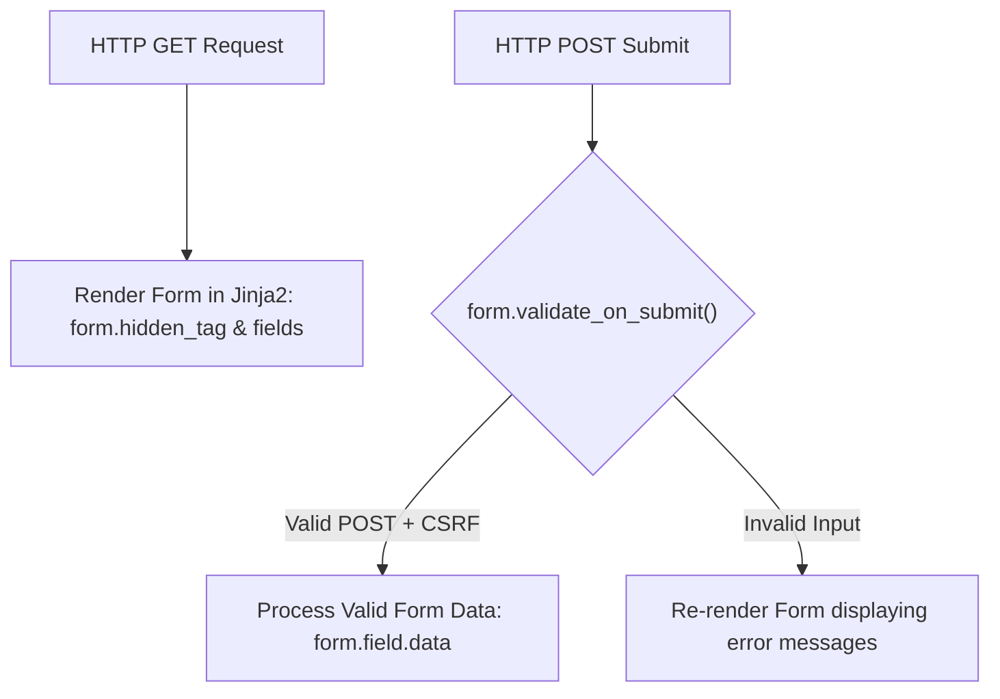

```yaml
schema_version: "2.0"
metadata:
  lesson_id: "FLK-MOD05-LES01"
  course_slug: "course-04-flask"
  course_title: "Course 4: Flask Backend & Microservices"
  module_slug: "mod-05-web-forms-validation"
  module_title: "Module 5 - Web Forms & Input Validation (Flask-WTF)"
  lesson_slug: "flask-wtf-forms-and-fields"
  lesson_title: "Lesson 5.1 WTForms & Flask-WTF Extension"
  sort_order: 501

pedagogy:
  difficulty: "beginner"
  estimated_time:
    reading_minutes: 15
    practice_minutes: 20
    quiz_minutes: 10
    total_minutes: 45
  bloom_taxonomy_level: "Apply"
  xp_reward: 50

prerequisites:
  required_lesson_ids:
    - "FLK-MOD04-LES02"
  required_skills:
    - "Flask Request Object & Jinja2 Templating"

skills_acquired:
  - "Integrating Flask-WTF Extension (`FlaskForm`)"
  - "WTForms Field Types (`StringField`, `PasswordField`, `SelectField`, `SubmitField`)"
  - "Rendering Forms in Jinja2 Templates (`form.field()`, `form.hidden_tag()`)"
  - "Handling Form Submission (`validate_on_submit()`)"

dependencies:
  software:
    - "VS Code"
    - "Python 3.12+"
    - "Flask-WTF"
  hardware: []

seo_and_social:
  meta_title: "Flask Web Forms: Flask-WTF, WTForms Fields & validate_on_submit()"
  meta_description: "Master Flask Web Forms with Flask-WTF: defining FlaskForm classes, WTForms field types, Jinja2 form rendering, and processing inputs with validate_on_submit()."
  keywords: ["Flask-WTF", "WTForms", "FlaskForm", "validate_on_submit", "StringField", "Flask Web Forms", "Input Handling"]

assessment_config:
  has_quiz: true
  has_lab: true
  has_flashcards: true
  pass_score_percentage: 80
```

# Lesson 5.1 WTForms & Flask-WTF Extension

## 1. Overview & Learning Objectives [id: overview]

- **Estimated Time**: 45 Minutes (15m Reading | 20m Practice | 10m Quiz)
- **Difficulty Level**: ⭐ Beginner
- **Prerequisites**: [Lesson 4.2 The `g` Object](file:///d:/My%20Drive/all%20files/PROJECT%20FILES/notes/docs/curriculum/_04_flask/_04_08_flask_g_object_and_request_scoped_state.md)
- **XP Reward**: +50 XP

### Learning Objectives
By the end of this lesson, you will be able to:
1. Integrate the **Flask-WTF** extension for object-oriented HTML form generation.
2. Define form classes inheriting from **`FlaskForm`**.
3. Use standard WTForms field types (`StringField`, `PasswordField`, `SelectField`, `SubmitField`).
4. Render and process form submissions cleanly using **`validate_on_submit()`**.

---

## 2. Environment & Prerequisites [id: prerequisites]

Install `Flask-WTF`:

```bash
pip install Flask-WTF
```

---

## 3. Theoretical Foundations [id: theory]

### 3.1 Processing Manual HTML Forms vs Flask-WTF
Handling raw HTML `<form>` inputs manually via `request.form.get()` leads to repetitive validation code and security oversights. **Flask-WTF** wraps the WTForms library, providing:
- Object-oriented form definitions in Python classes.
- Automatic CSRF token generation and validation.
- Declarative field validation rules.
- Seamless Jinja2 field rendering.

```
┌─────────────────────────────────────────────────────────────────────────────┐
│                          FLASK-WTF FORM LIFECYCLE                           │
├─────────────────────────────────────────────────────────────────────────────┤
│ User HTTP GET ──► instantiates `form = TelemetryForm()`                     │
│               ──► Jinja2 renders `{{ form.sensor_id() }}`                   │
│ User HTTP POST──► `form.validate_on_submit()` checks HTTP method + CSRF     │
│               ──► Returns `True` if valid; populates `form.errors` if invalid│
└─────────────────────────────────────────────────────────────────────────────┘
```

---

## 4. Architecture & Diagram Visualizations [id: diagram]



---

## 5. Code & Hardware Implementation [id: syntax]

### File 1: `forms.py` (FlaskForm Class Definition)

```python
from flask_wtf import FlaskForm
from wtforms import StringField, FloatField, SelectField, SubmitField
from wtforms.validators import DataRequired, Length, NumberRange

class SensorConfigForm(FlaskForm):
    sensor_id = StringField(
        "Sensor Node ID",
        validators=[DataRequired(), Length(min=3, max=20)]
    )
    location = StringField("Deployment Location", validators=[DataRequired()])
    alert_threshold = FloatField(
        "Temperature Threshold (°C)",
        validators=[DataRequired(), NumberRange(min=-40.0, max=125.0)]
    )
    sensor_type = SelectField(
        "Sensor Hardware Type",
        choices=[("DHT22", "DHT22 Temperature & Humidity"), ("DS18B20", "DS18B20 Waterproof Probe")]
    )
    submit = SubmitField("Save Sensor Configuration")
```

### File 2: `app.py` (Flask View Function)

```python
from flask import Flask, render_template, redirect, url_for, flash
from forms import SensorConfigForm

app = Flask(__name__)
app.config["SECRET_KEY"] = "secret-key-for-csrf-protection-90210"

@app.route("/sensor/new", methods=["GET", "POST"])
def create_sensor():
    form = SensorConfigForm()

    # validate_on_submit() checks if request is POST AND passes all validators!
    if form.validate_on_submit():
        sensor_id = form.sensor_id.data
        location = form.location.data
        threshold = form.alert_threshold.data
        
        flash(f"Sensor '{sensor_id}' configured successfully for {location}!", "success")
        return redirect(url_for("create_sensor"))

    return render_template("sensor_form.html", form=form)

if __name__ == "__main__":
    app.run(debug=True)
```

---

## 6. Enterprise Real-World Applications [id: examples]

- **Device Configuration Dashboards**: Admin portals use Flask-WTF forms to configure IoT sensor alert limits and wireless credentials securely with built-in CSRF protection.

---

## 7. Guided Step-by-Step Hands-On Exercise [id: exercises]

1. Save `forms.py` and `app.py`.
2. Navigate to `/sensor/new` in browser $\to$ Submit valid data $\to$ Inspect flash message redirect!

---

## 8. Common Pitfalls & Troubleshooting [id: common_mistakes]

| Bug / Error | Root Cause | Engineering Solution |
| :--- | :--- | :--- |
| **CSRF Token Missing Error** | Forgetting to call `{{ form.hidden_tag() }}` inside the HTML `<form>` tag in Jinja2. | Always include `{{ form.hidden_tag() }}` at the top of Flask-WTF forms. |

---

## 9. Best Practices & Optimization [id: best_practices]

- **Use `validate_on_submit()`**: Combines `request.method == 'POST'` and `form.validate()` checks in a single call.

---

## 10. Industry Interview Q&A [id: interview_qa]

### Q1: What does `form.validate_on_submit()` do in Flask-WTF?
**Answer**: `form.validate_on_submit()` is a shortcut method that checks if the current HTTP request is a `POST`, `PUT`, `PATCH`, or `DELETE` request, and then runs all defined field validators and CSRF token checks, returning `True` only if all validation rules pass.

---

## 11. Self-Assessment Quiz [id: quiz]

```json
{
  "quiz_title": "Lesson 5.1 Flask-WTF Assessment",
  "questions": [
    {
      "question_id": "Q1",
      "type": "multiple_choice",
      "question_text": "Which base class must all Flask-WTF form classes inherit from?",
      "options": ["Form", "FlaskForm", "BaseForm", "WTForm"],
      "correct_answer_index": 1,
      "explanation": "Flask-WTF forms inherit from flask_wtf.FlaskForm."
    }
  ]
}
```

---

## 12. Portfolio Assignment & Challenge [id: lab]

Build a user registration `FlaskForm` with username, email, and password fields.

---

## 13. Spaced Repetition Flashcards [id: flashcards]

**Front**: What Jinja2 statement renders hidden CSRF token fields in Flask-WTF templates?
**Back**: `{{ form.hidden_tag() }}`.
<!-- flashcard:end -->

---

## 14. Summary & Cheat Sheet [id: summary]

```python
class MyForm(FlaskForm):
    name = StringField("Name", validators=[DataRequired()])
```
