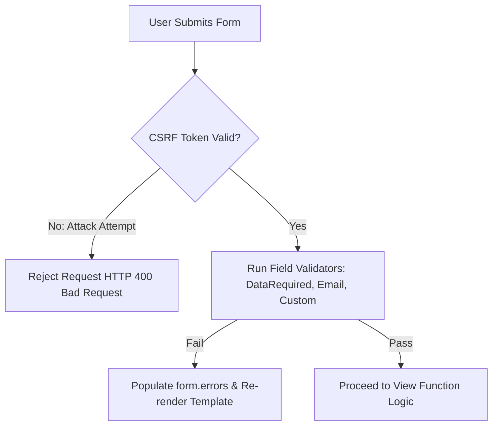

```yaml
schema_version: "2.0"
metadata:
  lesson_id: "FLK-MOD05-LES02"
  course_slug: "course-04-flask"
  course_title: "Course 4: Flask Backend & Microservices"
  module_slug: "mod-05-web-forms-validation"
  module_title: "Module 5 - Web Forms & Input Validation (Flask-WTF)"
  lesson_slug: "form-validation-and-csrf-protection"
  lesson_title: "Lesson 5.2 Form Validation & Automatic CSRF Protection"
  sort_order: 502

pedagogy:
  difficulty: "intermediate"
  estimated_time:
    reading_minutes: 15
    practice_minutes: 20
    quiz_minutes: 10
    total_minutes: 45
  bloom_taxonomy_level: "Apply"
  xp_reward: 50

prerequisites:
  required_lesson_ids:
    - "FLK-MOD05-LES01"
  required_skills:
    - "Flask-WTF & WTForms Field Definitions"

skills_acquired:
  - "WTForms Standard Validators (`Email`, `EqualTo`, `Regexp`, `ValidationError`)"
  - "Writing Custom In-Class Field Validators (`validate_<fieldname>`)"
  - "Automatic CSRF Token Generation & Verification"
  - "Rendering Field Validation Errors in Jinja2 Templates"

dependencies:
  software:
    - "VS Code"
    - "Python 3.12+"
    - "Flask-WTF"
    - "email-validator"
  hardware: []

seo_and_social:
  meta_title: "Flask Form Validation: Custom WTForms Validators & CSRF Protection"
  meta_description: "Master Flask Form Validation: WTForms validators (Email, EqualTo, Regexp), custom validate_field methods, ValidationError, and automatic CSRF protection."
  keywords: ["Form Validation", "WTForms Validators", "Custom Validator", "CSRF Protection", "ValidationError", "Flask Security"]

assessment_config:
  has_quiz: true
  has_lab: true
  has_flashcards: true
  pass_score_percentage: 80
```

# Lesson 5.2 Form Validation & Automatic CSRF Protection

## 1. Overview & Learning Objectives [id: overview]

- **Estimated Time**: 45 Minutes (15m Reading | 20m Practice | 10m Quiz)
- **Difficulty Level**: ⭐⭐ Intermediate
- **Prerequisites**: [Lesson 5.1 WTForms Basics](file:///d:/My%20Drive/all%20files/PROJECT%20FILES/notes/docs/curriculum/_04_flask/_04_09_flask_wtf_forms_and_fields.md)
- **XP Reward**: +50 XP

### Learning Objectives
By the end of this lesson, you will be able to:
1. Apply standard WTForms validators (`Email`, `EqualTo`, `Regexp`).
2. Write custom in-class validator methods (`validate_<fieldname>`).
3. Explain how **CSRF Protection** prevents unauthorized cross-site form submissions.
4. Render inline error messages for invalid fields in Jinja2 templates.

---

## 2. Environment & Prerequisites [id: prerequisites]

Install `email-validator`:

```bash
pip install email-validator
```

---

## 3. Theoretical Foundations [id: theory]

### 3.1 Custom In-Class Field Validation
WTForms automatically detects methods named `validate_<fieldname>(self, field)` on form classes. If a custom validation rule fails, raising a `ValidationError("Custom error message")` attaches the message to `field.errors`:

```python
class RegistrationForm(FlaskForm):
    username = StringField("Username")

    # Custom validator method automatically executed during form.validate()!
    def validate_username(self, field):
        if field.data.lower() == "admin":
            raise ValidationError("The username 'admin' is reserved!")
```

### 3.2 CSRF Protection Mechanism
Flask-WTF embeds a cryptographically signed, secret-based **CSRF Token** inside `form.hidden_tag()`. When submitted, Flask verifies that the token matches the user's session cookie, blocking forged requests initiated by malicious third-party websites.

---

## 4. Architecture & Diagram Visualizations [id: diagram]



---

## 5. Code & Hardware Implementation [id: syntax]

### File 1: `forms.py` (Form with Custom & Standard Validators)

```python
from flask_wtf import FlaskForm
from wtforms import StringField, PasswordField, SubmitField
from wtforms.validators import DataRequired, Email, EqualTo, Length, ValidationError

class UserRegistrationForm(FlaskForm):
    email = StringField(
        "Email Address",
        validators=[DataRequired(), Email(message="Invalid email address format")]
    )
    password = PasswordField(
        "Password",
        validators=[DataRequired(), Length(min=8, message="Password must be at least 8 characters")]
    )
    confirm_password = PasswordField(
        "Confirm Password",
        validators=[DataRequired(), EqualTo("password", message="Passwords must match!")]
    )
    submit = SubmitField("Register Account")

    # Custom In-Class Field Validator
    def validate_email(self, field):
        reserved_domains = ["example.com", "test.com"]
        domain = field.data.split("@")[-1] if "@" in field.data else ""
        if domain in reserved_domains:
            raise ValidationError(f"Registration from domain '{domain}' is prohibited.")
```

### File 2: `templates/register.html` (Rendering Inline Validation Errors)

```html
<form method="POST" action="">
  {{ form.hidden_tag() }} <!-- Renders CSRF Hidden Field! -->

  <div>
    {{ form.email.label }}
    {{ form.email() }}
    
      <span class="error-text" style="color: red;">{{ error }}</span>
    
  </div>

  <div>
    {{ form.password.label }}
    {{ form.password() }}
    
      <span class="error-text" style="color: red;">{{ error }}</span>
    
  </div>

  <div>
    {{ form.confirm_password.label }}
    {{ form.confirm_password() }}
    
      <span class="error-text" style="color: red;">{{ error }}</span>
    
  </div>

  {{ form.submit() }}
</form>
```

---

## 6. Enterprise Real-World Applications [id: examples]

- **Secure Financial & User Portals**: Enterprise web applications enforce strict password strength regex validation and custom database uniqueness checks (`validate_email`) on user registration.

---

## 7. Guided Step-by-Step Hands-On Exercise [id: exercises]

1. Save `forms.py` and `register.html`.
2. Submit form with mismatched passwords $\to$ Observe inline red error message rendering!

---

## 8. Common Pitfalls & Troubleshooting [id: common_mistakes]

| Bug / Error | Root Cause | Engineering Solution |
| :--- | :--- | :--- |
| **`WTForms Email Validator Requires email-validator`** | Using `Email()` validator without installing `email-validator` python package. | Run `pip install email-validator`. |

---

## 9. Best Practices & Optimization [id: best_practices]

- **Render Inline Errors**: Loop over `form.field.errors` to show specific error messages directly below input fields.

---

## 10. Industry Interview Q&A [id: interview_qa]

### Q1: How do you write a custom field validator in Flask-WTF?
**Answer**: Define a method on the `FlaskForm` subclass following the naming convention `validate_<fieldname>(self, field)`. Inside the method, inspect `field.data` and raise a `wtforms.validators.ValidationError("Custom Message")` if validation fails.

---

## 11. Self-Assessment Quiz [id: quiz]

```json
{
  "quiz_title": "Lesson 5.2 Form Validation Assessment",
  "questions": [
    {
      "question_id": "Q1",
      "type": "multiple_choice",
      "question_text": "Which exception class should be raised inside custom WTForms field validation methods?",
      "options": ["ValueError", "ValidationError", "WTFormError", "HTTPException"],
      "correct_answer_index": 1,
      "explanation": "wtforms.validators.ValidationError must be raised for validation errors."
    }
  ]
}
```

---

## 12. Portfolio Assignment & Challenge [id: lab]

Build a password reset form with custom complexity validation rules.

---

## 13. Spaced Repetition Flashcards [id: flashcards]

**Front**: What WTForms validator verifies that two password input fields contain identical string values?
**Back**: `EqualTo('password')`.
<!-- flashcard:end -->

---

## 14. Summary & Cheat Sheet [id: summary]

```python
def validate_field(self, field):
    if len(field.data) < 3:
        raise ValidationError("Too short")
```
