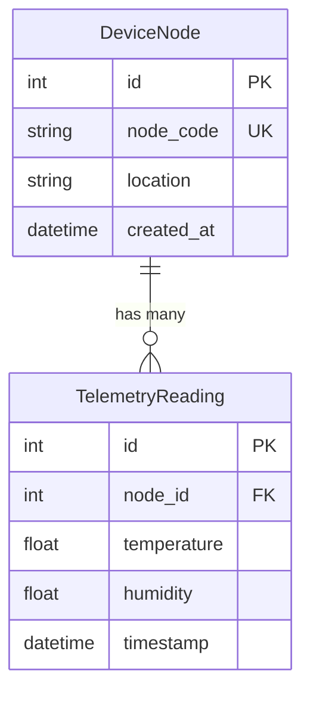

```yaml
schema_version: "2.0"
metadata:
  lesson_id: "FLK-MOD06-LES02"
  course_slug: "course-04-flask"
  course_title: "Course 4: Flask Backend & Microservices"
  module_slug: "mod-06-relational-databases-orm"
  module_title: "Module 6 - Relational Databases & ORM (Flask-SQLAlchemy)"
  lesson_slug: "sqlalchemy-models-fields-and-relationships"
  lesson_title: "Lesson 6.2 Defining SQLAlchemy Models, Fields, & Relationships"
  sort_order: 602

pedagogy:
  difficulty: "intermediate"
  estimated_time:
    reading_minutes: 20
    practice_minutes: 25
    quiz_minutes: 10
    total_minutes: 55
  bloom_taxonomy_level: "Apply"
  xp_reward: 60

prerequisites:
  required_lesson_ids:
    - "FLK-MOD06-LES01"
  required_skills:
    - "Flask-SQLAlchemy Extension Architecture & SQL Basics"

skills_acquired:
  - "Declaring SQLAlchemy Model Classes (`db.Model`)"
  - "Column Data Types & Constraints (`db.Column`, `db.Integer`, `db.String`)"
  - "One-to-Many Relationships (`db.ForeignKey`, `db.relationship`)"
  - "Cascade Deletes & `back_populates` Dual-Side Navigation"

dependencies:
  software:
    - "VS Code"
    - "Python 3.12+"
    - "Flask-SQLAlchemy"
  hardware: []

seo_and_social:
  meta_title: "SQLAlchemy Models: Columns, Foreign Keys, Relationships & Cascade"
  meta_description: "Master SQLAlchemy Model Definitions: db.Model, Column data types, primary_key, ForeignKey, One-to-Many relationships with db.relationship, and cascade deletes."
  keywords: ["SQLAlchemy Models", "db.Model", "db.Column", "db.ForeignKey", "db.relationship", "One to Many", "Cascade Delete"]

assessment_config:
  has_quiz: true
  has_lab: true
  has_flashcards: true
  pass_score_percentage: 80
```

# Lesson 6.2 Defining SQLAlchemy Models, Fields, & Relationships

## 1. Overview & Learning Objectives [id: overview]

- **Estimated Time**: 55 Minutes (20m Reading | 25m Practice | 10m Quiz)
- **Difficulty Level**: ⭐⭐ Intermediate
- **Prerequisites**: [Lesson 6.1 Flask-SQLAlchemy Architecture](file:///d:/My%20Drive/all%20files/PROJECT%20FILES/notes/docs/curriculum/_04_flask/_04_11_flask_sqlalchemy_extension_architecture.md)
- **XP Reward**: +60 XP

### Learning Objectives
By the end of this lesson, you will be able to:
1. Define database tables by subclassing **`db.Model`**.
2. Specify Column data types (`Integer`, `String`, `Float`, `DateTime`, `Boolean`) and constraints.
3. Model **One-to-Many** relationships using **`db.ForeignKey`** and **`db.relationship()`**.
4. Configure cascade deletions (`cascade="all, delete-orphan"`) and dual-side `back_populates` navigation.

---

## 2. Environment & Prerequisites [id: prerequisites]

Open Python REPL or VS Code.

---

## 3. Theoretical Foundations [id: theory]

### 3.1 SQLAlchemy Model Mapping
In SQLAlchemy, a Model class represents a database table, and class attributes represent table columns:

```
┌─────────────────────────────────────────────────────────────────────────────┐
│                       ONE-TO-MANY RELATIONSHIP SCHEME                       │
├─────────────────────────────────────────────────────────────────────────────┤
│ Parent Table (`DeviceNode`) 1 ───◄ N Child Table (`TelemetryReading`)      │
│ Primary Key: `id`                   Foreign Key: `node_id`                  │
└─────────────────────────────────────────────────────────────────────────────┘
```

- **`db.ForeignKey('parent_table.id')`**: Defined on the child table column to store the parent table's primary key value.
- **`db.relationship('ChildModel', back_populates='parent')`**: Defined on the parent model to enable high-level Python list access (`node.readings`).

---

## 4. Architecture & Diagram Visualizations [id: diagram]



---

## 5. Code & Hardware Implementation [id: syntax]

### File: `models.py` (SQLAlchemy Relational Schema)

```python
from datetime import datetime
from extensions import db

class DeviceNode(db.Model):
    __tablename__ = "device_nodes"

    id = db.Column(db.Integer, primary_key=True)
    node_code = db.Column(db.String(50), unique=True, nullable=False, index=True)
    location = db.Column(db.String(100), nullable=False)
    is_active = db.Column(db.Boolean, default=True, nullable=False)
    created_at = db.Column(db.DateTime, default=datetime.utcnow, nullable=False)

    # 1. One-to-Many Relationship to TelemetryReading
    readings = db.relationship(
        "TelemetryReading",
        back_populates="device",
        cascade="all, delete-orphan", # Auto-deletes readings if parent node is deleted!
        lazy="select"                 # Loads readings on demand
    )

    def __repr__(self):
        return f"<DeviceNode {self.node_code} ({self.location})>"


class TelemetryReading(db.Model):
    __tablename__ = "telemetry_readings"

    id = db.Column(db.Integer, primary_key=True)
    temperature = db.Column(db.Float, nullable=False)
    humidity = db.Column(db.Float, nullable=False)
    timestamp = db.Column(db.DateTime, default=datetime.utcnow, nullable=False, index=True)

    # 2. Foreign Key pointing to parent device_nodes.id
    node_id = db.Column(db.Integer, db.ForeignKey("device_nodes.id", ondelete="CASCADE"), nullable=False)

    # Dual-side navigation back to parent instance
    device = db.relationship("DeviceNode", back_populates="readings")

    def __repr__(self):
        return f"<TelemetryReading Node={self.node_id} Temp={self.temperature}°C>"
```

---

## 6. Enterprise Real-World Applications [id: examples]

- **Relational IoT Data Warehousing**: Device inventory tables link via one-to-many foreign keys to millions of time-series sensor telemetry readings, enabling fast relational queries.

---

## 7. Guided Step-by-Step Hands-On Exercise [id: exercises]

1. Save `models.py`.
2. Run `python -c "from app import create_app; from extensions import db; app = create_app(); app.app_context().push(); db.create_all()"` $\to$ Inspect SQL tables created in database!

---

## 8. Common Pitfalls & Troubleshooting [id: common_mistakes]

| Bug / Error | Root Cause | Engineering Solution |
| :--- | :--- | :--- |
| **`NoReferencedTableError`** | Writing `db.ForeignKey('DeviceNode.id')` using Model Class Name instead of actual table name string (`device_nodes.id`). | `db.ForeignKey` references the actual SQL database table name (`__tablename__`). |

---

## 9. Best Practices & Optimization [id: best_practices]

- **Use `back_populates`**: Explicitly declare `back_populates` on both parent and child models for clean, predictable bi-directional relationships.

---

## 10. Industry Interview Q&A [id: interview_qa]

### Q1: What is the difference between `backref` and `back_populates` in SQLAlchemy relationships?
**Answer**: `backref` automatically creates a reverse relationship property on the target model implicitly. `back_populates` requires explicitly declaring matching relationship properties on *both* model classes, making the code self-documenting and easier to debug.

---

## 11. Self-Assessment Quiz [id: quiz]

```json
{
  "quiz_title": "Lesson 6.2 SQLAlchemy Models Assessment",
  "questions": [
    {
      "question_id": "Q1",
      "type": "multiple_choice",
      "question_text": "What does `db.ForeignKey` reference in its string argument?",
      "options": ["Model Class Name", "SQL Database Table Name & Column", "Python File Name", "View Function"],
      "correct_answer_index": 1,
      "explanation": "ForeignKey references table_name.column_name."
    }
  ]
}
```

---

## 12. Portfolio Assignment & Challenge [id: lab]

Model a User and UserProfile One-to-One relationship using `uselist=False`.

---

## 13. Spaced Repetition Flashcards [id: flashcards]

**Front**: What cascade setting automatically deletes child rows when a parent object is deleted?
**Back**: `cascade="all, delete-orphan"`.
<!-- flashcard:end -->

---

## 14. Summary & Cheat Sheet [id: summary]

```python
class Node(db.Model):
    id = db.Column(db.Integer, primary_key=True)
    readings = db.relationship("Reading", back_populates="node")
```
