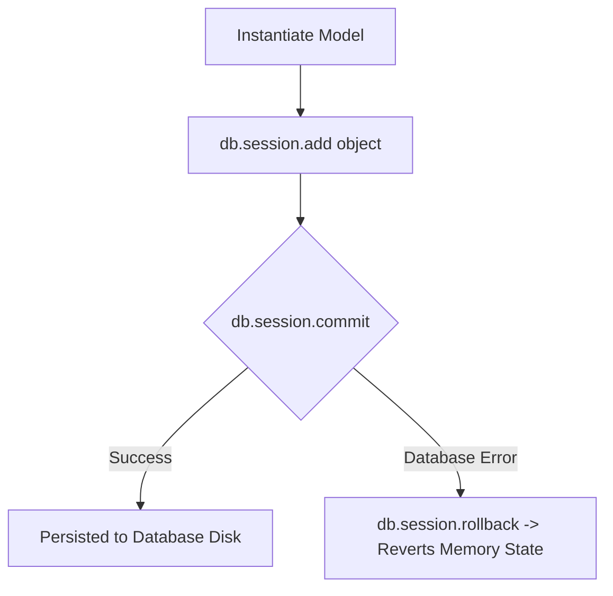

```yaml
schema_version: "2.0"
metadata:
  lesson_id: "FLK-MOD06-LES03"
  course_slug: "course-04-flask"
  course_title: "Course 4: Flask Backend & Microservices"
  module_slug: "mod-06-relational-databases-orm"
  module_title: "Module 6 - Relational Databases & ORM (Flask-SQLAlchemy)"
  lesson_slug: "sqlalchemy-crud-operations"
  lesson_title: "Lesson 6.3 Executing Database CRUD Operations"
  sort_order: 603

pedagogy:
  difficulty: "intermediate"
  estimated_time:
    reading_minutes: 20
    practice_minutes: 25
    quiz_minutes: 10
    total_minutes: 55
  bloom_taxonomy_level: "Apply"
  xp_reward: 60

prerequisites:
  required_lesson_ids:
    - "FLK-MOD06-LES02"
  required_skills:
    - "SQLAlchemy Model Definitions & Relational Schema"

skills_acquired:
  - "Inserting Records (`db.session.add()`, `db.session.commit()`)"
  - "Querying Data (`filter_by()`, `filter()`, `get_or_404()`, `all()`)"
  - "Updating Record Attributes & Deleting Objects (`db.session.delete()`)"
  - "Relational Joins & Database Pagination (`paginate(page, per_page)`)"

dependencies:
  software:
    - "VS Code"
    - "Python 3.12+"
    - "Flask-SQLAlchemy"
  hardware: []

seo_and_social:
  meta_title: "SQLAlchemy CRUD Operations: Filtering, Joins, Transactions & Pagination"
  meta_description: "Master SQLAlchemy CRUD Operations: db.session.add(), commit(), rollback(), filter_by(), get_or_404(), relational joins, and Flask-SQLAlchemy paginate()."
  keywords: ["SQLAlchemy CRUD", "db.session.add", "db.session.commit", "filter_by", "get_or_404", "Flask Pagination", "SQLAlchemy Joins"]

assessment_config:
  has_quiz: true
  has_lab: true
  has_flashcards: true
  pass_score_percentage: 80
```

# Lesson 6.3 Executing Database CRUD Operations

## 1. Overview & Learning Objectives [id: overview]

- **Estimated Time**: 55 Minutes (20m Reading | 25m Practice | 10m Quiz)
- **Difficulty Level**: ⭐⭐ Intermediate
- **Prerequisites**: [Lesson 6.2 SQLAlchemy Models](file:///d:/My%20Drive/all%20files/PROJECT%20FILES/notes/docs/curriculum/_04_flask/_04_12_sqlalchemy_models_fields_and_relationships.md)
- **XP Reward**: +60 XP

### Learning Objectives
By the end of this lesson, you will be able to:
1. Insert new records into relational database tables using `db.session.add()`.
2. Query data using `filter_by()`, `filter()`, `get_or_404()`, and `all()`.
3. Update and delete objects while maintaining transaction rollback safety (`db.session.rollback()`).
4. Execute relational table joins and implement API pagination using `.paginate()`.

---

## 2. Environment & Prerequisites [id: prerequisites]

Open Python REPL or VS Code.

---

## 3. Theoretical Foundations [id: theory]

### 3.1 Unit of Work Transaction Management
SQLAlchemy uses the **Unit of Work** pattern. Changes made to model instances are tracked in memory by `db.session`. Changes are not written to the underlying database until `db.session.commit()` is called. If an error occurs, `db.session.rollback()` reverts all pending operations safely.

```
┌─────────────────────────────────────────────────────────────────────────────┐
│                        SQLALCHEMY TRANSACTION LIFECYCLE                     │
├─────────────────────────────────────────────────────────────────────────────┤
│ `node = DeviceNode(...)` ──► `db.session.add(node)` ──► Pending Transaction  │
│                                                            │                │
│                                                            ▼                │
│ `db.session.rollback()` ◄── [Error Occurs!] ── OR ──► `db.session.commit()`│
└─────────────────────────────────────────────────────────────────────────────┘
```

---

## 4. Architecture & Diagram Visualizations [id: diagram]



---

## 5. Code & Hardware Implementation [id: syntax]

```python
# SQLAlchemy CRUD Operations & Pagination (crud_demo.py)
from flask import Flask, jsonify, request
from extensions import db
from models import DeviceNode, TelemetryReading

app = Flask(__name__)
app.config["SQLALCHEMY_DATABASE_URI"] = "sqlite:///crud_telemetry.db"
db.init_app(app)

# 1. CREATE Operation
@app.route("/api/v1/nodes", methods=["POST"])
def create_node():
    data = request.json
    try:
        new_node = DeviceNode(
            node_code=data["node_code"],
            location=data["location"]
        )
        db.session.add(new_node)
        db.session.commit() # Commit transaction
        return jsonify({"message": "Node created", "id": new_node.id}), 201
    except Exception as err:
        db.session.rollback() # Rollback on error!
        return jsonify({"error": str(err)}), 400

# 2. READ Operation with Pagination & Helper get_or_404
@app.route("/api/v1/nodes/<int:node_id>", methods=["GET"])
def get_node(node_id):
    # Returns model instance or automatically raises HTTP 404!
    node = DeviceNode.query.get_or_404(node_id)
    return jsonify({
        "id": node.id,
        "node_code": node.node_code,
        "location": node.location,
        "readings_count": len(node.readings)
    })

# 3. PAGINATED READ
@app.route("/api/v1/readings", methods=["GET"])
def get_paginated_readings():
    page = request.args.get("page", 1, type=int)
    per_page = request.args.get("per_page", 10, type=int)

    pagination = TelemetryReading.query.order_by(
        TelemetryReading.timestamp.desc()
    ).paginate(page=page, per_page=per_page, error_out=False)

    return jsonify({
        "total": pagination.total,
        "pages": pagination.pages,
        "current_page": page,
        "items": [
            {"id": r.id, "temp": r.temperature, "node_id": r.node_id}
            for r in pagination.items
        ]
    })
```

---

## 6. Enterprise Real-World Applications [id: examples]

- **RESTful API Backend Endpoints**: Microservices handle high-concurrency CRUD requests using `db.session.commit()` wrapped in `try...except` rollback blocks to preserve database integrity.

---

## 7. Guided Step-by-Step Hands-On Exercise [id: exercises]

1. Save code as `crud_demo.py`.
2. Run app $\to$ Send POST to `/api/v1/nodes` and GET to `/api/v1/readings?page=1`!

---

## 8. Common Pitfalls & Troubleshooting [id: common_mistakes]

| Bug / Error | Root Cause | Engineering Solution |
| :--- | :--- | :--- |
| **`InvalidRequestError: Session is in 'prepared' state`** | Failing to call `db.session.rollback()` after an exception before attempting new database queries. | Always call `db.session.rollback()` inside `except` blocks handling database errors. |

---

## 9. Best Practices & Optimization [id: best_practices]

- **Use `get_or_404()`**: Eliminates boilerplate `if node is None: return 404` checks.

---

## 10. Industry Interview Q&A [id: interview_qa]

### Q1: What is the purpose of `db.session.rollback()` in Flask-SQLAlchemy?
**Answer**: `db.session.rollback()` cancels all uncommitted database operations pending in the active transaction session. If a database query fails or throws an exception during `db.session.commit()`, calling `rollback()` resets the session state so subsequent queries in the request context can execute cleanly.

---

## 11. Self-Assessment Quiz [id: quiz]

```json
{
  "quiz_title": "Lesson 6.3 CRUD Operations Assessment",
  "questions": [
    {
      "question_id": "Q1",
      "type": "multiple_choice",
      "question_text": "Which Flask-SQLAlchemy method queries an object by primary key or automatically returns an HTTP 404 response if missing?",
      "options": ["Model.query.get()", "Model.query.first()", "Model.query.get_or_404()", "Model.query.filter()"],
      "correct_answer_index": 2,
      "explanation": "get_or_404() fetches an object or raises HTTP 404."
    }
  ]
}
```

---

## 12. Portfolio Assignment & Challenge [id: lab]

Build a paginated REST API endpoint supporting query filtering by temperature range.

---

## 13. Spaced Repetition Flashcards [id: flashcards]

**Front**: What method removes a model instance from the database in SQLAlchemy?
**Back**: `db.session.delete(instance)` followed by `db.session.commit()`.
<!-- flashcard:end -->

---

## 14. Summary & Cheat Sheet [id: summary]

```python
db.session.add(obj)
db.session.commit()
item = Model.query.get_or_404(1)
```
