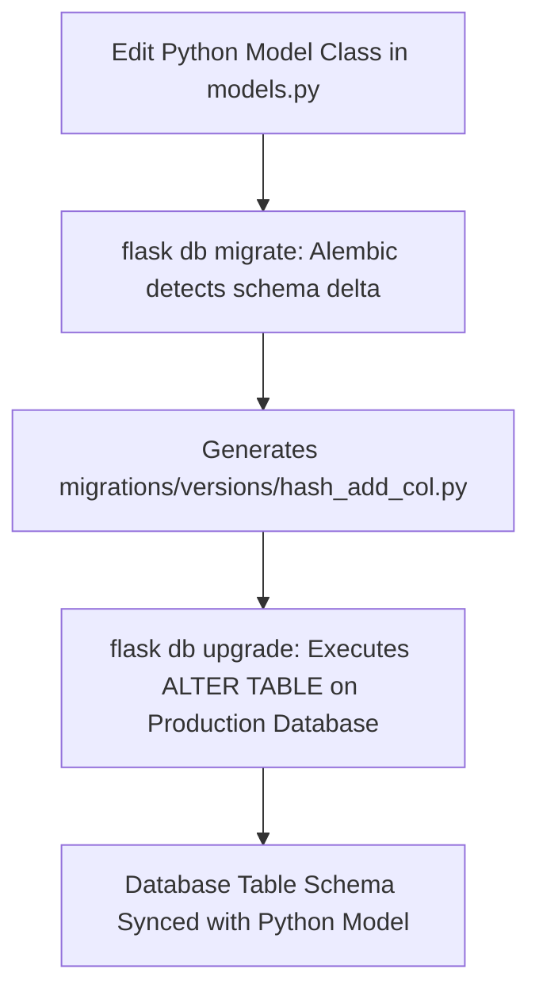

```yaml
schema_version: "2.0"
metadata:
  lesson_id: "FLK-MOD06-LES04"
  course_slug: "course-04-flask"
  course_title: "Course 4: Flask Backend & Microservices"
  module_slug: "mod-06-relational-databases-orm"
  module_title: "Module 6 - Relational Databases & ORM (Flask-SQLAlchemy)"
  lesson_slug: "schema-migrations-with-flask-migrate"
  lesson_title: "Lesson 6.4 Schema Migrations with Flask-Migrate & Alembic"
  sort_order: 604

pedagogy:
  difficulty: "intermediate"
  estimated_time:
    reading_minutes: 20
    practice_minutes: 25
    quiz_minutes: 10
    total_minutes: 55
  bloom_taxonomy_level: "Apply"
  xp_reward: 60

prerequisites:
  required_lesson_ids:
    - "FLK-MOD06-LES03"
  required_skills:
    - "Flask-SQLAlchemy Models & Database Operations"

skills_acquired:
  - "Integrating Flask-Migrate Extension (`Migrate(app, db)`)"
  - "Understanding the Alembic Database Migration Engine"
  - "Initializing Migration Repository (`flask db init`)"
  - "Generating & Applying Migrations (`flask db migrate`, `flask db upgrade`)"
  - "Rolling Back Schema Migrations (`flask db downgrade`)"

dependencies:
  software:
    - "VS Code"
    - "Python 3.12+"
    - "Flask-Migrate"
  hardware: []

seo_and_social:
  meta_title: "Flask-Migrate Schema Migrations: Alembic, flask db init, migrate & upgrade"
  meta_description: "Master Flask-Migrate Database Migrations: Alembic migration engine, initializing repos with flask db init, generating migrations with flask db migrate, and applying schemas with flask db upgrade."
  keywords: ["Flask-Migrate", "Alembic", "flask db init", "flask db migrate", "flask db upgrade", "Database Schema Evolution", "DDL Migrations"]

assessment_config:
  has_quiz: true
  has_lab: true
  has_flashcards: true
  pass_score_percentage: 80
```

# Lesson 6.4 Schema Migrations with Flask-Migrate & Alembic

## 1. Overview & Learning Objectives [id: overview]

- **Estimated Time**: 55 Minutes (20m Reading | 25m Practice | 10m Quiz)
- **Difficulty Level**: ⭐⭐ Intermediate
- **Prerequisites**: [Lesson 6.3 CRUD Operations](file:///d:/My%20Drive/all%20files/PROJECT%20FILES/notes/docs/curriculum/_04_flask/_04_13_sqlalchemy_crud_operations.md)
- **XP Reward**: +60 XP

### Learning Objectives
By the end of this lesson, you will be able to:
1. Explain the database schema evolution challenge in production systems.
2. Integrate **Flask-Migrate** into the Application Factory pattern.
3. Understand the underlying **Alembic** migration engine.
4. Execute CLI commands: `flask db init`, `flask db migrate`, `flask db upgrade`, and `flask db downgrade`.

---

## 2. Environment & Prerequisites [id: prerequisites]

Install `Flask-Migrate`:

```bash
pip install Flask-Migrate
```

---

## 3. Theoretical Foundations [id: theory]

### 3.1 Why `db.create_all()` Fails in Production
In early development, calling `db.create_all()` creates tables that do not exist yet. However, if you add a new column to an existing model class, `db.create_all()` does **NOT** alter existing tables or add the new column!

**Flask-Migrate** wraps **Alembic** (the database migration tool for SQLAlchemy). It tracks schema changes over time by generating versioned Python migration scripts containing `upgrade()` and `downgrade()` DDL instructions:

```
┌─────────────────────────────────────────────────────────────────────────────┐
│                       FLASK-MIGRATE WORKFLOW CYCLE                          │
├─────────────────────────────────────────────────────────────────────────────┤
│ 1. Modify Model Class (Add Column `firmware_version`)                       │
│ 2. `flask db migrate -m "add firmware version"` ──► Generates Migration Script│
│ 3. `flask db upgrade`                           ──► Executes ALTER TABLE    │
└─────────────────────────────────────────────────────────────────────────────┘
```

---

## 4. Architecture & Diagram Visualizations [id: diagram]



---

## 5. Code & Hardware Implementation [id: syntax]

### File 1: `extensions.py`

```python
from flask_sqlalchemy import SQLAlchemy
from flask_migrate import Migrate

db = SQLAlchemy()
migrate = Migrate()
```

### File 2: `app/__init__.py` (Factory Integration)

```python
from flask import Flask
from config import Config
from extensions import db, migrate
import models  # Must import models so Alembic detects model classes!

def create_app():
    app = Flask(__name__)
    app.config.from_object(Config)

    # Initialize extensions
    db.init_app(app)
    migrate.init_app(app, db) # Binds Flask-Migrate to app and db!

    return app
```

### File 3: Command Line Execution Sequence

```bash
# 1. Initialize Migration Repository (Run ONCE per project)
flask db init

# 2. Generate Migration Script after modifying models.py
flask db migrate -m "Add battery_level column to DeviceNode"

# 3. Apply Migration DDL to Database
flask db upgrade

# 4. Rollback Last Migration (If needed)
flask db downgrade
```

---

## 6. Enterprise Real-World Applications [id: examples]

- **Zero-Downtime CD/CI Deployments**: Production deployment pipelines execute `flask db upgrade` automatically during deployment to update MySQL/PostgreSQL database schemas before launching new application containers.

---

## 7. Guided Step-by-Step Hands-On Exercise [id: exercises]

1. Run `flask db init` in terminal.
2. Add a new field `battery_level = db.Column(db.Float)` to `models.py`.
3. Run `flask db migrate -m "add battery"` then `flask db upgrade` $\to$ Inspect database schema update!

---

## 8. Common Pitfalls & Troubleshooting [id: common_mistakes]

| Bug / Error | Root Cause | Engineering Solution |
| :--- | :--- | :--- |
| **`Target database is not up to date`** | Modifying database schema outside of Flask-Migrate or running `migrate` out of sync. | Run `flask db stamp head` to sync current database state with Alembic version headers. |

---

## 9. Best Practices & Optimization [id: best_practices]

- **Commit `migrations/` Folder to Git**: Migration scripts are part of your source code repository.

---

## 10. Industry Interview Q&A [id: interview_qa]

### Q1: How does Flask-Migrate detect changes made to SQLAlchemy models when generating migration scripts?
**Answer**: Flask-Migrate (via Alembic) inspects the `metadata` of all imported `db.Model` subclasses, compares the defined model columns against the active database schema tables, and generates a Python migration script with `upgrade()` and `downgrade()` methods reflecting the schema differences.

---

## 11. Self-Assessment Quiz [id: quiz]

```json
{
  "quiz_title": "Lesson 6.4 Flask-Migrate Assessment",
  "questions": [
    {
      "question_id": "Q1",
      "type": "multiple_choice",
      "question_text": "Which CLI command applies pending database migration DDL scripts to the active database?",
      "options": ["flask db init", "flask db migrate", "flask db upgrade", "flask db commit"],
      "correct_answer_index": 2,
      "explanation": "flask db upgrade applies pending migration scripts to the database."
    }
  ]
}
```

---

## 12. Portfolio Assignment & Challenge [id: lab]

Add a `firmware_version` column to an existing model and apply a migration via Flask-Migrate.

---

## 13. Spaced Repetition Flashcards [id: flashcards]

**Front**: What underlying database migration engine powers Flask-Migrate?
**Back**: Alembic.
<!-- flashcard:end -->

---

## 14. Summary & Cheat Sheet [id: summary]

```bash
flask db init
flask db migrate -m "migration message"
flask db upgrade
```
