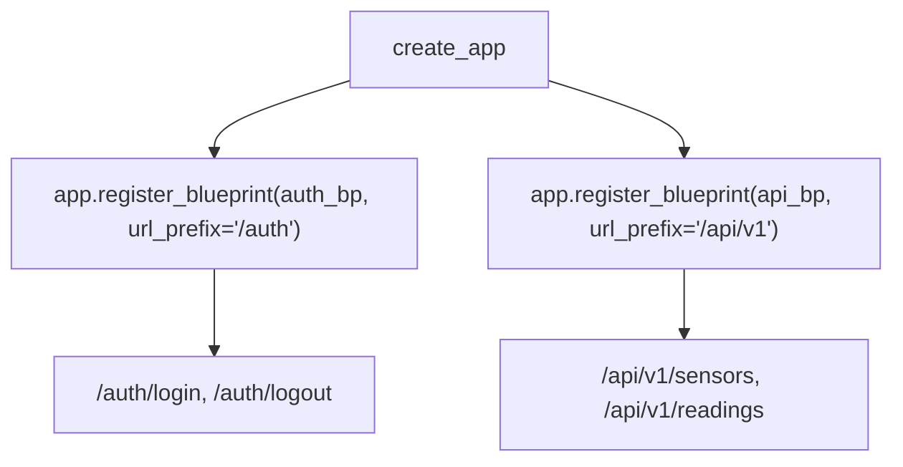

```yaml
schema_version: "2.0"
metadata:
  lesson_id: "FLK-MOD08-LES01"
  course_slug: "course-04-flask"
  course_title: "Course 4: Flask Backend & Microservices"
  module_slug: "mod-08-blueprints-app-structure"
  module_title: "Module 8 - Application Structuring with Blueprints"
  lesson_slug: "flask-blueprint-architecture"
  lesson_title: "Lesson 8.1 Flask Blueprint Architecture"
  sort_order: 801

pedagogy:
  difficulty: "intermediate"
  estimated_time:
    reading_minutes: 15
    practice_minutes: 20
    quiz_minutes: 10
    total_minutes: 45
  bloom_taxonomy_level: "Apply"
  xp_reward: 50

prerequisites:
  required_lesson_ids:
    - "FLK-MOD07-LES02"
  required_skills:
    - "Flask Application Factory & Routing System"

skills_acquired:
  - "Flask Blueprint Instantiation (`Blueprint('name', __name__)`)"
  - "Registering Blueprints with URL Prefixes (`url_prefix='/api/v1'`)"
  - "Blueprint-Scoped Route Namespacing (`url_for('blueprint.view_function')`)"
  - "Modular Architecture Separation of Concerns"

dependencies:
  software:
    - "VS Code"
    - "Python 3.12+"
  hardware: []

seo_and_social:
  meta_title: "Flask Blueprints Architecture: Blueprint(), url_prefix & Modular Routes"
  meta_description: "Master Flask Blueprints: modular application structure, Blueprint() instantiation, registering blueprints with url_prefix, and blueprint-scoped url_for()."
  keywords: ["Flask Blueprints", "Blueprint()", "url_prefix", "Modular Flask", "url_for blueprint", "Flask Architecture"]

assessment_config:
  has_quiz: true
  has_lab: true
  has_flashcards: true
  pass_score_percentage: 80
```

# Lesson 8.1 Flask Blueprint Architecture

## 1. Overview & Learning Objectives [id: overview]

- **Estimated Time**: 45 Minutes (15m Reading | 20m Practice | 10m Quiz)
- **Prerequisites**: [Lesson 7.2 Password Hashing](file:///d:/My%20Drive/all%20files/PROJECT%20FILES/notes/docs/curriculum/_04_flask/_04_16_password_hashing_and_cookie_security.md)
- **XP Reward**: +50 XP

### Learning Objectives
By the end of this lesson, you will be able to:
1. Explain the architectural necessity of **Flask Blueprints** in large applications.
2. Instantiate Blueprints using `Blueprint('name', __name__)`.
3. Register Blueprints on the application instance with custom `url_prefix` settings.
4. Reference blueprint-scoped view functions using `url_for('blueprint.view_function')`.

---

## 2. Environment & Prerequisites [id: prerequisites]

Open Python REPL or VS Code.

---

## 3. Theoretical Foundations [id: theory]

### 3.1 What is a Flask Blueprint?
A **Blueprint** is a way to organize a group of related view functions, templates, and static files into modular components. A Blueprint is not a standalone Flask application itself, but a set of instructions for registering routes, error handlers, and middleware hooks on an application instance created by `create_app()`.

```
┌─────────────────────────────────────────────────────────────────────────────┐
│                          FLASK BLUEPRINT ARCHITECTURE                       │
├─────────────────────────────────────────────────────────────────────────────┤
│ Application Factory (`create_app()`)                                        │
│   ├── Register `auth_bp`       ──► Prefix: `/auth`                          │
│   ├── Register `api_bp`        ──► Prefix: `/api/v1`                        │
│   └── Register `telemetry_bp`  ──► Prefix: `/telemetry`                     │
└─────────────────────────────────────────────────────────────────────────────┘
```

---

## 4. Architecture & Diagram Visualizations [id: diagram]



---

## 5. Code & Hardware Implementation [id: syntax]

### File 1: `app/api/routes.py` (Blueprint Module)

```python
from flask import Blueprint, jsonify

# 1. Instantiate Blueprint
api_bp = Blueprint("api", __name__)

@api_bp.route("/status")
def api_status():
    return jsonify({"system": "ONLINE", "blueprint": "api"})

@api_bp.route("/nodes")
def list_nodes():
    return jsonify({"nodes": ["ESP32-A1", "ESP32-B2"]})
```

### File 2: `app/__init__.py` (Registering Blueprints in Application Factory)

```python
from flask import Flask, url_for
from app.api.routes import api_bp

def create_app():
    app = Flask(__name__)

    # 2. Register Blueprint with URL Prefix
    app.register_blueprint(api_bp, url_prefix="/api/v1")

    @app.route("/test-routes")
    def test_routes():
        # Blueprint-scoped url_for requires 'blueprint_name.view_function'!
        status_url = url_for("api.api_status")
        return {"generated_api_url": status_url}

    return app
```

---

## 6. Enterprise Real-World Applications [id: examples]

- **Multi-Tenant Microservice Architectures**: Enterprise web platforms isolate user authentication, billing, administrative tools, and REST APIs into independent, self-contained Flask Blueprints.

---

## 7. Guided Step-by-Step Hands-On Exercise [id: exercises]

1. Save `app/api/routes.py` and `app/__init__.py`.
2. Run `FLASK_APP="app:create_app()" flask run` $\to$ Inspect `/api/v1/status` and `/test-routes` endpoints in browser!

---

## 8. Common Pitfalls & Troubleshooting [id: common_mistakes]

| Bug / Error | Root Cause | Engineering Solution |
| :--- | :--- | :--- |
| **`BuildError: Could not build url for endpoint 'api_status'`** | Calling `url_for('api_status')` without the blueprint namespace prefix. | Use the full blueprint namespace string: `url_for('api.api_status')`. |

---

## 9. Best Practices & Optimization [id: best_practices]

- **Always Namespace `url_for()`**: Prefix view function names with the blueprint name (`'auth.login'`).

---

## 10. Industry Interview Q&A [id: interview_qa]

### Q1: What is a Flask Blueprint and how does it improve code architecture?
**Answer**: A Blueprint is a logical grouping of routes, error handlers, and assets that can be registered on a Flask application instance. It promotes modular software architecture, allows splitting large applications into domain-specific packages, and enables reusing blueprints across multiple projects.

---

## 11. Self-Assessment Quiz [id: quiz]

```json
{
  "quiz_title": "Lesson 8.1 Flask Blueprints Assessment",
  "questions": [
    {
      "question_id": "Q1",
      "type": "multiple_choice",
      "question_text": "Which `url_for` syntax correctly references a view function named `login` defined inside an `auth` blueprint?",
      "options": ["url_for('login')", "url_for('auth.login')", "url_for('auth/login')", "url_for('Blueprint.login')"],
      "correct_answer_index": 1,
      "explanation": "url_for('auth.login') uses blueprint-scoped syntax."
    }
  ]
}
```

---

## 12. Portfolio Assignment & Challenge [id: lab]

Modularize a monolithic Flask app into `auth_bp` and `telemetry_bp` blueprints.

---

## 13. Spaced Repetition Flashcards [id: flashcards]

**Front**: What parameter on `app.register_blueprint()` prefixes all routes in that blueprint?
**Back**: `url_prefix='/prefix_name'`.
<!-- flashcard:end -->

---

## 14. Summary & Cheat Sheet [id: summary]

```python
bp = Blueprint("auth", __name__)
@bp.route("/login")
def login(): return "login"
app.register_blueprint(bp, url_prefix="/auth")
```
