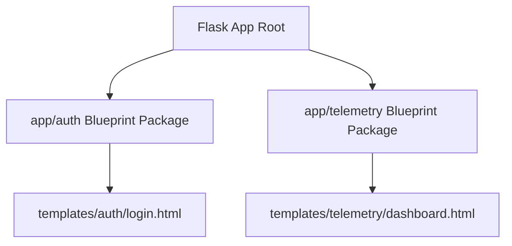

```yaml
schema_version: "2.0"
metadata:
  lesson_id: "FLK-MOD08-LES02"
  course_slug: "course-04-flask"
  course_title: "Course 4: Flask Backend & Microservices"
  module_slug: "mod-08-blueprints-app-structure"
  module_title: "Module 8 - Application Structuring with Blueprints"
  lesson_slug: "modular-directory-structure-and-templates"
  lesson_title: "Lesson 8.2 Modular Directory Structure & Blueprint Templates"
  sort_order: 802

pedagogy:
  difficulty: "intermediate"
  estimated_time:
    reading_minutes: 15
    practice_minutes: 20
    quiz_minutes: 10
    total_minutes: 45
  bloom_taxonomy_level: "Apply"
  xp_reward: 50

prerequisites:
  required_lesson_ids:
    - "FLK-MOD08-LES01"
  required_skills:
    - "Flask Blueprints Architecture & Template Inheritance"

skills_acquired:
  - "Designing Enterprise Modular Flask Directory Layouts"
  - "Configuring Blueprint Template Folders (`template_folder='templates'`)"
  - "Configuring Blueprint Static Folders (`static_folder='static'`)"
  - "Global Application Hooks via `@bp.before_app_request`"

dependencies:
  software:
    - "VS Code"
    - "Python 3.12+"
  hardware: []

seo_and_social:
  meta_title: "Enterprise Flask Project Layout: Modular Directory Structure & Blueprint Assets"
  meta_description: "Master Enterprise Flask Directory Layouts: modular package architecture, configuring blueprint template_folder, static_folder, and @before_app_request middleware hooks."
  keywords: ["Flask Project Structure", "Modular Flask", "template_folder", "static_folder", "before_app_request", "Flask Architecture"]

assessment_config:
  has_quiz: true
  has_lab: true
  has_flashcards: true
  pass_score_percentage: 80
```

# Lesson 8.2 Modular Directory Structure & Blueprint Templates

## 1. Overview & Learning Objectives [id: overview]

- **Estimated Time**: 45 Minutes (15m Reading | 20m Practice | 10m Quiz)
- **Difficulty Level**: ⭐⭐ Intermediate
- **Prerequisites**: [Lesson 8.1 Flask Blueprints](file:///d:/My%20Drive/all%20files/PROJECT%20FILES/notes/docs/curriculum/_04_flask/_04_17_flask_blueprint_architecture.md)
- **XP Reward**: +50 XP

### Learning Objectives
By the end of this lesson, you will be able to:
1. Design an enterprise-grade **Modular Package Layout** for large Flask codebases.
2. Isolate blueprint templates using `template_folder='templates'`.
3. Serve blueprint-specific static assets using `static_folder='static'`.
4. Register application-wide hooks from within blueprints using `@bp.before_app_request`.

---

## 2. Environment & Prerequisites [id: prerequisites]

Open VS Code.

---

## 3. Theoretical Foundations [id: theory]

### 3.1 Enterprise Modular Package Structure
In large enterprise applications, organizing all routes in one directory creates cluttered codebases. A **Modular Package Layout** groups models, views, forms, templates, and static assets inside domain-specific sub-packages (`auth/`, `telemetry/`, `api/`):

```
┌─────────────────────────────────────────────────────────────────────────────┐
│                    ENTERPRISE MODULAR FLASK DIRECTORY                       │
├─────────────────────────────────────────────────────────────────────────────┤
│ my_project/                                                                 │
│ ├── app/                                                                    │
│ │   ├── __init__.py          # Application Factory (create_app)             │
│ │   ├── extensions.py        # Unbound Extensions (db, migrate, login)      │
│ │   ├── auth/                # Auth Blueprint Package                       │
│ │   │   ├── __init__.py                                                     │
│ │   │   ├── routes.py, models.py, forms.py                                  │
│ │   │   └── templates/auth/  # Blueprint-Isolated Templates               │
│ │   └── telemetry/           # Telemetry Blueprint Package                  │
│ │       ├── routes.py, models.py                                            │
│ │       └── templates/telemetry/                                            │
│ ├── config.py                # Environment Configurations                   │
│ └── wsgi.py                  # Production Entrypoint                        │
└─────────────────────────────────────────────────────────────────────────────┘
```

---

## 4. Architecture & Diagram Visualizations [id: diagram]



---

## 5. Code & Hardware Implementation [id: syntax]

### File 1: `app/auth/__init__.py` (Blueprint Package with Isolated Assets)

```python
from flask import Blueprint

# Configure blueprint-specific template and static folders
auth_bp = Blueprint(
    "auth",
    __name__,
    template_folder="templates",
    static_folder="static"
)

# Application-wide hook registered from blueprint
@auth_bp.before_app_request
def check_user_session():
    # Executes before EVERY request across the entire Flask application!
    pass

from app.auth import routes  # Import routes to register handlers on auth_bp
```

### File 2: `app/auth/routes.py`

```python
from flask import render_template
from app.auth import auth_bp

@auth_bp.route("/login")
def login():
    # Explicitly namespace template path to avoid name collisions!
    return render_template("auth/login.html")
```

---

## 6. Enterprise Real-World Applications [id: examples]

- **Microservice Refactoring**: Feature teams develop, test, and maintain their domain blueprints (`billing/`, `analytics/`) independently without code collisions in shared directories.

---

## 7. Guided Step-by-Step Hands-On Exercise [id: exercises]

1. Create modular package folder structure.
2. Register `auth_bp` in application factory $\to$ Render `auth/login.html` to verify template resolution!

---

## 8. Common Pitfalls & Troubleshooting [id: common_mistakes]

| Bug / Error | Root Cause | Engineering Solution |
| :--- | :--- | :--- |
| **Wrong Template Loaded** | Naming templates `templates/login.html` across two different blueprints. | Always namespace blueprint templates into subfolders: `templates/auth/login.html`. |

---

## 9. Best Practices & Optimization [id: best_practices]

- **Namespace Blueprint Templates**: Put templates in `templates/blueprint_name/` to prevent Flask's global template loader from picking the wrong file.

---

## 10. Industry Interview Q&A [id: interview_qa]

### Q1: What is the difference between `@bp.before_request` and `@bp.before_app_request`?
**Answer**: `@bp.before_request` executes a middleware hook *only* before requests routed to endpoints inside that specific blueprint. `@bp.before_app_request` registers a global middleware hook that executes before *all* requests across the entire application regardless of which blueprint handles the route.

---

## 11. Self-Assessment Quiz [id: quiz]

```json
{
  "quiz_title": "Lesson 8.2 Modular Layout Assessment",
  "questions": [
    {
      "question_id": "Q1",
      "type": "multiple_choice",
      "question_text": "Which Blueprint decorator registers a middleware hook that executes before ALL application requests globally?",
      "options": ["@bp.before_request", "@bp.before_app_request", "@bp.global_before", "@bp.middleware"],
      "correct_answer_index": 1,
      "explanation": "@bp.before_app_request registers global application middleware hooks."
    }
  ]
}
```

---

## 12. Portfolio Assignment & Challenge [id: lab]

Re-architect a flat Flask application into an enterprise modular package structure.

---

## 13. Spaced Repetition Flashcards [id: flashcards]

**Front**: Why should templates inside a blueprint be stored in `templates/blueprint_name/`?
**Back**: To prevent template name collisions caused by Flask searching the global template search path.
<!-- flashcard:end -->

---

## 14. Summary & Cheat Sheet [id: summary]

```python
bp = Blueprint("auth", __name__, template_folder="templates")
@bp.before_app_request
def global_hook(): pass
```
