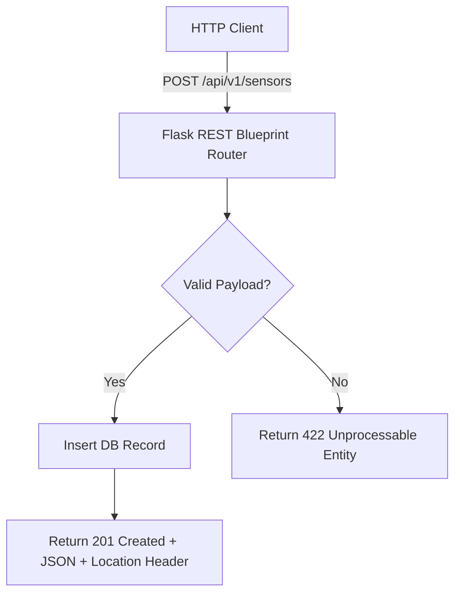

```yaml
schema_version: "2.0"
metadata:
  lesson_id: "FLK-MOD09-LES01"
  course_slug: "course-04-flask"
  course_title: "Course 4: Flask Backend & Microservices"
  module_slug: "mod-09-rest-api-serialization"
  module_title: "Module 9 - REST API Development & Serialization"
  lesson_slug: "restful-api-principles-and-resource-routing"
  lesson_title: "Lesson 9.1 RESTful API Principles & Resource Routing"
  sort_order: 901

pedagogy:
  difficulty: "intermediate"
  estimated_time:
    reading_minutes: 15
    practice_minutes: 20
    quiz_minutes: 10
    total_minutes: 45
  bloom_taxonomy_level: "Apply"
  xp_reward: 50

prerequisites:
  required_lesson_ids:
    - "FLK-MOD08-LES02"
  required_skills:
    - "Flask Blueprints Architecture & Request/Response Objects"

skills_acquired:
  - "REST Architectural Constraints (Statelessness, Nouns, Uniform Interface)"
  - "Designing RESTful Resource Endpoint URLs"
  - "Standard HTTP Method Semantics (GET, POST, PUT, PATCH, DELETE)"
  - "HTTP Status Code Semantics (200, 201, 204, 400, 401, 404, 422, 500)"

dependencies:
  software:
    - "VS Code"
    - "Python 3.12+"
  hardware: []

seo_and_social:
  meta_title: "Flask REST API Design: RESTful Constraints, Resource Endpoints & Status Codes"
  meta_description: "Master Flask REST API Design: RESTful architectural constraints, resource-oriented URI design, HTTP verb semantics, and HTTP status code standards."
  keywords: ["Flask REST API", "RESTful Design", "HTTP Status Codes", "Resource Endpoints", "Stateless API", "Python Microservices"]

assessment_config:
  has_quiz: true
  has_lab: true
  has_flashcards: true
  pass_score_percentage: 80
```

# Lesson 9.1 RESTful API Principles & Resource Routing

## 1. Overview & Learning Objectives [id: overview]

- **Estimated Time**: 45 Minutes (15m Reading | 20m Practice | 10m Quiz)
- **Difficulty Level**: ⭐⭐ Intermediate
- **Prerequisites**: [Lesson 8.2 Modular Layout](file:///d:/My%20Drive/all%20files/PROJECT%20FILES/notes/docs/curriculum/_04_flask/_04_18_modular_directory_structure_and_templates.md)
- **XP Reward**: +50 XP

### Learning Objectives
By the end of this lesson, you will be able to:
1. Apply **REST (Representational State Transfer)** architectural constraints.
2. Design resource-oriented, plural noun URI endpoints (`/api/v1/devices`).
3. Map HTTP verbs (`GET`, `POST`, `PUT`, `PATCH`, `DELETE`) to CRUD resource operations.
4. Return appropriate **HTTP Status Codes** (`200 OK`, `201 Created`, `204 No Content`, `400 Bad Request`, `422 Unprocessable`).

---

## 2. Environment & Prerequisites [id: prerequisites]

Open Python REPL or VS Code.

---

## 3. Theoretical Foundations [id: theory]

### 3.1 REST Architectural Constraints
**REST (Representational State Transfer)** is an architectural style for designing networked web services based on 6 core constraints:
1. **Statelessness**: Every client request must contain all authentication and state information required to fulfill it.
2. **Resource-Oriented URIs**: Endpoints represent nouns (`/sensors`), never actions (`/get_sensors`).
3. **Uniform Interface**: Uses standard HTTP verbs for uniform operations.

```
┌─────────────────────────────────────────────────────────────────────────────┐
│                       RESTFUL RESOURCE HTTP VERB MAPPING                    │
├────────┬────────────────────────────────┬───────────────────────────────────┤
│ Verb   │ URI Endpoint                   │ Action & HTTP Status Code         │
├────────┼────────────────────────────────┼───────────────────────────────────┤
│ `GET`  │ `/api/v1/sensors`              │ List all sensors (200 OK)         │
│ `POST` │ `/api/v1/sensors`              │ Create new sensor (201 Created)   │
│ `GET`  │ `/api/v1/sensors/101`          │ Fetch sensor 101 (200 OK / 404)  │
│ `PUT`  │ `/api/v1/sensors/101`          │ Replace sensor 101 (200 OK)       │
│`DELETE`│ `/api/v1/sensors/101`          │ Delete sensor 101 (204 No Content)│
└────────┴────────────────────────────────┴───────────────────────────────────┘
```

---

## 4. Architecture & Diagram Visualizations [id: diagram]



---

## 5. Code & Hardware Implementation [id: syntax]

```python
# RESTful Resource API Endpoint Blueprint (api_demo.py)
from flask import Flask, Blueprint, jsonify, request

api_v1 = Blueprint("api_v1", __name__, url_prefix="/api/v1")

# Mock In-Memory Resource Datastore
SENSORS_DB = {
    101: {"id": 101, "code": "ESP32-A", "location": "Lab 1"},
    102: {"id": 102, "code": "ESP32-B", "location": "Warehouse"}
}

# 1. Collection Resource: LIST & CREATE
@api_v1.route("/sensors", methods=["GET", "POST"])
def manage_sensors():
    if request.method == "GET":
        return jsonify({"data": list(SENSORS_DB.values()), "count": len(SENSORS_DB)}), 200

    elif request.method == "POST":
        data = request.json or {}
        if "code" not in data or "location" not in data:
            return jsonify({"error": "Missing code or location"}), 422

        new_id = max(SENSORS_DB.keys(), default=100) + 1
        new_sensor = {"id": new_id, "code": data["code"], "location": data["location"]}
        SENSORS_DB[new_id] = new_sensor

        return jsonify({"data": new_sensor}), 201

# 2. Individual Resource: GET, PUT, DELETE
@api_v1.route("/sensors/<int:sensor_id>", methods=["GET", "PUT", "DELETE"])
def sensor_detail(sensor_id):
    sensor = SENSORS_DB.get(sensor_id)
    if not sensor:
        return jsonify({"error": f"Sensor {sensor_id} not found"}), 404

    if request.method == "GET":
        return jsonify({"data": sensor}), 200

    elif request.method == "PUT":
        data = request.json or {}
        sensor["code"] = data.get("code", sensor["code"])
        sensor["location"] = data.get("location", sensor["location"])
        return jsonify({"data": sensor}), 200

    elif request.method == "DELETE":
        del SENSORS_DB[sensor_id]
        return "", 204 # 204 No Content (Empty Response Body!)

app = Flask(__name__)
app.register_blueprint(api_v1)

if __name__ == "__main__":
    app.run(debug=True)
```

---

## 6. Enterprise Real-World Applications [id: examples]

- **Microservice API Architecture**: Public and internal API platforms enforce strict RESTful URL conventions and HTTP status code specifications to enable automated API client SDK code generation.

---

## 7. Guided Step-by-Step Hands-On Exercise [id: exercises]

1. Save code as `api_demo.py`.
2. Send DELETE request via curl: `curl -X DELETE -i http://127.0.0.1:5000/api/v1/sensors/101` $\to$ Observe `HTTP/1.1 204 No Content` response header!

---

## 8. Common Pitfalls & Troubleshooting [id: common_mistakes]

| Bug / Error | Root Cause | Engineering Solution |
| :--- | :--- | :--- |
| **Verb in URI Endpoint** | Naming endpoints `/api/v1/get_sensors` or `/api/v1/deleteSensor`. | Use plural nouns for resources (`/api/v1/sensors`) and express actions via HTTP verbs (`GET`, `DELETE`). |

---

## 9. Best Practices & Optimization [id: best_practices]

- **Return `204 No Content` for Deletions**: A successful DELETE operation should return HTTP status 204 with an empty body.

---

## 10. Industry Interview Q&A [id: interview_qa]

### Q1: What is idempotency in RESTful APIs and which HTTP verbs are idempotent?
**Answer**: An HTTP method is idempotent if executing a request multiple times produces the exact same result on the server state as a single request. `GET`, `PUT`, and `DELETE` are idempotent. `POST` is NOT idempotent because executing it multiple times creates multiple duplicate resources.

---

## 11. Self-Assessment Quiz [id: quiz]

```json
{
  "quiz_title": "Lesson 9.1 RESTful APIs Assessment",
  "questions": [
    {
      "question_id": "Q1",
      "type": "multiple_choice",
      "question_text": "Which HTTP status code should be returned when a POST request successfully creates a new resource?",
      "options": ["200 OK", "201 Created", "204 No Content", "202 Accepted"],
      "correct_answer_index": 1,
      "explanation": "HTTP status 201 Created indicates successful resource creation."
    }
  ]
}
```

---

## 12. Portfolio Assignment & Challenge [id: lab]

Design a RESTful API blueprint for a device inventory resource supporting full CRUD semantics.

---

## 13. Spaced Repetition Flashcards [id: flashcards]

**Front**: Is the HTTP `POST` method idempotent?
**Back**: No. Repeated `POST` requests create multiple distinct resources on the server.
<!-- flashcard:end -->

---

## 14. Summary & Cheat Sheet [id: summary]

```python
@bp.route("/items", methods=["POST"])
def create(): return jsonify(item), 201
```
