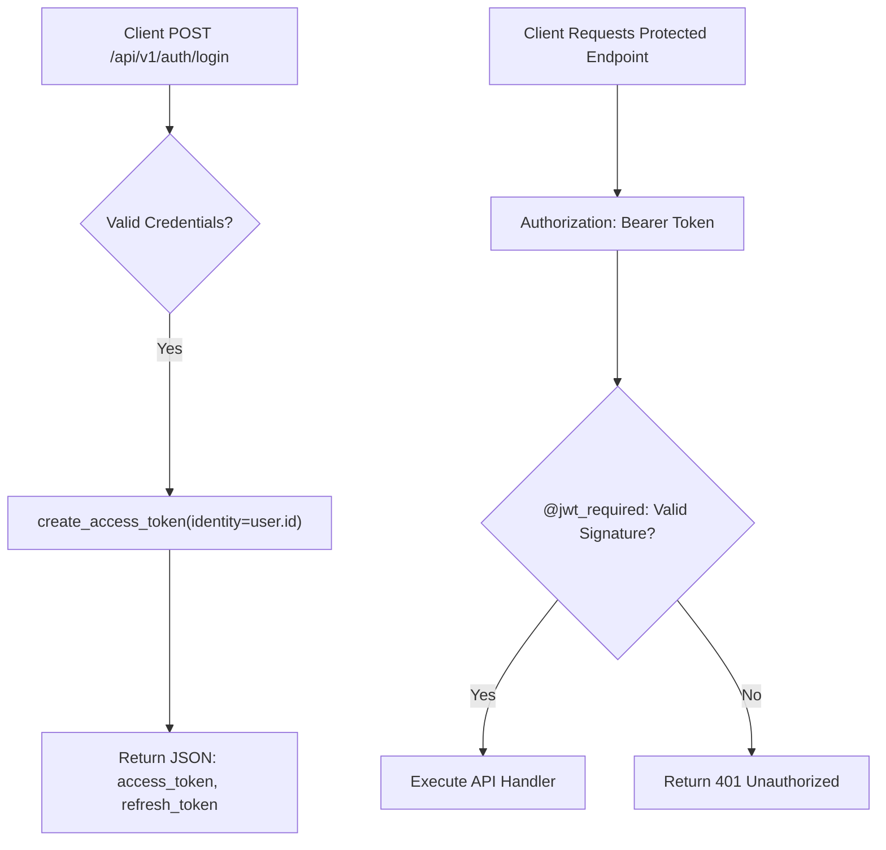

```yaml
schema_version: "2.0"
metadata:
  lesson_id: "FLK-MOD09-LES03"
  course_slug: "course-04-flask"
  course_title: "Course 4: Flask Backend & Microservices"
  module_slug: "mod-09-rest-api-serialization"
  module_title: "Module 9 - REST API Development & Serialization"
  lesson_slug: "jwt-authentication-with-flask-jwt-extended"
  lesson_title: "Lesson 9.3 JWT Authentication with Flask-JWT-Extended"
  sort_order: 903

pedagogy:
  difficulty: "advanced"
  estimated_time:
    reading_minutes: 20
    practice_minutes: 25
    quiz_minutes: 10
    total_minutes: 55
  bloom_taxonomy_level: "Apply"
  xp_reward: 70

prerequisites:
  required_lesson_ids:
    - "FLK-MOD09-LES02"
  required_skills:
    - "Flask RESTful APIs & Password Hashing"

skills_acquired:
  - "JSON Web Token (JWT) Structure (Header, Payload, Signature)"
  - "Integrating Flask-JWT-Extended (`JWTManager`)"
  - "Issuing Access & Refresh Tokens (`create_access_token()`, `create_refresh_token()`)"
  - "Protecting REST Routes (`@jwt_required()`, `get_jwt_identity()`)"

dependencies:
  software:
    - "VS Code"
    - "Python 3.12+"
    - "Flask-JWT-Extended"
  hardware: []

seo_and_social:
  meta_title: "Flask JWT Authentication: Flask-JWT-Extended, create_access_token & jwt_required"
  meta_description: "Master Stateless API Authentication in Flask: JSON Web Tokens (JWT), Flask-JWT-Extended integration, issuing access/refresh tokens, and @jwt_required route protection."
  keywords: ["Flask JWT", "Flask-JWT-Extended", "JSON Web Token", "create_access_token", "jwt_required", "get_jwt_identity", "Stateless API Auth"]

assessment_config:
  has_quiz: true
  has_lab: true
  has_flashcards: true
  pass_score_percentage: 80
```

# Lesson 9.3 JWT Authentication with Flask-JWT-Extended

## 1. Overview & Learning Objectives [id: overview]

- **Estimated Time**: 55 Minutes (20m Reading | 25m Practice | 10m Quiz)
- **Difficulty Level**: ⭐⭐⭐ Advanced
- **Prerequisites**: [Lesson 9.2 API Serialization](file:///d:/My%20Drive/all%20files/PROJECT%20FILES/notes/docs/curriculum/_04_flask/_04_20_api_serialization_with_flask_marshmallow.md)
- **XP Reward**: +70 XP

### Learning Objectives
By the end of this lesson, you will be able to:
1. Explain **Stateless JWT Authentication** architecture (Header.Payload.Signature).
2. Integrate the **Flask-JWT-Extended** extension.
3. Issue Access and Refresh tokens (`create_access_token()`, `create_refresh_token()`).
4. Protect RESTful API endpoints using **`@jwt_required()`** and **`get_jwt_identity()`**.

---

## 2. Environment & Prerequisites [id: prerequisites]

Install `Flask-JWT-Extended`:

```bash
pip install Flask-JWT-Extended
```

---

## 3. Theoretical Foundations [id: theory]

### 3.1 JSON Web Token (JWT) Structure
Session-based authentication (`Flask-Login`) requires maintaining server-side session state. **JWT (JSON Web Token)** provides **stateless** authentication for REST APIs and microservices.

A JWT is a Base64URL-encoded string consisting of 3 parts separated by dots (`Header.Payload.Signature`):
1. **Header**: Specifies the hashing algorithm (e.g. `HS256`).
2. **Payload**: Contains claims (user identity, expiration timestamp `exp`).
3. **Signature**: Cryptographic signature generated using the server's secret key to prevent payload tampering.

```
┌─────────────────────────────────────────────────────────────────────────────┐
│                          JWT AUTHENTICATION FLOW                            │
├─────────────────────────────────────────────────────────────────────────────┤
│ 1. Client POST `/login` ──► Server verifies credentials                     │
│                         ──► Returns JWT Access Token string                 │
│ 2. Client API Request   ──► Sends `Authorization: Bearer <JWT_TOKEN>`       │
│ 3. Server `@jwt_required`──► Cryptographically verifies signature & claims │
└─────────────────────────────────────────────────────────────────────────────┘
```

---

## 4. Architecture & Diagram Visualizations [id: diagram]



---

## 5. Code & Hardware Implementation [id: syntax]

```python
# Flask-JWT-Extended Authentication API (jwt_demo.py)
from datetime import timedelta
from flask import Flask, jsonify, request
from flask_jwt_extended import (
    JWTManager, create_access_token, create_refresh_token,
    jwt_required, get_jwt_identity
)
from werkzeug.security import check_password_hash, generate_password_hash

app = Flask(__name__)
app.config["JWT_SECRET_KEY"] = "jwt-secret-key-super-secure-90210"
app.config["JWT_ACCESS_TOKEN_EXPIRES"] = timedelta(hours=1)
app.config["JWT_REFRESH_TOKEN_EXPIRES"] = timedelta(days=30)

jwt = JWTManager(app)

# Mock Database
USERS_DB = {
    "admin_dev": {
        "id": 101,
        "username": "admin_dev",
        "password_hash": generate_password_hash("SecretPass123")
    }
}

# 1. Login Endpoint issuing JWT Access & Refresh Tokens
@app.route("/api/v1/auth/login", methods=["POST"])
def jwt_login():
    data = request.json or {}
    username = data.get("username")
    password = data.get("password")

    user = USERS_DB.get(username)
    if not user or not check_password_hash(user["password_hash"], password):
        return jsonify({"error": "Invalid username or password"}), 401

    # Issue JWT Tokens with user ID as identity claim
    access_token = create_access_token(identity=user["id"])
    refresh_token = create_refresh_token(identity=user["id"])

    return jsonify({
        "access_token": access_token,
        "refresh_token": refresh_token,
        "token_type": "Bearer"
    }), 200

# 2. Protected REST API Endpoint
@app.route("/api/v1/telemetry/protected", methods=["GET"])
@jwt_required() # Protects endpoint!
def protected_telemetry():
    # Extract identity claim from verified JWT token
    current_user_id = get_jwt_identity()
    return jsonify({
        "status": "AUTHORIZED",
        "user_id": current_user_id,
        "data": "Sensitive IoT Telemetry Stream"
    }), 200

if __name__ == "__main__":
    app.run(debug=True)
```

---

## 6. Enterprise Real-World Applications [id: examples]

- **Single-Page Application & Mobile App Backends**: Flutter mobile apps and React SPAs store JWT access tokens in memory and include `Authorization: Bearer <token>` headers on all API requests.

---

## 7. Guided Step-by-Step Hands-On Exercise [id: exercises]

1. Save code as `jwt_demo.py`.
2. Send POST to `/api/v1/auth/login` to obtain access token string.
3. Send GET to `/api/v1/telemetry/protected` with header `Authorization: Bearer <access_token>` $\to$ Inspect 200 OK authorized response!

---

## 8. Common Pitfalls & Troubleshooting [id: common_mistakes]

| Bug / Error | Root Cause | Engineering Solution |
| :--- | :--- | :--- |
| **`401 Unauthorized: Missing Authorization Header`** | Sending request without the `Authorization` header or omitting the `Bearer ` prefix. | Ensure header is formatted as `Authorization: Bearer <token>`. |

---

## 9. Best Practices & Optimization [id: best_practices]

- **Keep Access Tokens Short-Lived**: Set access token expiration to 15–60 minutes and use refresh tokens for long-lived sessions.

---

## 10. Industry Interview Q&A [id: interview_qa]

### Q1: What is the main structural difference between session-based authentication and JWT authentication?
**Answer**: Session authentication is stateful: the server stores session state in memory or a database and sends a session ID cookie. JWT authentication is stateless: all user identity claims and expiration dates are cryptographically signed inside the token string itself, allowing any server to verify the token without querying a session database.

---

## 11. Self-Assessment Quiz [id: quiz]

```json
{
  "quiz_title": "Lesson 9.3 Flask JWT Assessment",
  "questions": [
    {
      "question_id": "Q1",
      "type": "multiple_choice",
      "question_text": "Which decorator from Flask-JWT-Extended restricts route access to requests with valid JWT tokens?",
      "options": ["@jwt_required()", "@login_required", "@token_auth", "@require_jwt"],
      "correct_answer_index": 0,
      "explanation": "@jwt_required() protects endpoints using JWT tokens."
    }
  ]
}
```

---

## 12. Portfolio Assignment & Challenge [id: lab]

Build a JWT authentication system supporting token refresh endpoints (`/auth/refresh`).

---

## 13. Spaced Repetition Flashcards [id: flashcards]

**Front**: What function extracts the user identity claim from a valid JWT inside a `@jwt_required()` route?
**Back**: `get_jwt_identity()`.
<!-- flashcard:end -->

---

## 14. Summary & Cheat Sheet [id: summary]

```python
token = create_access_token(identity=user_id)
@app.route("/api")
@jwt_required()
def api(): uid = get_jwt_identity()
```
