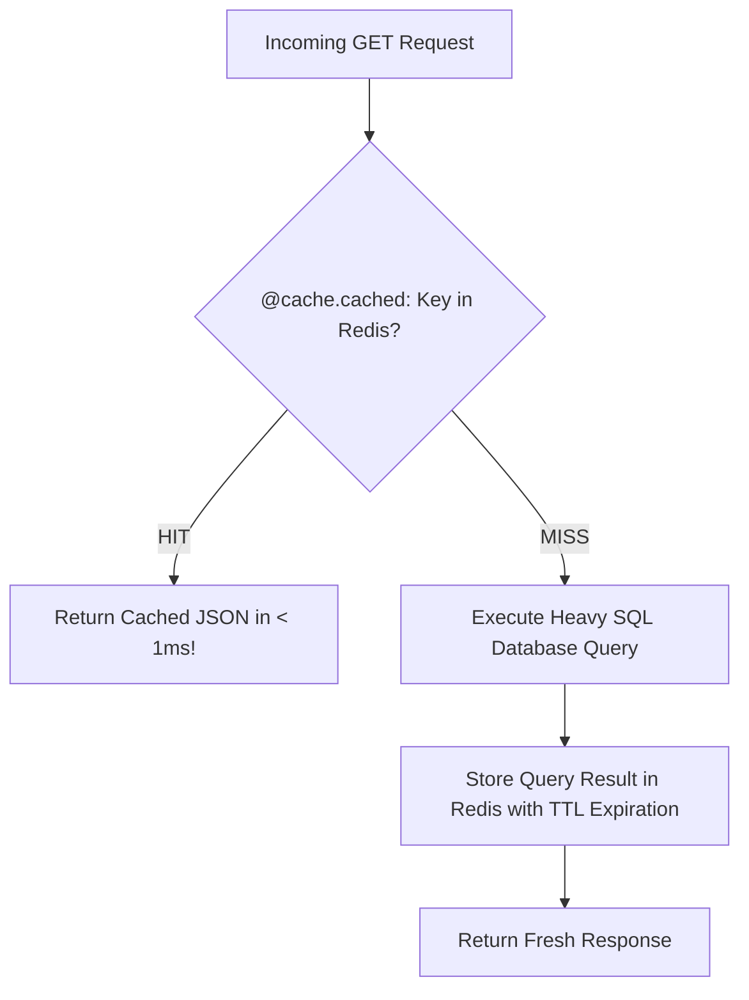

```yaml
schema_version: "2.0"
metadata:
  lesson_id: "FLK-MOD10-LES01"
  course_slug: "course-04-flask"
  course_title: "Course 4: Flask Backend & Microservices"
  module_slug: "mod-10-advanced-extensions-celery"
  module_title: "Module 10 - Advanced Flask Extensions & Background Tasks"
  lesson_slug: "application-caching-with-flask-caching"
  lesson_title: "Lesson 10.1 Application Caching with Flask-Caching & Redis"
  sort_order: 1001

pedagogy:
  difficulty: "intermediate"
  estimated_time:
    reading_minutes: 15
    practice_minutes: 20
    quiz_minutes: 10
    total_minutes: 45
  bloom_taxonomy_level: "Apply"
  xp_reward: 50

prerequisites:
  required_lesson_ids:
    - "FLK-MOD09-LES03"
  required_skills:
    - "Flask Application Factory & RESTful APIs"

skills_acquired:
  - "Integrating Flask-Caching Extension (`Cache(app)`)"
  - "Configuring Cache Backends (SimpleCache, RedisCache, Memcached)"
  - "Caching View Functions (`@cache.cached(timeout=60)`)"
  - "Caching Arbitrary Function Results (`@cache.memoize()`)"
  - "Cache Invalidation & Clearing (`cache.clear()`)"

dependencies:
  software:
    - "VS Code"
    - "Python 3.12+"
    - "Flask-Caching"
    - "redis"
  hardware: []

seo_and_social:
  meta_title: "Flask Caching: Flask-Caching, Redis Backend, @cache.cached & Memoization"
  meta_description: "Master Flask Application Caching: Flask-Caching integration, Redis backend configuration, view caching with @cache.cached, and function memoization with @cache.memoize."
  keywords: ["Flask-Caching", "Redis Cache", "@cache.cached", "Memoization", "@cache.memoize", "Flask Performance", "Backend Caching"]

assessment_config:
  has_quiz: true
  has_lab: true
  has_flashcards: true
  pass_score_percentage: 80
```

# Lesson 10.1 Application Caching with Flask-Caching & Redis

## 1. Overview & Learning Objectives [id: overview]

- **Estimated Time**: 45 Minutes (15m Reading | 20m Practice | 10m Quiz)
- **Difficulty Level**: ⭐⭐ Intermediate
- **Prerequisites**: [Lesson 9.3 JWT Authentication](file:///d:/My%20Drive/all%20files/PROJECT%20FILES/notes/docs/curriculum/_04_flask/_04_21_jwt_authentication_with_flask_jwt_extended.md)
- **XP Reward**: +50 XP

### Learning Objectives
By the end of this lesson, you will be able to:
1. Integrate the **Flask-Caching** extension.
2. Configure caching backends (`SimpleCache`, `RedisCache`).
3. Cache view function HTTP responses using **`@cache.cached()`**.
4. Memoize expensive function calculations based on arguments using **`@cache.memoize()`**.

---

## 2. Environment & Prerequisites [id: prerequisites]

Install `Flask-Caching` and `redis`:

```bash
pip install Flask-Caching redis
```

---

## 3. Theoretical Foundations [id: theory]

### 3.1 Why Backend Caching?
Repeatedly executing expensive SQL database queries or heavy calculations on every HTTP request creates server bottlenecks and high database CPU usage.

**Flask-Caching** intercepts view execution and returns pre-computed responses stored in high-speed in-memory caches (such as **Redis**):

```
┌─────────────────────────────────────────────────────────────────────────────┐
│                          FLASK-CACHING REQUEST FLOW                         │
├─────────────────────────────────────────────────────────────────────────────┤
│ HTTP Request ──► `@cache.cached()` ──► Check Redis Key                     │
│                                        ├── HIT:  Return cached response!    │
│                                        └── MISS: Execute DB Query           │
│                                                  ──► Store result in Redis  │
└─────────────────────────────────────────────────────────────────────────────┘
```

---

## 4. Architecture & Diagram Visualizations [id: diagram]



---

## 5. Code & Hardware Implementation [id: syntax]

```python
# Flask-Caching & Memoization Demonstration (caching_demo.py)
import time
from flask import Flask, jsonify
from flask_caching import Cache

app = Flask(__name__)

# Configure Caching Extension
app.config.update(
    CACHE_TYPE="SimpleCache", # Use 'RedisCache' in production!
    CACHE_DEFAULT_TIMEOUT=60   # Default TTL 60 seconds
)

cache = Cache(app)

# 1. View Function Caching (Caches full HTTP response for 30s)
@app.route("/api/v1/summary")
@cache.cached(timeout=30, query_string=True)
def get_summary():
    time.sleep(2) # Simulate 2-second expensive database calculation!
    return jsonify({
        "status": "COMPUTED",
        "timestamp": time.time(),
        "active_devices": 1024
    })

# 2. Function Memoization (Caches function result based on parameter arguments)
@cache.memoize(timeout=120)
def compute_device_analytics(device_id, metric_type):
    time.sleep(1) # Simulate expensive analytics calculation
    return {"device_id": device_id, "metric": metric_type, "value": 99.4}

@app.route("/api/v1/analytics/<string:device_id>")
def analytics_view(device_id):
    data = compute_device_analytics(device_id, "temperature")
    return jsonify(data)

if __name__ == "__main__":
    app.run(debug=True)
```

---

## 6. Enterprise Real-World Applications [id: examples]

- **High-Traffic Product Catalogs & Leaderboards**: E-commerce platforms cache heavy database catalog queries in Redis, reducing database load by over 90% during flash sales.

---

## 7. Guided Step-by-Step Hands-On Exercise [id: exercises]

1. Save code as `caching_demo.py`.
2. Send 2 consecutive GET requests to `/api/v1/summary` $\to$ Observe 1st request takes 2.0s (MISS) and 2nd request takes 0.002s (HIT)!

---

## 8. Common Pitfalls & Troubleshooting [id: common_mistakes]

| Bug / Error | Root Cause | Engineering Solution |
| :--- | :--- | :--- |
| **Stale Cache Data Returned** | Failing to invalidate or clear the cache after database record updates. | Call `cache.delete_memoized(func)` or `cache.clear()` when updating records. |

---

## 9. Best Practices & Optimization [id: best_practices]

- **Enable `query_string=True`**: Ensures `@cache.cached()` includes URL query parameters (`?page=1`) in the cache key.

---

## 10. Industry Interview Q&A [id: interview_qa]

### Q1: What is the difference between `@cache.cached()` and `@cache.memoize()` in Flask-Caching?
**Answer**: `@cache.cached()` caches the entire HTTP response of a view function based on the request URL path. `@cache.memoize()` caches the return value of an arbitrary Python function based on the specific arguments passed into the function call.

---

## 11. Self-Assessment Quiz [id: quiz]

```json
{
  "quiz_title": "Lesson 10.1 Flask-Caching Assessment",
  "questions": [
    {
      "question_id": "Q1",
      "type": "multiple_choice",
      "question_text": "Which Flask-Caching decorator caches a function's return value based on the arguments passed into it?",
      "options": ["@cache.cached()", "@cache.memoize()", "@cache.store()", "@cache.save()"],
      "correct_answer_index": 1,
      "explanation": "@cache.memoize() caches function results based on arguments."
    }
  ]
}
```

---

## 12. Portfolio Assignment & Challenge [id: lab]

Cache an expensive telemetry statistics API route using RedisCache and custom TTLs.

---

## 13. Spaced Repetition Flashcards [id: flashcards]

**Front**: What method clears all cached keys in Flask-Caching?
**Back**: `cache.clear()`.
<!-- flashcard:end -->

---

## 14. Summary & Cheat Sheet [id: summary]

```python
@app.route("/data")
@cache.cached(timeout=60)
def data(): return jsonify(result)
```
