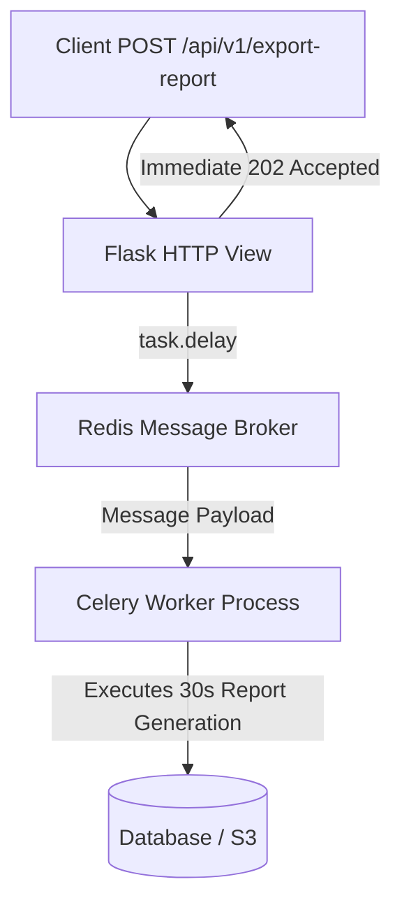

```yaml
schema_version: "2.0"
metadata:
  lesson_id: "FLK-MOD10-LES02"
  course_slug: "course-04-flask"
  course_title: "Course 4: Flask Backend & Microservices"
  module_slug: "mod-10-advanced-extensions-celery"
  module_title: "Module 10 - Advanced Flask Extensions & Background Tasks"
  lesson_slug: "asynchronous-background-tasks-with-celery"
  lesson_title: "Lesson 10.2 Asynchronous Background Tasks with Celery & Redis"
  sort_order: 1002

pedagogy:
  difficulty: "advanced"
  estimated_time:
    reading_minutes: 20
    practice_minutes: 25
    quiz_minutes: 10
    total_minutes: 55
  bloom_taxonomy_level: "Apply"
  xp_reward: 70

prerequisites:
  required_lesson_ids:
    - "FLK-MOD10-LES01"
  required_skills:
    - "Flask Application Factory & Redis Caching Basics"

skills_acquired:
  - "Asynchronous Task Queue Architecture (Celery + Redis Broker)"
  - "Configuring Celery with Flask Application Context"
  - "Defining Celery Tasks (`@shared_task`, `@celery.task`)"
  - "Dispatching Asynchronous Tasks via `task.delay()`"
  - "Querying Task Status using `AsyncResult`"

dependencies:
  software:
    - "VS Code"
    - "Python 3.12+"
    - "Celery"
    - "Redis"
  hardware: []

seo_and_social:
  meta_title: "Flask Celery Background Tasks: Redis Broker, task.delay() & AsyncResult"
  meta_description: "Master Asynchronous Background Tasks in Flask: Celery task queue integration, Redis message broker, task.delay() dispatching, and AsyncResult status tracking."
  keywords: ["Flask Celery", "Celery Task Queue", "Redis Broker", "task.delay()", "AsyncResult", "Background Processing", "Python Celery"]

assessment_config:
  has_quiz: true
  has_lab: true
  has_flashcards: true
  pass_score_percentage: 80
```

# Lesson 10.2 Asynchronous Background Tasks with Celery & Redis

## 1. Overview & Learning Objectives [id: overview]

- **Estimated Time**: 55 Minutes (20m Reading | 25m Practice | 10m Quiz)
- **Difficulty Level**: ⭐⭐⭐ Advanced
- **Prerequisites**: [Lesson 10.1 Application Caching](file:///d:/My%20Drive/all%20files/PROJECT%20FILES/notes/docs/curriculum/_04_flask/_04_22_application_caching_with_flask_caching.md)
- **XP Reward**: +70 XP

### Learning Objectives
By the end of this lesson, you will be able to:
1. Explain the **Distributed Task Queue** architecture using **Celery** and **Redis**.
2. Integrate Celery with Flask's Application Factory and Application Context.
3. Offload long-running tasks (report generation, batch data processing) using `task.delay()`.
4. Monitor task execution status and retrieve results using `AsyncResult`.

---

## 2. Environment & Prerequisites [id: prerequisites]

Install `celery` and `redis`:

```bash
pip install celery redis
```

---

## 3. Theoretical Foundations [id: theory]

### 3.1 Why Asynchronous Background Tasks?
Performing heavy operations (generating PDF reports, processing video uploads, executing batch database updates) directly inside an HTTP view function blocks the web server worker thread and causes browser gateway timeouts (`HTTP 504`).

**Celery** offloads heavy operations to independent background worker processes using a message broker like **Redis**:

```
┌─────────────────────────────────────────────────────────────────────────────┐
│                          CELERY TASK QUEUE ARCHITECTURE                     │
├─────────────────────────────────────────────────────────────────────────────┤
│ Flask App View ──► `task.delay(args)` ──► Pushes Message to Redis Queue     │
│ HTTP Response  ◄── Returns 202 Accepted (Instant response to client!)       │
│                                                                             │
│ Background Worker Process ◄── Pulls Task from Redis ──► Executes Heavy Work │
└─────────────────────────────────────────────────────────────────────────────┘
```

---

## 4. Architecture & Diagram Visualizations [id: diagram]



---

## 5. Code & Hardware Implementation [id: syntax]

### File 1: `celery_app.py` (Celery Integration Helper)

```python
from celery import Celery, Task

def celery_init_app(app):
    class FlaskTask(Task):
        def __call__(self, *args, **kwargs):
            # Wraps every Celery task inside Flask's app.app_context()!
            with app.app_context():
                return self.run(*args, **kwargs)

    celery_app = Celery(app.name, task_cls=FlaskTask)
    celery_app.config_from_object(app.config["CELERY"])
    celery_app.set_default()
    app.extensions["celery"] = celery_app
    return celery_app
```

### File 2: `tasks.py` (Celery Tasks)

```python
import time
from celery import shared_task

@shared_task(ignore_result=False)
def generate_telemetry_report(device_id):
    print(f"[Celery Worker]: Generating heavy PDF report for Device {device_id}...")
    time.sleep(10) # Simulate 10-second heavy report generation!
    return {"status": "COMPLETE", "device_id": device_id, "file_path": f"/exports/report_{device_id}.pdf"}
```

### File 3: `app.py` (Dispatching Tasks & Checking Status)

```python
from flask import Flask, jsonify
from celery_app import celery_init_app
from celery.result import AsyncResult
from tasks import generate_telemetry_report

app = Flask(__name__)
app.config.from_mapping(
    CELERY=dict(
        broker_url="redis://localhost:6379/0",
        result_backend="redis://localhost:6379/0",
        task_ignore_result=False,
    )
)
celery_app = celery_init_app(app)

# 1. Dispatch Asynchronous Task
@app.route("/api/v1/reports/<string:device_id>", methods=["POST"])
def trigger_report(device_id):
    # task.delay() sends task to Redis and returns IMMEDIATELY!
    task = generate_telemetry_report.delay(device_id)
    return jsonify({"task_id": task.id, "status": "QUEUED"}), 202

# 2. Check Task Status Endpoint
@app.route("/api/v1/tasks/<string:task_id>", methods=["GET"])
def get_task_status(task_id):
    result = AsyncResult(task_id)
    return jsonify({
        "task_id": task_id,
        "state": result.state, # PENDING, SUCCESS, FAILURE
        "result": result.result if result.ready() else None
    })
```

---

## 6. Enterprise Real-World Applications [id: examples]

- **Enterprise Analytics & Export Engines**: E-commerce platforms dispatch Celery tasks to compile monthly CSV/PDF financial invoices, emailing download links to users upon completion.

---

## 7. Guided Step-by-Step Hands-On Exercise [id: exercises]

1. Start Redis server: `redis-server`.
2. Start Celery worker: `celery -A app.celery_app worker --loglevel=info`.
3. Send POST to `/api/v1/reports/ESP32-1` $\to$ Observe instant HTTP 202 response and background worker terminal logs!

---

## 8. Common Pitfalls & Troubleshooting [id: common_mistakes]

| Bug / Error | Root Cause | Engineering Solution |
| :--- | :--- | :--- |
| **`Working outside of application context` in Celery** | Accessing SQLAlchemy database models inside a Celery task without pushing Flask's application context. | Wrap task execution inside `with app.app_context():` using a custom task class. |

---

## 9. Best Practices & Optimization [id: best_practices]

- **Always Return HTTP 202 Accepted**: When offloading background work, return status 202 with a `task_id` so clients can poll for status updates.

---

## 10. Industry Interview Q&A [id: interview_qa]

### Q1: Why is Celery used with Flask instead of Python's built-in `threading` module?
**Answer**: Python's `threading` module runs within the same process and memory space as the web server, making it vulnerable to process crashes and GIL (Global Interpreter Lock) performance limits. Celery runs on independent, dedicated worker OS processes managed across distributed message queues (Redis/RabbitMQ), providing true parallelism, task retries, persistence, and horizontal scaling.

---

## 11. Self-Assessment Quiz [id: quiz]

```json
{
  "quiz_title": "Lesson 10.2 Celery Assessment",
  "questions": [
    {
      "question_id": "Q1",
      "type": "multiple_choice",
      "question_text": "Which Celery method dispatches a background task to the Redis message queue asynchronously?",
      "options": ["task.run()", "task.delay()", "task.dispatch()", "task.execute()"],
      "correct_answer_index": 1,
      "explanation": "task.delay() dispatches tasks asynchronously."
    }
  ]
}
```

---

## 12. Portfolio Assignment & Challenge [id: lab]

Build an asynchronous batch data processing pipeline using Celery and Redis.

---

## 13. Spaced Repetition Flashcards [id: flashcards]

**Front**: What Celery class inspects the status of an asynchronous background task by ID?
**Back**: `AsyncResult(task_id)`.
<!-- flashcard:end -->

---

## 14. Summary & Cheat Sheet [id: summary]

```python
task = my_task.delay(arg)
res = AsyncResult(task.id)
```
