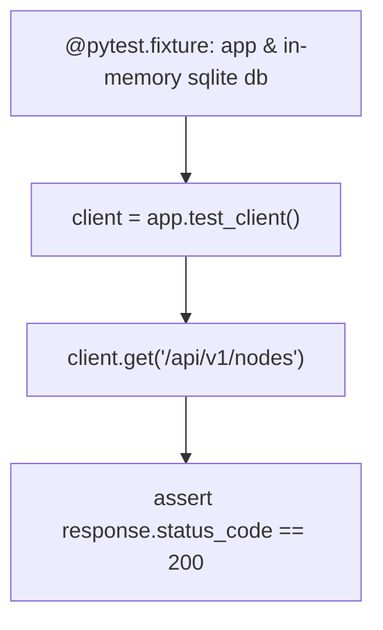

```yaml
schema_version: "2.0"
metadata:
  lesson_id: "FLK-MOD12-LES01"
  course_slug: "course-04-flask"
  course_title: "Course 4: Flask Backend & Microservices"
  module_slug: "mod-12-testing-production-deployment"
  module_title: "Module 12 - Testing & Production Deployment"
  lesson_slug: "automated-testing-with-pytest"
  lesson_title: "Lesson 12.1 Automated Testing with Pytest & Test Client"
  sort_order: 1201

pedagogy:
  difficulty: "intermediate"
  estimated_time:
    reading_minutes: 20
    practice_minutes: 25
    quiz_minutes: 10
    total_minutes: 55
  bloom_taxonomy_level: "Apply"
  xp_reward: 60

prerequisites:
  required_lesson_ids:
    - "FLK-MOD11-LES02"
  required_skills:
    - "Flask Application Factory & Pytest Basics"

skills_acquired:
  - "Setting up Pytest Fixtures for Flask (`@pytest.fixture`)"
  - "Utilizing Flask Test Client (`app.test_client()`)"
  - "In-Memory Database Testing with SQLite"
  - "Testing REST API Endpoints & Asserting JSON Responses"

dependencies:
  software:
    - "VS Code"
    - "Python 3.12+"
    - "pytest"
  hardware: []

seo_and_social:
  meta_title: "Flask Testing with Pytest: app.test_client, Fixtures & REST API Assertions"
  meta_description: "Master Automated Testing in Flask: pytest fixtures, app.test_client(), in-memory SQLite testing databases, and asserting JSON REST API status codes."
  keywords: ["Flask Testing", "pytest Flask", "app.test_client()", "pytest Fixtures", "In-Memory Database Test", "Python API Testing"]

assessment_config:
  has_quiz: true
  has_lab: true
  has_flashcards: true
  pass_score_percentage: 80
```

# Lesson 12.1 Automated Testing with Pytest & Test Client

## 1. Overview & Learning Objectives [id: overview]

- **Estimated Time**: 55 Minutes (20m Reading | 25m Practice | 10m Quiz)
- **Difficulty Level**: ⭐⭐ Intermediate
- **Prerequisites**: [Lesson 11.2 Application Logging](file:///d:/My%20Drive/all%20files/PROJECT%20FILES/notes/docs/curriculum/_04_flask/_04_26_application_logging_and_sentry.md)
- **XP Reward**: +60 XP

### Learning Objectives
By the end of this lesson, you will be able to:
1. Configure **Pytest** test suites for Flask applications.
2. Build reusable test fixtures for app instances and database sessions.
3. Simulate HTTP requests using Flask's **`app.test_client()`**.
4. Test REST API endpoints and assert status codes, headers, and JSON responses.

---

## 2. Environment & Prerequisites [id: prerequisites]

Install `pytest`:

```bash
pip install pytest
```

---

## 3. Theoretical Foundations [id: theory]

### 3.1 Flask `test_client()` Architecture
Testing Flask applications does **NOT** require launching an actual HTTP web server process. Flask provides a built-in **`test_client()`** that simulates WSGI HTTP requests directly in memory, executing view functions and returning full response objects with status codes and JSON payloads fast.

```
┌─────────────────────────────────────────────────────────────────────────────┐
│                         FLASK TEST CLIENT ARCHITECTURE                      │
├─────────────────────────────────────────────────────────────────────────────┤
│ Pytest Suite ──► `client.get('/api/v1/sensors')` (In-Memory WSGI Request)   │
│                                    │                                        │
│                                    ▼                                        │
│ Executes Application View ──► Returns `response.status_code`, `json`        │
│ Asserts `response.status_code == 200` & `response.json["count"] == 2`      │
└─────────────────────────────────────────────────────────────────────────────┘
```

---

## 4. Architecture & Diagram Visualizations [id: diagram]



---

## 5. Code & Hardware Implementation [id: syntax]

### File 1: `conftest.py` (Pytest Shared Fixtures)

```python
import pytest
from app import create_app
from extensions import db
from models import DeviceNode

@pytest.fixture
def app():
    # Configure app for testing mode using in-memory SQLite database!
    app = create_app()
    app.config.update({
        "TESTING": True,
        "SQLALCHEMY_DATABASE_URI": "sqlite:///:memory:"
    })

    with app.app_context():
        db.create_all()
        # Seed test data
        node = DeviceNode(node_code="TEST-NODE-01", location="Test Lab")
        db.session.add(node)
        db.session.commit()

        yield app

        db.session.remove()
        db.drop_all()

@pytest.fixture
def client(app):
    return app.test_client()
```

### File 2: `test_api.py` (Pytest Test Cases)

```python
def test_get_nodes(client):
    # Simulate GET request using test client
    response = client.get("/api/v1/nodes")
    
    assert response.status_code == 200
    data = response.get_json()
    assert len(data) == 1
    assert data[0]["node_code"] == "TEST-NODE-01"

def test_create_node_success(client):
    payload = {"node_code": "NEW-NODE-02", "location": "Warehouse"}
    
    # Simulate POST request sending JSON payload
    response = client.post("/api/v1/nodes", json=payload)
    
    assert response.status_code == 201
    assert response.get_json()["message"] == "Node created"

def test_create_node_missing_fields(client):
    payload = {"location": "Incomplete"}
    response = client.post("/api/v1/nodes", json=payload)
    
    assert response.status_code == 400
```

---

## 6. Enterprise Real-World Applications [id: examples]

- **Continuous Integration (CI) Pipelines**: GitHub Actions and GitLab CI run `pytest` test suites automatically on every pull request to verify that new code additions do not break existing REST API endpoints.

---

## 7. Guided Step-by-Step Hands-On Exercise [id: exercises]

1. Save `conftest.py` and `test_api.py`.
2. Run `pytest` in terminal $\to$ Observe 3 passed test cases in < 0.5s!

---

## 8. Common Pitfalls & Troubleshooting [id: common_mistakes]

| Bug / Error | Root Cause | Engineering Solution |
| :--- | :--- | :--- |
| **Tests Leak State Across Runs** | Sharing a physical disk database file across multiple test runs. | Always use `sqlite:///:memory:` for fast, isolated, ephemeral test databases. |

---

## 9. Best Practices & Optimization [id: best_practices]

- **Use In-Memory SQLite (`sqlite:///:memory:`)**: Speeds up test suite execution dramatically while isolating state between tests.

---

## 10. Industry Interview Q&A [id: interview_qa]

### Q1: How does Flask's `app.test_client()` work and why is it preferred over HTTP requests library like `requests` during unit testing?
**Answer**: `app.test_client()` simulates WSGI HTTP requests directly in-memory within the Python process without opening network sockets or starting a web server. It executes view handlers rapidly, provides direct access to context objects, and allows mocking database dependencies effortlessly.

---

## 11. Self-Assessment Quiz [id: quiz]

```json
{
  "quiz_title": "Lesson 12.1 Testing Assessment",
  "questions": [
    {
      "question_id": "Q1",
      "type": "multiple_choice",
      "question_text": "Which Flask method creates an in-memory test client for simulating HTTP requests?",
      "options": ["app.test_client()", "app.get_client()", "app.mock_request()", "app.client()"],
      "correct_answer_index": 0,
      "explanation": "app.test_client() returns a test client instance."
    }
  ]
}
```

---

## 12. Portfolio Assignment & Challenge [id: lab]

Write a complete Pytest test suite covering GET, POST, and DELETE REST endpoints.

---

## 13. Spaced Repetition Flashcards [id: flashcards]

**Front**: What SQLite database URI creates an ephemeral in-memory database for testing?
**Back**: `sqlite:///:memory:`.
<!-- flashcard:end -->

---

## 14. Summary & Cheat Sheet [id: summary]

```python
client = app.test_client()
res = client.get("/api/v1/nodes")
assert res.status_code == 200
```
