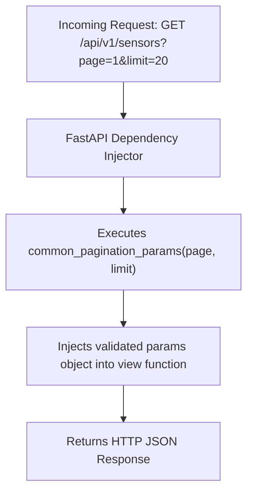

```yaml
schema_version: "2.0"
metadata:
  lesson_id: "FAP-MOD03-LES01"
  course_slug: "course-05-fastapi"
  course_title: "Course 5: FastAPI High-Performance Microservices"
  module_slug: "mod-03-dependency-injection"
  module_title: "Module 3 - Dependency Injection System"
  lesson_slug: "dependency-injection-architecture-and-depends"
  lesson_title: "Lesson 3.1 Dependency Injection Architecture & Depends()"
  sort_order: 301

pedagogy:
  difficulty: "intermediate"
  estimated_time:
    reading_minutes: 15
    practice_minutes: 20
    quiz_minutes: 10
    total_minutes: 45
  bloom_taxonomy_level: "Apply"
  xp_reward: 50

prerequisites:
  required_lesson_ids:
    - "FAP-MOD02-LES02"
  required_skills:
    - "FastAPI Parameters & Pydantic Models"

skills_acquired:
  - "Understanding Dependency Injection (DI) Concepts in Web Frameworks"
  - "Declaring Reusable Callable Dependencies using `Depends()`"
  - "Class-Based Dependencies as Callable Objects"
  - "Eliminating Code Duplication across Route Handlers"

dependencies:
  software:
    - "VS Code"
    - "Python 3.12+"
    - "fastapi"
  hardware: []

seo_and_social:
  meta_title: "FastAPI Dependency Injection: Depends(), Callable Dependencies & Class Dependencies"
  meta_description: "Master FastAPI Dependency Injection: Depends() helper, function dependencies, class-based dependencies, sharing query logic, and DRY code design."
  keywords: ["FastAPI Dependency Injection", "Depends()", "FastAPI Depends", "Class Dependencies", "Reusable Query Logic", "DRY Code"]

assessment_config:
  has_quiz: true
  has_lab: true
  has_flashcards: true
  pass_score_percentage: 80
```

# Lesson 3.1 Dependency Injection Architecture & `Depends()`

## 1. Overview & Learning Objectives [id: overview]

- **Estimated Time**: 45 Minutes (15m Reading | 20m Practice | 10m Quiz)
- **Difficulty Level**: ⭐⭐ Intermediate
- **Prerequisites**: [Lesson 2.2 Pydantic v2](file:///d:/My%20Drive/all%20files/PROJECT%20FILES/notes/docs/curriculum/_05_fastapi/_05_04_pydantic_v2_models_and_schema_validation.md)
- **XP Reward**: +50 XP

### Learning Objectives
By the end of this lesson, you will be able to:
1. Explain **Dependency Injection (DI)** design patterns in web microservices.
2. Declare reusable function dependencies using **`Depends()`**.
3. Implement class-based callable dependencies.
4. Share query parameter parsing, database sessions, and authentication logic across multiple routes.

---

## 2. Environment & Prerequisites [id: prerequisites]

Open Python REPL or VS Code.

---

## 3. Theoretical Foundations [id: theory]

### 3.1 What is Dependency Injection?
In software engineering, **Dependency Injection (DI)** is a design pattern where an object or function receives other objects it needs (dependencies) from an external injector rather than instantiating them internally.

FastAPI features a built-in Dependency Injection system powered by **`Depends()`**. It automatically manages dependency instantiation, parameters, sub-dependencies, and scope cleanup for every HTTP request:

```
┌─────────────────────────────────────────────────────────────────────────────┐
│                   FASTAPI DEPENDENCY INJECTION LIFECYCLE                    │
├─────────────────────────────────────────────────────────────────────────────┤
│ HTTP Request ──► FastAPI detects `params: CommonParams = Depends()`         │
│              ──► Executes `CommonParams(page=1, limit=10)`                  │
│              ──► Injects validated `params` object into view function      │
└─────────────────────────────────────────────────────────────────────────────┘
```

---

## 4. Architecture & Diagram Visualizations [id: diagram]



---

## 5. Code & Hardware Implementation [id: syntax]

```python
# FastAPI Dependency Injection (depends_demo.py)
from fastapi import FastAPI, Depends, Query

app = FastAPI(title="Dependency Injection API")

# 1. Function Dependency for Shared Pagination Parameters
def common_pagination_params(
    page: int = Query(default=1, ge=1),
    limit: int = Query(default=10, ge=1, le=100)
):
    skip = (page - 1) * limit
    return {"page": page, "limit": limit, "skip": skip}

# 2. Class-Based Dependency
class TelemetryFilter:
    def __init__(
        self,
        min_temp: float | None = Query(default=None),
        max_temp: float | None = Query(default=None)
    ):
        self.min_temp = min_temp
        self.max_temp = max_temp

# Route 1: Using Function Dependency
@app.get("/api/v1/sensors")
def list_sensors(pagination: dict = Depends(common_pagination_params)):
    return {
        "page": pagination["page"],
        "limit": pagination["limit"],
        "skip": pagination["skip"],
        "data": ["ESP32-A", "ESP32-B"]
    }

# Route 2: Using Class-Based Dependency (Shortened Depends() syntax!)
@app.get("/api/v1/telemetry")
def filter_telemetry(
    pagination: dict = Depends(common_pagination_params),
    filters: TelemetryFilter = Depends() # Automatically infers TelemetryFilter!
):
    return {
        "pagination": pagination,
        "filters": {"min_temp": filters.min_temp, "max_temp": filters.max_temp}
    }
```

---

## 6. Enterprise Real-World Applications [id: examples]

- **Shared Authorization & Database Contexts**: Enterprise FastAPI applications use `Depends()` to extract JWT authorization headers and inject active database connections across hundreds of API endpoints seamlessly.

---

## 7. Guided Step-by-Step Hands-On Exercise [id: exercises]

1. Save code as `depends_demo.py`.
2. Run `uvicorn depends_demo:app --reload`.
3. Navigate to `/api/v1/telemetry?page=2&limit=5&min_temp=20.0` $\to$ Inspect injected pagination and filter dictionary output!

---

## 8. Common Pitfalls & Troubleshooting [id: common_mistakes]

| Bug / Error | Root Cause | Engineering Solution |
| :--- | :--- | :--- |
| **`Depends()` Called Manually** | Calling `common_pagination_params()` manually inside view body instead of `Depends(common_pagination_params)` in function signature. | Pass the function reference into `Depends()` inside function arguments. |

---

## 9. Best Practices & Optimization [id: best_practices]

- **Use `Depends()` without Arguments for Classes**: When type-annotating with a class (`filters: TelemetryFilter = Depends()`), omit the class reference inside `Depends()`.

---

## 10. Industry Interview Q&A [id: interview_qa]

### Q1: What are the main benefits of FastAPI's Dependency Injection system over traditional middleware?
**Answer**: FastAPI's Dependency Injection system works at the specific endpoint level rather than global HTTP request level. Dependencies can take parameters, leverage OpenAPI documentation automatically, declare sub-dependencies, yield cleanup resources after request completion, and be easily mocked out during unit testing with `app.dependency_overrides`.

---

## 11. Self-Assessment Quiz [id: quiz]

```json
{
  "quiz_title": "Lesson 3.1 Dependency Injection Assessment",
  "questions": [
    {
      "question_id": "Q1",
      "type": "multiple_choice",
      "question_text": "Which FastAPI helper function injects reusable dependencies into route handler parameters?",
      "options": ["Inject()", "Depends()", "Use()", "Require()"],
      "correct_answer_index": 1,
      "explanation": "Depends() handles dependency injection."
    }
  ]
}
```

---

## 12. Portfolio Assignment & Challenge [id: lab]

Build a class-based dependency parsing header authentication tokens.

---

## 13. Spaced Repetition Flashcards [id: flashcards]

**Front**: How do you declare a reusable dependency function in FastAPI?
**Back**: Pass the function to `Depends()` inside route argument signatures (e.g. `param: dict = Depends(my_dep)`).
<!-- flashcard:end -->

---

## 14. Summary & Cheat Sheet [id: summary]

```python
def get_db(): return DB()
@app.get("/items")
def items(db: DB = Depends(get_db)): return db.query()
```
