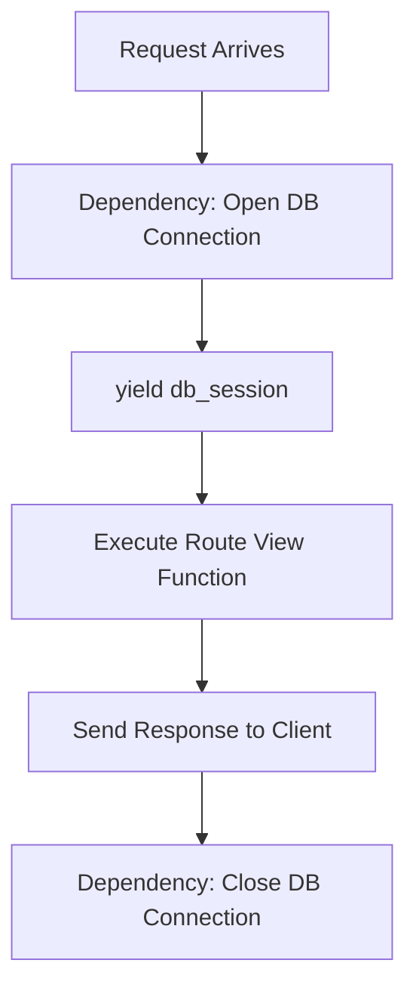

```yaml
schema_version: "2.0"
metadata:
  lesson_id: "FAP-MOD03-LES02"
  course_slug: "course-05-fastapi"
  course_title: "Course 5: FastAPI High-Performance Microservices"
  module_slug: "mod-03-dependency-injection"
  module_title: "Module 3 - Dependency Injection System"
  lesson_slug: "sub-dependencies-security-and-yield-cleanups"
  lesson_title: "Lesson 3.2 Sub-Dependencies, Security Dependencies, & Yield Cleanups"
  sort_order: 302

pedagogy:
  difficulty: "intermediate"
  estimated_time:
    reading_minutes: 15
    practice_minutes: 20
    quiz_minutes: 10
    total_minutes: 45
  bloom_taxonomy_level: "Apply"
  xp_reward: 50

prerequisites:
  required_lesson_ids:
    - "FAP-MOD03-LES01"
  required_skills:
    - "FastAPI Dependency Injection & Depends() Basics"

skills_acquired:
  - "Building Hierarchical Sub-Dependency Trees"
  - "Resource Cleanup with Yield Dependencies (`yield`)"
  - "Global Router Dependencies (`dependencies=[Depends(...)]`)"
  - "Overriding Dependencies during Unit Testing (`app.dependency_overrides`)"

dependencies:
  software:
    - "VS Code"
    - "Python 3.12+"
    - "fastapi"
  hardware: []

seo_and_social:
  meta_title: "Advanced FastAPI Dependencies: Sub-dependencies, Yield Cleanups & Overrides"
  meta_description: "Master Advanced FastAPI Dependency Injection: hierarchical sub-dependencies, yield dependencies for context cleanup, router dependencies, and dependency_overrides."
  keywords: ["FastAPI Yield Dependency", "Sub-dependencies", "dependency_overrides", "FastAPI Security", "Resource Cleanup", "Router Dependencies"]

assessment_config:
  has_quiz: true
  has_lab: true
  has_flashcards: true
  pass_score_percentage: 80
```

# Lesson 3.2 Sub-Dependencies, Security Dependencies, & Yield Cleanups

## 1. Overview & Learning Objectives [id: overview]

- **Estimated Time**: 45 Minutes (15m Reading | 20m Practice | 10m Quiz)
- **Difficulty Level**: ⭐⭐ Intermediate
- **Prerequisites**: [Lesson 3.1 Dependency Injection](file:///d:/My%20Drive/all%20files/PROJECT%20FILES/notes/docs/curriculum/_05_fastapi/_05_05_dependency_injection_architecture_and_depends.md)
- **XP Reward**: +50 XP

### Learning Objectives
By the end of this lesson, you will be able to:
1. Construct hierarchical **Sub-Dependency** trees.
2. Implement automatic database resource teardown using **Yield Dependencies (`yield`)**.
3. Enforce global authentication rules using **Router Dependencies**.
4. Mock dependencies during unit testing using **`app.dependency_overrides`**.

---

## 2. Environment & Prerequisites [id: prerequisites]

Open Python REPL or VS Code.

---

## 3. Theoretical Foundations [id: theory]

### 3.1 Yield Dependencies & Context Cleanup
When a dependency manages external resources (database connections, network sockets, open file handles), it needs to clean up after the HTTP request finishes.

Using Python's **`yield`** keyword inside a dependency function splits execution into two phases:
1. Everything before `yield` executes **BEFORE** the view function runs.
2. Everything after `yield` executes **AFTER** the HTTP response is sent to the client.

```
┌─────────────────────────────────────────────────────────────────────────────┐
│                       YIELD DEPENDENCY EXECUTION PHASES                     │
├─────────────────────────────────────────────────────────────────────────────┤
│ 1. Code before `yield`: Opens DB Socket ──► Injects Session into View      │
│ 2. View Function executes & returns HTTP Response to Client                 │
│ 3. Code after `yield`: Closes DB Socket safely (`db.close()`)              │
└─────────────────────────────────────────────────────────────────────────────┘
```

---

## 4. Architecture & Diagram Visualizations [id: diagram]



---

## 5. Code & Hardware Implementation [id: syntax]

```python
# Advanced Dependencies & Yield Teardown (advanced_deps_demo.py)
from typing import Generator
from fastapi import FastAPI, Depends, Header, HTTPException, status

app = FastAPI(title="Advanced Dependencies API")

# 1. Base Security Dependency: Extract Token Header
def get_auth_header(authorization: str = Header(...)) -> str:
    if not authorization.startswith("Bearer "):
        raise HTTPException(
            status_code=status.HTTP_401_UNAUTHORIZED,
            detail="Invalid Authorization header format"
        )
    return authorization.split(" ")[1]

# 2. Sub-Dependency: Validates Token using output of get_auth_header!
def get_current_user(token: str = Depends(get_auth_header)) -> dict:
    if token != "SECRET_ACCESS_TOKEN":
        raise HTTPException(
            status_code=status.HTTP_401_UNAUTHORIZED,
            detail="Invalid or expired access token"
        )
    return {"user_id": 101, "username": "operator_admin", "role": "ADMIN"}

# 3. Yield Dependency for Resource Teardown
def get_db_session() -> Generator[str, None, None]:
    print("[DB Session]: Opening database connection socket...")
    db_session = "ACTIVE_DB_CONNECTION_HANDLE"
    try:
        yield db_session # Yields resource to view function!
    finally:
        print("[DB Session Teardown]: Closing database connection socket.")

# Route Handler consuming Sub-Dependency & Yield Dependency
@app.get("/api/v1/secure-telemetry")
def get_secure_telemetry(
    current_user: dict = Depends(get_current_user),
    db: str = Depends(get_db_session)
):
    return {
        "user": current_user["username"],
        "db_status": db,
        "telemetry_data": [24.5, 25.1, 24.8]
    }
```

### Mocking Dependencies in Unit Tests:

```python
# Overriding dependencies for Pytest testing!
def mock_get_current_user():
    return {"user_id": 999, "username": "test_user", "role": "TESTER"}

app.dependency_overrides[get_current_user] = mock_get_current_user
```

---

## 6. Enterprise Real-World Applications [id: examples]

- **Database Connection Pool Management**: High-throughput FastAPI backends use `yield` dependencies to fetch database connections from a connection pool and return them safely to the pool after every request.

---

## 7. Guided Step-by-Step Hands-On Exercise [id: exercises]

1. Save code as `advanced_deps_demo.py`.
2. Run `uvicorn advanced_deps_demo:app --reload`.
3. Send GET request with header `Authorization: Bearer SECRET_ACCESS_TOKEN` $\to$ Inspect terminal logs for opening and teardown messages!

---

## 8. Common Pitfalls & Troubleshooting [id: common_mistakes]

| Bug / Error | Root Cause | Engineering Solution |
| :--- | :--- | :--- |
| **Resource Leak / Unclosed Database Sockets** | Forgetting to wrap post-yield cleanup code in a `try...finally` block. | Always place resource closing calls inside `finally:` blocks following `yield`. |

---

## 9. Best Practices & Optimization [id: best_practices]

- **Always Use `try...finally` with Yield**: Ensures cleanup code executes even if an exception is raised inside the view function.

---

## 10. Industry Interview Q&A [id: interview_qa]

### Q1: How do Yield Dependencies work in FastAPI and how do they prevent resource leaks?
**Answer**: Yield dependencies use Python generator syntax. Execution runs up to the `yield` statement before passing the yielded object to the view function. After the HTTP response is sent, execution resumes immediately after `yield`. Placing cleanup code inside a `finally:` block guarantees resource cleanup (closing DB connections or file handles) executes reliably.

---

## 11. Self-Assessment Quiz [id: quiz]

```json
{
  "quiz_title": "Lesson 3.2 Advanced Dependencies Assessment",
  "questions": [
    {
      "question_id": "Q1",
      "type": "multiple_choice",
      "question_text": "Which Python keyword splits execution in a FastAPI dependency to handle resource teardown after request completion?",
      "options": ["return", "yield", "finally", "await"],
      "correct_answer_index": 1,
      "explanation": "yield handles resource cleanup phases."
    }
  ]
}
```

---

## 12. Portfolio Assignment & Challenge [id: lab]

Implement a database yield dependency wrapped in `try...finally` and write a pytest override for it.

---

## 13. Spaced Repetition Flashcards [id: flashcards]

**Front**: How do you override a dependency during unit testing in FastAPI?
**Back**: `app.dependency_overrides[original_dep] = mock_dep`.
<!-- flashcard:end -->

---

## 14. Summary & Cheat Sheet [id: summary]

```python
def get_db():
    db = open_db()
    try: yield db
    finally: db.close()
```
