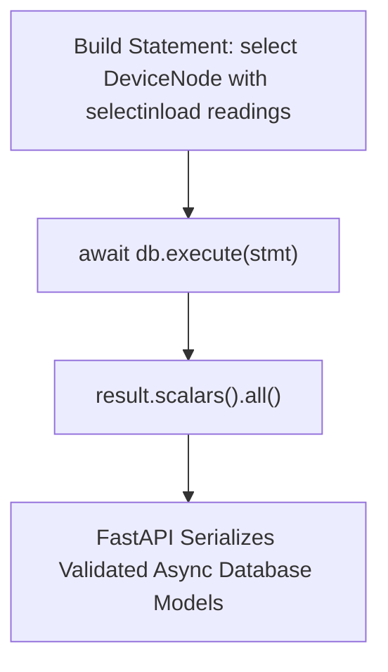

```yaml
schema_version: "2.0"
metadata:
  lesson_id: "FAP-MOD04-LES02"
  course_slug: "course-05-fastapi"
  course_title: "Course 5: FastAPI High-Performance Microservices"
  module_slug: "mod-04-async-database-sqlalchemy"
  module_title: "Module 4 - Async Database Integration with SQLAlchemy 2.0 & asyncpg"
  lesson_slug: "async-crud-operations-and-asyncsession"
  lesson_title: "Lesson 4.2 Async CRUD Operations & AsyncSession"
  sort_order: 402

pedagogy:
  difficulty: "advanced"
  estimated_time:
    reading_minutes: 20
    practice_minutes: 25
    quiz_minutes: 10
    total_minutes: 55
  bloom_taxonomy_level: "Apply"
  xp_reward: 70

prerequisites:
  required_lesson_ids:
    - "FAP-MOD04-LES01"
  required_skills:
    - "SQLAlchemy 2.0 Async Engine & AsyncSession Dependencies"

skills_acquired:
  - "Executing Async Queries using `select()` and `await db.execute()`"
  - "Async Eager Loading Strategies (`selectinload()`)"
  - "Async Table Schema Creation (`await conn.run_sync(Base.metadata.create_all)`)"
  - "Building Non-blocking CRUD API Endpoints"

dependencies:
  software:
    - "VS Code"
    - "Python 3.12+"
    - "fastapi"
    - "sqlalchemy>=2.0"
    - "aiosqlite"
  hardware: []

seo_and_social:
  meta_title: "SQLAlchemy 2.0 Async CRUD: select(), selectinload() & AsyncSession"
  meta_description: "Master Asynchronous CRUD Operations in FastAPI: SQLAlchemy 2.0 select() queries, await db.execute(), async eager loading with selectinload(), and conn.run_sync()."
  keywords: ["SQLAlchemy 2.0 CRUD", "Async CRUD", "selectinload", "await db.execute", "AsyncSession", "FastAPI Database"]

assessment_config:
  has_quiz: true
  has_lab: true
  has_flashcards: true
  pass_score_percentage: 80
```

# Lesson 4.2 Async CRUD Operations & AsyncSession

## 1. Overview & Learning Objectives [id: overview]

- **Estimated Time**: 55 Minutes (20m Reading | 25m Practice | 10m Quiz)
- **Difficulty Level**: ⭐⭐⭐ Advanced
- **Prerequisites**: [Lesson 4.1 Async Engine](file:///d:/My%20Drive/all%20files/PROJECT%20FILES/notes/docs/curriculum/_05_fastapi/_05_07_sqlalchemy_20_async_engine_and_asyncpg.md)
- **XP Reward**: +70 XP

### Learning Objectives
By the end of this lesson, you will be able to:
1. Execute asynchronous SELECT, INSERT, UPDATE, and DELETE queries using `select()` and `await db.execute()`.
2. Apply async relationship eager loading strategies using **`selectinload()`**.
3. Initialize database tables asynchronously using **`await conn.run_sync(Base.metadata.create_all)`**.
4. Construct non-blocking REST API CRUD endpoints.

---

## 2. Environment & Prerequisites [id: prerequisites]

Open Python REPL or VS Code.

---

## 3. Theoretical Foundations [id: theory]

### 3.1 SQLAlchemy 2.0 Async Query Style
SQLAlchemy 2.0 replaced legacy `Model.query` calls with explicit `select(Model)` constructs. In async mode, all database interactions must be explicitly awaited using `await db.execute(stmt)` or `await db.commit()`:

```
┌─────────────────────────────────────────────────────────────────────────────┐
│                      SQLALCHEMY 2.0 ASYNC QUERY STATEMENTS                  │
├─────────────────┬───────────────────────────────────────────────────────────┤
│ Operation       │ Async Syntax Example                                      │
├─────────────────┼───────────────────────────────────────────────────────────┤
│ SELECT List     │ `result = await db.execute(select(DeviceNode))`           │
│                 │ `nodes = result.scalars().all()`                          │
│ SELECT Single   │ `result = await db.execute(select(Node).where(Node.id==1))`│
│                 │ `node = result.scalar_one_or_none()`                      │
│ Eager Loading   │ `select(Node).options(selectinload(Node.readings))`       │
└─────────────────┴───────────────────────────────────────────────────────────┘
```

---

## 4. Architecture & Diagram Visualizations [id: diagram]



---

## 5. Code & Hardware Implementation [id: syntax]

### File 1: `models.py` (Async SQLAlchemy Models)

```python
from datetime import datetime
from sqlalchemy import String, Float, ForeignKey, DateTime
from sqlalchemy.orm import Mapped, mapped_column, relationship
from database import Base

class DeviceNode(Base):
    __tablename__ = "device_nodes"

    id: Mapped[int] = mapped_column(primary_key=True)
    code: Mapped[str] = mapped_column(String(50), unique=True, index=True)
    location: Mapped[str] = mapped_column(String(100))

    readings: Mapped[list["TelemetryReading"]] = relationship(
        back_populates="device",
        cascade="all, delete-orphan"
    )

class TelemetryReading(Base):
    __tablename__ = "telemetry_readings"

    id: Mapped[int] = mapped_column(primary_key=True)
    temp: Mapped[float] = mapped_column(Float)
    node_id: Mapped[int] = mapped_column(ForeignKey("device_nodes.id"))

    device: Mapped["DeviceNode"] = relationship(back_populates="readings")
```

### File 2: `main.py` (Async CRUD Routes)

```python
from contextlib import asynccontextmanager
from fastapi import FastAPI, Depends, HTTPException, status
from sqlalchemy import select
from sqlalchemy.ext.asyncio import AsyncSession
from sqlalchemy.orm import selectinload
from database import engine, Base, get_async_db
from models import DeviceNode, TelemetryReading

# Lifespan Context Manager to initialize DB tables asynchronously!
@asynccontextmanager
async def lifespan(app: FastAPI):
    async with engine.begin() as conn:
        await conn.run_sync(Base.metadata.create_all)
    yield

app = FastAPI(title="Async CRUD API", lifespan=lifespan)

# 1. CREATE Operation
@app.post("/api/v1/nodes", status_code=status.HTTP_201_CREATED)
async def create_node(code: str, location: str, db: AsyncSession = Depends(get_async_db)):
    new_node = DeviceNode(code=code, location=location)
    db.add(new_node)
    await db.commit()
    await db.refresh(new_node)
    return {"id": new_node.id, "code": new_node.code, "location": new_node.location}

# 2. READ Operation with Eager Loading (selectinload)
@app.get("/api/v1/nodes/{node_id}")
async def get_node_with_readings(node_id: int, db: AsyncSession = Depends(get_async_db)):
    # Eagerly load readings relationship asynchronously!
    stmt = select(DeviceNode).options(selectinload(DeviceNode.readings)).where(DeviceNode.id == node_id)
    result = await db.execute(stmt)
    node = result.scalar_one_or_none()

    if not node:
        raise HTTPException(status_code=404, detail="Node not found")

    return {
        "id": node.id,
        "code": node.code,
        "location": node.location,
        "readings": [{"id": r.id, "temp": r.temp} for r in node.readings]
    }
```

---

## 6. Enterprise Real-World Applications [id: examples]

- **Time-Series Data Ingestion**: High-performance FastAPI endpoints use `await db.execute(insert(TelemetryReading)...)` batch inserts to persist thousands of sensor readings into PostgreSQL tables per second.

---

## 7. Guided Step-by-Step Hands-On Exercise [id: exercises]

1. Save `models.py` and `main.py`.
2. Run `uvicorn main:app --reload`.
3. Send POST to `/api/v1/nodes?code=ESP32-A1&location=Lab1` $\to$ Inspect database record creation!

---

## 8. Common Pitfalls & Troubleshooting [id: common_mistakes]

| Bug / Error | Root Cause | Engineering Solution |
| :--- | :--- | :--- |
| **`MissingGreenlet: lazy load operation cannot be used in async`** | Accessing un-loaded relational properties (`node.readings`) in async mode without `selectinload()`. | Always include `.options(selectinload(Model.relation))` in `select()` queries. |

---

## 9. Best Practices & Optimization [id: best_practices]

- **Use `selectinload()` for One-to-Many**: Performs a fast secondary SELECT query to load related child objects in async mode.

---

## 10. Industry Interview Q&A [id: interview_qa]

### Q1: Why is lazy loading problematic in asynchronous SQLAlchemy and how does `selectinload()` solve it?
**Answer**: In synchronous SQLAlchemy, accessing an un-loaded relationship property (`node.readings`) triggers a blocking SQL query implicitly. In async mode, triggering implicit blocking I/O is impossible, raising a `MissingGreenlet` exception. `selectinload()` eagerly fetches related objects in a second non-blocking async query during the initial `await db.execute()` call.

---

## 11. Self-Assessment Quiz [id: quiz]

```json
{
  "quiz_title": "Lesson 4.2 Async CRUD Assessment",
  "questions": [
    {
      "question_id": "Q1",
      "type": "multiple_choice",
      "question_text": "Which SQLAlchemy option eagerly loads One-to-Many relationships in async queries without throwing MissingGreenlet errors?",
      "options": ["lazyload()", "selectinload()", "deferred()", "noload()"],
      "correct_answer_index": 1,
      "explanation": "selectinload() eagerly loads relationships asynchronously."
    }
  ]
}
```

---

## 12. Portfolio Assignment & Challenge [id: lab]

Build an async CRUD endpoint creating child records with `selectinload()` responses.

---

## 13. Spaced Repetition Flashcards [id: flashcards]

**Front**: How do you create database tables asynchronously in a FastAPI lifespan context manager?
**Back**: `await conn.run_sync(Base.metadata.create_all)`.
<!-- flashcard:end -->

---

## 14. Summary & Cheat Sheet [id: summary]

```python
stmt = select(Node).options(selectinload(Node.readings))
res = await db.execute(stmt)
node = res.scalar_one_or_none()
```


---

## Migrated Notes

> **Source**: `_15_01_Database_Indexes_and_Transactions_Notes.md` (from backend concepts archive)
> This content was migrated from existing study notes. Review and merge with topics above.

# Module 7: Database Design
## Topic 15: Database Indexes & ACID Transactions

---

### 1. Database Indexes

#### What is an Index?
A database **Index** is a data structure (typically a B-Tree) that improves the speed of data retrieval operations on a database table at the cost of additional write time and storage space.

* **The Book Metaphor:** Without an index, finding a word in a 1,000-page book requires scanning every page from page 1 to 1,000 (**Full Table Scan** - $O(N)$). With an index at the back of the book, you look up the word alphabetically, find the page number, and jump directly to it (**Index Scan** - $O(\log N)$).

#### Tradeoffs of Indexing
* **Pros:** Speeds up `SELECT` queries with `WHERE`, `JOIN`, `ORDER BY`, or `GROUP BY` clauses.
* **Cons:** 
  * **Slower Writes:** Every time you perform an `INSERT`, `UPDATE`, or `DELETE`, the database must update the index structure.
  * **Disk Space:** Indexes consume significant disk space. Large tables can have indexes that are gigabytes in size.

#### What Columns to Index
1. **Primary Keys:** Indexed automatically.
2. **Foreign Keys:** Always index foreign keys to speed up table joins.
3. **High-Cardiality Search Columns:** Columns frequently used in filters (e.g., `email`, `username`, `created_at`). Do *not* index low-cardinality columns (like `gender` or `status` with only 2-3 distinct values), as the database will still prefer a full table scan.

---

### 2. ACID Transactions
A **Transaction** is a unit of work performed against a database. To ensure data integrity, relational databases guarantee **ACID** properties:

1. **Atomicity:** "All-or-Nothing." If a transaction has 5 steps (e.g., deduct balance, record payment, create order), and step 4 fails, the entire transaction is rolled back. No partial changes are saved.
2. **Consistency:** A transaction must transition the database from one valid state to another, maintaining all constraints (e.g., foreign keys, unique fields).
3. **Isolation:** Multiple transactions executing concurrently must not interfere with each other. The database simulates running them sequentially.
4. **Durability:** Once a transaction is committed, its changes are permanently written to non-volatile storage (disk) and will survive a system crash.

---

### 3. Implementing Transactions in SQLAlchemy

To implement Atomicity, we use `try-except` blocks. If any database operation fails, we trigger a `session.rollback()`.

```python
from sqlalchemy.orm import Session
from sqlalchemy import Column, Integer

def transfer_funds(db: Session, sender_id: int, receiver_id: int, amount: int):
    try:
        # 1. Deduct from sender
        sender = db.query(Account).filter_by(id=sender_id).with_for_update().first() # Lock row
        sender.balance -= amount
        
        # 2. Add to receiver
        receiver = db.query(Account).filter_by(id=receiver_id).with_for_update().first()
        receiver.balance += amount
        
        # If both succeed, commit the transaction
        db.commit()
    except Exception as e:
        # If any step fails (e.g., connection drop, constraint violation), roll back everything!
        db.rollback()
        raise e
```

---

### 4. Hands-on Workout & Assessment

#### Part A: API Design Challenge (ACID Transactions)
You are building an **E-Commerce Checkout** API. When a user buys a product:
1. The **Order** is created.
2. The **Product Stock** is decremented.
3. The **User Loyalty Points** are incremented.

- Explain what would happen to database integrity if step 1 and 2 succeed, but step 3 fails due to a database constraint, and you are **not** using a transaction.
- Explain how a transaction solves this.

#### Part B: Quiz
1. Which ACID property ensures that all operations in a transaction either succeed completely or fail completely?
   A. Atomicity
   B. Consistency
   C. Isolation
   D. Durability
2. Why should you avoid indexing every single column in a database table?
   A. The database allows only 3 indexes per table.
   B. It will slow down `INSERT`, `UPDATE`, and `DELETE` operations because the database must rebuild the indexes on every write.
   C. It causes database memory leaks.
   D. Indexes can only be created on integer columns.
3. What does `session.rollback()` do in SQLAlchemy?
   A. It restarts the database server.
   B. It deletes the database file.
   C. It undoes all uncommitted database modifications made during the current transaction.
   D. It commits the changes.

---

### 5. Progress Tracker

* **Module 7: Database Design:** 0%
* **Topics Completed:** 0/2
* **Coding Exercises:** 0/0
* **Quiz Score:** N/A
* **API Design Challenge Score:** N/A
* **Backend Score:** 0 / 100

---
