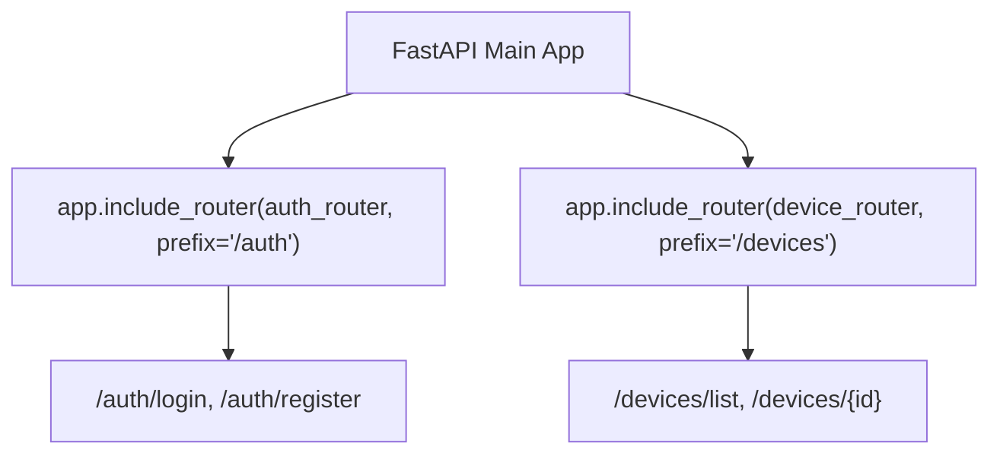

```yaml
schema_version: "2.0"
metadata:
  lesson_id: "FAP-MOD06-LES01"
  course_slug: "course-05-fastapi"
  course_title: "Course 5: FastAPI High-Performance Microservices"
  module_slug: "mod-06-modular-apirouter-structure"
  module_title: "Module 6 - Modular Application Structuring with APIRouter"
  lesson_slug: "apirouter-architecture-and-prefixes"
  lesson_title: "Lesson 6.1 APIRouter() Architecture & Route Prefixes"
  sort_order: 601

pedagogy:
  difficulty: "intermediate"
  estimated_time:
    reading_minutes: 15
    practice_minutes: 20
    quiz_minutes: 10
    total_minutes: 45
  bloom_taxonomy_level: "Apply"
  xp_reward: 50

prerequisites:
  required_lesson_ids:
    - "FAP-MOD05-LES02"
  required_skills:
    - "FastAPI Application Instantiation & JWT Authentication"

skills_acquired:
  - "Instantiating `APIRouter()` Modules"
  - "Registering Routers via `app.include_router()`"
  - "Configuring Router Parameters (`prefix`, `tags`, `responses`)"
  - "Attaching Router-Level Dependencies (`dependencies=[Depends(...)]`)"

dependencies:
  software:
    - "VS Code"
    - "Python 3.12+"
    - "fastapi"
  hardware: []

seo_and_social:
  meta_title: "FastAPI APIRouter Architecture: include_router, prefix & Router Dependencies"
  meta_description: "Master FastAPI APIRouter Architecture: instantiating APIRouter(), registering routers with app.include_router(), URL prefixes, tags, and router-level dependencies."
  keywords: ["FastAPI APIRouter", "include_router", "url prefix", "FastAPI Modular Routing", "Router Dependencies", "OpenAPI Tags"]

assessment_config:
  has_quiz: true
  has_lab: true
  has_flashcards: true
  pass_score_percentage: 80
```

# Lesson 6.1 APIRouter() Architecture & Route Prefixes

## 1. Overview & Learning Objectives [id: overview]

- **Estimated Time**: 45 Minutes (15m Reading | 20m Practice | 10m Quiz)
- **Prerequisites**: [Lesson 5.2 JWT Auth](file:///d:/My%20Drive/all%20files/PROJECT%20FILES/notes/docs/curriculum/_05_fastapi/_05_10_jwt_authentication_and_current_user.md)
- **XP Reward**: +50 XP

### Learning Objectives
By the end of this lesson, you will be able to:
1. Modularize routes using **`APIRouter()`**.
2. Register routers on the main application instance using **`app.include_router()`**.
3. Configure router parameters (`prefix`, `tags`, `responses`).
4. Apply router-level security dependencies using `dependencies=[Depends(...)]`.

---

## 2. Environment & Prerequisites [id: prerequisites]

Open Python REPL or VS Code.

---

## 3. Theoretical Foundations [id: theory]

### 3.1 What is an APIRouter?
In large microservice applications, defining all routes on a single `app = FastAPI()` instance leads to giant, unmaintainable Python files.

An **`APIRouter`** acts like a "mini FastAPI app"—a self-contained set of operations, tags, and dependencies that can be included in the main application using `app.include_router()`:

```
┌─────────────────────────────────────────────────────────────────────────────┐
│                          FASTAPI APIROUTER ARCHITECTURE                     │
├─────────────────────────────────────────────────────────────────────────────┤
│ Main FastAPI App (`app = FastAPI()`)                                        │
│   ├── `app.include_router(auth_router, prefix="/api/v1/auth")`             │
│   ├── `app.include_router(devices_router, prefix="/api/v1/devices")`       │
│   └── `app.include_router(telemetry_router, prefix="/api/v1/telemetry")`   │
└─────────────────────────────────────────────────────────────────────────────┘
```

---

## 4. Architecture & Diagram Visualizations [id: diagram]



---

## 5. Code & Hardware Implementation [id: syntax]

### File 1: `routers/devices.py` (APIRouter Module)

```python
from fastapi import APIRouter, Depends, status

# 1. Instantiate APIRouter
router = APIRouter(
    prefix="/devices",
    tags=["Devices & Hardware Nodes"],
    responses={404: {"description": "Device Node Not Found"}}
)

@router.get("/")
def list_devices():
    return [{"id": 101, "code": "ESP32-A"}]

@router.post("/", status_code=status.HTTP_201_CREATED)
def create_device(code: str):
    return {"id": 102, "code": code, "status": "CREATED"}
```

### File 2: `main.py` (Main FastAPI App Registering Router)

```python
from fastapi import FastAPI
from routers.devices import router as devices_router

app = FastAPI(title="Modular APIRouter Application")

# 2. Register Router on Main FastAPI App with Global Prefix
app.include_router(devices_router, prefix="/api/v1")

@app.get("/")
def root():
    return {"message": "IoT Gateway API System Online"}
```

---

## 6. Enterprise Real-World Applications [id: examples]

- **Enterprise Microservice Organization**: Production backends divide routes into independent router modules (`users.py`, `billing.py`, `telemetry.py`), mounting them on the main app with versioned URL prefixes (`/api/v1`).

---

## 7. Guided Step-by-Step Hands-On Exercise [id: exercises]

1. Save `routers/devices.py` and `main.py`.
2. Run `uvicorn main:app --reload` $\to$ Inspect `/docs` to see endpoints grouped under "Devices & Hardware Nodes" with `/api/v1/devices` prefix!

---

## 8. Common Pitfalls & Troubleshooting [id: common_mistakes]

| Bug / Error | Root Cause | Engineering Solution |
| :--- | :--- | :--- |
| **Duplicate Path Prefixes (`/api/v1/devices/devices`)** | Declaring `prefix="/devices"` in `APIRouter()` AND `prefix="/api/v1/devices"` in `app.include_router()`. | Define base prefix once in `include_router` or combine cleanly (`prefix="/api/v1"` in app, `prefix="/devices"` in router). |

---

## 9. Best Practices & Optimization [id: best_practices]

- **Group Routers in a `routers/` Folder**: Keep router modules organized in a dedicated directory.

---

## 10. Industry Interview Q&A [id: interview_qa]

### Q1: How does `APIRouter` in FastAPI differ from Flask's `Blueprint`?
**Answer**: `APIRouter` in FastAPI serves a similar modular purpose to Flask's `Blueprint`, but with native integration for OpenAPI documentation and Dependency Injection. Routers allow passing `dependencies=[Depends(...)]` directly at the router level, automatically applying security or logging dependencies to every endpoint within that router.

---

## 11. Self-Assessment Quiz [id: quiz]

```json
{
  "quiz_title": "Lesson 6.1 APIRouter Assessment",
  "questions": [
    {
      "question_id": "Q1",
      "type": "multiple_choice",
      "question_text": "Which FastAPI app method registers an APIRouter module onto the main application?",
      "options": ["app.register_router()", "app.include_router()", "app.add_router()", "app.mount()"],
      "correct_answer_index": 1,
      "explanation": "app.include_router() includes APIRouter modules."
    }
  ]
}
```

---

## 12. Portfolio Assignment & Challenge [id: lab]

Modularize a monolithic FastAPI app into `auth_router` and `devices_router`.

---

## 13. Spaced Repetition Flashcards [id: flashcards]

**Front**: What parameter on `app.include_router()` attaches a security dependency to all routes in that router?
**Back**: `dependencies=[Depends(my_security_dep)]`.
<!-- flashcard:end -->

---

## 14. Summary & Cheat Sheet [id: summary]

```python
router = APIRouter(prefix="/items", tags=["Items"])
@router.get("/")
def get_items(): return []
app.include_router(router, prefix="/api/v1")
```


---

## Migrated Notes

> **Source**: `_03_01_API_Architecture_and_Patterns_Notes.md` (from backend concepts archive)
> This content was migrated from existing study notes. Review and merge with topics above.

# Module 1: API Design and Architecture
## Topic 3: API Architecture, Layered Patterns, and Dependency Injection

---

### 1. The Big Picture

#### What is API Architecture?
API Architecture is the structural design of your backend application. As a junior, it is tempting to put all your routes, database queries, and business logic into a single `main.py` file. In an enterprise environment, this is a recipe for disaster. 

Professional backend codebases are structured using **Architectural Patterns** to ensure:
* **Maintainability:** Changing how database queries are run shouldn't require changing your HTTP route handlers.
* **Testability:** You must be able to test your business logic without connecting to a real database.
* **Scalability:** Multiple developers must be able to work on different parts of the system (e.g., database vs. routes) without merge conflicts.

#### The Layered (Three-Tier) Architecture
The industry standard for structuring backend applications is the **Three-Tier/Layered Architecture**:

```
┌────────────────────────────────────────────────────────┐
│                   PRESENTATION LAYER                   │
│        (Routers, Controllers, Schemas/DTOs)            │
│   - Receives HTTP requests                             │
│   - Validates input (Pydantic / Hibernate)             │
│   - Returns HTTP responses & status codes              │
└───────────────────────────┬────────────────────────────┘
                            │
                            ▼ (Calls Service)
┌────────────────────────────────────────────────────────┐
│                  BUSINESS LOGIC LAYER                  │
│                     (Service Layer)                    │
│   - Executes core business rules and calculations      │
│   - Coordinates transactions                           │
│   - Completely unaware of HTTP (no request/response)   │
└───────────────────────────┬────────────────────────────┘
                            │
                            ▼ (Calls Repository)
┌────────────────────────────────────────────────────────┐
│                   DATA ACCESS LAYER                    │
│             (Repository / Data Access Object)          │
│   - Performs raw database queries (SQLAlchemy/SQL)     │
│   - Reads/writes to database or cache                  │
│   - Completely unaware of business rules               │
└────────────────────────────────────────────────────────┘
```

#### What is Dependency Injection (DI)?
**Dependency Injection** is a design pattern in which an object or function receives other objects that it depends on (its dependencies), rather than creating them itself.
* *Without DI:* Class A creates an instance of Class B inside its constructor. Class A is now tightly coupled to Class B. If you want to test Class A, you are forced to run Class B as well.
* *With DI:* Class A is handed (injected with) an instance of Class B. You can easily inject a "Mock B" during testing.

---

### 2. Lesson Objectives
By the end of this lesson, you will:
1. Understand the responsibilities of the Presentation, Service, and Repository layers.
2. Master the **Repository Pattern** to abstract database operations.
3. Implement **Dependency Injection** in FastAPI using the `Depends` system.
4. Refactor our **Enterprise E-Commerce API** into a clean, layered architecture.

---

### 3. Detailed Explanation & Core Concepts

#### 1. Layer Responsibilities
* **Router/Controller:** *The Receptionist.* Its only job is to greet the client, verify they brought the right paperwork (validation), hand the paperwork to the manager (Service), and return the manager's response with a stamp (HTTP Status Code).
* **Service:** *The Manager.* The brain of the application. It decides *what* to do. E.g., "If the user is registering, check if the email exists, hash their password, create their account, and send a welcome email."
* **Repository:** *The Clerk.* Its only job is to fetch or save records from the file cabinet (Database). It does not care *why* it is fetching the data.

#### 2. The Repository Pattern
The Repository Pattern mediates between the domain and data mapping layers using a collection-like interface for accessing domain objects. 
* **Why?** If you decide to migrate from PostgreSQL to MongoDB, you only need to rewrite your Repository classes. Your Service classes and Routers remain completely untouched.

#### 3. SOLID Principles in API Design
* **Single Responsibility Principle (SRP):** A class/file should have only one reason to change. The router only changes if the HTTP contract changes. The service only changes if the business rules change.
* **Dependency Inversion Principle (DIP):** High-level modules should not depend on low-level modules; both should depend on abstractions. (e.g., Services depend on Repository interfaces, not concrete SQL connections).

---

### 4. Code Comparison: FastAPI (Python)

Let's see how a junior developer couples code compared to a production-grade layered implementation.

#### A. Beginner Code (Tightly Coupled)
```python
from fastapi import FastAPI, HTTPException
import psycopg2 # Direct database dependency

app = FastAPI()

@app.post("/users")
def create_user(name: str, email: str):
    # 1. Database Connection (Low-level detail in presentation layer!)
    conn = psycopg2.connect("dbname=test user=postgres")
    cur = conn.cursor()
    
    # 2. Business Logic & Query mixed together
    cur.execute("SELECT id FROM users WHERE email = %s", (email,))
    if cur.fetchone():
        raise HTTPException(status_code=400, detail="Email exists")
        
    cur.execute("INSERT INTO users (name, email) VALUES (%s, %s) RETURNING id", (name, email))
    user_id = cur.fetchone()[0]
    conn.commit()
    
    return {"id": user_id, "name": name, "email": email}
```

#### B. Production Code (Layered & Decoupled)

##### 1. The Repository Layer (`repository.py`)
```python
from typing import List, Optional

# Concrete Repository (In-memory mock for now, can be swapped with SQLAlchemy later)
class UserRepository:
    def __init__(self):
        self._db = []
        self._current_id = 1

    def get_by_email(self, email: str) -> Optional[dict]:
        for user in self._db:
            if user["email"] == email:
                return user
        return None

    def create(self, name: str, email: str, password_hash: str) -> dict:
        user = {
            "id": self._current_id,
            "name": name,
            "email": email,
            "password_hash": password_hash
        }
        self._db.append(user)
        self._current_id += 1
        return user
```

##### 2. The Service Layer (`service.py`)
```python
from typing import Optional
from repository import UserRepository

class UserService:
    # Dependency Injection: We inject the UserRepository
    def __init__(self, user_repo: UserRepository):
        self.user_repo = user_repo

    def register_user(self, name: str, email: str, password_raw: str) -> dict:
        # 1. Business Logic: Check duplicate
        existing_user = self.user_repo.get_by_email(email)
        if existing_user:
            raise ValueError("Email already registered")
            
        # 2. Business Logic: Hash password
        hashed_password = f"secure_hash_{password_raw}"
        
        # 3. Data Access
        return self.user_repo.create(name, email, hashed_password)
```

##### 3. The Presentation Layer (`router.py`)
```python
from fastapi import APIRouter, Depends, HTTPException, status
from pydantic import BaseModel, EmailStr
from repository import UserRepository
from service import UserService

router = APIRouter(prefix="/api/v1/users", tags=["Users"])

# --- DEPENDENCY INJECTION SETUP ---
# We create singletons or factory functions to supply our dependencies.
_user_repo = UserRepository()

def get_user_service() -> UserService:
    return UserService(user_repo=_user_repo)

# --- SCHEMAS ---
class UserCreate(BaseModel):
    name: str
    email: EmailStr
    password: str

class UserResponse(BaseModel):
    id: int
    name: str
    email: EmailStr

# --- ROUTE ---
@router.post("", response_model=UserResponse, status_code=status.HTTP_201_CREATED)
def create_user(
    user_in: UserCreate, 
    user_service: UserService = Depends(get_user_service) # FastAPI Dependency Injection
):
    try:
        # The router does not know HOW to hash passwords or check duplicate emails.
        # It simply delegates to the Service.
        new_user = user_service.register_user(
            name=user_in.name,
            email=user_in.email,
            password_raw=user_in.password
        )
        return new_user
    except ValueError as e:
        # Service throws a domain exception; router converts it to HTTP Exception
        raise HTTPException(status_code=status.HTTP_400_BAD_REQUEST, detail=str(e))
```

---

### 5. Code Comparison: Spring Boot (Java)

Spring Boot is built entirely around Dependency Injection using its **Application Context** (Inversion of Control container).

```java
// 1. DATA ACCESS LAYER (Repository)
@Repository
public interface UserRepository extends JpaRepository<UserEntity, Long> {
    Optional<UserEntity> findByEmail(String email);
}

// 2. BUSINESS LOGIC LAYER (Service)
@Service
public class UserService {
    
    private final UserRepository userRepository;
    private final PasswordEncoder passwordEncoder;

    // Constructor Injection (Best Practice)
    public UserService(UserRepository userRepository, PasswordEncoder passwordEncoder) {
        this.userRepository = userRepository;
        this.passwordEncoder = passwordEncoder;
    }

    public UserResponseDTO registerUser(UserCreateDTO dto) {
        if (userRepository.findByEmail(dto.getEmail()).isPresent()) {
            throw new BadRequestException("Email already registered");
        }
        UserEntity entity = new UserEntity();
        entity.setName(dto.getName());
        entity.setEmail(dto.getEmail());
        entity.setPasswordHash(passwordEncoder.encode(dto.getPassword()));
        
        UserEntity saved = userRepository.save(entity);
        return convertToDTO(saved);
    }
}

// 3. PRESENTATION LAYER (Controller)
@RestController
@RequestMapping("/api/v1/users")
public class UserController {

    private final UserService userService;

    public UserController(UserService userService) {
        this.userService = userService;
    }

    @PostMapping
    public ResponseEntity<UserResponseDTO> createUser(@Valid @RequestBody UserCreateDTO dto) {
        return new ResponseEntity<>(userService.registerUser(dto), HttpStatus.CREATED);
    }
}
```

---

### 6. Professional Notes

#### Why Constructor Injection is Best Practice
In Spring Boot or plain Python, you should always prefer injecting dependencies through the constructor (`__init__`) rather than using field injection (like `@Autowired` on fields or global variables).
* **Easy Testing:** You can instantiate the service in a unit test by simply passing a mock repository to the constructor: `service = UserService(mock_repo)`. No complex framework setup required.
* **Immutability:** Dependencies can be marked as final/read-only, ensuring they are not modified after initialization.

---

### 7. Hands-on Workout & Assessment

#### Part A: Coding Exercise
Refactor your **Enterprise E-Commerce API** in `c:\Users\rajas\OneDrive\_00_a_study\_05_backend_concepts\API Design and Architecture - Backend Engineering\ecommerce_api` to use this Layered Architecture:
1. Move your in-memory database storage into a `UserRepository` in `app/modules/users/repository.py`.
2. Implement a `UserService` in `app/modules/users/service.py` that accepts the `UserRepository` in its constructor.
3. Update `app/modules/users/router.py` to inject the `UserService` using FastAPI's `Depends`.
4. Do the same for the **Products** module! Create `ProductRepository` and `ProductService`.

#### Part B: Architecture Challenge
Suppose you are designing an **Order Processing** system. When an order is placed, the system must:
1. Deduct inventory stock.
2. Charge the customer's credit card via Stripe.
3. Create an order record in the database.
4. Send an email confirmation.

Describe:
- Which layer (Router, Service, or Repository) should coordinate these 4 steps?
- Why it belongs in that layer.
- How you would use Dependency Injection to ensure this system is testable without charging real credit cards or sending real emails.

#### Part C: Quiz
##### 1. Multiple Choice Questions (10)
1. Which layer of the Three-Tier Architecture is responsible for parsing HTTP request bodies?
   A. Service Layer
   B. Presentation Layer
   C. Repository Layer
   D. Database Layer
2. What is the primary benefit of Dependency Injection?
   A. It makes the application run faster.
   B. It decouples components, making them easier to test and maintain.
   C. It automatically secures the database.
   D. It eliminates the need for writing SQL queries.
3. In a layered architecture, which of the following is a violation of the dependency rule?
   A. The Router calling the Service.
   B. The Service calling the Repository.
   C. The Repository calling the Service.
   D. The Repository calling the Database.
4. Why should business logic NOT be placed in the Router?
   A. Routers are not capable of executing Python math operations.
   B. It makes it impossible to reuse that business logic in other interfaces (like a CLI tool or a Cron job) and makes testing difficult.
   C. Routers can only return JSON.
   D. It causes database connection leaks.
5. The Repository Pattern is used to abstract:
   A. The HTTP protocol.
   B. Data storage and retrieval operations.
   C. User authentication.
   D. HTML rendering.
6. What FastAPI function is used to declare and resolve dependencies?
   A. `Inject`
   B. `Depends`
   C. `Autowired`
   D. `Required`
7. In unit testing, what is a "mock"?
   A. A copy of the production database.
   B. A lightweight, simulated object that mimics the behavior of a real dependency.
   C. A tool that checks for syntax errors.
   D. An encrypted password.
8. Which SOLID principle states that "high-level modules should not depend on low-level modules; both should depend on abstractions"?
   A. Single Responsibility Principle (SRP)
   B. Open/Closed Principle (OCP)
   C. Liskov Substitution Principle (LSP)
   D. Dependency Inversion Principle (DIP)
9. Which layer of our architecture should throw an `HTTPException`?
   A. Repository Layer
   B. Service Layer
   C. Presentation (Router) Layer
   D. Database Layer
10. Why is constructor injection preferred over field injection?
    A. It requires fewer lines of code.
    B. It allows classes to be instantiated easily in unit tests without starting a framework container.
    C. It speeds up database queries.
    D. It is only supported in Python.

##### 2. True / False (5)
1. The Service Layer should contain code that directly imports and executes SQL queries. (True/False)
2. Dependency Injection requires you to use a third-party framework; it cannot be done manually. (True/False)
3. Under the Single Responsibility Principle, a class should only have one reason to change. (True/False)
4. The Repository layer should be completely unaware of HTTP requests and responses. (True/False)
5. Injecting dependencies makes unit testing harder because you have to write more boilerplate code. (True/False)

##### 3. Fill in the Blanks (5)
1. The architectural layer responsible for executing core business rules is the ________ layer.
2. In FastAPI, we use the ________ function to inject services into our route functions.
3. The design pattern that abstracts data access behind a collection-like interface is the ________ pattern.
4. A class that depends on an interface rather than a concrete implementation is adhering to the Dependency ________ Principle.
5. The abbreviation SRP stands for ________ ________ Principle.

##### 4. Debugging Question
Identify the architectural violation in this Service class and explain how to fix it:
```python
from fastapi import HTTPException, status
import psycopg2

class ProductService:
    def get_product_price(self, product_id: int):
        conn = psycopg2.connect("dbname=shop")
        cur = conn.cursor()
        cur.execute("SELECT price FROM products WHERE id = %s", (product_id,))
        row = cur.fetchone()
        if not row:
            raise HTTPException(status_code=status.HTTP_404_NOT_FOUND, detail="Product not found")
        return row[0]
```

---

### 8. Flashcards

1. **Q:** What is Layered Architecture?
   **A:** A design pattern that organizes code into horizontal layers (Presentation, Service, Data Access), where each layer has a distinct responsibility.
2. **Q:** What is the Service Layer?
   **A:** The layer that contains business logic and orchestrates the application's workflows.
3. **Q:** What is the Repository Layer?
   **A:** The layer responsible for data access, abstracting database-specific operations from the rest of the application.
4. **Q:** Why do we use Dependency Injection?
   **A:** To decouple components, making code more modular, maintainable, and easier to test via mocking.
5. **Q:** What is the difference between a domain exception and an HTTP exception?
   **A:** A domain exception (e.g., ValueError) is raised by business logic, independent of transport. An HTTP exception (e.g., HTTPException) is raised in the presentation layer to map that error to an HTTP response code.

---

### 9. Progress Tracker

* **Module 1: API Design and Architecture:** 0%
* **Topics Completed:** 0/3
* **Coding Exercises:** 0/3
* **Quiz Score:** N/A
* **API Design Challenge Score:** N/A
* **Backend Score:** 0 / 100

---
