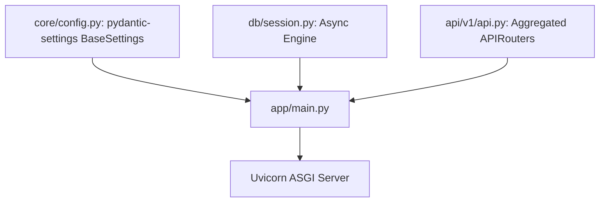

```yaml
schema_version: "2.0"
metadata:
  lesson_id: "FAP-MOD06-LES02"
  course_slug: "course-05-fastapi"
  course_title: "Course 5: FastAPI High-Performance Microservices"
  module_slug: "mod-06-modular-apirouter-structure"
  module_title: "Module 6 - Modular Application Structuring with APIRouter"
  lesson_slug: "modular-directory-structure-and-big-applications"
  lesson_title: "Lesson 6.2 Modular Directory Structure & Big Applications"
  sort_order: 602

pedagogy:
  difficulty: "intermediate"
  estimated_time:
    reading_minutes: 15
    practice_minutes: 20
    quiz_minutes: 10
    total_minutes: 45
  bloom_taxonomy_level: "Apply"
  xp_reward: 50

prerequisites:
  required_lesson_ids:
    - "FAP-MOD06-LES01"
  required_skills:
    - "FastAPI APIRouter Architecture & Pydantic v2 Models"

skills_acquired:
  - "Designing Enterprise Scalable FastAPI Directory Layouts"
  - "Package Separation (`core/`, `api/`, `models/`, `schemas/`, `services/`)"
  - "Environment Management with `pydantic-settings` (`BaseSettings`)"
  - "Global Exception Interceptors (`@app.exception_handler`)"

dependencies:
  software:
    - "VS Code"
    - "Python 3.12+"
    - "fastapi"
    - "pydantic-settings"
  hardware: []

seo_and_social:
  meta_title: "Enterprise FastAPI Structure: Modular Package Layout & pydantic-settings"
  meta_description: "Master Enterprise FastAPI Project Structures: scalable package organization, environment variable management with pydantic-settings, and global exception handlers."
  keywords: ["FastAPI Directory Structure", "pydantic-settings", "BaseSettings", "Modular FastAPI", "FastAPI Enterprise Layout", "Exception Handlers"]

assessment_config:
  has_quiz: true
  has_lab: true
  has_flashcards: true
  pass_score_percentage: 80
```

# Lesson 6.2 Modular Directory Structure & Big Applications

## 1. Overview & Learning Objectives [id: overview]

- **Estimated Time**: 45 Minutes (15m Reading | 20m Practice | 10m Quiz)
- **Difficulty Level**: ⭐⭐ Intermediate
- **Prerequisites**: [Lesson 6.1 APIRouter Architecture](file:///d:/My%20Drive/all%20files/PROJECT%20FILES/notes/docs/curriculum/_05_fastapi/_05_11_apirouter_architecture_and_prefixes.md)
- **XP Reward**: +50 XP

### Learning Objectives
By the end of this lesson, you will be able to:
1. Design an enterprise **Modular Package Layout** for large FastAPI codebases.
2. Separate concerns into dedicated packages (`core/`, `api/`, `models/`, `schemas/`, `services/`).
3. Manage environment variables type-safely using **`pydantic-settings` (`BaseSettings`)**.
4. Intercept custom domain exceptions using **`@app.exception_handler()`**.

---

## 2. Environment & Prerequisites [id: prerequisites]

Install `pydantic-settings`:

```bash
pip install pydantic-settings
```

---

## 3. Theoretical Foundations [id: theory]

### 3.1 Enterprise Production Directory Layout
As FastAPI applications grow to dozens of routes and models, flat project layouts become hard to navigate. Enterprise applications adopt a **Domain-Driven Modular Package Structure**:

```
┌─────────────────────────────────────────────────────────────────────────────┐
│                    ENTERPRISE FASTAPI PROJECT LAYOUT                        │
├─────────────────────────────────────────────────────────────────────────────┤
│ src/                                                                        │
│ ├── app/                                                                    │
│ │   ├── main.py              # App instantiation & router mounting          │
│ │   ├── core/                # App config (pydantic-settings), security     │
│ │   │   ├── config.py, security.py                                          │
│ │   ├── db/                  # Database engine & session setup              │
│ │   │   ├── session.py, base.py                                             │
│ │   ├── models/              # SQLAlchemy database models                   │
│ │   ├── schemas/             # Pydantic request/response DTO schemas        │
│ │   ├── api/                 # APIRouter modules                            │
│ │   │   ├── v1/                                                             │
│ │   │   │   ├── api.py, endpoints/ (devices.py, telemetry.py)              │
│ │   └── services/            # Business logic service layer                 │
└─────────────────────────────────────────────────────────────────────────────┘
```

---

## 4. Architecture & Diagram Visualizations [id: diagram]



---

## 5. Code & Hardware Implementation [id: syntax]

### File 1: `src/app/core/config.py` (Pydantic-Settings Configuration)

```python
from pydantic_settings import BaseSettings, SettingsConfigDict

class Settings(BaseSettings):
    PROJECT_NAME: str = "Enterprise IoT Gateway API"
    API_V1_STR: str = "/api/v1"
    SECRET_KEY: str = "super-secret-key-change-in-production-90210"
    DATABASE_URL: str = "sqlite+aiosqlite:///./production.db"

    # Automatically loads variables from .env file!
    model_config = SettingsConfigDict(env_file=".env", env_file_encoding="utf-8")

settings = Settings()
```

### File 2: `src/app/main.py` (Global Exception Handler & Main App)

```python
from fastapi import FastAPI, Request, status
from fastapi.responses import JSONResponse
from app.core.config import settings

app = FastAPI(title=settings.PROJECT_NAME)

# Custom Domain Exception Class
class DeviceOfflineException(Exception):
    def __init__(self, device_id: str):
        self.device_id = device_id

# Global Exception Interceptor
@app.exception_handler(DeviceOfflineException)
async def device_offline_exception_handler(request: Request, exc: DeviceOfflineException):
    return JSONResponse(
        status_code=status.HTTP_503_SERVICE_UNAVAILABLE,
        content={
            "error": "DEVICE_OFFLINE",
            "message": f"Hardware device '{exc.device_id}' is unreachable.",
            "path": request.url.path
        }
    )

@app.get("/api/v1/test-offline/{device_id}")
async def test_offline(device_id: str):
    if device_id.startswith("OFFLINE"):
        raise DeviceOfflineException(device_id)
    return {"status": "ONLINE", "device_id": device_id}
```

---

## 6. Enterprise Real-World Applications [id: examples]

- **Microservice Configuration**: Enterprise teams configure database URLs, API keys, and CORS origins using `pydantic-settings`, allowing seamless environment switching across Local, Staging, and Production Kubernetes clusters.

---

## 7. Guided Step-by-Step Hands-On Exercise [id: exercises]

1. Save `src/app/core/config.py` and `src/app/main.py`.
2. Run `uvicorn src.app.main:app --reload`.
3. Navigate to `/api/v1/test-offline/OFFLINE-101` $\to$ Inspect custom HTTP 503 JSON error response!

---

## 8. Common Pitfalls & Troubleshooting [id: common_mistakes]

| Bug / Error | Root Cause | Engineering Solution |
| :--- | :--- | :--- |
| **`ValidationError: Field required` in Settings** | Defining a required field without a default value in `BaseSettings` that is missing from environment `.env`. | Provide safe default values or supply `.env` variables. |

---

## 9. Best Practices & Optimization [id: best_practices]

- **Use `pydantic-settings`**: Always manage environment configuration using `pydantic-settings` for type validation and default value handling.

---

## 10. Industry Interview Q&A [id: interview_qa]

### Q1: Why is `pydantic-settings` preferred over `os.environ.get()` in FastAPI production codebases?
**Answer**: `pydantic-settings` provides type safety, automatic type casting, validation, and default fallback values for environment variables. It parses `.env` files automatically, ensuring that missing or invalid environment variables (like a malformed database port) cause an immediate, clear error at application startup rather than runtime crashes.

---

## 11. Self-Assessment Quiz [id: quiz]

```json
{
  "quiz_title": "Lesson 6.2 Big Applications Assessment",
  "questions": [
    {
      "question_id": "Q1",
      "type": "multiple_choice",
      "question_text": "Which Pydantic class handles environment variable loading and validation in FastAPI applications?",
      "options": ["BaseModel", "BaseSettings", "EnvSettings", "ConfigSettings"],
      "correct_answer_index": 1,
      "explanation": "pydantic_settings.BaseSettings manages environment settings."
    }
  ]
}
```

---

## 12. Portfolio Assignment & Challenge [id: lab]

Build a `BaseSettings` class loading database credentials from a `.env` file.

---

## 13. Spaced Repetition Flashcards [id: flashcards]

**Front**: What decorator registers custom exception handlers globally in FastAPI?
**Back**: `@app.exception_handler(CustomException)`.
<!-- flashcard:end -->

---

## 14. Summary & Cheat Sheet [id: summary]

```python
class Settings(BaseSettings):
    DB_URL: str = "sqlite:///app.db"
settings = Settings()
```
