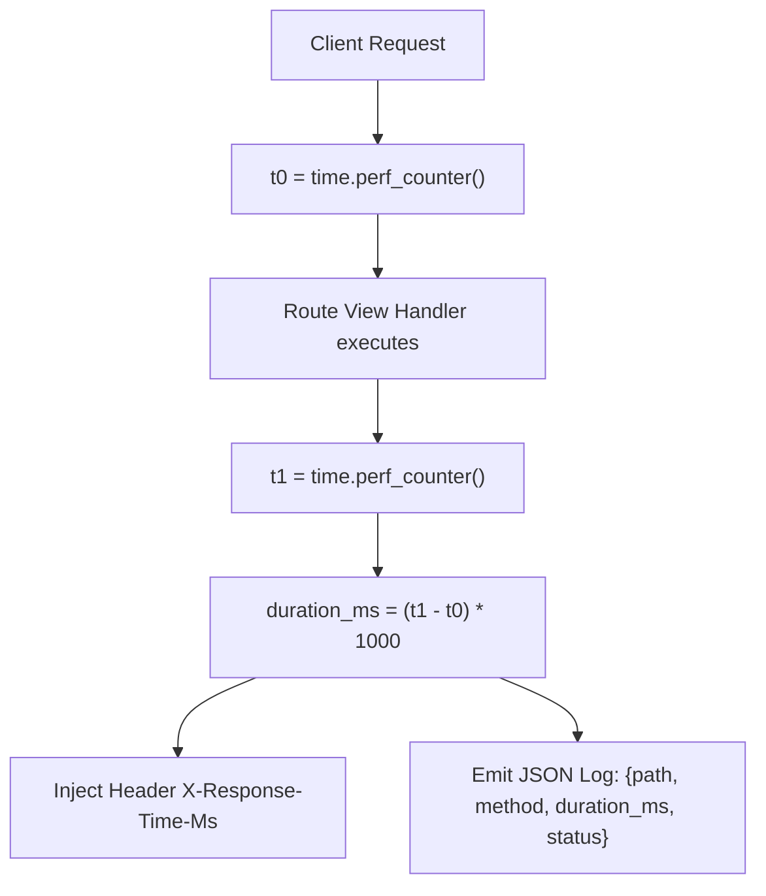

```yaml
schema_version: "2.0"
metadata:
  lesson_id: "FAP-MOD07-LES02"
  course_slug: "course-05-fastapi"
  course_title: "Course 5: FastAPI High-Performance Microservices"
  module_slug: "mod-07-middleware-cors"
  module_title: "Module 7 - Asynchronous Middleware & CORS"
  lesson_slug: "request-timing-headers-and-performance-logging"
  lesson_title: "Lesson 7.2 Request Timing Headers & Performance Logging"
  sort_order: 702

pedagogy:
  difficulty: "intermediate"
  estimated_time:
    reading_minutes: 15
    practice_minutes: 20
    quiz_minutes: 10
    total_minutes: 45
  bloom_taxonomy_level: "Apply"
  xp_reward: 50

prerequisites:
  required_lesson_ids:
    - "FAP-MOD07-LES01"
  required_skills:
    - "FastAPI Custom Middleware & Asynchronous Requests"

skills_acquired:
  - "High-Precision Latency Tracking (`time.perf_counter()`)"
  - "Injecting Diagnostic Response Headers (`X-Response-Time`)"
  - "Structured JSON Access Logging"
  - "API Rate Limiting with `slowapi` Extension"

dependencies:
  software:
    - "VS Code"
    - "Python 3.12+"
    - "fastapi"
    - "slowapi"
  hardware: []

seo_and_social:
  meta_title: "FastAPI Latency Tracking: Request Timing Headers, Access Logging & slowapi Rate Limiting"
  meta_description: "Master FastAPI Performance Monitoring: high-precision timing headers with time.perf_counter(), structured access logging middleware, and rate limiting with slowapi."
  keywords: ["FastAPI Latency Tracking", "perf_counter", "slowapi Rate Limiting", "Access Logging", "Performance Middleware", "FastAPI Headers"]

assessment_config:
  has_quiz: true
  has_lab: true
  has_flashcards: true
  pass_score_percentage: 80
```

# Lesson 7.2 Request Timing Headers & Performance Logging

## 1. Overview & Learning Objectives [id: overview]

- **Estimated Time**: 45 Minutes (15m Reading | 20m Practice | 10m Quiz)
- **Difficulty Level**: ⭐⭐ Intermediate
- **Prerequisites**: [Lesson 7.1 Middleware & CORS](file:///d:/My%20Drive/all%20files/PROJECT%20FILES/notes/docs/curriculum/_05_fastapi/_05_13_asynchronous_middleware_and_cors.md)
- **XP Reward**: +50 XP

### Learning Objectives
By the end of this lesson, you will be able to:
1. Measure high-precision API request latencies using **`time.perf_counter()`**.
2. Inject custom diagnostic headers (`Server-Timing`, `X-Response-Time-Ms`) into HTTP responses.
3. Build structured JSON access logging middleware for observability platforms.
4. Protect endpoints against Denial-of-Service attacks using **`slowapi`** rate limiting.

---

## 2. Environment & Prerequisites [id: prerequisites]

Install `slowapi`:

```bash
pip install slowapi
```

---

## 3. Theoretical Foundations [id: theory]

### 3.1 High-Precision Latency Tracking
In microservices, understanding API latency bottlenecks is essential for maintaining SLAs. Standard `time.time()` lacks high-resolution precision and can jump due to system clock synchronization.

**`time.perf_counter()`** provides a monotonic high-resolution clock designed specifically for measuring short execution intervals in nanoseconds:

```
┌─────────────────────────────────────────────────────────────────────────────┐
│                    PERFORMANCE MONITORING MIDDLEWARE PIPELINE               │
├─────────────────────────────────────────────────────────────────────────────┤
│ 1. Request Arrives ──► Record `t0 = time.perf_counter()`                    │
│ 2. `await call_next(request)` executes route handler                        │
│ 3. Response Ready  ──► Record `t1 = time.perf_counter()`                    │
│                    ──► Duration = `(t1 - t0) * 1000` (Milliseconds)        │
│                    ──► Inject `X-Response-Time-Ms: 1.45ms` Header          │
└─────────────────────────────────────────────────────────────────────────────┘
```

---

## 4. Architecture & Diagram Visualizations [id: diagram]



---

## 5. Code & Hardware Implementation [id: syntax]

```python
# Latency Tracking & slowapi Rate Limiting (perf_demo.py)
import time
import logging
from fastapi import FastAPI, Request
from slowapi import Limiter, _rate_limit_exceeded_handler
from slowapi.util import get_remote_address
from slowapi.errors import RateLimitExceeded

# 1. Initialize SlowAPI Limiter
limiter = Limiter(key_func=get_remote_address)

app = FastAPI(title="Performance & Rate Limiting API")
app.state.limiter = limiter
app.add_exception_handler(RateLimitExceeded, _rate_limit_exceeded_handler)

# Configure Logger
logging.basicConfig(level=logging.INFO)
logger = logging.getLogger("api_access")

# 2. Performance & Access Logging Middleware
@app.middleware("http")
def performance_logging_middleware(request: Request, call_next):
    start_time = time.perf_counter()

    response = call_next(request)

    duration_ms = (time.perf_counter() - start_time) * 1000.0
    response.headers["X-Response-Time-Ms"] = f"{duration_ms:.2f}ms"

    # Structured Access Log Emission
    logger.info(
        f"[ACCESS]: Method={request.method} Path={request.url.path} "
        f"Status={response.status_code} Latency={duration_ms:.2f}ms"
    )

    return response

# 3. Rate Limited Endpoint (5 requests per minute per IP!)
@app.get("/api/v1/limited-resource")
@limiter.limit("5/minute")
def limited_endpoint(request: Request):
    return {"message": "Rate limited endpoint accessed successfully"}
```

---

## 6. Enterprise Real-World Applications [id: examples]

- **Microservice APM Observability**: Production FastAPI applications emit structured JSON logs to Datadog and Elastic APM, leveraging `X-Response-Time-Ms` headers to trigger automated scaling alerts when latencies exceed 200ms.

---

## 7. Guided Step-by-Step Hands-On Exercise [id: exercises]

1. Save code as `perf_demo.py`.
2. Run `uvicorn perf_demo:app --reload`.
3. Refresh `/api/v1/limited-resource` 6 times in 1 minute $\to$ Observe HTTP 429 Too Many Requests response on 6th request!

---

## 8. Common Pitfalls & Troubleshooting [id: common_mistakes]

| Bug / Error | Root Cause | Engineering Solution |
| :--- | :--- | :--- |
| **`AttributeError: 'Request' has no attribute 'state'` in SlowAPI** | Forgetting to pass `request: Request` into the view function signature when using `@limiter.limit()`. | Always include `request: Request` in functions annotated with `@limiter.limit()`. |

---

## 9. Best Practices & Optimization [id: best_practices]

- **Use `time.perf_counter()` for Benchmarking**: Always use `time.perf_counter()` instead of `time.time()` for accurate high-precision execution timing.

---

## 10. Industry Interview Q&A [id: interview_qa]

### Q1: Why is `time.perf_counter()` preferred over `time.time()` for measuring code latency?
**Answer**: `time.time()` reads the system wall-clock time, which is subject to Network Time Protocol (NTP) adjustments and clock drifts that can cause negative or inaccurate latency calculations. `time.perf_counter()` reads a CPU-based monotonic clock that never runs backwards and provides nanosecond-level precision.

---

## 11. Self-Assessment Quiz [id: quiz]

```json
{
  "quiz_title": "Lesson 7.2 Performance Assessment",
  "questions": [
    {
      "question_id": "Q1",
      "type": "multiple_choice",
      "question_text": "Which Python function provides high-precision monotonic timing for measuring code execution latency?",
      "options": ["time.time()", "time.perf_counter()", "time.clock()", "time.now()"],
      "correct_answer_index": 1,
      "explanation": "time.perf_counter() provides high-precision monotonic timing."
    }
  ]
}
```

---

## 12. Portfolio Assignment & Challenge [id: lab]

Implement rate limiting (10/min) and performance logging middleware on an API endpoint.

---

## 13. Spaced Repetition Flashcards [id: flashcards]

**Front**: What HTTP status code is returned when a client exceeds a SlowAPI rate limit?
**Back**: HTTP 429 Too Many Requests.
<!-- flashcard:end -->

---

## 14. Summary & Cheat Sheet [id: summary]

```python
t0 = time.perf_counter()
res = await call_next(req)
ms = (time.perf_counter() - t0) * 1000
res.headers["X-Latency-Ms"] = f"{ms:.2f}"
```


---

## Migrated Notes

> **Source**: `_16_01_Performance_Redis_and_Rate_Limiting_Notes.md` (from backend concepts archive)
> This content was migrated from existing study notes. Review and merge with topics above.

# Module 8: Performance
## Topic 16: Caching with Redis & Rate Limiting

---

### 1. Caching with Redis

#### What is Caching?
**Caching** is the process of storing copies of data in a high-speed, temporary storage layer (the cache) so that future requests for that data can be served faster.

#### What is Redis?
**Redis (Remote Dictionary Server)** is an open-source, in-memory, key-value data store. It is extremely fast (sub-millisecond latency) because it keeps all data in RAM rather than writing to disk.

#### Caching Strategies: Cache-Aside (Lazy Loading)
This is the most common caching pattern:
1. The application receives a request for data.
2. The application checks the cache (Redis).
   * **Cache Hit:** If data is found, return it immediately.
   * **Cache Miss:** If data is not found, query the database (PostgreSQL), store a copy of the data in the cache with an expiration time (**TTL - Time To Live**), and return the data.

```
                  ┌────────────────────────┐
                  │      1. Request        │
                  │        Client          │
                  └──────────┬─────────────┘
                             │
                             ▼
                  ┌────────────────────────┐
                  │    2. Check Cache      │  Cache Hit (Return Data)
                  │        (Redis)         ├────────────────────────┐
                  └──────────┬─────────────┘                        │
                             │ Cache Miss                           │
                             ▼                                      ▼
                  ┌────────────────────────┐              ┌──────────────────┐
                  │    3. Query Database   │              │   4. Response    │
                  │      (PostgreSQL)      │              │      Client      │
                  └──────────┬─────────────┘              └──────────────────┘
                             │                                      ▲
                             ▼                                      │
                  ┌────────────────────────┐                        │
                  │   5. Write to Cache    ├────────────────────────┘
                  │       with TTL         │
                  └────────────────────────┘
```

#### Cache Invalidation (The Hardest Part)
If the database updates a product's price, the cache now contains stale data. We must invalidate (delete) the cached item:
* **Active Invalidation:** When a product is updated via `PUT /products/1`, the code must explicitly delete the key `product:1` from Redis.
* **TTL-based Invalidation:** Always set a TTL (e.g., 1 hour) so that even if active invalidation fails, the cache will automatically refresh after the TTL expires.

---

### 2. Rate Limiting
**Rate Limiting** is a strategy to limit network traffic. It puts a cap on how often a client can repeat an action within a certain timeframe (e.g., "100 requests per minute").
* **Why?** It protects your API from brute-force login attacks, scraping, and Denial of Service (DoS) attacks.
* **Implementation:** Redis is ideal for rate limiting because of its fast atomic increment operations (`INCR`). We increment a counter for the client's IP address and set it to expire after 1 minute.

---

### 3. Python Example: Cache-Aside with Redis in FastAPI

```python
import json
from fastapi import APIRouter, Depends
import redis

router = APIRouter()

# Connect to Redis
redis_client = redis.Redis(host="localhost", port=6379, db=0, decode_responses=True)

@router.get("/api/v1/products/{product_id}")
def get_product(product_id: int):
    cache_key = f"product:{product_id}"
    
    # 1. Check Redis Cache
    cached_product = redis_client.get(cache_key)
    if cached_product:
        print("--- Cache Hit! ---")
        return json.loads(cached_product)
        
    # 2. Cache Miss: Query Database (Mock query here)
    print("--- Cache Miss! Querying DB... ---")
    product = {"id": product_id, "name": f"Product {product_id}", "price": 99.99}
    
    # 3. Save to Redis with a 5-minute TTL (300 seconds)
    redis_client.setex(cache_key, 300, json.dumps(product))
    
    return product
```

---

### 4. Hands-on Workout & Assessment

#### Part A: API Design Challenge (Cache Invalidation)
You are caching the **Product Catalog** list endpoint `GET /products` under the Redis key `products:all`.
- When a new product is created via `POST /products`, or an existing product is deleted via `DELETE /products/12`, what must your code do to the Redis cache to prevent clients from seeing stale data?
- Explain the difference between deleting the cache key (Write-Through/Cache-Aside) versus updating the cached list directly.

#### Part B: Quiz
1. Why is Redis faster than PostgreSQL for caching?
   A. Redis uses a more secure encryption.
   B. Redis stores data entirely in-memory (RAM), while PostgreSQL writes to disk.
   C. Redis is written in Python.
   D. Redis does not support tables.
2. What does TTL stand for in caching?
   A. Total Transfer Limit
   B. Time To Live
   C. Transaction Transition Lock
   D. Table Type Link
3. Which Redis command is commonly used to implement a rate limiter counter?
   A. `SET`
   B. `INCR`
   C. `DECR`
   D. `GET`

---

### 5. Progress Tracker

* **Module 8: Performance:** 0%
* **Topics Completed:** 0/1
* **Coding Exercises:** 0/0
* **Quiz Score:** N/A
* **API Design Challenge Score:** N/A
* **Backend Score:** 0 / 100

---
