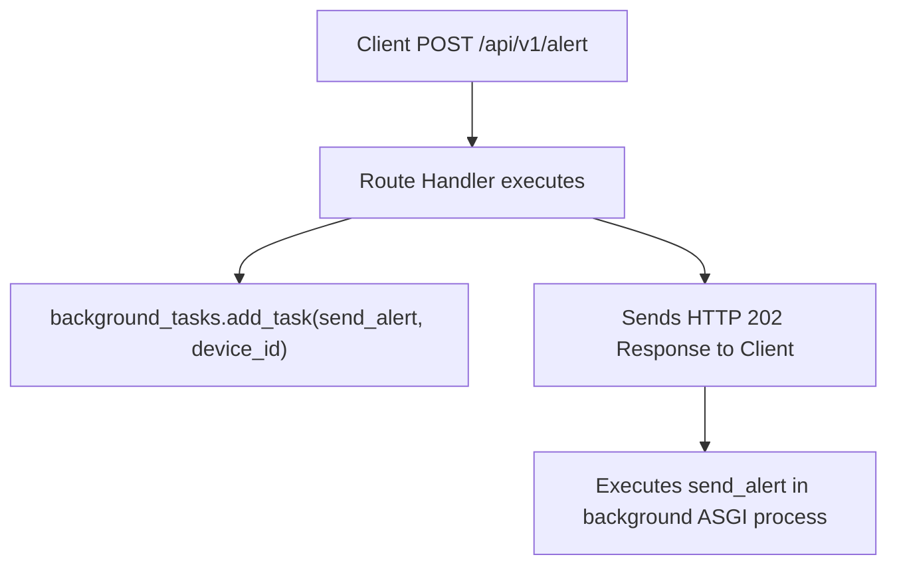

```yaml
schema_version: "2.0"
metadata:
  lesson_id: "FAP-MOD08-LES01"
  course_slug: "course-05-fastapi"
  course_title: "Course 5: FastAPI High-Performance Microservices"
  module_slug: "mod-08-background-tasks-events"
  module_title: "Module 8 - Background Tasks & Asynchronous Event Handlers"
  lesson_slug: "fastapi-background-tasks"
  lesson_title: "Lesson 8.1 FastAPI Background Tasks"
  sort_order: 801

pedagogy:
  difficulty: "beginner"
  estimated_time:
    reading_minutes: 15
    practice_minutes: 20
    quiz_minutes: 10
    total_minutes: 45
  bloom_taxonomy_level: "Apply"
  xp_reward: 50

prerequisites:
  required_lesson_ids:
    - "FAP-MOD07-LES02"
  required_skills:
    - "FastAPI Parameter Annotations & Async Route Handlers"

skills_acquired:
  - "Integrating FastAPI `BackgroundTasks` Class"
  - "Adding Asynchronous Operations via `background_tasks.add_task()`"
  - "Offloading In-Process Operations (Email, Audit Logs, File Writing)"
  - "Differentiating `BackgroundTasks` vs Celery Distributed Queues"

dependencies:
  software:
    - "VS Code"
    - "Python 3.12+"
    - "fastapi"
  hardware: []

seo_and_social:
  meta_title: "FastAPI Background Tasks: BackgroundTasks, add_task & Non-blocking Operations"
  meta_description: "Master FastAPI Background Tasks: using BackgroundTasks class, offloading operations with add_task(), in-process task execution, and when to use Celery."
  keywords: ["FastAPI BackgroundTasks", "add_task", "FastAPI Background Processing", "Non-blocking Operations", "Python Async Tasks"]

assessment_config:
  has_quiz: true
  has_lab: true
  has_flashcards: true
  pass_score_percentage: 80
```

# Lesson 8.1 FastAPI Background Tasks

## 1. Overview & Learning Objectives [id: overview]

- **Estimated Time**: 45 Minutes (15m Reading | 20m Practice | 10m Quiz)
- **Difficulty Level**: ⭐ Beginner
- **Prerequisites**: [Lesson 7.2 Request Timing](file:///d:/My%20Drive/all%20files/PROJECT%20FILES/notes/docs/curriculum/_05_fastapi/_05_14_request_timing_headers_and_performance_logging.md)
- **XP Reward**: +50 XP

### Learning Objectives
By the end of this lesson, you will be able to:
1. Utilize FastAPI's built-in **`BackgroundTasks`** parameter class.
2. Schedule post-response tasks using **`background_tasks.add_task()`**.
3. Offload light in-process operations (sending notifications, writing log files).
4. Differentiate between in-process `BackgroundTasks` and external distributed task queues like Celery.

---

## 2. Environment & Prerequisites [id: prerequisites]

Open Python REPL or VS Code.

---

## 3. Theoretical Foundations [id: theory]

### 3.1 What are FastAPI BackgroundTasks?
When an HTTP endpoint triggers non-critical side effects (such as writing an audit log entry or sending a confirmation email), forcing the user to wait until the side effect completes delays the HTTP response.

FastAPI provides a built-in **`BackgroundTasks`** parameter. Operations added via `background_tasks.add_task()` execute **AFTER** the HTTP response has been sent back to the client:

```
┌─────────────────────────────────────────────────────────────────────────────┐
│                       FASTAPI BACKGROUND TASKS FLOW                         │
├─────────────────────────────────────────────────────────────────────────────┤
│ Client Request ──► Route handler executes `background_tasks.add_task(func)`│
│                ──► Returns HTTP 202 Accepted immediately to Client!         │
│                ──► Server executes `func()` in the background post-response │
└─────────────────────────────────────────────────────────────────────────────┘
```

> [!NOTE]
> **`BackgroundTasks` vs Celery**: FastAPI `BackgroundTasks` run within the same Python ASGI process. For CPU-intensive operations or heavy distributed processing, use Celery with Redis instead.

---

## 4. Architecture & Diagram Visualizations [id: diagram]



---

## 5. Code & Hardware Implementation [id: syntax]

```python
# FastAPI BackgroundTasks Demonstration (background_demo.py)
import time
from fastapi import FastAPI, BackgroundTasks, status

app = FastAPI(title="Background Tasks API")

# Background Task Function
def write_audit_log(device_id: str, action: str):
    time.sleep(2) # Simulate 2-second log write operation!
    with open("audit.log", "a") as f:
        f.write(f"[{time.ctime()}] Device={device_id} Action={action}\n")
    print(f"[Background Task Complete]: Logged action for {device_id}")

@app.post("/api/v1/devices/{device_id}/reset", status_code=status.HTTP_202_ACCEPTED)
def reset_device_node(device_id: str, background_tasks: BackgroundTasks):
    # Schedule background task to run AFTER response is sent!
    background_tasks.add_task(write_audit_log, device_id, action="HARD_RESET")

    # Returns HTTP 202 Accepted IMMEDIATELY to client!
    return {
        "status": "ACCEPTED",
        "message": f"Reset command issued to {device_id}. Audit logging in background."
    }
```

---

## 6. Enterprise Real-World Applications [id: examples]

- **Microservice Audit & Notification Hooks**: API endpoints dispatch audit logs to secondary logging services or push Slack notification webhooks in the background, keeping API response latencies under 10ms.

---

## 7. Guided Step-by-Step Hands-On Exercise [id: exercises]

1. Save code as `background_demo.py`.
2. Run `uvicorn background_demo:app --reload`.
3. Send POST to `/api/v1/devices/ESP32-99/reset` $\to$ Observe instant HTTP 202 response and watch terminal print log 2 seconds later!

---

## 8. Common Pitfalls & Troubleshooting [id: common_mistakes]

| Bug / Error | Root Cause | Engineering Solution |
| :--- | :--- | :--- |
| **Response Blocked by Task** | Invoking `write_audit_log()` directly instead of `background_tasks.add_task(write_audit_log)`. | Pass the function reference and positional arguments into `background_tasks.add_task()`. |

---

## 9. Best Practices & Optimization [id: best_practices]

- **Use for Light Tasks**: Use `BackgroundTasks` for light in-process tasks. Switch to Celery for heavy CPU calculations or long-running tasks.

---

## 10. Industry Interview Q&A [id: interview_qa]

### Q1: When should you use FastAPI `BackgroundTasks` versus an external task queue like Celery?
**Answer**: Use FastAPI `BackgroundTasks` for light, non-critical in-process operations (like writing access logs or sending single email notifications) that do not require complex retry logic or persistent storage. Use Celery when tasks require heavy CPU computation, distributed multi-server processing, persistent task state, or automatic exponential retries.

---

## 11. Self-Assessment Quiz [id: quiz]

```json
{
  "quiz_title": "Lesson 8.1 Background Tasks Assessment",
  "questions": [
    {
      "question_id": "Q1",
      "type": "multiple_choice",
      "question_text": "Which FastAPI parameter class schedules functions to execute after an HTTP response is sent?",
      "options": ["BackgroundTasks", "AsyncTask", "CeleryQueue", "ThreadTask"],
      "correct_answer_index": 0,
      "explanation": "BackgroundTasks handles post-response background execution."
    }
  ]
}
```

---

## 12. Portfolio Assignment & Challenge [id: lab]

Build a route scheduling background audit logging tasks via `BackgroundTasks`.

---

## 13. Spaced Repetition Flashcards [id: flashcards]

**Front**: What method adds a function to FastAPI's `BackgroundTasks` pipeline?
**Back**: `background_tasks.add_task(func, *args, **kwargs)`.
<!-- flashcard:end -->

---

## 14. Summary & Cheat Sheet [id: summary]

```python
@app.post("/log")
def log(bg: BackgroundTasks):
    bg.add_task(write_file, "data")
    return {"status": "ok"}
```
