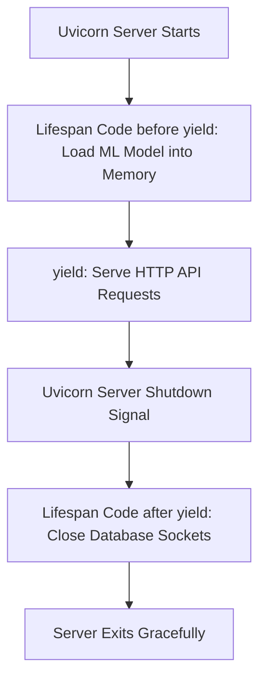

```yaml
schema_version: "2.0"
metadata:
  lesson_id: "FAP-MOD08-LES02"
  course_slug: "course-05-fastapi"
  course_title: "Course 5: FastAPI High-Performance Microservices"
  module_slug: "mod-08-background-tasks-events"
  module_title: "Module 8 - Background Tasks & Asynchronous Event Handlers"
  lesson_slug: "lifespan-event-handlers"
  lesson_title: "Lesson 8.2 Lifespan Event Handlers"
  sort_order: 802

pedagogy:
  difficulty: "intermediate"
  estimated_time:
    reading_minutes: 15
    practice_minutes: 20
    quiz_minutes: 10
    total_minutes: 45
  bloom_taxonomy_level: "Apply"
  xp_reward: 50

prerequisites:
  required_lesson_ids:
    - "FAP-MOD08-LES01"
  required_skills:
    - "FastAPI Application Instantiation & Async Context Managers"

skills_acquired:
  - "Writing Lifespan Context Managers (`@asynccontextmanager`)"
  - "Executing Startup Logic (Database Pooling, ML Model Pre-loading)"
  - "Executing Shutdown Logic (Connection Teardown, Cache Flushing)"
  - "Migrating from Deprecated `@app.on_event('startup')`"

dependencies:
  software:
    - "VS Code"
    - "Python 3.12+"
    - "fastapi"
  hardware: []

seo_and_social:
  meta_title: "FastAPI Lifespan Events: @asynccontextmanager, Startup & Shutdown Hooks"
  meta_description: "Master FastAPI Lifespan Events: writing asynccontextmanager lifespan functions, executing startup logic (ML models, DB pools), and shutdown cleanup hooks."
  keywords: ["FastAPI Lifespan", "@asynccontextmanager", "FastAPI Startup", "FastAPI Shutdown", "Lifespan Event Handlers", "ML Model Preloading"]

assessment_config:
  has_quiz: true
  has_lab: true
  has_flashcards: true
  pass_score_percentage: 80
```

# Lesson 8.2 Lifespan Event Handlers

## 1. Overview & Learning Objectives [id: overview]

- **Estimated Time**: 45 Minutes (15m Reading | 20m Practice | 10m Quiz)
- **Difficulty Level**: ⭐⭐ Intermediate
- **Prerequisites**: [Lesson 8.1 Background Tasks](file:///d:/My%20Drive/all%20files/PROJECT%20FILES/notes/docs/curriculum/_05_fastapi/_05_15_fastapi_background_tasks.md)
- **XP Reward**: +50 XP

### Learning Objectives
By the end of this lesson, you will be able to:
1. Understand the modern **Lifespan** architecture in FastAPI.
2. Define startup and shutdown hooks using **`@asynccontextmanager`**.
3. Pre-load Machine Learning models or database pools on server startup.
4. Execute clean connection pool teardown on server shutdown.

---

## 2. Environment & Prerequisites [id: prerequisites]

Open Python REPL or VS Code.

---

## 3. Theoretical Foundations [id: theory]

### 3.1 What are Lifespan Events?
Application **Lifespan Events** allow you to define code that runs **BEFORE** the application starts receiving HTTP requests (Startup) and code that runs **AFTER** the application finishes handling requests (Shutdown).

Modern FastAPI uses Python's `@asynccontextmanager` context manager passed into `FastAPI(lifespan=lifespan)` (replacing deprecated `@app.on_event("startup")`):

```
┌─────────────────────────────────────────────────────────────────────────────┐
│                          FASTAPI LIFESPAN EVENT CYCLE                       │
├─────────────────────────────────────────────────────────────────────────────┤
│ 1. Code before `yield`: Startup Phase (Preload ML Model, Init DB Tables)   │
│ 2. `yield`: Application handles incoming HTTP client requests               │
│ 3. Code after `yield`: Shutdown Phase (Close DB Connection Pool)            │
└─────────────────────────────────────────────────────────────────────────────┘
```

---

## 4. Architecture & Diagram Visualizations [id: diagram]



---

## 5. Code & Hardware Implementation [id: syntax]

```python
# FastAPI Lifespan Event Handler Demonstration (lifespan_demo.py)
from contextlib import asynccontextmanager
from fastapi import FastAPI

# Simulated Heavy Machine Learning Model or DB Connection Pool
ml_models = {}

# 1. Define Modern Async Lifespan Context Manager
@asynccontextmanager
async def lifespan(app: FastAPI):
    # --- STARTUP PHASE ---
    print("[Lifespan Startup]: Pre-loading Heavy Machine Learning Model into GPU Memory...")
    ml_models["anomaly_detector"] = lambda temp: temp > 80.0
    print("[Lifespan Startup]: Machine Learning Model Ready!")

    yield # Yield control to application to process requests!

    # --- SHUTDOWN PHASE ---
    print("[Lifespan Shutdown]: Flushing In-Memory Caches & Closing DB Connection Pools...")
    ml_models.clear()
    print("[Lifespan Shutdown]: Cleanup Complete. Graceful Exit.")

# 2. Instantiate FastAPI App with Lifespan Argument
app = FastAPI(title="Lifespan Event API", lifespan=lifespan)

@app.get("/api/v1/detect-anomaly")
def detect_anomaly(temperature: float):
    detector = ml_models.get("anomaly_detector")
    is_anomaly = detector(temperature) if detector else False
    return {"temperature": temperature, "is_anomaly": is_anomaly}
```

---

## 6. Enterprise Real-World Applications [id: examples]

- **AI/ML Model Microservices**: Production FastAPI inference services pre-load multi-gigabyte PyTorch/TensorFlow models into GPU memory during the lifespan startup phase, avoiding model load delays on individual API requests.

---

## 7. Guided Step-by-Step Hands-On Exercise [id: exercises]

1. Save code as `lifespan_demo.py`.
2. Run `uvicorn lifespan_demo:app --reload`.
3. Stop server using `Ctrl+C` $\to$ Inspect terminal logs for both Startup pre-load and Shutdown cleanup messages!

---

## 8. Common Pitfalls & Troubleshooting [id: common_mistakes]

| Bug / Error | Root Cause | Engineering Solution |
| :--- | :--- | :--- |
| **`DeprecationWarning: on_event is deprecated`** | Using legacy `@app.on_event("startup")` or `@app.on_event("shutdown")`. | Migrate to modern `lifespan` context manager using `@asynccontextmanager`. |

---

## 9. Best Practices & Optimization [id: best_practices]

- **Use `lifespan` Argument**: Always pass the lifespan context manager into `FastAPI(lifespan=lifespan)`.

---

## 10. Industry Interview Q&A [id: interview_qa]

### Q1: Why did FastAPI deprecate `@app.on_event("startup")` in favor of the `lifespan` context manager?
**Answer**: The `@asynccontextmanager` lifespan pattern unifies startup and shutdown logic into a single function. Variables initialized during startup (like state dictionaries or database connection pools) remain naturally in scope for shutdown cleanup code after `yield`, improving type safety and avoiding global variables.

---

## 11. Self-Assessment Quiz [id: quiz]

```json
{
  "quiz_title": "Lesson 8.2 Lifespan Assessment",
  "questions": [
    {
      "question_id": "Q1",
      "type": "multiple_choice",
      "question_text": "Which Python decorator from contextlib defines modern lifespan context managers in FastAPI?",
      "options": ["@contextmanager", "@asynccontextmanager", "@lifespan_event", "@startup_event"],
      "correct_answer_index": 1,
      "explanation": "@asynccontextmanager defines modern async lifespan managers."
    }
  ]
}
```

---

## 12. Portfolio Assignment & Challenge [id: lab]

Build a lifespan context manager pre-loading an in-memory cache and tearing it down on shutdown.

---

## 13. Spaced Repetition Flashcards [id: flashcards]

**Front**: Where is the lifespan function registered on a FastAPI application instance?
**Back**: `app = FastAPI(lifespan=my_lifespan_func)`.
<!-- flashcard:end -->

---

## 14. Summary & Cheat Sheet [id: summary]

```python
@asynccontextmanager
async def lifespan(app: FastAPI):
    # Startup code
    yield
    # Shutdown code
app = FastAPI(lifespan=lifespan)
```
