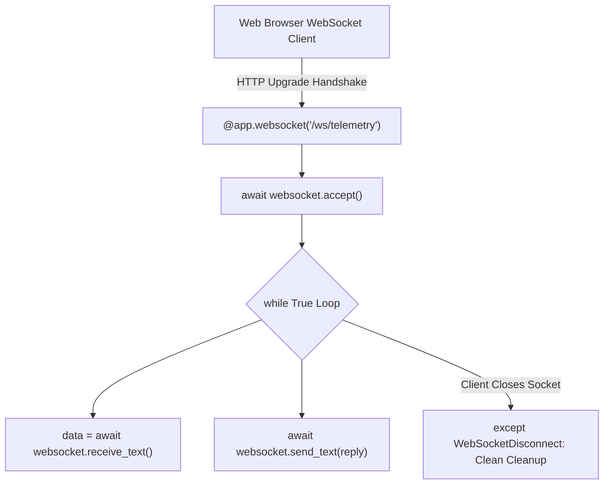

```yaml
schema_version: "2.0"
metadata:
  lesson_id: "FAP-MOD09-LES01"
  course_slug: "course-05-fastapi"
  course_title: "Course 5: FastAPI High-Performance Microservices"
  module_slug: "mod-09-websockets-realtime"
  module_title: "Module 9 - WebSockets & Real-Time Communication"
  lesson_slug: "websockets-protocol-and-endpoint-handling"
  lesson_title: "Lesson 9.1 WebSockets Protocol & Endpoint Handling"
  sort_order: 901

pedagogy:
  difficulty: "advanced"
  estimated_time:
    reading_minutes: 20
    practice_minutes: 25
    quiz_minutes: 10
    total_minutes: 55
  bloom_taxonomy_level: "Apply"
  xp_reward: 70

prerequisites:
  required_lesson_ids:
    - "FAP-MOD08-LES02"
  required_skills:
    - "FastAPI Async Route Handlers & WebSockets Basics"

skills_acquired:
  - "Understanding Full-Duplex WebSocket Protocol (`ws://` / `wss://`)"
  - "Defining FastAPI WebSocket Endpoints (`@app.websocket`)"
  - "Accepting & Receiving Messages (`websocket.accept()`, `websocket.receive_text()`)"
  - "Handling Disconnections (`WebSocketDisconnect`)"

dependencies:
  software:
    - "VS Code"
    - "Python 3.12+"
    - "fastapi"
  hardware: []

seo_and_social:
  meta_title: "FastAPI WebSockets: @app.websocket, receive_text & WebSocketDisconnect"
  meta_description: "Master Real-Time WebSockets in FastAPI: full-duplex WebSocket protocol, @app.websocket endpoints, accepting connections, receiving messages, and WebSocketDisconnect handling."
  keywords: ["FastAPI WebSockets", "@app.websocket", "WebSocketDisconnect", "Real-time Communication", "Full Duplex", "Python WebSockets"]

assessment_config:
  has_quiz: true
  has_lab: true
  has_flashcards: true
  pass_score_percentage: 80
```

# Lesson 9.1 WebSockets Protocol & Endpoint Handling

## 1. Overview & Learning Objectives [id: overview]

- **Estimated Time**: 55 Minutes (20m Reading | 25m Practice | 10m Quiz)
- **Difficulty Level**: ⭐⭐⭐ Advanced
- **Prerequisites**: [Lesson 8.2 Lifespan Handlers](file:///d:/My%20Drive/all%20files/PROJECT%20FILES/notes/docs/curriculum/_05_fastapi/_05_16_lifespan_event_handlers.md)
- **XP Reward**: +70 XP

### Learning Objectives
By the end of this lesson, you will be able to:
1. Explain the **Full-Duplex WebSocket (`ws://` / `wss://`)** protocol lifecycle.
2. Define WebSocket route endpoints using **`@app.websocket()`**.
3. Accept connections and exchange text/JSON messages using `websocket.accept()`, `websocket.receive_text()`, and `websocket.send_text()`.
4. Handle abrupt client disconnects cleanly using **`WebSocketDisconnect`**.

---

## 2. Environment & Prerequisites [id: prerequisites]

Open Python REPL or VS Code.

---

## 3. Theoretical Foundations [id: theory]

### 3.1 HTTP Polling vs Full-Duplex WebSockets
Traditional HTTP request-response architecture requires clients to constantly poll the server for new data.

**WebSockets (RFC 6455)** establish a persistent, low-latency, full-duplex TCP connection over a single socket after an initial HTTP upgrade handshake. Both client and server can send messages independently at any time:

```
┌─────────────────────────────────────────────────────────────────────────────┐
│                          WEBSOCKET HANDSHAKE & DUPLEX FLOW                  │
├─────────────────────────────────────────────────────────────────────────────┤
│ 1. HTTP GET `/ws` (Header: `Upgrade: websocket`) ──► Handshake Accepted     │
│ 2. Persistent TCP Connection Established (`ws://host/ws`)                   │
│    ├── Client ──► `websocket.send_json({"command": "START"})`               │
│    └── Server ──► `websocket.send_json({"temp": 24.5})` (Bi-directional!)  │
└─────────────────────────────────────────────────────────────────────────────┘
```

---

## 4. Architecture & Diagram Visualizations [id: diagram]



---

## 5. Code & Hardware Implementation [id: syntax]

```python
# FastAPI WebSocket Endpoint (websocket_demo.py)
from fastapi import FastAPI, WebSocket, WebSocketDisconnect

app = FastAPI(title="WebSocket Telemetry API")

@app.websocket("/ws/telemetry/{client_id}")
async def websocket_telemetry_endpoint(websocket: WebSocket, client_id: str):
    # 1. Accept incoming WebSocket connection handshake
    await websocket.accept()
    print(f"[WebSocket Connected]: Client {client_id} connected.")
    
    try:
        # 2. Continuous Bi-Directional Message Loop
        while True:
            # Receive text message from client
            data = await websocket.receive_text()
            print(f"[Message Received from {client_id}]: {data}")

            # Send real-time response back to client
            response_payload = f"Echo [{client_id}]: Processed telemetry '{data}'"
            await websocket.send_text(response_payload)

    except WebSocketDisconnect:
        # 3. Clean disconnect handling when client closes tab/socket
        print(f"[WebSocket Disconnected]: Client {client_id} closed connection.")
```

---

## 6. Enterprise Real-World Applications [id: examples]

- **Real-Time IoT Telemetry Dashboards**: Web applications stream live temperature readings, factory machine status, and sensor alerts directly to browser dashboards over WebSockets without polling overhead.

---

## 7. Guided Step-by-Step Hands-On Exercise [id: exercises]

1. Save code as `websocket_demo.py`.
2. Run `uvicorn websocket_demo:app --reload`.
3. Open browser console and execute: `let ws = new WebSocket("ws://localhost:8000/ws/telemetry/node1"); ws.onmessage = e => console.log(e.data); ws.send("24.5C");` $\to$ Inspect live websocket echo response!

---

## 8. Common Pitfalls & Troubleshooting [id: common_mistakes]

| Bug / Error | Root Cause | Engineering Solution |
| :--- | :--- | :--- |
| **`RuntimeError: Unexpected ASGI message 'websocket.send'`** | Forgetting to call `await websocket.accept()` before trying to send or receive messages. | Always call `await websocket.accept()` as the first operation inside `@app.websocket`. |

---

## 9. Best Practices & Optimization [id: best_practices]

- **Always Handle `WebSocketDisconnect`**: Wrap `while True` loops in `try...except WebSocketDisconnect` to prevent unhandled tracebacks when clients disconnect.

---

## 10. Industry Interview Q&A [id: interview_qa]

### Q1: What is the purpose of `await websocket.accept()` in a FastAPI WebSocket endpoint?
**Answer**: `await websocket.accept()` completes the HTTP-to-WebSocket protocol upgrade handshake (returning HTTP 101 Switching Protocols). Calling `accept()` establishes the persistent full-duplex TCP socket, allowing subsequent `send_*()` and `receive_*()` calls to exchange data.

---

## 11. Self-Assessment Quiz [id: quiz]

```json
{
  "quiz_title": "Lesson 9.1 WebSockets Assessment",
  "questions": [
    {
      "question_id": "Q1",
      "type": "multiple_choice",
      "question_text": "Which exception is raised when a WebSocket client abruptly closes its connection?",
      "options": ["ConnectionResetError", "WebSocketDisconnect", "SocketClosedError", "HTTPException"],
      "correct_answer_index": 1,
      "explanation": "WebSocketDisconnect is raised when clients disconnect."
    }
  ]
}
```

---

## 12. Portfolio Assignment & Challenge [id: lab]

Build an echo WebSocket endpoint receiving JSON sensor payloads and returning status confirmations.

---

## 13. Spaced Repetition Flashcards [id: flashcards]

**Front**: What decorator defines a WebSocket endpoint in FastAPI?
**Back**: `@app.websocket("/path")`.
<!-- flashcard:end -->

---

## 14. Summary & Cheat Sheet [id: summary]

```python
@app.websocket("/ws")
async def ws_endpoint(ws: WebSocket):
    await ws.accept()
    data = await ws.receive_text()
    await ws.send_text(f"Echo {data}")
```
