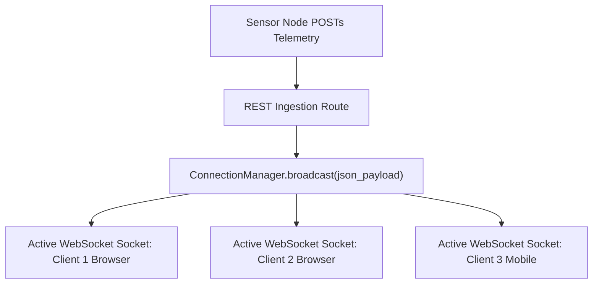

```yaml
schema_version: "2.0"
metadata:
  lesson_id: "FAP-MOD09-LES02"
  course_slug: "course-05-fastapi"
  course_title: "Course 5: FastAPI High-Performance Microservices"
  module_slug: "mod-09-websockets-realtime"
  module_title: "Module 9 - WebSockets & Real-Time Communication"
  lesson_slug: "realtime-connection-manager-and-broadcasting"
  lesson_title: "Lesson 9.2 Real-Time Connection Manager & Broadcasting"
  sort_order: 902

pedagogy:
  difficulty: "advanced"
  estimated_time:
    reading_minutes: 20
    practice_minutes: 25
    quiz_minutes: 10
    total_minutes: 55
  bloom_taxonomy_level: "Apply"
  xp_reward: 70

prerequisites:
  required_lesson_ids:
    - "FAP-MOD09-LES01"
  required_skills:
    - "FastAPI WebSockets Basics & Disconnect Handling"

skills_acquired:
  - "Constructing an In-Memory `ConnectionManager` Class"
  - "Tracking Active WebSocket Connections (`connect()`, `disconnect()`)"
  - "Broadcasting JSON Data to All Connected Clients (`broadcast()`)"
  - "Real-Time Telemetry Streaming to Multiple Web Browsers"

dependencies:
  software:
    - "VS Code"
    - "Python 3.12+"
    - "fastapi"
  hardware: []

seo_and_social:
  meta_title: "FastAPI ConnectionManager: WebSocket Broadcasting & Multi-Client Streaming"
  meta_description: "Master Real-Time Broadcasting in FastAPI: designing an in-memory ConnectionManager class, tracking active WebSocket sockets, and broadcasting JSON telemetry to multiple connected web clients."
  keywords: ["ConnectionManager", "WebSocket Broadcasting", "FastAPI Broadcasting", "Real-time Streaming", "Multi-client WebSocket"]

assessment_config:
  has_quiz: true
  has_lab: true
  has_flashcards: true
  pass_score_percentage: 80
```

# Lesson 9.2 Real-Time Connection Manager & Broadcasting

## 1. Overview & Learning Objectives [id: overview]

- **Estimated Time**: 55 Minutes (20m Reading | 25m Practice | 10m Quiz)
- **Difficulty Level**: ⭐⭐⭐ Advanced
- **Prerequisites**: [Lesson 9.1 WebSockets Basics](file:///d:/My%20Drive/all%20files/PROJECT%20FILES/notes/docs/curriculum/_05_fastapi/_05_17_websockets_protocol_and_endpoint_handling.md)
- **XP Reward**: +70 XP

### Learning Objectives
By the end of this lesson, you will be able to:
1. Design an in-memory **`ConnectionManager`** class for WebSocket socket management.
2. Track connected active clients (`connect()`, `disconnect()`).
3. Broadcast messages to all connected clients simultaneously using **`broadcast()`**.
4. Push real-time sensor telemetry updates to multi-user web dashboards.

---

## 2. Environment & Prerequisites [id: prerequisites]

Open Python REPL or VS Code.

---

## 3. Theoretical Foundations [id: theory]

### 3.1 The Connection Manager Pattern
A single WebSocket connection only links one client to the server. To stream telemetry or chat messages to *multiple* web browsers simultaneously, the application must track all active `WebSocket` connection objects in a centralized **`ConnectionManager`** list.

```
┌─────────────────────────────────────────────────────────────────────────────┐
│                       CONNECTION MANAGER BROADCAST FLOW                     │
├─────────────────────────────────────────────────────────────────────────────┤
│ Sensor Device POSTs Data ──► `manager.broadcast({"temp": 28.4})`            │
│                              ├── Loop over `active_connections` list        │
│                              ├── Client 1 (Browser A) ◄── receives JSON     │
│                              └── Client 2 (Browser B) ◄── receives JSON     │
└─────────────────────────────────────────────────────────────────────────────┘
```

---

## 4. Architecture & Diagram Visualizations [id: diagram]



---

## 5. Code & Hardware Implementation [id: syntax]

```python
# ConnectionManager & Real-Time Broadcasting (broadcasting_demo.py)
from fastapi import FastAPI, WebSocket, WebSocketDisconnect, status
from pydantic import BaseModel

app = FastAPI(title="Real-Time Telemetry Broadcast API")

# 1. In-Memory ConnectionManager Class
class ConnectionManager:
    def __init__(self):
        # List storing all currently connected WebSocket instances
        self.active_connections: list[WebSocket] = []

    async def connect(self, websocket: WebSocket):
        await websocket.accept()
        self.active_connections.append(websocket)
        print(f"[Manager]: Client added. Active connections: {len(self.active_connections)}")

    def disconnect(self, websocket: WebSocket):
        if websocket in self.active_connections:
            self.active_connections.remove(websocket)
            print(f"[Manager]: Client removed. Active connections: {len(self.active_connections)}")

    async def broadcast(self, message: dict):
        # Iterate over all active socket connections and send JSON message!
        for connection in self.active_connections:
            await connection.send_json(message)

manager = ConnectionManager()

# Telemetry Schema
class TelemetryPayload(BaseModel):
    node_id: str
    temperature: float

# 2. WebSocket Subscription Endpoint for Web Dashboards
@app.websocket("/ws/telemetry-stream")
async def telemetry_stream(websocket: WebSocket):
    await manager.connect(websocket)
    try:
        while True:
            # Keep socket connection alive
            await websocket.receive_text()
    except WebSocketDisconnect:
        manager.disconnect(websocket)

# 3. REST Endpoint triggering Real-Time Broadcast to all WebSocket Clients!
@app.post("/api/v1/telemetry/ingest", status_code=status.HTTP_202_ACCEPTED)
async def ingest_telemetry(payload: TelemetryPayload):
    broadcast_data = {
        "event": "TELEMETRY_UPDATE",
        "node_id": payload.node_id,
        "temperature": payload.temperature
    }
    # Broadcast to all connected web browsers!
    await manager.broadcast(broadcast_data)
    return {"status": "INGESTED", "broadcast_clients": len(manager.active_connections)}
```

---

## 6. Enterprise Real-World Applications [id: examples]

- **Live Monitoring Command Centers**: Industrial control rooms use `ConnectionManager` broadcasting to push instant critical machine alarms to all open monitoring browser screens without page reloads.

---

## 7. Guided Step-by-Step Hands-On Exercise [id: exercises]

1. Save code as `broadcasting_demo.py`.
2. Run `uvicorn broadcasting_demo:app --reload`.
3. Open 2 browser tabs at `ws://localhost:8000/ws/telemetry-stream`.
4. Send POST request to `/api/v1/telemetry/ingest` with `{"node_id": "ESP32-1", "temperature": 32.4}` $\to$ Inspect live broadcast received in both browser tabs!

---

## 8. Common Pitfalls & Troubleshooting [id: common_mistakes]

| Bug / Error | Root Cause | Engineering Solution |
| :--- | :--- | :--- |
| **`RuntimeError: Cannot call send_json after disconnect`** | Failing to call `manager.disconnect(websocket)` when a client disconnects, leaving dead sockets in `active_connections`. | Remove disconnected socket instances inside `except WebSocketDisconnect:` blocks immediately. |

---

## 9. Best Practices & Optimization [id: best_practices]

- **Always Remove Dead Sockets on Disconnect**: Call `manager.disconnect(websocket)` inside `except WebSocketDisconnect:` blocks to keep `active_connections` clean.

---

## 10. Industry Interview Q&A [id: interview_qa]

### Q1: How do you scale WebSocket broadcasting across multiple Uvicorn worker processes or servers?
**Answer**: In multi-process or multi-server deployments, in-memory `ConnectionManager` instances cannot share sockets across process boundaries. To scale, use a Pub/Sub message broker (like **Redis Pub/Sub**). When an API process receives data, it publishes a message to Redis, and all server instances subscribe to Redis and broadcast to their local connected WebSocket sockets.

---

## 11. Self-Assessment Quiz [id: quiz]

```json
{
  "quiz_title": "Lesson 9.2 ConnectionManager Assessment",
  "questions": [
    {
      "question_id": "Q1",
      "type": "multiple_choice",
      "question_text": "Which method sends JSON data to all active WebSocket connections in a ConnectionManager list?",
      "options": ["manager.send_all()", "manager.broadcast()", "manager.emit_every()", "manager.publish()"],
      "correct_answer_index": 1,
      "explanation": "manager.broadcast() sends data to all active connections."
    }
  ]
}
```

---

## 12. Portfolio Assignment & Challenge [id: lab]

Build a `ConnectionManager` broadcasting live temperature telemetry updates.

---

## 13. Spaced Repetition Flashcards [id: flashcards]

**Front**: How do you send a JSON payload over a FastAPI WebSocket connection?
**Back**: `await websocket.send_json({"key": "value"})`.
<!-- flashcard:end -->

---

## 14. Summary & Cheat Sheet [id: summary]

```python
class Manager:
    def __init__(self): self.conns = []
    async def broadcast(self, data):
        for c in self.conns: await c.send_json(data)
```
