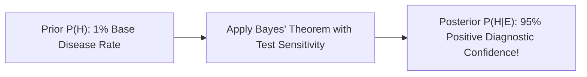

```yaml
schema_version: "2.0"
metadata:
  lesson_id: "DS-MOD01-LES05"
  course_slug: "course-01-ds-math"
  course_title: "Course 1: Mathematics & Statistics for Data Science"
  module_slug: "mod-01-probability-statistics"
  module_title: "Module 1.2 - Probability Theory & Random Variables"
  lesson_slug: "probability-fundamentals-and-axioms"
  lesson_title: "Lesson 1.2.1 Probability Fundamentals & Axioms"
  sort_order: 105

pedagogy:
  difficulty: "intermediate"
  estimated_time:
    reading_minutes: 15
    practice_minutes: 20
    quiz_minutes: 10
    total_minutes: 45
  bloom_taxonomy_level: "Apply"
  xp_reward: 50

prerequisites:
  required_lesson_ids:
    - "Python.Functions"
  required_skills:
    - "Basic Sets & Python Logic"

skills_acquired:
  - "Kolmogorov Probability Axioms"
  - "Conditional Probability Calculation ($P(A|B)$)"
  - "Bayes' Theorem ($P(A|B) = \frac{P(B|A)P(A)}{P(B)}$)"
  - "Law of Total Probability"

dependencies:
  software:
    - "VS Code"
    - "Python 3.11+"
  hardware: []

seo_and_social:
  meta_title: "Probability Fundamentals, Bayes' Theorem & Conditional Probability"
  meta_description: "Master probability theory for data science: Kolmogorov axioms, conditional probability, Bayes' Theorem, prior vs posterior, and Law of Total Probability."
  keywords: ["Probability Theory", "Bayes Theorem", "Conditional Probability", "Prior Posterior", "Kolmogorov Axioms", "Law of Total Probability"]

assessment_config:
  has_quiz: true
  has_lab: true
  has_flashcards: true
  pass_score_percentage: 80
```

# Lesson 1.2.1 Probability Fundamentals & Axioms

## 1. Overview & Learning Objectives [id: overview]

- **Estimated Time**: 45 Minutes (15m Reading | 20m Practice | 10m Quiz)
- **Difficulty Level**: ⭐⭐ Intermediate
- **Prerequisites**: Reused Python Core (`Python.Functions`)
- **XP Reward**: +50 XP

### Learning Objectives
By the end of this lesson, you will be able to:
1. Apply the three Kolmogorov Probability Axioms to sample spaces $\Omega$.
2. Calculate Conditional Probability $P(A|B)$.
3. Implement **Bayes' Theorem** to update prior probabilities into posterior probabilities upon observing new evidence.
4. Utilize the Law of Total Probability for complex event partitioning.

---

## 2. Environment & Prerequisites [id: prerequisites]

Open VS Code and write python scripts to simulate Bayes' Theorem probabilities.

---

## 3. Theoretical Foundations [id: theory]

### 3.1 Kolmogorov Probability Axioms
1. **Non-negativity**: $P(E) \geq 0$ for any event $E$.
2. **Unitarity**: $P(\Omega) = 1$ for the entire sample space $\Omega$.
3. **Additivity**: For mutually exclusive events $E_1, E_2, \dots$:

$$P\left( \bigcup_{i=1}^{\infty} E_i \right) = \sum_{i=1}^{\infty} P(E_i)$$

### 3.2 Bayes' Theorem
Bayes' Theorem updates the probability of a hypothesis $H$ given observed evidence $E$:

$$P(H|E) = \frac{P(E|H) \cdot P(H)}{P(E)}$$

- $P(H)$: **Prior Probability** (Initial belief before evidence).
- $P(E|H)$: **Likelihood** (Probability of observing evidence given hypothesis).
- $P(E)$: **Marginal Likelihood / Evidence** ($P(E) = \sum P(E|H_i) P(H_i)$ via Law of Total Probability).
- $P(H|E)$: **Posterior Probability** (Updated belief after evidence).

---

## 4. Architecture & Diagram Visualizations [id: diagram]



---

## 5. Code & Hardware Implementation [id: syntax]

```python
# Bayes' Theorem Diagnostic Calculator

def bayes_theorem(prior, sensitivity, false_positive_rate):
    """
    prior: P(Disease)
    sensitivity: P(Positive | Disease)
    false_positive_rate: P(Positive | No Disease)
    """
    p_no_disease = 1.0 - prior
    
    # Law of Total Probability for P(Positive)
    p_positive = (sensitivity * prior) + (false_positive_rate * p_no_disease)
    
    # Posterior P(Disease | Positive)
    posterior = (sensitivity * prior) / p_positive
    return posterior

# Example: Rare Disease (1% prevalence), 99% Sensitivity, 5% False Positive Rate
posterior_prob = bayes_theorem(prior=0.01, sensitivity=0.99, false_positive_rate=0.05)
print(f"Posterior Probability of Disease given Positive Test: {posterior_prob:.4f}")
```

---

## 6. Enterprise Real-World Applications [id: examples]

- **Naive Bayes Classifiers**: Spam filtering and medical diagnosis algorithms calculate posterior probabilities $P(\text{Spam} | \text{Words})$ using Bayes' Theorem.

---

## 7. Guided Step-by-Step Hands-On Exercise [id: exercises]

1. Save code as `bayes_demo.py`.
2. Run `python bayes_demo.py` $\to$ Verify posterior probability is 16.64%!

---

## 8. Common Pitfalls & Troubleshooting [id: common_mistakes]

| Bug / Error | Root Cause | Engineering Solution |
| :--- | :--- | :--- |
| **Base Rate Fallacy** | Ignoring prior base probabilities $P(H)$ when interpreting diagnostic tests. | Always multiply likelihood by prior probability $P(H)$. |

---

## 9. Best Practices & Optimization [id: best_practices]

- **Always Calculate Marginal Likelihood $P(E)$**: Use Law of Total Probability.

---

## 10. Industry Interview Q&A [id: interview_qa]

### Q1: What is the difference between Prior Probability and Posterior Probability in Bayes' Theorem?
**Answer**: Prior probability $P(H)$ is the initial belief about an event before seeing any new data. Posterior probability $P(H|E)$ is the updated belief after observing and incorporating new evidence $E$.

---

## 11. Self-Assessment Quiz [id: quiz]

```json
{
  "quiz_title": "Lesson 1.2.1 Probability Assessment",
  "questions": [
    {
      "question_id": "Q1",
      "type": "multiple_choice",
      "question_text": "What term in Bayes' Theorem represents $P(E|H)$?",
      "options": ["Prior", "Likelihood", "Posterior", "Evidence"],
      "correct_answer_index": 1,
      "explanation": "P(E|H) represents Likelihood."
    }
  ]
}
```

---

## 12. Portfolio Assignment & Challenge [id: lab]

Build an interactive Naive Bayes spam filter likelihood calculator.

---

## 13. Spaced Repetition Flashcards [id: flashcards]

**Front**: What is the formula for Bayes' Theorem?
**Back**: $P(H|E) = \frac{P(E|H) P(H)}{P(E)}$
<!-- flashcard:end -->

---

## 14. Summary & Cheat Sheet [id: summary]

```python
posterior = (likelihood * prior) / evidence
```
