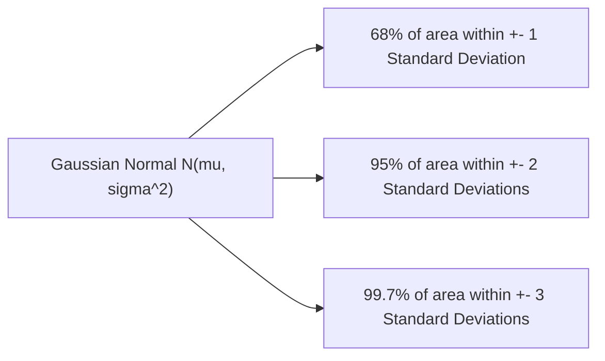

```yaml
schema_version: "2.0"
metadata:
  lesson_id: "DS-MOD01-LES06"
  course_slug: "course-01-ds-math"
  course_title: "Course 1: Mathematics & Statistics for Data Science"
  module_slug: "mod-01-probability-statistics"
  module_title: "Module 1.2 - Probability Theory & Random Variables"
  lesson_slug: "discrete-and-continuous-probability-distributions"
  lesson_title: "Lesson 1.2.2 Discrete & Continuous Probability Distributions"
  sort_order: 106

pedagogy:
  difficulty: "intermediate"
  estimated_time:
    reading_minutes: 20
    practice_minutes: 25
    quiz_minutes: 10
    total_minutes: 55
  bloom_taxonomy_level: "Apply"
  xp_reward: 60

prerequisites:
  required_lesson_ids:
    - "DS-MOD01-LES05"
  required_skills:
    - "Probability Axioms & Bayes' Theorem"

skills_acquired:
  - "Discrete vs Continuous Random Variable Definition"
  - "PMF, PDF, and CDF Mechanics"
  - "Discrete Distributions (Bernoulli, Binomial, Poisson)"
  - 'Continuous Distributions (Gaussian Normal $\mathcal{N}(\mu, \sigma^2)$, Exponential)'
  - "SciPy `scipy.stats` Distribution Modeling"

dependencies:
  software:
    - "VS Code"
    - "Python 3.11+ with SciPy & NumPy"
  hardware: []

seo_and_social:
  meta_title: "Probability Distributions: Gaussian Normal, Binomial, Poisson & SciPy Stats"
  meta_description: "Master probability distributions for data science: PMF, PDF, CDF, Binomial, Poisson, Gaussian Normal distribution N(mu, sigma^2), and Exponential."
  keywords: ["Probability Distributions", "Gaussian Distribution", "Normal Distribution", "PMF PDF CDF", "Poisson Distribution", "Binomial Distribution", "SciPy stats"]

assessment_config:
  has_quiz: true
  has_lab: true
  has_flashcards: true
  pass_score_percentage: 80
```

# Lesson 1.2.2 Discrete & Continuous Probability Distributions

## 1. Overview & Learning Objectives [id: overview]

- **Estimated Time**: 55 Minutes (20m Reading | 25m Practice | 10m Quiz)
- **Difficulty Level**: ⭐⭐ Intermediate
- **Prerequisites**: [Lesson 1.2.1 Probability Fundamentals](file:///d:/My%20Drive/all%20files/PROJECT%20FILES/notes/docs/curriculum/_08_ds_math/_01_05_probability_fundamentals_and_axioms.md)
- **XP Reward**: +60 XP

### Learning Objectives
By the end of this lesson, you will be able to:
1. Differentiate between Discrete and Continuous Random Variables $X$.
2. Compute PMF (Probability Mass Function), PDF (Probability Density Function), and CDF (Cumulative Distribution Function).
3. Model discrete event counts using **Binomial** and **Poisson** distributions.
4. Model continuous natural phenomena using the **Gaussian (Normal)** distribution $\mathcal{N}(\mu, \sigma^2)$.
5. Calculate probabilities using SciPy's `scipy.stats` module.

---

## 2. Environment & Prerequisites [id: prerequisites]

Open VS Code and install SciPy: `pip install scipy matplotlib`.

---

## 3. Theoretical Foundations [id: theory]

### 3.1 PMF, PDF, & CDF
- **PMF (Discrete)**: Probability that discrete $X$ equals exact value $k$: $P(X = k)$.
- **PDF (Continuous)**: Probability density $f(x)$ where area under curve represents probability:

$$P(a \leq X \leq b) = \int_{a}^{b} f(x) \, dx$$

- **CDF (Cumulative)**: Probability that $X \leq x$: $F(x) = P(X \leq x)$.

### 3.2 Gaussian (Normal) Distribution $\mathcal{N}(\mu, \sigma^2)$
The cornerstone of statistical modeling and machine learning noise assumptions:

$$f(x \mid \mu, \sigma^2) = \frac{1}{\sqrt{2\pi\sigma^2}} \exp\left( -\frac{(x - \mu)^2}{2\sigma^2} \right)$$

- 68–95–99.7 Empirical Rule: 68% of data falls within $\pm 1\sigma$, 95% within $\pm 2\sigma$, 99.7% within $\pm 3\sigma$.

---

## 4. Architecture & Diagram Visualizations [id: diagram]



---

## 5. Code & Hardware Implementation [id: syntax]

```python
import numpy as np
from scipy import stats

# 1. Discrete Binomial Distribution (10 coin flips, p=0.5)
# P(X = 5 heads)
prob_5_heads = stats.binom.pmf(k=5, n=10, p=0.5)
print(f"P(5 Heads in 10 Flips): {prob_5_heads:.4f}")

# 2. Continuous Gaussian Normal Distribution (mu=100, sigma=15)
# P(X <= 115) - Cumulative Density
prob_below_115 = stats.norm.cdf(x=115, loc=100, scale=15)
print(f"P(IQ <= 115): {prob_below_115:.4f}")
```

---

## 6. Enterprise Real-World Applications [id: examples]

- **Gaussian Error Assumptions**: Linear Regression OLS assumes residual errors follow a Gaussian Normal distribution $\mathcal{N}(0, \sigma^2)$.

---

## 7. Guided Step-by-Step Hands-On Exercise [id: exercises]

1. Save code as `dist_demo.py`.
2. Run `python dist_demo.py` $\to$ Verify $P(\text{IQ} \le 115) = 84.13\%$!

---

## 8. Common Pitfalls & Troubleshooting [id: common_mistakes]

| Bug / Error | Root Cause | Engineering Solution |
| :--- | :--- | :--- |
| **Evaluating PDF value as Probability** | Evaluating `stats.norm.pdf(x)` and assuming output is a percentage probability $> 1$. | Use `stats.norm.cdf(x)` or integrate PDF over an interval. |

---

## 9. Best Practices & Optimization [id: best_practices]

- **Use CDF for Range Probabilities**: Calculate $P(a \le X \le b) = F(b) - F(a)$.

---

## 10. Industry Interview Q&A [id: interview_qa]

### Q1: What is the difference between a PMF and a PDF?
**Answer**: A Probability Mass Function (PMF) maps discrete values to exact probabilities $P(X=k)$. A Probability Density Function (PDF) describes a continuous probability distribution where individual point probabilities equal 0, and probabilities are calculated by integrating area under the curve over an interval.

---

## 11. Self-Assessment Quiz [id: quiz]

```json
{
  "quiz_title": "Lesson 1.2.2 Distributions Assessment",
  "questions": [
    {
      "question_id": "Q1",
      "type": "multiple_choice",
      "question_text": "What percentage of data falls within $\\pm 2$ standard deviations in a Gaussian Normal distribution?",
      "options": ["68%", "95%", "99.7%", "50%"],
      "correct_answer_index": 1,
      "explanation": "Approximately 95% of data falls within 2 standard deviations."
    }
  ]
}
```

---

## 12. Portfolio Assignment & Challenge [id: lab]

Model IoT packet arrival times using the Poisson and Exponential distributions in SciPy.

---

## 13. Spaced Repetition Flashcards [id: flashcards]

**Front**: What distribution models the time between independent poisson events?
**Back**: The Exponential Distribution.
<!-- flashcard:end -->

---

## 14. Summary & Cheat Sheet [id: summary]

```python
from scipy import stats
prob = stats.norm.cdf(1.96) - stats.norm.cdf(-1.96) # 0.95
```
