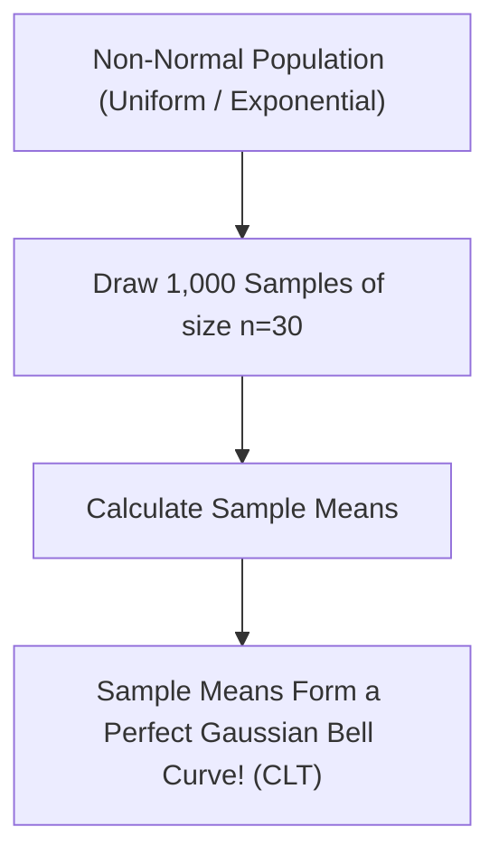

```yaml
schema_version: "2.0"
metadata:
  lesson_id: "DS-MOD01-LES07"
  course_slug: "course-01-ds-math"
  course_title: "Course 1: Mathematics & Statistics for Data Science"
  module_slug: "mod-01-probability-statistics"
  module_title: "Module 1.2 - Probability Theory & Random Variables"
  lesson_slug: "joint-marginal-and-conditional-distributions"
  lesson_title: "Lesson 1.2.3 Joint, Marginal, & Conditional Distributions"
  sort_order: 107

pedagogy:
  difficulty: "advanced"
  estimated_time:
    reading_minutes: 20
    practice_minutes: 25
    quiz_minutes: 10
    total_minutes: 55
  bloom_taxonomy_level: "Analyze"
  xp_reward: 70

prerequisites:
  required_lesson_ids:
    - "DS-MOD01-LES06"
  required_skills:
    - "Probability Distributions & Calculus"

skills_acquired:
  - 'Joint Probability Density Functions ($f(x,y)$)'
  - 'Marginalization Integration ($f_X(x) = \int f(x,y) dy$)'
  - 'Covariance ($\text{Cov}(X,Y)$) & Pearson Correlation ($\rho_{X,Y}$)'
  - 'Covariance Matrix Construction ($\Sigma$)'
  - "Central Limit Theorem (CLT) Simulation"

dependencies:
  software:
    - "VS Code"
    - "Python 3.11+ with NumPy & SciPy"
  hardware: []

seo_and_social:
  meta_title: "Joint Distributions, Covariance Matrix & Central Limit Theorem (CLT)"
  meta_description: "Master multi-variable probability: joint distributions f(x,y), marginalization, covariance matrix, Pearson correlation, and Central Limit Theorem (CLT)."
  keywords: ["Joint Distribution", "Marginal Probability", "Covariance Matrix", "Pearson Correlation", "Central Limit Theorem", "CLT", "Law of Large Numbers"]

assessment_config:
  has_quiz: true
  has_lab: true
  has_flashcards: true
  pass_score_percentage: 80
```

# Lesson 1.2.3 Joint, Marginal, & Conditional Distributions

## 1. Overview & Learning Objectives [id: overview]

- **Estimated Time**: 55 Minutes (20m Reading | 25m Practice | 10m Quiz)
- **Difficulty Level**: ⭐⭐⭐ Advanced
- **Prerequisites**: [Lesson 1.2.2 Probability Distributions](file:///d:/My%20Drive/all%20files/PROJECT%20FILES/notes/docs/curriculum/_08_ds_math/_01_06_discrete_and_continuous_probability_distributions.md)
- **XP Reward**: +70 XP

### Learning Objectives
By the end of this lesson, you will be able to:
1. Formulate Joint Probability Density Functions $f(x,y)$ for multiple random variables.
2. Extract Marginal Distributions $f_X(x)$ via integration/summation marginalization.
3. Compute Covariance $\text{Cov}(X,Y)$ and Pearson Correlation Coefficient $\rho_{X,Y}$.
4. Construct multi-dimensional **Covariance Matrices** ($\Sigma$).
5. Demonstrate the **Central Limit Theorem (CLT)** via numerical simulation.

---

## 2. Environment & Prerequisites [id: prerequisites]

Open VS Code and install NumPy/SciPy for numerical simulation.

---

## 3. Theoretical Foundations [id: theory]

### 3.1 Joint & Marginal Distributions
When two random variables $X$ and $Y$ interact, their joint distribution is $f(x,y)$.

Marginal distribution $f_X(x)$ integrates out variable $Y$:

$$f_X(x) = \int_{-\infty}^{\infty} f(x,y) \, dy$$

### 3.2 Covariance & Pearson Correlation
Covariance measures linear joint variability:

$$\text{Cov}(X,Y) = E[(X - \mu_X)(Y - \mu_Y)]$$

Pearson Correlation $\rho_{X,Y}$ normalizes covariance between $-1$ and $+1$:

$$\rho_{X,Y} = \frac{\text{Cov}(X,Y)}{\sigma_X \sigma_Y}$$

### 3.3 The Central Limit Theorem (CLT)

> [!IMPORTANT]
> **Central Limit Theorem**: As sample size $n \to \infty$, the distribution of sample means $\bar{X}$ approaches a **Gaussian Normal distribution** $\mathcal{N}(\mu, \frac{\sigma^2}{n})$, regardless of the underlying population's original distribution shape!

---

## 4. Architecture & Diagram Visualizations [id: diagram]



---

## 5. Code & Hardware Implementation [id: syntax]

```python
import numpy as np

# 1. Covariance Matrix Calculation
x = np.array([1, 2, 3, 4, 5])
y = np.array([2, 4, 5, 4, 5])

cov_matrix = np.cov(x, y)
corr_coef = np.corrcoef(x, y)[0, 1]

print("Covariance Matrix:\n", cov_matrix)
print(f"Pearson Correlation: {corr_coef:.4f}")

# 2. Central Limit Theorem (CLT) Simulation
uniform_pop = np.random.uniform(0, 100, 100000) # Non-normal uniform distribution
sample_means = [np.mean(np.random.choice(uniform_pop, size=30)) for _ in range(1000)]

print(f"Sample Means Distribution Mean: {np.mean(sample_means):.2f}")
print(f"Sample Means Distribution Std: {np.std(sample_means):.2f}")
```

---

## 6. Enterprise Real-World Applications [id: examples]

- **A/B Test Inference**: Central Limit Theorem justifies using Gaussian $z$-tests and $t$-tests to evaluate sample conversion rate differences in web A/B experiments.

---

## 7. Guided Step-by-Step Hands-On Exercise [id: exercises]

1. Save code as `clt_demo.py`.
2. Run `python clt_demo.py` $\to$ Observe how sample means form a bell curve from uniform raw data!

---

## 8. Common Pitfalls & Troubleshooting [id: common_mistakes]

| Bug / Error | Root Cause | Engineering Solution |
| :--- | :--- | :--- |
| **Confusing Correlation with Causation** | Assuming high Pearson correlation ($\rho > 0.9$) proves a direct causal relationship. | Perform controlled A/B experiments or causal inference to prove causality. |

---

## 9. Best Practices & Optimization [id: best_practices]

- **Use `np.cov` and `np.corrcoef`**: Standard for multi-variable correlation.

---

## 10. Industry Interview Q&A [id: interview_qa]

### Q1: What does the Central Limit Theorem state and why is it crucial for statistics?
**Answer**: The CLT states that the distribution of sample means approaches a normal distribution as sample size increases ($n \ge 30$), regardless of the population distribution shape. It allows statisticians to make parametric inferences ($t$-tests, confidence intervals) on non-normal real-world data.

---

## 11. Self-Assessment Quiz [id: quiz]

```json
{
  "quiz_title": "Lesson 1.2.3 CLT Assessment",
  "questions": [
    {
      "question_id": "Q1",
      "type": "multiple_choice",
      "question_text": "What range of values can the Pearson Correlation Coefficient $\\rho$ take?",
      "options": ["0 to 1", "-1 to +1", "-infty to +infty", "0 to 100"],
      "correct_answer_index": 1,
      "explanation": "Pearson correlation is normalized between -1 and +1."
    }
  ]
}
```

---

## 12. Portfolio Assignment & Challenge [id: lab]

Build a CLT interactive simulator plotting histograms for $n=5, 30, 100$.

---

## 13. Spaced Repetition Flashcards [id: flashcards]

**Front**: What is the standard error of the mean under CLT?
**Back**: $SE = \frac{\sigma}{\sqrt{n}}$
<!-- flashcard:end -->

---

## 14. Summary & Cheat Sheet [id: summary]

```python
cov_matrix = np.cov(data_x, data_y)
corr = np.corrcoef(data_x, data_y)[0, 1]
```
