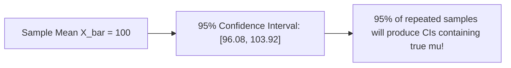

```yaml
schema_version: "2.0"
metadata:
  lesson_id: "DS-MOD01-LES08"
  course_slug: "course-01-ds-math"
  course_title: "Course 1: Mathematics & Statistics for Data Science"
  module_slug: "mod-01-inferential-statistics"
  module_title: "Module 1.3 - Inferential Statistics & Hypothesis Testing"
  lesson_slug: "estimation-and-confidence-intervals"
  lesson_title: "Lesson 1.3.1 Estimation & Confidence Intervals"
  sort_order: 108

pedagogy:
  difficulty: "intermediate"
  estimated_time:
    reading_minutes: 20
    practice_minutes: 25
    quiz_minutes: 10
    total_minutes: 55
  bloom_taxonomy_level: "Apply"
  xp_reward: 60

prerequisites:
  required_lesson_ids:
    - "DS-MOD01-LES07"
  required_skills:
    - "Central Limit Theorem & Normal Distribution"

skills_acquired:
  - "Point Estimators (Bias, Variance, Mean Squared Error)"
  - "Maximum Likelihood Estimation (MLE) Derivation"
  - 'Confidence Intervals Calculation ($95\%$ CI)'
  - "Margin of Error & Sample Size Estimation"

dependencies:
  software:
    - "VS Code"
    - "Python 3.11+ with SciPy"
  hardware: []

seo_and_social:
  meta_title: "Statistical Estimation, Maximum Likelihood (MLE) & Confidence Intervals"
  meta_description: "Master statistical estimation: point estimators, bias-variance, Maximum Likelihood Estimation (MLE), 95% Confidence Intervals, and sample size calculations."
  keywords: ["Point Estimation", "Maximum Likelihood Estimation", "MLE", "Confidence Intervals", "Margin of Error", "Bias Variance", "SciPy stats"]

assessment_config:
  has_quiz: true
  has_lab: true
  has_flashcards: true
  pass_score_percentage: 80
```

# Lesson 1.3.1 Estimation & Confidence Intervals

## 1. Overview & Learning Objectives [id: overview]

- **Estimated Time**: 55 Minutes (20m Reading | 25m Practice | 10m Quiz)
- **Difficulty Level**: ⭐⭐ Intermediate
- **Prerequisites**: [Lesson 1.2.3 CLT & Joint Distributions](file:///d:/My%20Drive/all%20files/PROJECT%20FILES/notes/docs/curriculum/_08_ds_math/_01_07_joint_marginal_and_conditional_distributions.md)
- **XP Reward**: +60 XP

### Learning Objectives
By the end of this lesson, you will be able to:
1. Evaluate Point Estimator properties (Unbiasedness, Efficiency, Consistency, MSE).
2. Derive Maximum Likelihood Estimation (MLE) log-likelihood functions.
3. Construct 95% Confidence Intervals for population means and proportions.
4. Calculate required sample sizes for a target Margin of Error.

---

## 2. Environment & Prerequisites [id: prerequisites]

Open VS Code and install SciPy.

---

## 3. Theoretical Foundations [id: theory]

### 3.1 Point Estimation & MLE
- **Unbiased Estimator**: $E[\hat{\theta}] = \theta$. Sample mean $\bar{X}$ is an unbiased estimator of population mean $\mu$.
- **Maximum Likelihood Estimation (MLE)**: Finds parameter $\theta$ that maximizes the probability of observing sample data $X$:

$$L(\theta) = \prod_{i=1}^n f(x_i \mid \theta) \implies \ell(\theta) = \sum_{i=1}^n \ln f(x_i \mid \theta)$$

### 3.2 Confidence Intervals (CI)
A $(1-\alpha)$ Confidence Interval provides a range $[L, U]$ likely to contain the true population parameter $\mu$:

$$\text{CI}_{95\%} = \bar{X} \pm z_{\alpha/2} \left( \frac{s}{\sqrt{n}} \right)$$

For $95\%$ confidence level, $z_{0.025} = 1.96$.

---

## 4. Architecture & Diagram Visualizations [id: diagram]



---

## 5. Code & Hardware Implementation [id: syntax]

```python
import numpy as np
from scipy import stats

# Sample Dataset
data = np.array([12, 15, 14, 10, 13, 16, 11, 14, 15, 13])
n = len(data)
mean = np.mean(data)
sem = stats.sem(data) # Standard Error of the Mean (s / sqrt(n))

# 95% Confidence Interval using Student's t-distribution
ci_95 = stats.t.interval(0.95, df=n-1, loc=mean, scale=sem)

print(f"Sample Mean: {mean:.2f}")
print(f"95% Confidence Interval: [{ci_95[0]:.2f}, {ci_95[1]:.2f}]")
```

---

## 6. Enterprise Real-World Applications [id: examples]

- **Product Latency Benchmarks**: Measuring API response times (P95) with confidence intervals ensures microservices meet SLA guarantees.

---

## 7. Guided Step-by-Step Hands-On Exercise [id: exercises]

1. Save code as `ci_demo.py`.
2. Run `python ci_demo.py` $\to$ Inspect calculated 95% Confidence Interval bounds!

---

## 8. Common Pitfalls & Troubleshooting [id: common_mistakes]

| Bug / Error | Root Cause | Engineering Solution |
| :--- | :--- | :--- |
| **Misinterpreting CI as Probability** | Stating "There is a 95% probability true $\mu$ is in this specific interval". | A specific interval either contains $\mu$ or does not. 95% refers to the long-run procedure success rate. |

---

## 9. Best Practices & Optimization [id: best_practices]

- **Use Student's $t$ for $n < 30$**: Accounts for sample standard deviation uncertainty.

---

## 10. Industry Interview Q&A [id: interview_qa]

### Q1: What is the correct interpretation of a 95% Confidence Interval?
**Answer**: If we repeat the experiment 100 times and construct 100 confidence intervals, approximately 95 of those intervals will contain the true population parameter $\mu$.

---

## 11. Self-Assessment Quiz [id: quiz]

```json
{
  "quiz_title": "Lesson 1.3.1 Confidence Intervals Assessment",
  "questions": [
    {
      "question_id": "Q1",
      "type": "multiple_choice",
      "question_text": "What $z$-score is associated with a 95% Confidence Interval under a normal distribution?",
      "options": ["1.645", "1.96", "2.576", "1.00"],
      "correct_answer_index": 1,
      "explanation": "z = 1.96 corresponds to a 95% confidence level."
    }
  ]
}
```

---

## 12. Portfolio Assignment & Challenge [id: lab]

Calculate sample size requirements for an A/B test targeting a 2% margin of error.

---

## 13. Spaced Repetition Flashcards [id: flashcards]

**Front**: What function computes a confidence interval in `scipy.stats`?
**Back**: `stats.t.interval(confidence, df, loc, scale)`
<!-- flashcard:end -->

---

## 14. Summary & Cheat Sheet [id: summary]

```python
ci = stats.t.interval(0.95, df=len(data)-1, loc=np.mean(data), scale=stats.sem(data))
```
