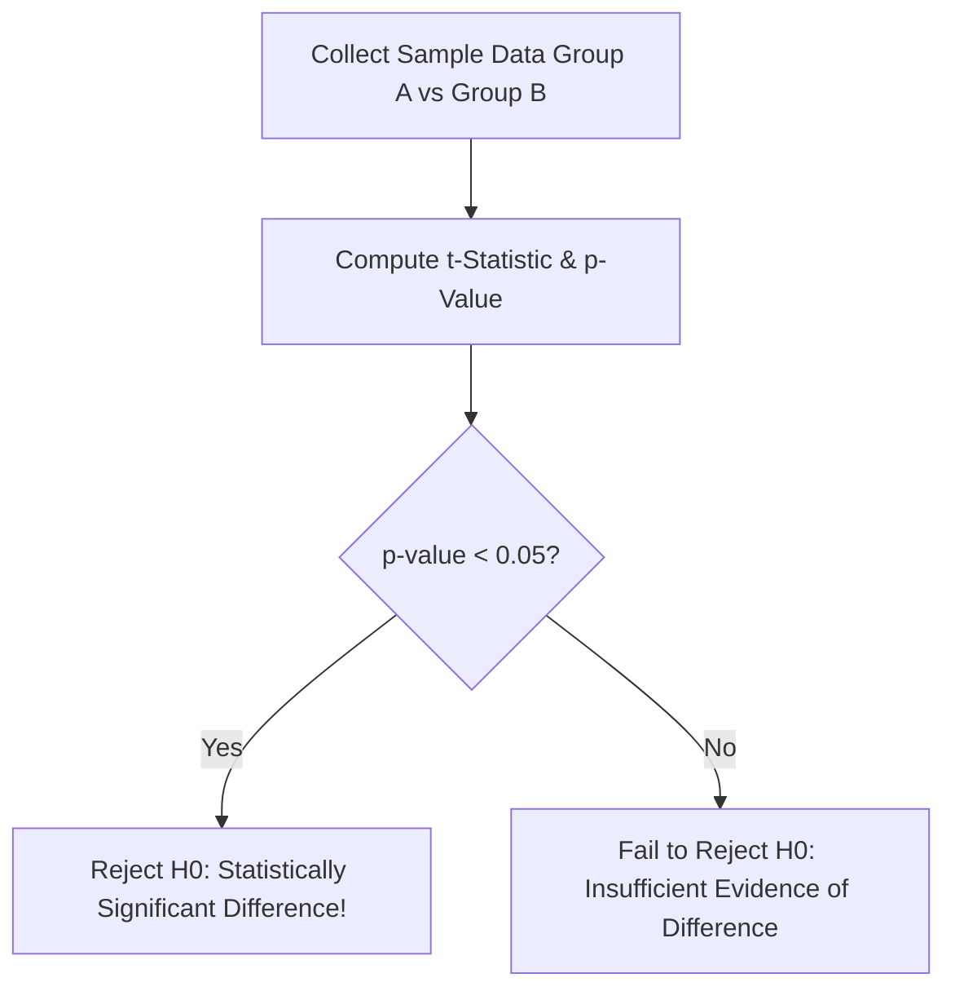

```yaml
schema_version: "2.0"
metadata:
  lesson_id: "DS-MOD01-LES09"
  course_slug: "course-01-ds-math"
  course_title: "Course 1: Mathematics & Statistics for Data Science"
  module_slug: "mod-01-inferential-statistics"
  module_title: "Module 1.3 - Inferential Statistics & Hypothesis Testing"
  lesson_slug: "parametric-hypothesis-testing"
  lesson_title: "Lesson 1.3.2 Parametric Hypothesis Testing"
  sort_order: 109

pedagogy:
  difficulty: "intermediate"
  estimated_time:
    reading_minutes: 20
    practice_minutes: 25
    quiz_minutes: 10
    total_minutes: 55
  bloom_taxonomy_level: "Apply"
  xp_reward: 60

prerequisites:
  required_lesson_ids:
    - "DS-MOD01-LES08"
  required_skills:
    - "Confidence Intervals & Standard Error"

skills_acquired:
  - "Formulating $H_0$ and $H_1$ Hypotheses"
  - "Type I ($\alpha$) and Type II ($\beta$) Error Trade-Offs"
  - "Statistical Power ($1 - \beta$) Calculation"
  - "One-Sample, Two-Sample, & Paired $t$-Tests"
  - "Evaluating $p$-values against Significance Level $\alpha=0.05$"

dependencies:
  software:
    - "VS Code"
    - "Python 3.11+ with SciPy"
  hardware: []

seo_and_social:
  meta_title: "Parametric Hypothesis Testing: t-Tests, p-Values & A/B Testing Math"
  meta_description: "Master parametric hypothesis testing: H0 vs H1, Type I/II errors, p-values, One-Sample, Two-Sample Independent, and Paired t-tests in SciPy."
  keywords: ["Hypothesis Testing", "t-Test", "p-value", "Type I Error", "Type II Error", "A/B Testing Math", "SciPy ttest"]

assessment_config:
  has_quiz: true
  has_lab: true
  has_flashcards: true
  pass_score_percentage: 80
```

# Lesson 1.3.2 Parametric Hypothesis Testing

## 1. Overview & Learning Objectives [id: overview]

- **Estimated Time**: 55 Minutes (20m Reading | 25m Practice | 10m Quiz)
- **Difficulty Level**: ⭐⭐ Intermediate
- **Prerequisites**: [Lesson 1.3.1 Estimation & Confidence Intervals](file:///d:/My%20Drive/all%20files/PROJECT%20FILES/notes/docs/curriculum/_08_ds_math/_01_08_estimation_and_confidence_intervals.md)
- **XP Reward**: +60 XP

### Learning Objectives
By the end of this lesson, you will be able to:
1. Formulate Null ($H_0$) and Alternative ($H_1$) hypotheses for experimental setups.
2. Differentiate between Type I Errors ($\alpha$, False Positive) and Type II Errors ($\beta$, False Negative).
3. Evaluate $p$-values against significance threshold $\alpha = 0.05$.
4. Execute One-Sample, Two-Sample Independent, and Paired $t$-tests using `scipy.stats`.

---

## 2. Environment & Prerequisites [id: prerequisites]

Open VS Code and install SciPy.

---

## 3. Theoretical Foundations [id: theory]

### 3.1 Error Matrix & Statistical Power

```
┌─────────────────────────────────────────────────────────────────────────────┐
│                       HYPOTHESIS ERROR DECISION MATRIX                      │
├─────────────────┬──────────────────────────────────┬────────────────────────┤
│ Decision        │ H0 is True (No real effect)      │ H0 is False (Real effect!)│
├─────────────────┼──────────────────────────────────┼────────────────────────┤
│ Reject H0       │ 🔴 Type I Error ($\alpha$)        │ 🟢 Correct Decision    │
│                 │ (False Positive)                 │ (Statistical Power $1-\beta$)│
├─────────────────┼──────────────────────────────────┼────────────────────────┤
│ Fail to Reject  │ 🟢 Correct Decision              │ 🔴 Type II Error ($\beta$)│
│ H0              │ (True Negative)                  │ (False Negative)       │
└─────────────────┴──────────────────────────────────┴────────────────────────┘
```

### 3.2 Two-Sample Independent $t$-Test
Tests if two independent population means $\mu_1$ and $\mu_2$ differ significantly:

$$t = \frac{\bar{X}_1 - \bar{X}_2}{\sqrt{\frac{s_1^2}{n_1} + \frac{s_2^2}{n_2}}}$$

- **Rule**: If $p$-value $< \alpha$ ($0.05$), reject $H_0$ (statistically significant difference!).

---

## 4. Architecture & Diagram Visualizations [id: diagram]



---

## 5. Code & Hardware Implementation [id: syntax]

```python
import numpy as np
from scipy import stats

# A/B Testing Example: Group A (Control) vs Group B (Variant) Conversion Scores
group_a = np.array([12, 14, 15, 11, 13, 16, 12, 14])
group_b = np.array([17, 18, 16, 19, 15, 18, 17, 20])

# 1. Two-Sample Independent t-Test (Welch's t-test: equal_var=False)
t_stat, p_val = stats.ttest_ind(group_a, group_b, equal_var=False)

print(f"t-statistic: {t_stat:.4f}")
print(f"p-value: {p_val:.6f}")

if p_val < 0.05:
    print("Decision: Reject H0 (Variant B produces statistically higher conversions!)")
else:
    print("Decision: Fail to Reject H0")
```

---

## 6. Enterprise Real-World Applications [id: examples]

- **Web A/B Testing**: Evaluating if a new landing page design produces a statistically significant lift in user signups compared to the control version.

---

## 7. Guided Step-by-Step Hands-On Exercise [id: exercises]

1. Save code as `ttest_demo.py`.
2. Run `python ttest_demo.py` $\to$ Observe $p$-value $< 0.001$ confirming significant variant lift!

---

## 8. Common Pitfalls & Troubleshooting [id: common_mistakes]

| Bug / Error | Root Cause | Engineering Solution |
| :--- | :--- | :--- |
| **$p$-Hacking / Multiple Testing** | Running 20 $t$-tests simultaneously without alpha adjustment. | Apply Bonferroni or Benjamini-Hochberg false discovery rate corrections. |

---

## 9. Best Practices & Optimization [id: best_practices]

- **Use `equal_var=False`**: Welch's $t$-test does not assume equal sample variances.

---

## 10. Industry Interview Q&A [id: interview_qa]

### Q1: What is a $p$-value in hypothesis testing?
**Answer**: A $p$-value is the probability of observing a test statistic as extreme as (or more extreme than) the one calculated from sample data, assuming the Null Hypothesis ($H_0$) is true.

---

## 11. Self-Assessment Quiz [id: quiz]

```json
{
  "quiz_title": "Lesson 1.3.2 Hypothesis Testing Assessment",
  "questions": [
    {
      "question_id": "Q1",
      "type": "multiple_choice",
      "question_text": "What error occurs when an experimenter incorrectly rejects a true Null Hypothesis?",
      "options": ["Type I Error (False Positive)", "Type II Error (False Negative)", "Standard Error", "Sampling Error"],
      "correct_answer_index": 0,
      "explanation": "Type I error is a False Positive (rejecting true H0)."
    }
  ]
}
```

---

## 12. Portfolio Assignment & Challenge [id: lab]

Build an automated A/B test analyzer computing $t$-stats, $p$-values, and statistical power.

---

## 13. Spaced Repetition Flashcards [id: flashcards]

**Front**: What SciPy function performs a two-sample independent $t$-test?
**Back**: `stats.ttest_ind(sample1, sample2, equal_var=False)`
<!-- flashcard:end -->

---

## 14. Summary & Cheat Sheet [id: summary]

```python
t_stat, p_val = stats.ttest_ind(group_a, group_b, equal_var=False)
```
