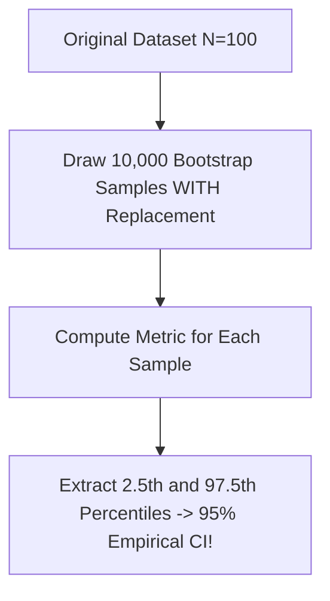

```yaml
schema_version: "2.0"
metadata:
  lesson_id: "DS-MOD01-LES11"
  course_slug: "course-01-ds-math"
  course_title: "Course 1: Mathematics & Statistics for Data Science"
  module_slug: "mod-01-inferential-statistics"
  module_title: "Module 1.3 - Inferential Statistics & Hypothesis Testing"
  lesson_slug: "non-parametric-statistical-methods"
  lesson_title: "Lesson 1.3.4 Non-Parametric Statistical Methods"
  sort_order: 111

pedagogy:
  difficulty: "advanced"
  estimated_time:
    reading_minutes: 20
    practice_minutes: 25
    quiz_minutes: 10
    total_minutes: 55
  bloom_taxonomy_level: "Apply"
  xp_reward: 70

prerequisites:
  required_lesson_ids:
    - "DS-MOD01-LES10"
  required_skills:
    - "ANOVA & Hypothesis Testing"

skills_acquired:
  - "Parametric vs Non-Parametric Assumption Audits"
  - "Mann-Whitney U Test Execution"
  - "Wilcoxon Signed-Rank Test for Paired Non-Normal Data"
  - "Kruskal-Wallis Test (Non-Parametric ANOVA)"
  - "Spearman Rank Correlation ($\rho_s$)"
  - "Bootstrapping & Resampling Confidence Interval Estimation"

dependencies:
  software:
    - "VS Code"
    - "Python 3.11+ with SciPy"
  hardware: []

seo_and_social:
  meta_title: "Non-Parametric Statistics: Mann-Whitney U, Kruskal-Wallis & Bootstrapping"
  meta_description: "Master non-parametric statistical methods for skewed data: Mann-Whitney U test, Wilcoxon signed-rank, Kruskal-Wallis test, Spearman correlation, and Bootstrapping."
  keywords: ["Non-Parametric Statistics", "Mann Whitney U Test", "Kruskal Wallis", "Wilcoxon Signed Rank", "Spearman Correlation", "Bootstrapping", "Resampling"]

assessment_config:
  has_quiz: true
  has_lab: true
  has_flashcards: true
  pass_score_percentage: 80
```

# Lesson 1.3.4 Non-Parametric Statistical Methods

## 1. Overview & Learning Objectives [id: overview]

- **Estimated Time**: 55 Minutes (20m Reading | 25m Practice | 10m Quiz)
- **Difficulty Level**: ⭐⭐⭐ Advanced
- **Prerequisites**: [Lesson 1.3.3 ANOVA & Chi-Square Tests](file:///d:/My%20Drive/all%20files/PROJECT%20FILES/notes/docs/curriculum/_08_ds_math/_01_10_anova_and_chi_square_tests.md)
- **XP Reward**: +70 XP

### Learning Objectives
By the end of this lesson, you will be able to:
1. Identify when parametric assumptions (normality, equal variance) are violated.
2. Execute the **Mann-Whitney U Test** for non-normal independent samples.
3. Conduct the **Wilcoxon Signed-Rank Test** for paired non-normal data.
4. Execute the **Kruskal-Wallis Test** as a non-parametric alternative to One-Way ANOVA.
5. Apply **Bootstrapping** resampling to estimate empirical confidence intervals.

---

## 2. Environment & Prerequisites [id: prerequisites]

Open VS Code and install SciPy.

---

## 3. Theoretical Foundations [id: theory]

### 3.1 Parametric vs Non-Parametric Decision Matrix

```
┌─────────────────────────────────────────────────────────────────────────────┐
│                    PARAMETRIC VS NON-PARAMETRIC MATRIX                      │
├─────────────────┬──────────────────────────────────┬────────────────────────┤
│ Test Purpose    │ Parametric Test (Normal Data)    │ Non-Parametric Test    │
├─────────────────┼──────────────────────────────────┼────────────────────────┤
│ 2 Indep Groups  │ Two-Sample $t$-test              │ Mann-Whitney U Test    │
│ 2 Paired Groups │ Paired $t$-test                  │ Wilcoxon Signed-Rank   │
│ 3+ Groups       │ One-Way ANOVA                    │ Kruskal-Wallis Test    │
│ Correlation     │ Pearson Correlation ($\rho$)     │ Spearman Rank ($\rho_s$)│
└─────────────────┴──────────────────────────────────┴────────────────────────┘
```

### 3.2 Bootstrapping Resampling
Bootstrapping estimates sampling distributions by repeatedly sampling **with replacement** from the original dataset $B$ times (e.g. $B = 10,000$).

---

## 4. Architecture & Diagram Visualizations [id: diagram]



---

## 5. Code & Hardware Implementation [id: syntax]

```python
import numpy as np
from scipy import stats

# Skewed Non-Normal Data (e.g., User Income Distribution)
grp_a = np.array([22, 25, 29, 31, 35, 120, 450]) # Heavily skewed outlier
grp_b = np.array([18, 20, 22, 24, 25, 28, 30])

# 1. Mann-Whitney U Test (Non-parametric alternative to 2-sample t-test)
u_stat, p_val = stats.mannwhitneyu(grp_a, grp_b)
print(f"Mann-Whitney U stat: {u_stat:.2f}, p-value: {p_val:.4f}")

# 2. Bootstrapped 95% Confidence Interval for Median
boot_medians = [np.median(np.random.choice(grp_a, size=len(grp_a), replace=True)) for _ in range(10000)]
ci_lower = np.percentile(boot_medians, 2.5)
ci_upper = np.percentile(boot_medians, 97.5)

print(f"Bootstrapped 95% CI for Median: [{ci_lower:.2f}, {ci_upper:.2f}]")
```

---

## 6. Enterprise Real-World Applications [id: examples]

- **Web Latency & Financial Transaction Analytics**: Server latency logs and user income data contain heavy right-skewed outliers where $t$-tests fail; engineers use Mann-Whitney U tests and Bootstrapping instead.

---

## 7. Guided Step-by-Step Hands-On Exercise [id: exercises]

1. Save code as `nonparametric_demo.py`.
2. Run `python nonparametric_demo.py` $\to$ Inspect robust bootstrapped median confidence interval!

---

## 8. Common Pitfalls & Troubleshooting [id: common_mistakes]

| Bug / Error | Root Cause | Engineering Solution |
| :--- | :--- | :--- |
| **Using $t$-test on Highly Skewed Data** | Severe outliers violate the normality assumption, distorting sample means. | Switch to Mann-Whitney U test or evaluate medians via Bootstrapping. |

---

## 9. Best Practices & Optimization [id: best_practices]

- **Use Bootstrapping for Complex Metrics**: Ideal for medians, ratios, or custom ML evaluation metrics.

---

## 10. Industry Interview Q&A [id: interview_qa]

### Q1: What is Bootstrapping and why is it useful in Data Science?
**Answer**: Bootstrapping is a non-parametric resampling technique that draws repeated samples *with replacement* from observed data to build an empirical sampling distribution. It calculates confidence intervals for complex metrics (like medians or Gini coefficients) without making parametric distribution assumptions.

---

## 11. Self-Assessment Quiz [id: quiz]

```json
{
  "quiz_title": "Lesson 1.3.4 Non-Parametric Assessment",
  "questions": [
    {
      "question_id": "Q1",
      "type": "multiple_choice",
      "question_text": "Which non-parametric test serves as an alternative to One-Way ANOVA for non-normal data?",
      "options": ["Mann-Whitney U Test", "Wilcoxon Signed-Rank Test", "Kruskal-Wallis Test", "Spearman Correlation"],
      "correct_answer_index": 2,
      "explanation": "Kruskal-Wallis is the non-parametric equivalent of One-Way ANOVA."
    }
  ]
}
```

---

## 12. Portfolio Assignment & Challenge [id: lab]

Build a custom Bootstrapping engine that calculates 95% CIs for non-normal server latency logs.

---

## 13. Spaced Repetition Flashcards [id: flashcards]

**Front**: What is the non-parametric equivalent of Pearson correlation?
**Back**: Spearman Rank Correlation ($\rho_s$).
<!-- flashcard:end -->

---

## 14. Summary & Cheat Sheet [id: summary]

```python
u_stat, p_val = stats.mannwhitneyu(sample1, sample2)
boot_ci = np.percentile(boot_estimates, [2.5, 97.5])
```
