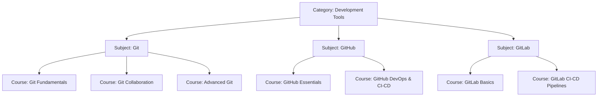

# Upgraded Master Curriculum: Git, GitHub, & GitLab Learning Path

This curriculum outlines the scalable structure for version control, collaboration, and DevOps tooling within the Learning OS. Following the 10/10 roadmap upgrade, the subjects are mapped as modular, structured courses under the **Development Tools** category.

---

## 1. CMS Category Definition

### Category: Development Tools
* **Slug**: `development-tools`
* **Type**: `technical`
* **Icon**: `fas fa-tools`
* **Color**: `#4f46e5`

---

## 2. Subjects, Courses, & Modules Taxonomy

### Subject A: Git
* **Slug**: `git`
* **Icon**: `fab fa-git-alt`
* **Difficulty Level**: `beginner`
* **Description**: Version control fundamentals, internal mechanics, branching, merging, and local workspace management.

#### Course 1: Git Fundamentals (Beginner)
* **Slug**: `git-fundamentals`
* **Estimated Hours**: 12 hours
* **Modules**:
  1. **Introduction to VCS**: Version Control History, CVCS vs DVCS, Git's origin.
  2. **Git Architecture**: The Three States (Working Directory, Staging Area, Local Repository), HEAD pointer, config settings.
  3. **Basic Local Workflow**: Init, status, add, commit, diff, log, checkout, switch, restore.
  4. **Branching & Merging Basics**: Branch creation, HEAD shifting, Fast-Forward Merges, Three-Way Merges.

#### Course 2: Git Collaboration (Intermediate) [NEW]
* **Slug**: `git-collaboration`
* **Estimated Hours**: 15 hours
* **Modules**:
  1. **Remotes & Origin**: Adding remotes, naming conventions, clone vs fork.
  2. **Data Syncing**: Git Fetch, Git Push, Git Pull (Fetch + Merge), tracking branches.
  3. **Merge Conflicts**: Visualizing conflict markers, strategy for clean resolutions, aborting merges.
  4. **Upstream & Forking Workflows**: Linking upstream repositories, syncing forks, configuring collaboration parameters.

#### Course 3: Advanced Git (Advanced)
* **Slug**: `advanced-git`
* **Estimated Hours**: 22 hours
* **Modules**:
  1. **Git Internals Deep-Dive**: Git Objects (Blobs, Trees, Commits, Tags), SHA-1 hashing, Refs, packfiles, `.git/` folder architecture.
  2. **Rewriting History**: Commit amends, Interactive Rebase, squash commits, Cherry-Picking, Git Reflog.
  3. **Advanced Workflows**: Git Reset (soft, mixed, hard) vs Revert, Git Stash, Git Bisect, Git Blame, Git Worktree, Git LFS.
  4. **Customization & Hooks**: Pre-commit hooks, post-merge hooks, config aliases, submodules.

---

### Subject B: GitHub
* **Slug**: `github`
* **Icon**: `fab fa-github`
* **Difficulty Level**: `intermediate`
* **Description**: Host repository collaboration, pull requests, workspace configurations, integrations, and automated pipelines.

#### Course 1: GitHub Essentials (Intermediate)
* **Slug**: `github-essentials`
* **Estimated Hours**: 12 hours
* **Modules**:
  1. **Collaboration Foundations**: Remotes, pull requests, review workflows, syncing forks, fork protection.
  2. **Work Management**: Issues, Projects (Kanban, Milestones), labels, wikis, discussions.
  3. **Repository Administration**: Teams, permissions, Code Owners, branch protection rules, branch restrictions.
  4. **Developer Workspaces**: GitHub CLI, GitHub Codespaces, GitHub Copilot integration, GitHub Pages.

#### Course 2: GitHub DevOps & CI-CD (Advanced)
* **Slug**: `github-devops-cicd`
* **Estimated Hours**: 18 hours
* **Modules**:
  1. **Actions Automation**: GitHub Actions syntax, workflows, custom runners, event triggers, environment variables.
  2. **CI-CD & Packages**: Code verification pipelines, unit testing, compiling, security scans, publishing packages (npm, docker).
  3. **Repository Security**: Dependabot vulnerability scans, secret scanning, codeql audits, env secrets.

---

### Subject C: GitLab
* **Slug**: `gitlab`
* **Icon**: `fab fa-gitlab`
* **Difficulty Level**: `intermediate`
* **Description**: Single-application DevSecOps lifecycle management, GitLab CI/CD pipelines, runner orchestration, and enterprise environments.

#### Course 1: GitLab Basics (Intermediate)
* **Slug**: `gitlab-basics`
* **Estimated Hours**: 12 hours
* **Modules**:
  1. **Workspace Hierarchy**: Groups, subgroups, projects, milestones, epics, issue boards.
  2. **Merge Requests (MRs)**: Code reviews, threads, approval rules, GitLab pages.
  3. **Self-Hosted GitLab basics**: Introduction to self-hosted instances, architecture overview.

#### Course 2: GitLab CI-CD Pipelines (Advanced)
* **Slug**: `gitlab-cicd-pipelines`
* **Estimated Hours**: 20 hours
* **Modules**:
  1. **Pipelines Foundations**: `.gitlab-ci.yml` syntax, stages, jobs, shared vs custom GitLab runners.
  2. **Continuous Integration**: Cache, artifacts, variables, container registry, registry triggers.
  3. **Administration & Monitoring**: Runner scaling, self-hosted administration, Prometheus monitoring hooks.
