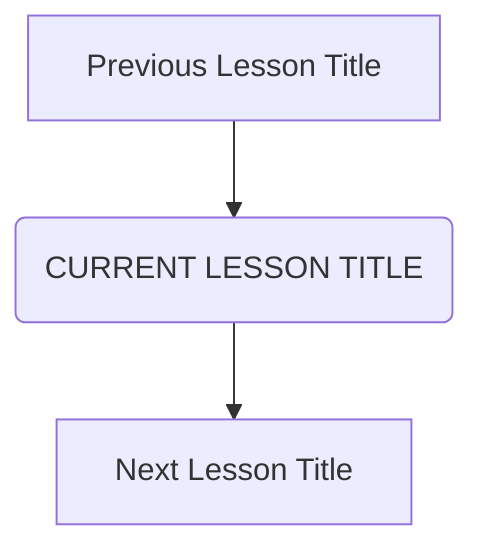

# Upgraded Lesson Template: Learning OS Knowledge Block

Every lesson file imported into the Learning OS CMS must match this strict layout, using explicit section ID anchors to support dynamic frontend block rendering.

---

```yaml
# ── LESSON METADATA BLOCK ───────────────────────────────────────────
lesson_id: "SUBJECT-COURSE-NUMBER"    # e.g., GIT-FND-001
subject: "Subject Name"               # e.g., Git
course: "Course Title"                # e.g., Git Fundamentals
module: "Module Name"                 # e.g., Git Architecture
difficulty: "⭐"                     # Rating from ⭐ to ⭐⭐⭐⭐⭐
time_breakdown:
  reading: "X min"
  exercise: "Y min"
  quiz: "Z min"
  revision: "W min"
version: "1.0"
last_updated: "YYYY-MM-DD"
status: "Published"
author: "Learning OS Author"
reviewed_by: "Reviewer Name"
prerequisites:
  - "Prerequisite A"
tags:
  - "Tag 1"
  - "Tag 2"
```

---

## 1. Overview [id: overview]
[A clear 2-3 sentence overview explaining the central focus of the lesson]

## 2. Knowledge Connections [id: connections]


## 3. Learning Outcomes [id: outcomes]
- **Knowledge (What you will understand)**:
  - Concept 1
- **Skills (What you can do)**:
  - Skill 1
- **Outcome (Professional application)**:
  - Outcome 1

## 4. Concept & Internals Deep-Dive [id: concept]
[Comprehensive explanation using analogies, with deep dive into internal architecture like pointers, objects, hashes, or schemas]

## 5. Professional Box: Industry Usage [id: industry_usage]
> [!NOTE]
> **How [Company Name/Open Source] Uses This**:
> Real-world engineering details showing scale or best practice at Google, Microsoft, or major projects.

## 6. Visual Learning & Architecture [id: visuals]
[Mermaid.js flowchart, sequence diagram, decision tree, mindmap, or architectural comparison layout]

## 7. Terminology [id: terminology]
- **Term 1**: Definition.

## 8. Installation & Configuration [id: setup]
[Guides for setting up the environment, settings, or credentials]

## 9. Commands & Command Syntax [id: commands]
```bash
[Generic command syntax templates]
```
- `parameters`: explanation of arguments.

## 10. Practical Code Examples [id: examples]

### Easy
[Simplest baseline code and output]

### Medium
[Real-world intermediate use case with comments]

### Advanced
[Professional pipelines or complex scenarios]

## 11. Common Errors & Troubleshooting [id: errors]

### Beginner Errors
- **Error**: Explanation / Fix.

### Intermediate Errors
- **Error**: Explanation / Fix.

### Professional Errors
- **Error**: Explanation / Fix.

## 12. Comparison Tables [id: comparisons]
| Metric/Feature | Option A | Option B |
|---|---|---|

## 13. Best Practices & Professional Tips [id: best_practices]
- **Best Practice**: Rationale.
- **Pro Tip**: Industry shortcut.

## 14. Interview Preparation [id: interview]

### Fresher Questions
1. **Question**: ...
   * **Ideal Answer**: ...

### 2 Years Experience Questions
2. **Question**: ...
   * **Ideal Answer**: ...

### 5 Years Experience Questions
3. **Question**: ...
   * **Ideal Answer**: ...

### Architect Level Questions
4. **Question**: ...
   * **Ideal Answer**: ...

## 15. Ingestion Exercises [id: exercises]

### MCQ
- Question...

### Coding Challenge
- Solve this...

### Predict the Output
- What prints here...

### Debugging Task
- Fix this code...

### Scenario Question
- If a client has X...

### Hands-on Lab
- Terminal steps to take...

## 16. Graded Assignments [id: assignments]
[An actionable assignment for the student to complete offline]

## 17. Mini Projects [id: projects]
- **Mini Scale**: Simple scripting.
- **Small Scale**: Multi-file task.
- **Medium Scale**: Integration task.
- **Industry Scale**: Complete production simulation.

## 18. Topic Cheat Sheet [id: cheatsheet]
- **Standard Syntax**: `command`
- **Aliases**: `shortcut`
- **Shortcut**: Key combo.
- **Warning**: Dangerous commands to avoid.

## 19. AI Generated Content [id: ai_notes]
- **AI Summary**: Short recap.
- **AI Flashcards**: Q&A cards.

## 20. References [id: references]
- [Documentation Link](https://example.com)
