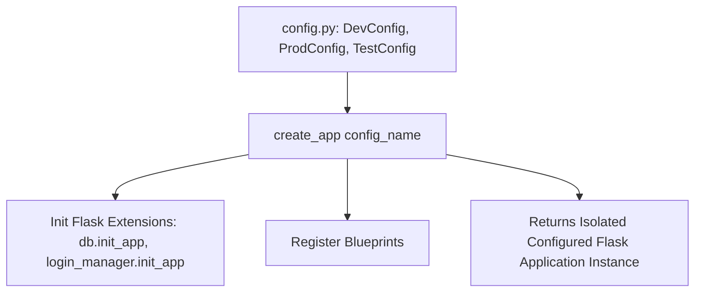

# Flask Application Factory Pattern

> **Course**: Git Version Control | **Module**: Introduction | **Difficulty**: beginner

---

- **Estimated Time**: 45 Minutes (15m Reading | 20m Practice | 10m Quiz)
- **Difficulty Level**: ⭐⭐ Intermediate
- **Prerequisites**: [Lesson 1.1 WSGI Architecture](file:///d:/My%20Drive/all%20files/PROJECT%20FILES/notes/docs/curriculum/_04_flask/_04_01_wsgi_architecture_and_flask_basics.md)
- **XP Reward**: +50 XP

### Learning Objectives
By the end of this lesson, you will be able to:
1. Explain the architectural limitations of global monolithic `app.py` files.
2. Implement the **Application Factory Pattern** (`create_app()`).
3. Structure environment configurations (`DevelopmentConfig`, `ProductionConfig`, `TestingConfig`).
4. Manage secret keys securely using `.env` files and the `instance/` folder.

---

---

Install `python-dotenv`:

```bash
pip install python-dotenv
```

---

---

### 3.1 Why the Application Factory Pattern?
In simple tutorials, Flask apps instantiate a single global `app = Flask(__name__)` at the module level. In enterprise applications, this creates major flaws:
1. **Circular Imports**: Importing `app` across multiple files creates circular module dependencies.
2. **Testing Limitations**: Testing requires creating multiple instances of the app with different configuration settings (e.g. `TESTING=True`).

The **Application Factory Pattern** encapsulates application creation inside a callable `create_app(config_name)` function:

```
┌─────────────────────────────────────────────────────────────────────────────┐
│                       APPLICATION FACTORY PATTERN FLOW                      │
├─────────────────────────────────────────────────────────────────────────────┤
│ CLI / Test Runner ──► create_app('development') ──► Instantiates new app    │
│                                                 ──► Loads Config Class      │
│                                                 ──► Registers Extensions    │
│                                                 ──► Returns Configured App  │
└─────────────────────────────────────────────────────────────────────────────┘
```

---

---



---

---

### File 1: `config.py` (Environment Configurations)

```python
import os

class Config:
    SECRET_KEY = os.environ.get("SECRET_KEY", "fallback-dev-secret-key-101")
    SQLALCHEMY_TRACK_MODIFICATIONS = False

class DevelopmentConfig(Config):
    DEBUG = True
    SQLALCHEMY_DATABASE_URI = os.environ.get("DEV_DATABASE_URL", "sqlite:///dev_iot.db")

class TestingConfig(Config):
    TESTING = True
    SQLALCHEMY_DATABASE_URI = "sqlite:///:memory:"

class ProductionConfig(Config):
    DEBUG = False
    SQLALCHEMY_DATABASE_URI = os.environ.get("DATABASE_URL")

config_by_name = {
    "development": DevelopmentConfig,
    "testing": TestingConfig,
    "production": ProductionConfig,
}
```

### File 2: `app/__init__.py` (Application Factory)

```python
from flask import Flask
from config import config_by_name

def create_app(config_name="development"):
    app = Flask(__name__, instance_relative_config=True)
    
    # Load Configuration from Class
    app.config.from_object(config_by_name[config_name])

    # Basic Test Route
    @app.route("/health")
    def health():
        return {"status": "HEALTHY", "environment": config_name}

    return app
```

---

---

- **Microservice Test Suites**: Pytest test suites invoke `create_app('testing')` to spin up isolated in-memory database app instances before every unit test run.

---

---

1. Save `config.py` and `app/__init__.py`.
2. Run `FLASK_APP="app:create_app('development')" flask run` $\to$ Inspect `/health` JSON endpoint!

---

---

| Bug / Error | Root Cause | Engineering Solution |
| :--- | :--- | :--- |
| **`KeyError: 'production'`** | Calling `create_app()` with an invalid configuration environment name string. | Use fallback defaults: `config_name = os.getenv('FLASK_ENV', 'development')`. |

---

---

- **Use `.env` for Secrets**: Never commit hardcoded secret keys or database credentials to Git repositories.

---

---

### Q1: What is the Application Factory Pattern in Flask and why is it recommended for production applications?
**Answer**: The Application Factory Pattern defines a function (`create_app()`) that creates and configures a Flask application instance dynamically. It avoids circular import dependencies, allows passing dynamic configuration settings, and enables running isolated test suites with different database connections.

---

---

```json
{
  "quiz_title": "Lesson 1.2 Application Factory Assessment",
  "questions": [
    {
      "question_id": "Q1",
      "type": "multiple_choice",
      "question_text": "Which function name is the standard convention for implementing the Flask Application Factory pattern?",
      "options": ["init_flask()", "create_app()", "start_server()", "make_app()"],
      "correct_answer_index": 1,
      "explanation": "create_app() is the standard convention for Flask application factories."
    }
  ]
}
```

---

---

Build an application factory loading configurations from environment variables via `python-dotenv`.

---

---

**Front**: How do you load a configuration class into a Flask application inside `create_app()`?
**Back**: `app.config.from_object(ConfigClass)`.
<!-- flashcard:end -->

---

---

```python
def create_app(config="dev"):
    app = Flask(__name__)
    app.config.from_object(config)
    return app
```

---
