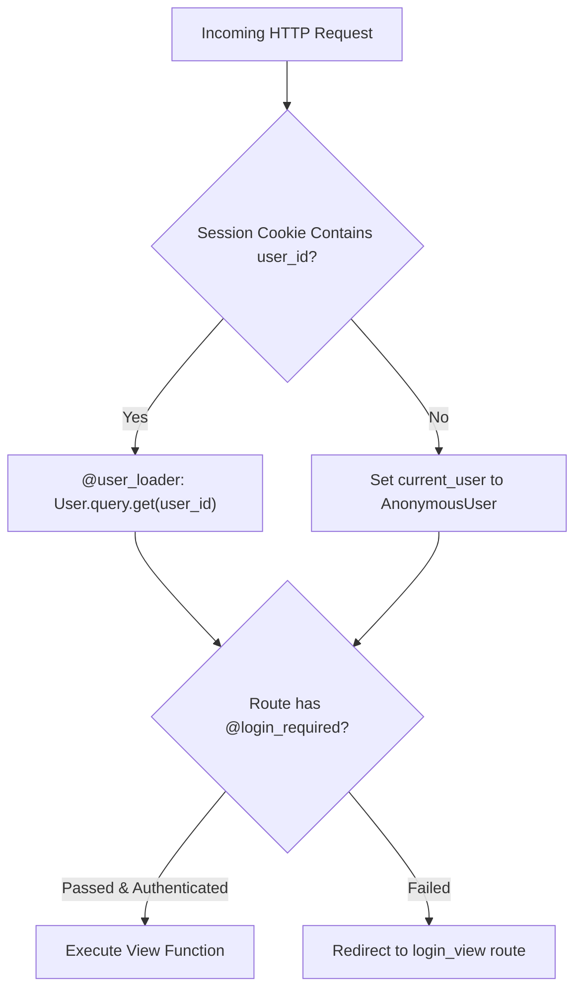

# User Authentication With Flask Login

> **Course**: Git Version Control | **Module**: Introduction | **Difficulty**: beginner

---

- **Estimated Time**: 55 Minutes (20m Reading | 25m Practice | 10m Quiz)
- **Difficulty Level**: ⭐⭐ Intermediate
- **Prerequisites**: [Lesson 6.4 Schema Migrations](file:///d:/My%20Drive/all%20files/PROJECT%20FILES/notes/docs/curriculum/_04_flask/_04_14_schema_migrations_with_flask_migrate.md)
- **XP Reward**: +60 XP

### Learning Objectives
By the end of this lesson, you will be able to:
1. Integrate the **Flask-Login** extension for user session management.
2. Inherit from **`UserMixin`** to implement standard authentication properties (`is_authenticated`, `is_active`).
3. Define the mandatory **`@login_manager.user_loader`** callback.
4. Protect view functions using **`@login_required`** and manage logins/logouts (`login_user()`, `logout_user()`).

---

---

Install `Flask-Login`:

```bash
pip install Flask-Login
```

---

---

### 3.1 Flask-Login Architecture
**Flask-Login** handles the session-based authentication lifecycle. It tracks when a user logs in, stores their user ID inside an encrypted session cookie, reloads the user object on every request, and protects routes requiring authentication.

```
┌─────────────────────────────────────────────────────────────────────────────┐
│                         FLASK-LOGIN SESSION LIFECYCLE                       │
├─────────────────────────────────────────────────────────────────────────────┤
│ `login_user(user)` ──► Encrypts `user_id` inside Client Session Cookie       │
│ Subsequent Request ──► `@user_loader` callback loads User object from DB     │
│ `@login_required`  ──► Grants access if `current_user.is_authenticated`     │
│ `logout_user()`    ──► Clears session cookie                                │
└─────────────────────────────────────────────────────────────────────────────┘
```

---

---



---

---

### File 1: `models.py` (User Model with UserMixin)

```python
from extensions import db
from flask_login import UserMixin

# UserMixin provides default implementations for is_authenticated, is_active, is_anonymous, and get_id()
class User(db.Model, UserMixin):
    __tablename__ = "users"

    id = db.Column(db.Integer, primary_key=True)
    username = db.Column(db.String(50), unique=True, nullable=False)
    email = db.Column(db.String(120), unique=True, nullable=False)
    password_hash = db.Column(db.String(256), nullable=False)
```

### File 2: `app.py` (Flask-Login Initialization & Auth Routes)

```python
from flask import Flask, render_template, redirect, url_for, request, flash
from flask_login import LoginManager, login_user, logout_user, login_required, current_user
from extensions import db
from models import User

app = Flask(__name__)
app.config["SECRET_KEY"] = "super-secret-key-90210"

# 1. Initialize LoginManager
login_manager = LoginManager()
login_manager.init_app(app)
login_manager.login_view = "login" # Route to redirect unauthenticated users
login_manager.login_message_category = "warning"

# 2. Mandatory User Loader Callback
@login_manager.user_loader
def load_user(user_id):
    return User.query.get(int(user_id))

# 3. Login View Function
@app.route("/login", methods=["GET", "POST"])
def login():
    if request.method == "POST":
        username = request.form.get("username")
        user = User.query.filter_by(username=username).first()

        if user:
            login_user(user, remember=True) # Sets session cookie!
            flash("Logged in successfully!", "success")
            next_page = request.args.get("next") # Handle redirect back to protected page
            return redirect(next_page or url_for("dashboard"))
        
        flash("Invalid username", "danger")
    return render_template("login.html")

# 4. Protected Route
@app.route("/dashboard")
@login_required # Protects route!
def dashboard():
    return f"Welcome to IoT Command Center, {current_user.username}!"

# 5. Logout Route
@app.route("/logout")
@login_required
def logout():
    logout_user() # Clears session cookie
    flash("Logged out successfully.", "info")
    return redirect(url_for("login"))
```

---

---

- **Enterprise Administrative Command Panels**: Security-critical web dashboards protect sensitive telemetry controls behind `@login_required` decorators and session timeouts.

---

---

1. Save `models.py` and `app.py`.
2. Navigate to `/dashboard` while unauthenticated $\to$ Verify automatic redirect to `/login?next=%2Fdashboard`!

---

---

| Bug / Error | Root Cause | Engineering Solution |
| :--- | :--- | :--- |
| **`Exception: Missing user_loader callback`** | Forgetting to define the `@login_manager.user_loader` decorated function. | Define `@login_manager.user_loader def load_user(user_id): return User.query.get(int(user_id))`. |

---

---

- **Inherit from `UserMixin`**: Supplies standard implementation for `get_id()`, `is_authenticated`, `is_active`, and `is_anonymous`.

---

---

### Q1: What is the purpose of `@login_manager.user_loader` in Flask-Login?
**Answer**: `@login_manager.user_loader` registers a callback function that Flask-Login calls on every HTTP request to reload the `User` model instance from the database using the `user_id` stored inside the encrypted session cookie, binding it to `current_user`.

---

---

```json
{
  "quiz_title": "Lesson 7.1 Flask-Login Assessment",
  "questions": [
    {
      "question_id": "Q1",
      "type": "multiple_choice",
      "question_text": "Which decorator protects a Flask view function from unauthenticated access?",
      "options": ["@app.protected", "@login_required", "@auth_only", "@session_required"],
      "correct_answer_index": 1,
      "explanation": "@login_required restricts access to authenticated users."
    }
  ]
}
```

---

---

Build an authentication system with login, logout, and protected dashboard routes.

---

---

**Front**: What proxy object represents the currently authenticated user in Flask-Login?
**Back**: `current_user`.
<!-- flashcard:end -->

---

---

```python
login_user(user)
@app.route("/protected")
@login_required
def page(): return current_user.username
```

---
