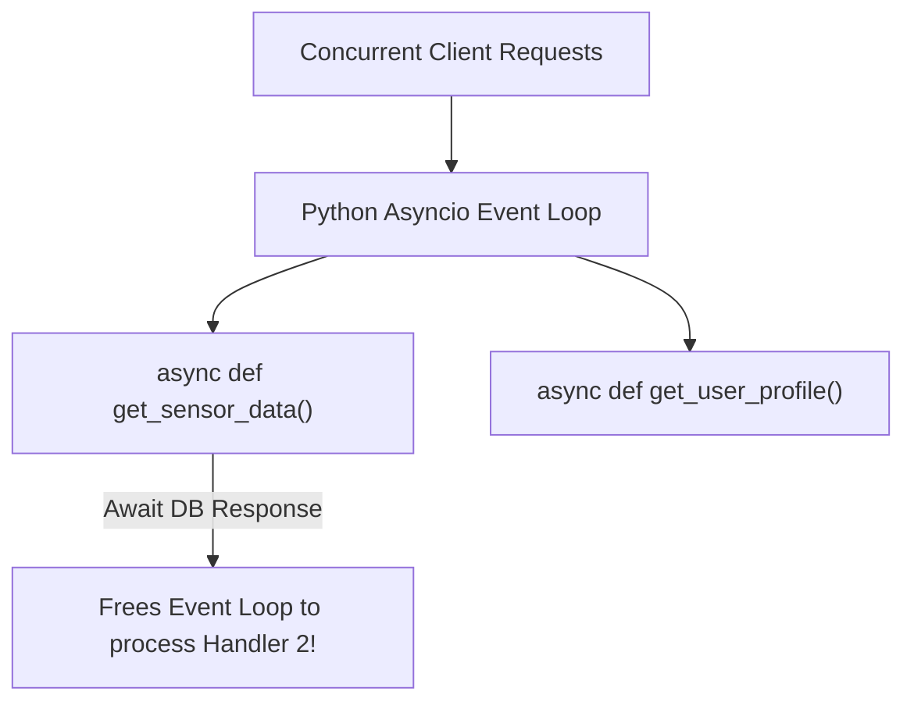

# Asgi Architecture Uvicorn And Fastapi Basics

> **Course**: Git Version Control | **Module**: Introduction | **Difficulty**: beginner

---

- **Estimated Time**: 45 Minutes (15m Reading | 20m Practice | 10m Quiz)
- **Difficulty Level**: ⭐ Beginner
- **Prerequisites**: [Lesson 12.2 Production Deployment](file:///d:/My%20Drive/all%20files/PROJECT%20FILES/notes/docs/curriculum/_04_flask/_04_28_production_deployment_gunicorn_nginx_docker.md)
- **XP Reward**: +50 XP

### Learning Objectives
By the end of this lesson, you will be able to:
1. Explain the **ASGI (Asynchronous Server Gateway Interface)** specification.
2. Differentiate between synchronous WSGI (Flask/Django) and asynchronous ASGI (FastAPI).
3. Run FastAPI microservices using the **Uvicorn** ASGI server.
4. Construct high-concurrency asynchronous endpoints using `async def`.

---

---

Install `fastapi` and `uvicorn`:

```bash
pip install fastapi uvicorn
```

---

---

### 3.1 WSGI vs ASGI Architecture
Traditional Python web frameworks (like Flask) use **WSGI (Web Server Gateway Interface)**, which processes HTTP requests synchronously: one thread per request. If a request blocks on I/O (database, external API), that worker thread is blocked.

**FastAPI** is built on **Starlette** and **Pydantic**, implementing **ASGI (Asynchronous Server Gateway Interface)**. Using Python's `asyncio` event loop, a single worker process can handle thousands of concurrent I/O-bound requests asynchronously:

```
┌─────────────────────────────────────────────────────────────────────────────┐
│                            WSGI vs ASGI COMPARISON                          │
├─────────────────┬───────────────────────────────┬───────────────────────────┤
│ Feature         │ WSGI (Flask)                  │ ASGI (FastAPI)            │
├─────────────────┼───────────────────────────────┼───────────────────────────┤
│ Execution       │ Synchronous (Blocking)        │ Asynchronous Event Loop   │
│ Protocol        │ HTTP 1.1                      │ HTTP 1.1, HTTP 2, WebSockets│
│ Server          │ Gunicorn / uWSGI              │ Uvicorn / Hypercorn       │
│ Concurrency     │ Thread-bound                  │ Non-blocking Async I/O    │
└─────────────────┴───────────────────────────────┴───────────────────────────┘
```

---

---



---

---

```python
# FastAPI Basics & Async Route Handler (main.py)
import asyncio
from fastapi import FastAPI

# 1. Instantiate FastAPI application
app = FastAPI(
    title="IoT Microservice Telemetry API",
    description="High-performance async telemetry ingestion platform",
    version="1.0.0"
)

# 2. Synchronous Root Endpoint
@app.get("/")
def read_root():
    return {"status": "ONLINE", "framework": "FastAPI", "engine": "ASGI"}

# 3. Asynchronous High-Concurrency Endpoint
@app.get("/api/v1/telemetry/async-fetch")
async def fetch_telemetry():
    # Simulate non-blocking async I/O database query!
    await asyncio.sleep(0.1)
    return {
        "sensor_id": "ESP32-NODE-101",
        "temperature": 24.8,
        "humidity": 55.2,
        "mode": "ASYNCHRONOUS_NON_BLOCKING"
    }
```

### Running with Uvicorn Server:

```bash
# Execute Uvicorn server with hot reloading
uvicorn main:app --reload --port 8000
```

---

---

- **High-Throughput IoT Telemetry Gateways**: Connected vehicle and smart city platforms use FastAPI and Uvicorn to ingest tens of thousands of sensor readings per second over async HTTP/2 endpoints.

---

---

1. Save code as `main.py`.
2. Run `uvicorn main:app --reload` $\to$ Navigate to `http://127.0.0.1:8000/api/v1/telemetry/async-fetch` in browser!

---

---

| Bug / Error | Root Cause | Engineering Solution |
| :--- | :--- | :--- |
| **Blocking Event Loop inside `async def`** | Calling synchronous blocking functions (e.g. `time.sleep()`) inside `async def` view functions. | Use `await asyncio.sleep()` or define view function as standard `def` (FastAPI automatically runs `def` in a threadpool). |

---

---

- **Use `async def` for Async Libraries**: Use `async def` when performing non-blocking operations with async drivers (like `httpx` or `asyncpg`).

---

---

### Q1: What happens if you call a synchronous blocking function inside an `async def` endpoint in FastAPI?
**Answer**: Calling a synchronous blocking function (such as `time.sleep()` or synchronous `requests.get()`) inside an `async def` function blocks the single `asyncio` event loop thread, causing all other concurrent async requests to stall until the blocking operation finishes.

---

---

```json
{
  "quiz_title": "Lesson 1.1 FastAPI Core Assessment",
  "questions": [
    {
      "question_id": "Q1",
      "type": "multiple_choice",
      "question_text": "Which interface specification enables asynchronous event-driven Python web applications like FastAPI?",
      "options": ["WSGI", "ASGI", "CGI", "REST"],
      "correct_answer_index": 1,
      "explanation": "ASGI (Asynchronous Server Gateway Interface) powers FastAPI."
    }
  ]
}
```

---

---

Build a FastAPI application with async endpoints simulating external API fetches using `asyncio.sleep()`.

---

---

**Front**: What command launches a FastAPI app named `main.py` using Uvicorn with hot-reload?
**Back**: `uvicorn main:app --reload`.
<!-- flashcard:end -->

---

---

```python
app = FastAPI()
@app.get("/")
async def root(): return {"message": "Hello"}
```

---
